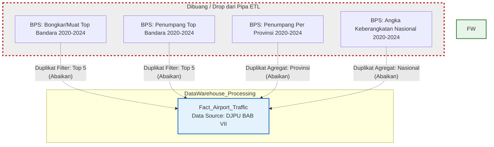

# Hasil Analisis BPS vs DJPU (Perspektif Rancangan Data Warehouse 2020-2024)

Untuk kebutuhan perancangan sistem **Data Warehouse (DW)** dengan fokus tahun pengamatan **2020–2024**, prinsip utamanya adalah mempertahankan satu *Single Source of Truth* (SSOT) agar tidak terjadi redundansi data dan duplikasi hitungan pada *Fact Table*.

Berdasarkan analisis kolom, hierarki tabel, dan pencocokan semantik, **seluruh data BPS (2020-2024)** merupakan **data turunan (Derived/Aggregated Data)** yang identik dengan sumber referensi **DJPU**. Oleh karena itu, kita dapat menghindari penambahan entri BPS ke dalam *staging area* DW kita karena *Fact Table* dari DJPU sudah memfasilitasi dan mencakup perhitungan tersebut.

Berikut rincian spesifik folder dan `.csv` di dataset BPS mana saja yang wajib **DI-DROP/ABAIKAN** untuk perancangan sistem, beserta bukti turunannya dari *Master Table* DJPU:

---

## 🛑 DAFTAR FOLDER & CSV BPS YANG HARUS DI-DROP (Karena Duplikat/Turunan)

### 1. Turunan Berdasarkan Pengelompokan "Bandara Utama" (BPS) vs Data Mentah "Lalu Lintas Bandara" (DJPU)
BPS merilis data yang sudah di-filter khusus untuk "5 Bandara Utama Domestik" dan "4 Bandara Utama Internasional". Padahal, angka ini merupakan penjumlahan langsung metrik dari File Master DJPU.

**Tinggalkan Folder BPS berikut:**
* 📂 `BPS/BongkarMuat Barang Angkutan Udara Dalam Negeri di 5 Bandara Utama (Ton)/` (berisi CSV 2020 - 2024)
* 📂 `BPS/BongkarMuat Barang Angkutan Udara Luar Negeri di 4 Bandara Utama (Ton)/` (berisi CSV 2022 - 2024)
* 📂 `BPS/Jumlah Penumpang Pesawat (Angkutan Udara) Domestik di 5 Bandara Utama/` (berisi CSV 2020 - 2024)
* 📂 `BPS/Jumlah Penumpang Pesawat (Angkutan Udara) Internasional di 4 Bandara Utama (Orang)/` (berisi CSV 2020 - 2024)
* 📂 `BPS/Jumlah Penumpang Pesawat di Bandara Utama (Orang)/` (berisi CSV 2020 - 2024)

> **💡 Bukti Identik di Master DJPU:**
> Master Table DJPU yang menyuplai angka ini terletak pada:
> 👉 `DJPU/Table_Pilihan/BAB VII — Lalu Lintas Bandara/DATA LALU LINTAS ANGKUTAN UDARA DI BANDAR UDARA TAHUN 2020 - 2024.csv`
> File Master tersebut berisi `barang_dtg`, `barang_brk` (untuk kargo) serta `penumpang_dtg`, `penumpang_brk`, `penumpang_tra` (untuk pesawat/penumpang) secara *granular* lengkap untuk **seluruh** bandara dengan pemisahan atribut teks `(INT)` untuk luar negeri dan `(DOM)` untuk dalam negeri pada ujung nama bandara (`airport_name`). Oleh karena itu tabel agregat dari BPS sangat aman untuk tidak dimuat sama sekali ke DW.

### 2. Turunan Berdasarkan Pengelompokan Level Provinsi
BPS merangkum jumlah total penumpang berdasarkan kedatangan/keberangkatan lintas 38 provinsi di Indonesia.
**Tinggalkan Folder BPS berikut:**
* 📂 `BPS/Jumlah Penumpang Domestik berdasarkan Moda Transportasi Pesawat Terbang menurut provinsi (Orang)/` (berisi CSV 2020 - 2024)
* 📂 `BPS/Jumlah Penumpang Internasional berdasarkan Moda Transportasi Pesawat Terbang menurut provinsi (Orang)/` (berisi CSV 2020 - 2024)

> **💡 Bukti Identik di Master DJPU:**
> Master Table DJPU pada 👉 `DJPU/Table_Pilihan/BAB VII — Lalu Lintas Bandara/DATA LALU LINTAS ANGKUTAN UDARA DI BANDAR UDARA TAHUN 2020 - 2024.csv` sudah dibekali dengan kolom *Reference/Dimension*: `propinsi_code` dan `propinsi_name`. Di dalam DW nanti, jika kita membutuhkan agregasi per provinsi (seperti yang dilakukan file BPS ini), maka cukup lakukan *Query Group By* `propinsi_name` dari *Fact Table* DJPU. 

### 3. Turunan Keberangkatan Skala Nasional
BPS menghitung angka absolut Nasional terkait jumlah keberangkatan (berbasis ratusan ribu penumpang).
**Tinggalkan Folder BPS berikut:**
* 📂 `BPS/Jumlah Penumpang Pada Keberangkatan di Bandara Indonesia (Ribu Orang), 2024/` (berisi CSV `...Keberangkatan di Bandara Indonesia, 2020.csv` s/d `2024.csv`)

> **💡 Bukti Identik di Master DJPU:**
> Ini tidak lain dari sekadar turunan mutlak penjumlahan agregate `SUM(penumpang_brk)` secara Nasional untuk seluruh relasi tabel master di file gabungan `DJPU/BAB VII`.

---

## 1 FOLDER PENGECUALIAN DI BPS (Tentu saja, Data Sebelum 2020)
Apabila lingkup Data Warehouse Anda benar-benar di-limit atau dibatasi kaku secara sistem hanya melihat rentang **2020-2024**, Anda bisa membuang folder BPS berikut. Tapi jika DW Anda kelak perlu menyimpan dimensi metrik waktu (time-series) lebih jauh ke belakang untuk keperluan analitik historis, satu-satunya hal yang tak dapat diambil dari DJPU adalah: 
* 📂 `BPS/Lalu Lintas Penerbangan Dalam Negeri Indonesia Tahun 2003-2022/`
* 📂 `BPS/Lalu Lintas Penerbangan Luar Negeri Indonesia Tahun 2003-2022/`
(Folder ini berisi tren data dari tahun **2003** sampai sebelum 2020 yang tidak dimapping oleh master DJPU). Jika DW hanya menganalisa periode spesifik **2020-2024**, buang juga folder tren historis ini tanpa ragu.

---

## Simpulan Rancangan Data Warehouse
Untuk arsitektur skema DW tahun **2020–2024**:
1. **ABAIKAN SELURUH ISI FOLDER `BPS/`**. 
2. Seluruh metrik penumpang, muatan kargo/barang pesawat, dan statistik pesawat yang ada dalam struktur folder `BPS/` dapat dihasilkan kembali secara dinamis (Data Mart / OLAP Cube) dari 1 *Fact Table* unggul: 
   👉 `DJPU/Table_Pilihan/BAB VII — Lalu Lintas Bandara/DATA LALU LINTAS ANGKUTAN UDARA DI BANDAR UDARA TAHUN 2020 - 2024.csv`
3. Pengintegrasian tabel tambahan lainnya sebaiknya cukup terpusat pada foldering `DJPU/Table_Pilihan` secara eksklusif (contoh: *Dimensi Maskapai* menggunakan BAB II & IV, *Dimensi Rute* menggunakan *BAB III dan VI*), menjadikan sistem ETL Anda efisien, ringkas, dan bebas duplikasi.

