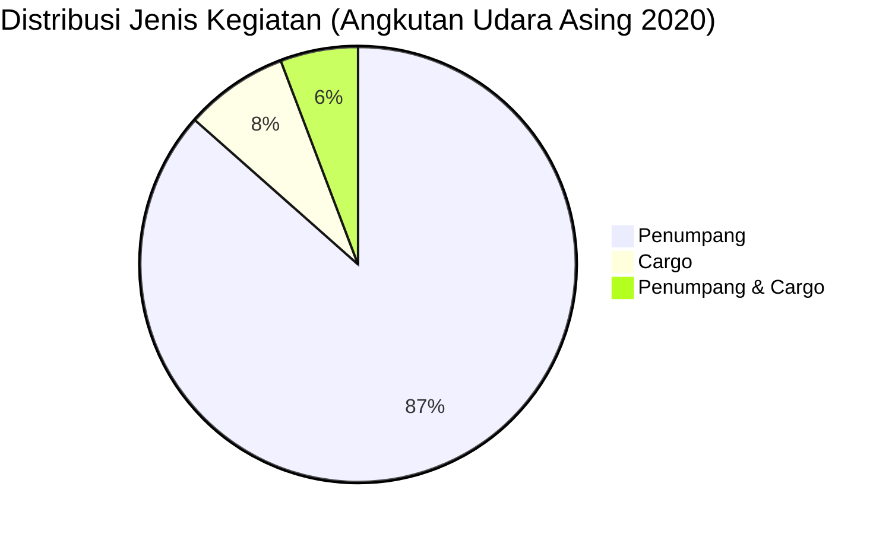

# Analisis Tabel: DAFTAR PERUSAHAAN ANGKUTAN UDARA ASING YANG BEROPERASI TAHUN 2020

## Informasi Umum
| Atribut | Nilai |
|---------|-------|
| **Sumber File** | `DAFTAR PERUSAHAAN ANGKUTAN UDARA ASING YANG BEROPERASI TAHUN 2020.csv` |
| **Tahun** | 2020 |
| **Kategori** | Angkutan Udara Asing |
| **Total Baris Data** | 52 |
| **Jumlah Kolom** | 3 |

---

## Struktur Tabel

| No | Nama Kolom | Tipe Data | Deskripsi |
|----|------------|-----------|-----------|
| 1 | `NO` | Integer | Nomor urut perusahaan |
| 2 | `NAMA PERUSAHAAN` | String | Nama resmi perusahaan asing |
| 3 | `JENIS KEGIATAN` | String | Jenis layanan operasional (Penumpang/Cargo) |

---

## Sample Data (3 Baris Pertama)

| NO | NAMA PERUSAHAAN | JENIS KEGIATAN |
|----|-----------------|----------------|
| 1 | AIR ASIA BERHARD | Penumpang |
| 2 | AIR ASIA X BERHARD | Penumpang |
| 3 | AIR CHINA | Penumpang |

---

## Analisis Kualitas Data

### Ringkasan Umum
| Metrik | Nilai |
|--------|-------|
| Total Baris | 52 |
| Kolom dengan Missing Values | 0 |
| Kolom dengan Nilai Null/NaN | 0 |
| Kolom dengan Strip ("-") | 0 |

### Detail Per Kolom

| Kolom | Total Baris | Non-Empty | Empty | Null/NaN | Strip ("-") | Lainnya | Keterangan |
|-------|-------------|-----------|-------|----------|-------------|---------|------------|
| `NO` | 52 | 52 | 0 | 0 | 0 | 0 | Semua terisi (angka 1-52) |
| `NAMA PERUSAHAAN` | 52 | 52 | 0 | 0 | 0 | 0 | Semua terisi, nama perusahaan asing |
| `JENIS KEGIATAN` | 52 | 52 | 0 | 0 | 0 | 0 | Semua terisi, nilai unik: "Penumpang", "Cargo", "Penumpang & Cargo" |

### Distribusi Nilai Kolom `JENIS KEGIATAN`
| Nilai | Jumlah | Persentase |
|-------|--------|------------|
| Penumpang | 45 | 86.5% |
| Cargo | 4 | 7.7% |
| Penumpang & Cargo | 3 | 5.8% |

---

## Diagram Distribusi Jenis Kegiatan

---

## Catatan Tambahan
- ✅ Data bersih tanpa nilai kosong/null/strip
- ✅ Nama perusahaan asing tidak menggunakan prefix "PT." (berbeda dengan file lain)
- ✅ Terdapat 3 perusahaan yang melayani kombinasi Penumpang & Cargo: `CATHAY PACIFIC`, `CHINA AIRLINES`, `KOREAN AIRLINES`
- ⚠️ 2 entitas menggunakan akhiran "BERHARD" (kemungkinan typo dari "BERHAD"): `AIR ASIA BERHARD`, `AIR ASIA X BERHARD`
