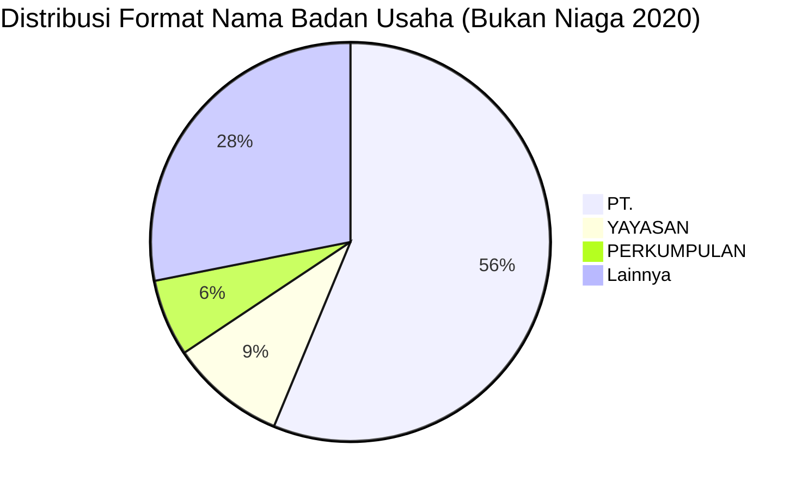

# Analisis Tabel: DAFTAR PERUSAHAAN ANGKUTAN UDARA BUKAN NIAGA YANG BEROPERASI TAHUN 2020

## Informasi Umum
| Atribut | Nilai |
|---------|-------|
| **Sumber File** | `DAFTAR PERUSAHAAN ANGKUTAN UDARA BUKAN NIAGA YANG BEROPERASI TAHUN 2020.csv` |
| **Tahun** | 2020 |
| **Kategori** | Angkutan Udara Bukan Niaga |
| **Total Baris Data** | 32 |
| **Jumlah Kolom** | 2 |

---

## Struktur Tabel

| No | Nama Kolom | Tipe Data | Deskripsi |
|----|------------|-----------|-----------|
| 1 | `NO` | Integer | Nomor urut badan usaha |
| 2 | `NAMA BADAN USAHA` | String | Nama resmi badan usaha/lembaga |

---

## Sample Data (3 Baris Pertama)

| NO | NAMA BADAN USAHA |
|----|------------------|
| 1 | MERPATI TRAINING CENTER |
| 2 | PERKUMPULAN PENERBANG INDONESIA |
| 3 | PT. SINAR MAS SUPER AIR |

---

## Analisis Kualitas Data

### Ringkasan Umum
| Metrik | Nilai |
|--------|-------|
| Total Baris | 32 |
| Kolom dengan Missing Values | 0 |
| Kolom dengan Nilai Null/NaN | 0 |
| Kolom dengan Strip ("-") | 0 |

### Detail Per Kolom

| Kolom | Total Baris | Non-Empty | Empty | Null/NaN | Strip ("-") | Lainnya | Keterangan |
|-------|-------------|-----------|-------|----------|-------------|---------|------------|
| `NO` | 32 | 32 | 0 | 0 | 0 | 0 | Semua terisi (angka 1-32) |
| `NAMA BADAN USAHA` | 32 | 32 | 0 | 0 | 0 | 0 | Semua terisi, beragam format nama |

### Catatan Khusus Kolom `NAMA BADAN USAHA`
Tidak ada kolom `JENIS KEGIATAN` di file ini (berbeda dengan file kategori lain).

#### Variasi Prefix/Format Nama Badan Usaha:
| Prefix/Format | Jumlah | Contoh |
|---------------|--------|--------|
| `PT.` | 18 | PT. SINAR MAS SUPER AIR, PT. ALFA FLYING SCHOOL |
| `YAYASAN` | 3 | YAYASAN PELAYANAN PENERBANGAN TARIKU (YPPT) |
| `PERKUMPULAN` | 2 | PERKUMPULAN PENERBANG INDONESIA |
| Lainnya | 9 | MERPATI TRAINING CENTER, MISSION AVIATION FELLOWSHIP (MAF), POLITEKNIK PENERBANGAN INDONESIA CURUG, dll |

---

## Diagram Distribusi Format Nama Badan Usaha

---

## Catatan Tambahan
- ✅ Data bersih tanpa nilai kosong/null/strip
- ⚠️ **File ini hanya memiliki 2 kolom** (tidak ada `JENIS KEGIATAN`)
- ⚠️ Format nama badan usaha beragam: PT, Yayasan, Perkumpulan, Academy, Balai, dll
- ⚠️ Entitas ke-32 memiliki nama sangat panjang: `BALAI BESAR TEKNOLOGI MODIFIKASI CUACA BADAN PENGKAJIAN DAN PENERAPAN TEKNOLOGI (BB-TMC BPPT)`
