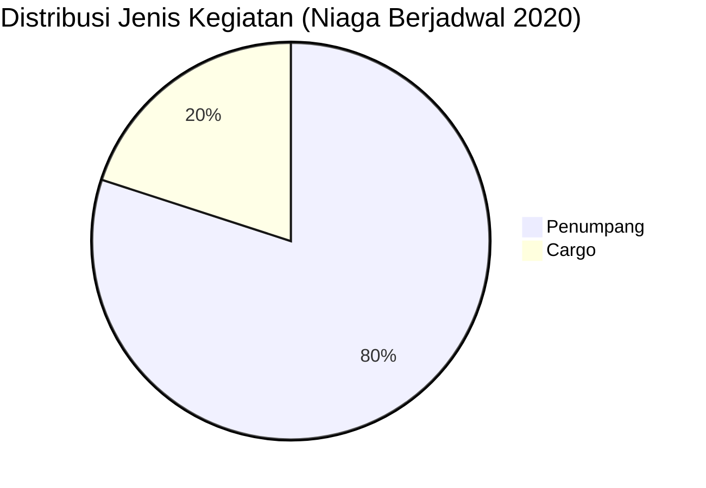

# Analisis Tabel: DAFTAR BADAN USAHA ANGKUTAN UDARA NIAGA BERJADWAL YANG BEROPERASI TAHUN 2020

## Informasi Umum
| Atribut | Nilai |
|---------|-------|
| **Sumber File** | `DAFTAR BADAN USAHA ANGKUTAN UDARA NIAGA BERJADWAL YANG BEROPERASI TAHUN 2020.csv` |
| **Tahun** | 2020 |
| **Kategori** | Angkutan Udara Niaga Berjadwal |
| **Total Baris Data** | 15 |
| **Jumlah Kolom** | 3 |

---

## Struktur Tabel

| No | Nama Kolom | Tipe Data | Deskripsi |
|----|------------|-----------|-----------|
| 1 | `NO` | Integer | Nomor urut badan usaha |
| 2 | `NAMA BADAN USAHA` | String | Nama resmi badan usaha/perusahaan |
| 3 | `JENIS KEGIATAN` | String | Jenis layanan operasional (Penumpang/Cargo) |

---

## Sample Data (3 Baris Pertama)

| NO | NAMA BADAN USAHA | JENIS KEGIATAN |
|----|------------------|----------------|
| 1 | PT. ASI PUDJIASTUTI AVIATION | Penumpang |
| 2 | PT. BATIK AIR INDONESIA | Penumpang |
| 3 | PT. CITILINK INDONESIA | Penumpang |

---

## Analisis Kualitas Data

### Ringkasan Umum
| Metrik | Nilai |
|--------|-------|
| Total Baris | 15 |
| Kolom dengan Missing Values | 0 |
| Kolom dengan Nilai Null/NaN | 0 |
| Kolom dengan Strip ("-") | 0 |

### Detail Per Kolom

| Kolom | Total Baris | Non-Empty | Empty | Null/NaN | Strip ("-") | Lainnya | Keterangan |
|-------|-------------|-----------|-------|----------|-------------|---------|------------|
| `NO` | 15 | 15 | 0 | 0 | 0 | 0 | Semua terisi (angka 1-15) |
| `NAMA BADAN USAHA` | 15 | 15 | 0 | 0 | 0 | 0 | Semua terisi, format konsisten "PT. ..." |
| `JENIS KEGIATAN` | 15 | 15 | 0 | 0 | 0 | 0 | Semua terisi, nilai unik: "Penumpang", "Cargo" |

### Distribusi Nilai Kolom `JENIS KEGIATAN`
| Nilai | Jumlah | Persentase |
|-------|--------|------------|
| Penumpang | 12 | 80% |
| Cargo | 3 | 20% |

---

## Diagram Distribusi Jenis Kegiatan

---

## Catatan Tambahan
- ✅ Data bersih tanpa nilai kosong/null/strip
- ✅ Format penamaan perusahaan konsisten menggunakan awalan "PT."
- ✅ Tidak ada duplikasi data
- ⚠️ Terdapat 1 perusahaan dengan catatan khusus: `PT. GARUDA INDONESIA (Persero) Tbk` (perusahaan terbuka)
