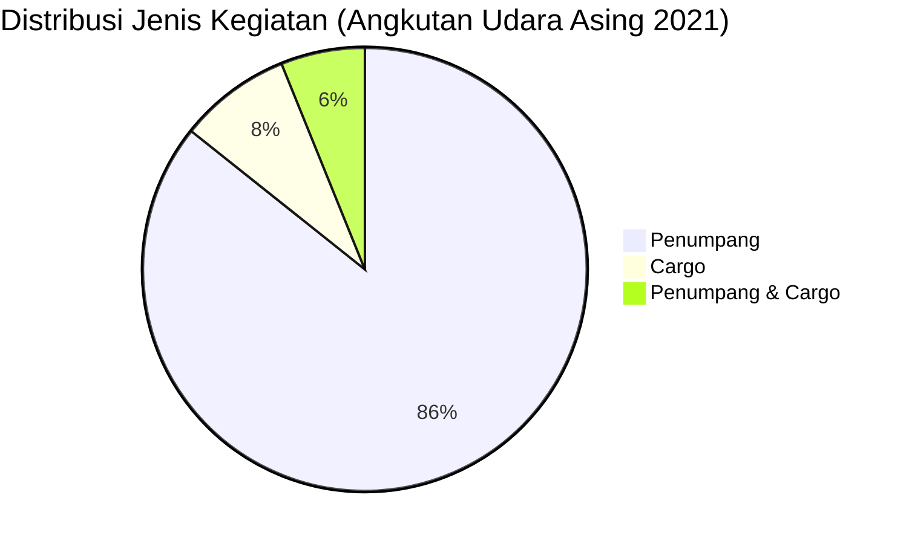

# Analisis Tabel: DAFTAR PERUSAHAAN ANGKUTAN UDARA ASING TAHUN 2021

## Informasi Umum
| Atribut | Nilai |
|---------|-------|
| **Sumber File** | `DAFTAR PERUSAHAAN ANGKUTAN UDARA ASING TAHUN 2021.csv` |
| **Tahun** | 2021 |
| **Kategori** | Angkutan Udara Asing |
| **Total Baris Data** | 49 |
| **Jumlah Kolom** | 4 |

---

## Struktur Tabel

| No | Nama Kolom | Tipe Data | Deskripsi |
|----|------------|-----------|-----------|
| 1 | `NO` | Integer | Nomor urut perusahaan |
| 2 | `NAMA PERUSAHAAN` | String | Nama resmi perusahaan asing |
| 3 | `NEGARA` | String | Negara asal perusahaan |
| 4 | `JENIS KEGIATAN` | String | Jenis layanan operasional (Penumpang/Cargo) |

---

## Sample Data (3 Baris Pertama)

| NO | NAMA PERUSAHAAN | NEGARA | JENIS KEGIATAN |
|----|-----------------|--------|----------------|
| 1 | AIR ASIA BERHARD | MALAYSIA | Penumpang |
| 2 | AIR ASIA X BERHARD** | MALAYSIA | Penumpang |
| 3 | AIR CHINA | CHINA | Penumpang |

---

## Analisis Kualitas Data

### Ringkasan Umum
| Metrik | Nilai |
|--------|-------|
| Total Baris | 49 |
| Kolom dengan Missing Values | 0 |
| Kolom dengan Nilai Null/NaN | 0 |
| Kolom dengan Strip ("-") | 0 |

### Detail Per Kolom

| Kolom | Total Baris | Non-Empty | Empty | Null/NaN | Strip ("-") | Lainnya | Keterangan |
|-------|-------------|-----------|-------|----------|-------------|---------|------------|
| `NO` | 49 | 49 | 0 | 0 | 0 | 0 | Semua terisi (angka 1-49) |
| `NAMA PERUSAHAAN` | 49 | 49 | 0 | 0 | 0 | 0 | Semua terisi, beberapa ada sufiks `**` |
| `NEGARA` | 49 | 49 | 0 | 0 | 0 | 0 | Semua terisi, nama negara dalam bahasa Indonesia |
| `JENIS KEGIATAN` | 49 | 49 | 0 | 0 | 0 | 0 | Semua terisi, nilai unik: "Penumpang", "Cargo", "Penumpang & Cargo" |

### Distribusi Nilai Kolom `JENIS KEGIATAN`
| Nilai | Jumlah | Persentase |
|-------|--------|------------|
| Penumpang | 42 | 85.7% |
| Cargo | 4 | 8.2% |
| Penumpang & Cargo | 3 | 6.1% |

### Catatan Khusus Sufiks `**` pada `NAMA PERUSAHAAN`
| Nama Perusahaan | Ada Sufiks |
|-----------------|------------|
| AIR ASIA X BERHARD** | ✅ |
| CEBU PACIFIC** | ✅ |
| HONGKONG AIRLINES ** | ✅ (spasi sebelum **) |
| JETSTAR AIRWAYS** | ✅ |
| MASWINGS** | ✅ |
| OMAN AIR ** | ✅ (spasi sebelum **) |
| PHILIPINE AIR ASIA ** | ✅ (spasi sebelum **) |
| QANTAS AIRWAYS** | ✅ |
| ROSSIYA AIRLINES ** | ✅ (spasi sebelum **) |
| THAI AIR ASIA ** | ✅ (spasi sebelum **) |
| VIETJET AIR ** | ✅ (spasi sebelum **) |

> ⚠️ **Inkonsistensi Format:** Ada 11 perusahaan dengan sufiks `**`, beberapa dengan spasi sebelum `**`, beberapa tanpa spasi.

---

## Diagram Distribusi Jenis Kegiatan

---

## Catatan Tambahan
- ✅ Data bersih tanpa nilai kosong/null/strip
- ⚠️ **Kolom baru:** `NEGARA` tidak ada di file 2020, ini merupakan tambahan struktur
- ⚠️ **Sufiks `**`** pada 11 nama perusahaan — kemungkinan merujuk ke catatan kaki/status khusus
- ⚠️ **Inkonsistensi penulisan spasi** sebelum sufiks `**`: 5 dengan spasi, 6 tanpa spasi
- ⚠️ **Perubahan ejaan:** `PHILIPPINE` (2020) → `PHILIPINE` (2021) — kemungkinan typo
- ⚠️ Beberapa perusahaan yang ada di 2020 tapi tidak di 2021: `CATHAY PACIFIC`, `CHINA AIRLINES`, `KOREAN AIRLINES` (sebenarnya ada tapi di bagian Penumpang & Cargo)
