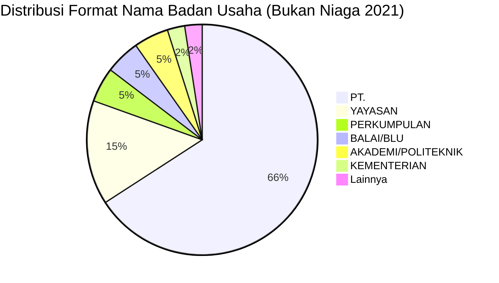

# Analisis Tabel: DAFTAR PERUSAHAAN ANGKUTAN UDARA BUKAN NIAGA TAHUN 2021

## Informasi Umum
| Atribut | Nilai |
|---------|-------|
| **Sumber File** | `DAFTAR PERUSAHAAN ANGKUTAN UDARA BUKAN NIAGA TAHUN 2021.csv` |
| **Tahun** | 2021 |
| **Kategori** | Angkutan Udara Bukan Niaga |
| **Total Baris Data** | 41 |
| **Jumlah Kolom** | 2 |

---

## Struktur Tabel

| No | Nama Kolom | Tipe Data | Deskripsi |
|----|------------|-----------|-----------|
| 1 | `NO` | Integer | Nomor urut badan usaha |
| 2 | `NAMA BADAN USAHA` | String | Nama resmi badan usaha/lembaga |

---

## Sample Data (3 Baris Pertama)

| NO | NAMA BADAN USAHA |
|----|------------------|
| 1 | PT. SINAR MAS SUPER AIR |
| 2 | YAYASAN MAF INDONESIA (MISSION AVIATION FELLOWSHIP) |
| 3 | YAYASAN PELAYANAN PENERBANGAN TARIKU (YPPT) |

---

## Analisis Kualitas Data

### Ringkasan Umum
| Metrik | Nilai |
|--------|-------|
| Total Baris | 41 |
| Kolom dengan Missing Values | 0 |
| Kolom dengan Nilai Null/NaN | 0 |
| Kolom dengan Strip ("-") | 0 |

### Detail Per Kolom

| Kolom | Total Baris | Non-Empty | Empty | Null/NaN | Strip ("-") | Lainnya | Keterangan |
|-------|-------------|-----------|-------|----------|-------------|---------|------------|
| `NO` | 41 | 41 | 0 | 0 | 0 | 0 | Semua terisi (angka 1-41) |
| `NAMA BADAN USAHA` | 41 | 41 | 0 | 0 | 0 | 0 | Semua terisi, beragam format nama |

### Catatan Khusus Kolom `NAMA BADAN USAHA`
Tidak ada kolom `JENIS KEGIATAN` di file ini (konsisten dengan 2020).

#### Variasi Prefix/Format Nama Badan Usaha:
| Prefix/Format | Jumlah | Contoh |
|---------------|--------|--------|
| `PT.` | 27 | PT. SINAR MAS SUPER AIR, PT. ALFA FLYING SCHOOL |
| `YAYASAN` | 6 | YAYASAN MAF INDONESIA, YAYASAN HELIVIDA |
| `PERKUMPULAN` | 2 | PERKUMPULAN PENERBANGAN INDONESIA, PERKUMPULAN PENERBANGAN ALFA INDONESIA |
| `BALAI/BLU` | 2 | BALAI BESAR TEKNOLOGI MODIFIKASI CUACA, BLU BALAI KALIBRASI FASILITAS PENERBANGAN |
| `AKADEMI/POLITEKNIK` | 2 | AKADEMI PENERBANG INDONESIA BANYUWANGI, POLITEKNIK PENERBANGAN INDONESIA CURUG |
| `KEMENTERIAN` | 1 | KEMENTERIAN LINGKUNGAN HIDUP DAN KEHUTANAN |
| Lainnya | 1 | ADVENTIST AVIATION INDONESIA |

---

## Diagram Distribusi Format Nama Badan Usaha

---

## Catatan Tambahan
- ✅ Data bersih tanpa nilai kosong/null/strip
- ⚠️ **File ini hanya memiliki 2 kolom** (konsisten dengan 2020 — tanpa `JENIS KEGIATAN`)
- ⚠️ **Jumlah entitas bertambah:** 32 (2020) → 41 (2021) — bertambah 9 entitas
- ⚠️ Entitas baru yang muncul di 2021: `KEMENTERIAN LINGKUNGAN HIDUP DAN KEHUTANAN`, `BLU BALAI KALIBRASI FASILITAS PENERBANGAN`, `PT. SPEKTRUM DATA GEOSURVEY`, dll
- ⚠️ Beberapa entitas 2020 hilang di 2021: `MERPATI TRAINING CENTER` (ada tapi jadi `PT. MERPATI TRAINING CENTER`), `MISSION AVIATION FELLOWSHIP (MAF)` (berganti nama jadi `YAYASAN MAF INDONESIA`)
- ⚠️ Ada karakter khusus: `PT. AVIATERRA DINAΜΙΚΑ` (menggunakan karakter Yunani `ΜΙΚΑ`)
