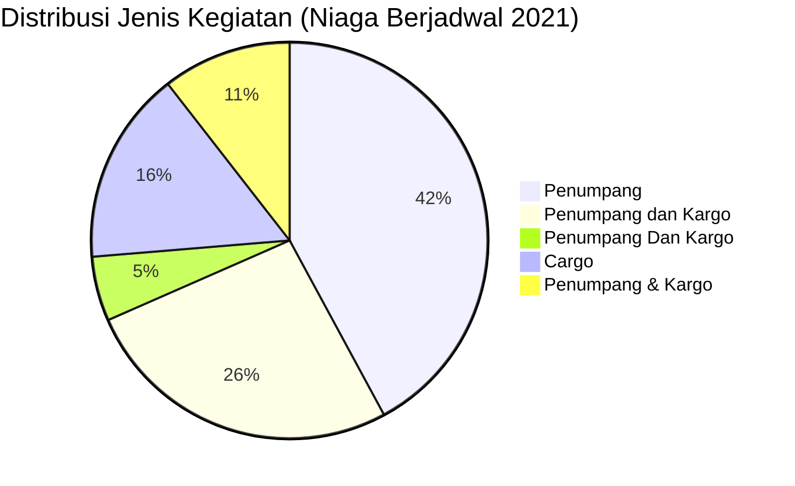

# Analisis Tabel: DAFTAR BADAN USAHA ANGKUTAN UDARA NIAGA BERJADWAL TAHUN 2021

## Informasi Umum
| Atribut | Nilai |
|---------|-------|
| **Sumber File** | `DAFTAR BADAN USAHA ANGKUTAN UDARA NIAGA BERJADWAL TAHUN 2021.csv` |
| **Tahun** | 2021 |
| **Kategori** | Angkutan Udara Niaga Berjadwal |
| **Total Baris Data** | 19 |
| **Jumlah Kolom** | 3 |

---

## Struktur Tabel

| No | Nama Kolom | Tipe Data | Deskripsi |
|----|------------|-----------|-----------|
| 1 | `NO` | Integer | Nomor urut badan usaha |
| 2 | `NAMA BADAN USAHA` | String | Nama resmi badan usaha/perusahaan |
| 3 | `JENIS KEGIATAN` | String | Jenis layanan operasional (Penumpang/Cargo) |

---

## Sample Data (3 Baris Pertama)

| NO | NAMA BADAN USAHA | JENIS KEGIATAN |
|----|------------------|----------------|
| 1 | PT. ASI PUDJIASTUTI AVIATION | Penumpang |
| 2 | PT. BATIK AIR INDONESIA | Penumpang |
| 3 | PT. INDONESIA AIRASIA | Penumpang |

---

## Analisis Kualitas Data

### Ringkasan Umum
| Metrik | Nilai |
|--------|-------|
| Total Baris | 19 |
| Kolom dengan Missing Values | 0 |
| Kolom dengan Nilai Null/NaN | 0 |
| Kolom dengan Strip ("-") | 0 |

### Detail Per Kolom

| Kolom | Total Baris | Non-Empty | Empty | Null/NaN | Strip ("-") | Lainnya | Keterangan |
|-------|-------------|-----------|-------|----------|-------------|---------|------------|
| `NO` | 19 | 19 | 0 | 0 | 0 | 0 | Semua terisi (angka 1-19) |
| `NAMA BADAN USAHA` | 19 | 19 | 0 | 0 | 0 | 0 | Semua terisi, format konsisten "PT. ..." |
| `JENIS KEGIATAN` | 19 | 19 | 0 | 0 | 0 | 0 | Semua terisi, nilai bervariasi dalam penulisan |

### Distribusi Nilai Kolom `JENIS KEGIATAN`
| Nilai | Jumlah | Persentase |
|-------|--------|------------|
| Penumpang | 8 | 42.1% |
| Penumpang dan Kargo | 5 | 26.3% |
| Penumpang Dan Kargo | 1 | 5.3% |
| Cargo | 3 | 15.8% |
| Penumpang & Kargo | 2 | 10.5% |

> ⚠️ **Ketidakonsistenan Penulisan:** Terdapat 3 variasi penulisan untuk kategori kombinasi: `"Penumpang dan Kargo"`, `"Penumpang Dan Kargo"`, `"Penumpang & Kargo"`

---

## Diagram Distribusi Jenis Kegiatan

---

## Catatan Tambahan
- ✅ Data bersih tanpa nilai kosong/null/strip
- ✅ Format penamaan perusahaan konsisten menggunakan awalan "PT."
- ⚠️ **Inkonsistensi penulisan** pada kolom `JENIS KEGIATAN`:
  - `"Penumpang dan Kargo"` (5 entitas)
  - `"Penumpang Dan Kargo"` (1 entitas: `PT. TRANSNUSA AVIATION MANDIRI`)
  - `"Penumpang & Kargo"` (2 entitas: `PT. CITILINK INDONESIA`, `PT. GARUDA INDONESIA`)
- ⚠️ Dibanding 2020, ada perubahan: `PT. CITILINK INDONESIA` dan `PT. GARUDA INDONESIA` berubah dari `"Penumpang"` menjadi `"Penumpang dan Kargo"`
- ⚠️ Ada 4 perusahaan baru yang tidak ada di 2020: `PT. SUPER AIR JET`, `PT. FLYINDO AVIASI NUSANTARA`, `PT. DARAPATI ANTAR BUANA`, `PT. PELITA AIR SERVICE`
- ⚠️ Tidak ada lagi: `PT. TRANSNUSA AVIATION MANDIRI` (sebenarnya ada tapi berubah jenis kegiatan)
