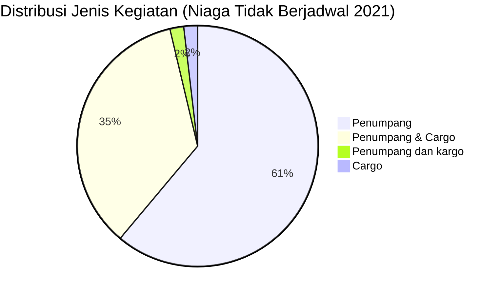

# Analisis Tabel: DAFTAR PERUSAHAAN ANGKUTAN UDARA NIAGA TIDAK BERJADWAL TAHUN 2021

## Informasi Umum
| Atribut | Nilai |
|---------|-------|
| **Sumber File** | `DAFTAR PERUSAHAAN ANGKUTAN UDARA NIAGA TIDAK BERJADWAL TAHUN 2021.csv` |
| **Tahun** | 2021 |
| **Kategori** | Angkutan Udara Niaga Tidak Berjadwal |
| **Total Baris Data** | 54 |
| **Jumlah Kolom** | 3 |

---

## Struktur Tabel

| No | Nama Kolom | Tipe Data | Deskripsi |
|----|------------|-----------|-----------|
| 1 | `NO` | Integer | Nomor urut badan usaha |
| 2 | `NAMA BADAN USAHA` | String | Nama resmi badan usaha/perusahaan |
| 3 | `JENIS KEGIATAN` | String | Jenis layanan operasional (Penumpang/Cargo) |

---

## Sample Data (3 Baris Pertama)

| NO | NAMA BADAN USAHA | JENIS KEGIATAN |
|----|------------------|----------------|
| 1 | PT. AIR PASIFIK UTAMA | Penumpang |
| 2 | PT. AIRFAST INDONESIA | Penumpang |
| 3 | PT. ALDA TRANS PAPUA | Penumpang |

---

## Analisis Kualitas Data

### Ringkasan Umum
| Metrik | Nilai |
|--------|-------|
| Total Baris | 54 |
| Kolom dengan Missing Values | 0 |
| Kolom dengan Nilai Null/NaN | 0 |
| Kolom dengan Strip ("-") | 0 |

### Detail Per Kolom

| Kolom | Total Baris | Non-Empty | Empty | Null/NaN | Strip ("-") | Lainnya | Keterangan |
|-------|-------------|-----------|-------|----------|-------------|---------|------------|
| `NO` | 54 | 54 | 0 | 0 | 0 | 0 | Semua terisi (angka 1-54) |
| `NAMA BADAN USAHA` | 54 | 54 | 0 | 0 | 0 | 0 | Semua terisi, format umumnya "PT. ..." |
| `JENIS KEGIATAN` | 54 | 54 | 0 | 0 | 0 | 0 | Semua terisi, nilai bervariasi dalam penulisan |

### Distribusi Nilai Kolom `JENIS KEGIATAN`
| Nilai | Jumlah | Persentase |
|-------|--------|------------|
| Penumpang | 33 | 61.1% |
| Penumpang & Cargo | 19 | 35.2% |
| Cargo | 1 | 1.9% |
| Penumpang dan kargo | 1 | 1.9% |

> ⚠️ **Ketidakonsistenan Penulisan:** Terdapat variasi `"Penumpang & Cargo"` (19 entitas) dan `"Penumpang dan kargo"` (1 entitas: `PT. ERSA EASTERN AVIATION`) — perhatikan huruf kecil pada "kargo"

---

## Diagram Distribusi Jenis Kegiatan

---

## Catatan Tambahan
- ✅ Data bersih tanpa nilai kosong/null/strip
- ✅ Format penamaan perusahaan umumnya "PT. ..."
- ⚠️ **Inkonsistensi penulisan** pada kolom `JENIS KEGIATAN`:
  - `"Penumpang & Cargo"` (19 entitas)
  - `"Penumpang dan kargo"` (1 entitas: `PT. ERSA EASTERN AVIATION`) — huruf kecil pada "kargo"
- ⚠️ **Typo potensial:** `PT. PELITA AIR SEVICE` (seharusnya "SERVICE")
- ⚠️ **Perubahan spasi:** `PT. INDONESIA TRANSPORT& INFRASTRUCTURE Tbk.` (tidak ada spasi sebelum `&`)
- ⚠️ Dibanding 2020, ada beberapa perusahaan yang hilang dan baru:
  - Hilang: `PT. ASI PUDJIASTUTI AVIATION` (pindah ke Niaga Berjadwal?), `PT. AVIASTAR MANDIRI`, dll
  - Baru: `PT. VOLTA PASIFIK AVIASI`, `PT. JET EKSEKUTIF TRAVYA`, `PT. REFFLES GLOBAL ANGKASA`, dll
- ⚠️ `PT. DERAYA` muncul dengan status `Cargo` (di 2020 ada sufiks `*)`)
