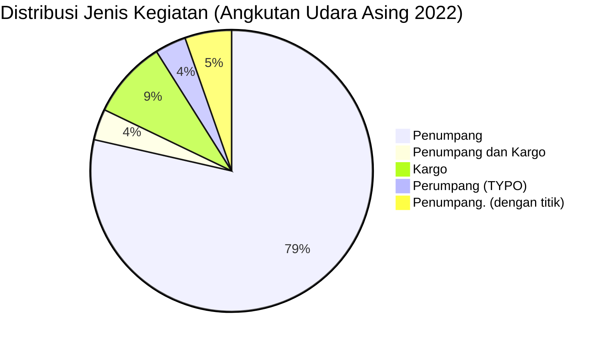

# Analisis Tabel: DAFTAR PERUSAHAAN ANGKUTAN UDARA ASING TAHUN 2022

## Informasi Umum
| Atribut | Nilai |
|---------|-------|
| **Sumber File** | `DAFTAR PERUSAHAAN ANGKUTAN UDARA ASING TAHUN 2022.csv` |
| **Tahun** | 2022 |
| **Kategori** | Angkutan Udara Asing |
| **Total Baris Data** | 56 |
| **Jumlah Kolom** | 4 |

---

## Struktur Tabel

| No | Nama Kolom | Tipe Data | Deskripsi |
|----|------------|-----------|-----------|
| 1 | `NO` | Integer | Nomor urut perusahaan |
| 2 | `NAMA PERUSAHAAN` | String | Nama resmi perusahaan asing |
| 3 | `NEGARA` | String | Negara asal perusahaan |
| 4 | `JENIS KEGIATAN` | String | Jenis layanan operasional (Penumpang/Cargo) |

---

## Sample Data (3 Baris Pertama)

| NO | NAMA PERUSAHAAN | NEGARA | JENIS KEGIATAN |
|----|-----------------|--------|----------------|
| 1 | AIR ASIA BERHARD | MALAYSIA | Penumpang |
| 2 | AIR ASIA X BERHARD | MALAYSIA | Penumpang |
| 3 | AIR CHINA LIMITED | CHINA | Penumpang |

---

## Analisis Kualitas Data

### Ringkasan Umum
| Metrik | Nilai |
|--------|-------|
| Total Baris | 56 |
| Kolom dengan Missing Values | 0 |
| Kolom dengan Nilai Null/NaN | 0 |
| Kolom dengan Strip ("-") | 0 |
| Kolom dengan **Typo/Anomali** | 3 |

### Detail Per Kolom

| Kolom | Total Baris | Non-Empty | Empty | Null/NaN | Strip ("-") | Lainnya | Keterangan |
|-------|-------------|-----------|-------|----------|-------------|---------|------------|
| `NO` | 56 | 56 | 0 | 0 | 0 | 0 | Semua terisi (angka 1-56) |
| `NAMA PERUSAHAAN` | 56 | 56 | 0 | 0 | 0 | 0 | Semua terisi, format lebih lengkap (nama legal entity) |
| `NEGARA` | 56 | 56 | 0 | 0 | 0 | 0 | Semua terisi, ada perubahan: `"CHINA"` → `"TIONGKOK"` untuk beberapa entitas |
| `JENIS KEGIATAN` | 56 | 56 | 0 | 0 | 0 | 0 | Semua terisi, ada typo dan variasi penulisan |

### Distribusi Nilai Kolom `JENIS KEGIATAN`
| Nilai | Jumlah | Persentase |
|-------|--------|------------|
| Penumpang | 44 | 78.6% |
| Penumpang dan Kargo | 2 | 3.6% |
| Kargo | 5 | 8.9% |
| Perumpang **(TYPO)** | 2 | 3.6% |
| Penumpang. **(dengan titik)** | 2 | 3.6% |
| Penumpang. **(dengan titik)** | 1 | 1.8% |

> ⚠️ **TYPO DITEMUKAN:**
> - `"Perumpang"` pada baris 30 (`QATAR AIRWAYS`) dan baris 47 (`SHENZEN AIRLINES`) — seharusnya `"Penumpang"`
> - `"Penumpang."` (dengan titik) pada baris 32 (`ROYAL BRUNEI AIRLINES`) dan baris 43 (`VIRGIN AUSTRALIA`)
> - `"Penumpang."` (dengan titik) pada baris 49 (`LANMEI AIRLINES`)

---

## Diagram Distribusi Jenis Kegiatan

---

## Catatan Tambahan
- ✅ **Sufiks `**` sudah hilang** — lebih bersih dari 2021
- ⚠️ **TYPO:** `"Perumpang"` muncul 2 kali (seharusnya `"Penumpang"`)
- ⚠️ **Tanda baca berlebih:** `"Penumpang."` (dengan titik) muncul 3 kali
- ⚠️ **Perubahan nama negara:** Beberapa perusahaan China yang sebelumnya `"CHINA"` sekarang `"TIONGKOK"`:
  - `SHANDONG AIRLINES` → TIONGKOK
  - `SICHUAN AIRLINES` → TIONGKOK
  - `CHINA EASTERN AIRLINES` → TIONGKOK
  - `SHENZEN AIRLINES` → TIONGKOK
  - `ZHEJIANG LOONG AIRLINES` → TIONGKOK
  - `LANMEI AIRLINES` → TIONGKOK
- ⚠️ **Format nama perusahaan lebih lengkap:**
  - `AIR CHINA` → `AIR CHINA LIMITED`
  - `ALL NIPPON AIRLINES` → `ALL NIPPONAIRWAYS Co. Ltd`
  - `CEBU PACIFIC` → `CEBU PACIFIC AIR`
  - `JAPAN AIRLINES` → tetap sama
- ⚠️ **Perusahaan baru:** `THAI SMILE AIRWAYS`, `SHANDONG AIRLINES`, `SICHUAN AIRLINES`, `ZHEJIANG LOONG AIRLINES`, `LANMEI AIRLINES`, `WORD CARGO AIRLINES`
- ⚠️ **Perusahaan hilang:** `SCOOT TIGERAIR PTE LTD` → diganti `SCOOT PTE LTD`
