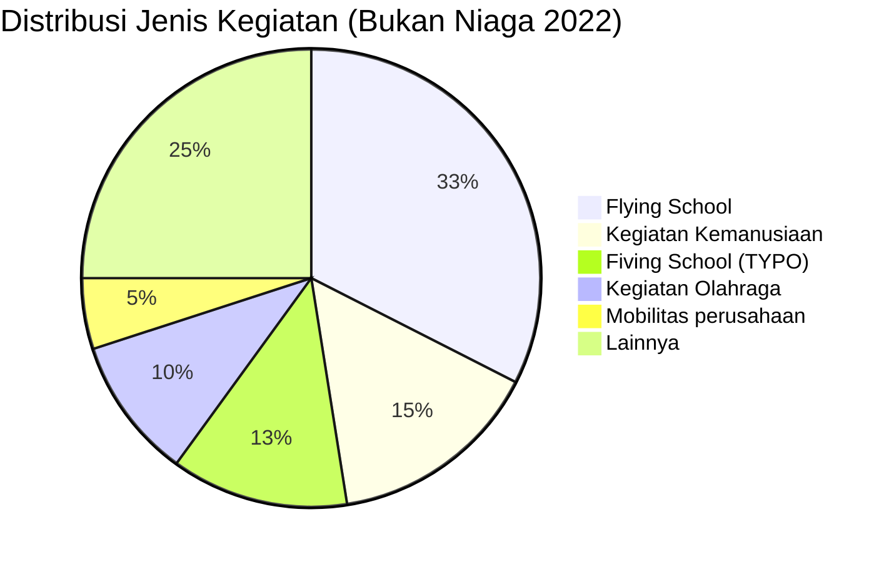

# Analisis Tabel: DAFTAR PERUSAHAAN ANGKUTAN UDARA BUKAN NIAGA TAHUN 2022

## Informasi Umum
| Atribut | Nilai |
|---------|-------|
| **Sumber File** | `DAFTAR PERUSAHAAN ANGKUTAN UDARA BUKAN NIAGA TAHUN 2022.csv` |
| **Tahun** | 2022 |
| **Kategori** | Angkutan Udara Bukan Niaga |
| **Total Baris Data** | 40 |
| **Jumlah Kolom** | 3 |

---

## Struktur Tabel

| No | Nama Kolom | Tipe Data | Deskripsi |
|----|------------|-----------|-----------|
| 1 | `NO` | Integer | Nomor urut badan usaha |
| 2 | `NAMA BADAN USAHA` | String | Nama resmi badan usaha/lembaga |
| 3 | `JENIS KEGIATAN` | String | Jenis kegiatan operasional |

---

## Sample Data (3 Baris Pertama)

| NO | NAMA BADAN USAHA | JENIS KEGIATAN |
|----|------------------|----------------|
| 1 | PT. AVIATERRA DINAMΙΚΑ | Flying School |
| 2 | PT. DIRGANTARA AVIATION ENGINEERING | Fiving School |
| 3 | PT. MITRA AVIASI PERKASA | Fiving School |

---

## Analisis Kualitas Data

### Ringkasan Umum
| Metrik | Nilai |
|--------|-------|
| Total Baris | 40 |
| Kolom dengan Missing Values | 0 |
| Kolom dengan Nilai Null/NaN | 0 |
| Kolom dengan Strip ("-") | 0 |
| Kolom dengan **Typo/Anomali** | 2 |

### Detail Per Kolom

| Kolom | Total Baris | Non-Empty | Empty | Null/NaN | Strip ("-") | Lainnya | Keterangan |
|-------|-------------|-----------|-------|----------|-------------|---------|------------|
| `NO` | 40 | 40 | 0 | 0 | 0 | 0 | Semua terisi (angka 1-40) |
| `NAMA BADAN USAHA` | 40 | 40 | 0 | 0 | 0 | 0 | Semua terisi, 1 ada sufiks `**` |
| `JENIS KEGIATAN` | 40 | 40 | 0 | 0 | 0 | 5 Typo | Ada typo berulang: `"Fiving School"`, `"Flving School"`, `"Perumparig"` |

### Distribusi Nilai Kolom `JENIS KEGIATAN`
| Nilai | Jumlah | Persentase |
|-------|--------|------------|
| Flying School | 13 | 32.5% |
| Fiving School **(TYPO)** | 5 | 12.5% |
| Flving School **(TYPO)** | 1 | 2.5% |
| Kegiatan Olahraga | 4 | 10% |
| Kegiatan Kemanusiaan | 6 | 15% |
| Penyemprotan perkebunan | 1 | 2.5% |
| Penyemprotan Pertanian | 1 | 2.5% |
| Mobilitas perusahaan | 2 | 5% |
| Perakitan Pesawat/Pabrikan | 1 | 2.5% |
| Patroli Udara | 1 | 2.5% |
| Perakiran Cuaca (hujan buatan) | 1 | 2.5% |
| Mengkalibrasi Pesawat | 1 | 2.5% |
| Membawa Alat untuk Foto Udara | 1 | 2.5% |
| Penumpang dan Angkutan Lainnya | 1 | 2.5% |
| (Data Kosong) | 1 | 2.5% |

> ⚠️ **TYPO DITEMUKAN:**
> - `"Fiving School"` (5 entitas) — seharusnya `"Flying School"`
> - `"Flving School"` (1 entitas: `PT. ALFA FLYING SCHOOL`) — seharusnya `"Flying School"`
> - `PT. SURYA AVIASI INTERNASIONAL**` memiliki `JENIS KEGIATAN = "(Data Kosong)"` dengan sufiks `**`

---

## Diagram Distribusi Jenis Kegiatan

---

## Catatan Tambahan
- ⚠️ **STRUKTUR BERUBAH DRAMATIS:** File ini sekarang punya **3 kolom** (ada tambahan `JENIS KEGIATAN` yang di 2020-2021 tidak ada!)
- ⚠️ **BANYAK TYPO** pada nilai `Flying School`:
  - `"Fiving School"` — huruf `l` → `i` (5 entitas)
  - `"Flving School"` — huruf `i` → `v` (1 entitas)
- ⚠️ **Data kosong:** `PT. SURYA AVIASI INTERNASIONAL**` memiliki `JENIS KEGIATAN = "(Data Kosong)"`
- ⚠️ **Perubahan nama:**
  - `YAYASAN MAF INDONESIA (MISSION AVIATION FELLOWSHIP)` → `YAYASAN MAF INDONESIA`
  - `YAYASAN PELAYANAN PENERBANGAN TARIKU (YPPT)` → `YAYASAN PELAYANAN PENERBANGAN TARIKU`
  - `BALAI BESAR TEKNOLOGI MODIFIKASI CUACA BADAN PENGKAJIAN DAN PENERAPAN TEKNOLOGI (BB-TMC BPPT)` → `BALAI BESAR TEKNOLOGI MODIFIKASI CUACA` (disingkat)
- ⚠️ **Karakter Yunani:** `PT. AVIATERRA DINAMΙΚΑ` (masih ada karakter Yunani `ΜΙΚΑ`)
- ⚠️ **Jumlah entitas:** 41 (2021) → 40 (2022) — berkurang 1
- ⚠️ **Hilang dari 2021:** `PT. SOLO WINGS FLIGHT CLUB`, `PT. SINAR PHOENIK ANGKASA PRIMA`, `YAYASAN MISI MASYARAKAT PEDALAMAN`
- ⚠️ **Baru di 2022:** `YAYASAN AVIASI NUSANTARA`, `YAYASAN HELIVIDA INDONESIA`
