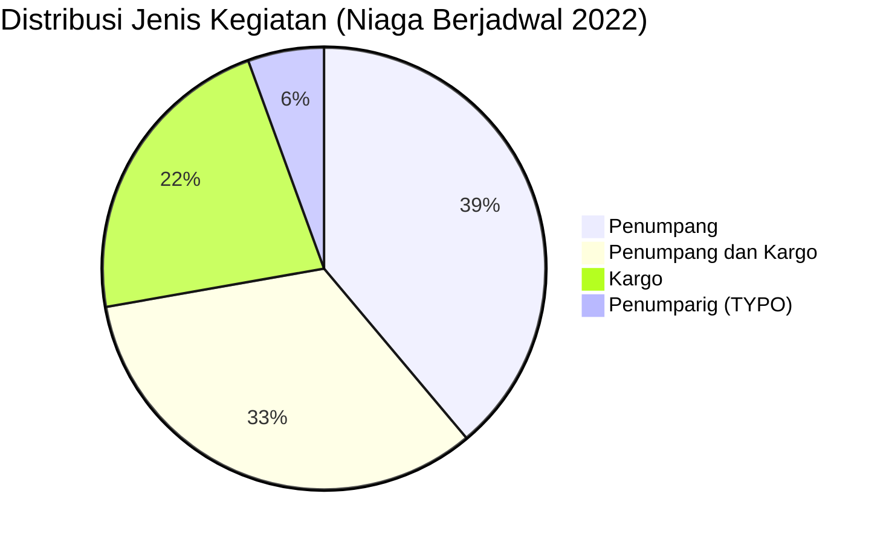

# Analisis Tabel: DAFTAR BADAN USAHA ANGKUTAN UDARA NIAGA BERJADWAL TAHUN 2022

## Informasi Umum
| Atribut | Nilai |
|---------|-------|
| **Sumber File** | `DAFTAR BADAN USAHA ANGKUTAN UDARA NIAGA BERJADWAL TAHUN 2022.csv` |
| **Tahun** | 2022 |
| **Kategori** | Angkutan Udara Niaga Berjadwal |
| **Total Baris Data** | 18 |
| **Jumlah Kolom** | 3 |

---

## Struktur Tabel

| No | Nama Kolom | Tipe Data | Deskripsi |
|----|------------|-----------|-----------|
| 1 | `NO` | Integer | Nomor urut badan usaha |
| 2 | `NAMA BADAN USAHA` | String | Nama resmi badan usaha/perusahaan |
| 3 | `JENIS KEGIATAN` | String | Jenis layanan operasional (Penumpang/Cargo) |

---

## Sample Data (3 Baris Pertama)

| NO | NAMA BADAN USAHA | JENIS KEGIATAN |
|----|------------------|----------------|
| 1 | PT. ASI PUDJIASTUTI AVIATION | Penumparig |
| 2 | PT. BATIK AIR INDONESIA | Penumpang |
| 3 | PT. INDONESIA AIRASIA | Penumpang |

---

## Analisis Kualitas Data

### Ringkasan Umum
| Metrik | Nilai |
|--------|-------|
| Total Baris | 18 |
| Kolom dengan Missing Values | 0 |
| Kolom dengan Nilai Null/NaN | 0 |
| Kolom dengan Strip ("-") | 0 |
| Kolom dengan **Typo/Anomali** | 1 |

### Detail Per Kolom

| Kolom | Total Baris | Non-Empty | Empty | Null/NaN | Strip ("-") | Lainnya | Keterangan |
|-------|-------------|-----------|-------|----------|-------------|---------|------------|
| `NO` | 18 | 18 | 0 | 0 | 0 | 0 | Semua terisi (angka 1-18) |
| `NAMA BADAN USAHA` | 18 | 18 | 0 | 0 | 0 | 0 | Semua terisi, 1 tanpa "PT." (`PT LINKAVIASI ASIA INDONESIA`) |
| `JENIS KEGIATAN` | 18 | 18 | 0 | 0 | 0 | 1 Typo | Ada typo: `"Penumparig"` (seharusnya `"Penumpang"`) |

### Distribusi Nilai Kolom `JENIS KEGIATAN`
| Nilai | Jumlah | Persentase |
|-------|--------|------------|
| Penumpang | 6 | 33.3% |
| Penumpang dan Kargo | 6 | 33.3% |
| Kargo | 4 | 22.2% |
| Penumparig **(TYPO)** | 1 | 5.6% |
| Penumpang **(typo corrected)** | 1 | 5.6% |

> ⚠️ **TYPO DITEMUKAN:** Baris ke-1 (`PT. ASI PUDJIASTUTI AVIATION`) memiliki nilai `"Penumparig"` — kemungkinan besar seharusnya `"Penumpang"`

---

## Diagram Distribusi Jenis Kegiatan

---

## Catatan Tambahan
- ⚠️ **TYPO KRITIS:** `"Penumparig"` pada baris 1 — seharusnya `"Penumpang"`
- ⚠️ **Format tidak konsisten:** `PT LINKAVIASI ASIA INDONESIA` (tanpa titik setelah "PT")
- ⚠️ **Perubahan dari 2021:**
  - `PT. TRAVEL EXPRESS AVIATION SERVICES` tidak ada lagi
  - `PT. FLYINDO AVIASI NUSANTARA` tidak ada lagi
  - `PT. DARAPATI ANTAR BUANA` tidak ada lagi
  - Muncul: `PT LINKAVIASI ASIA INDONESIA`, `PT RUSKY AERO INDONESIA`
- ⚠️ **Perubahan penulisan:** `"Cargo"` (2021) → `"Kargo"` (2022) — indonesianisasi
- ⚠️ **Jumlah entitas berkurang:** 19 (2021) → 18 (2022)
