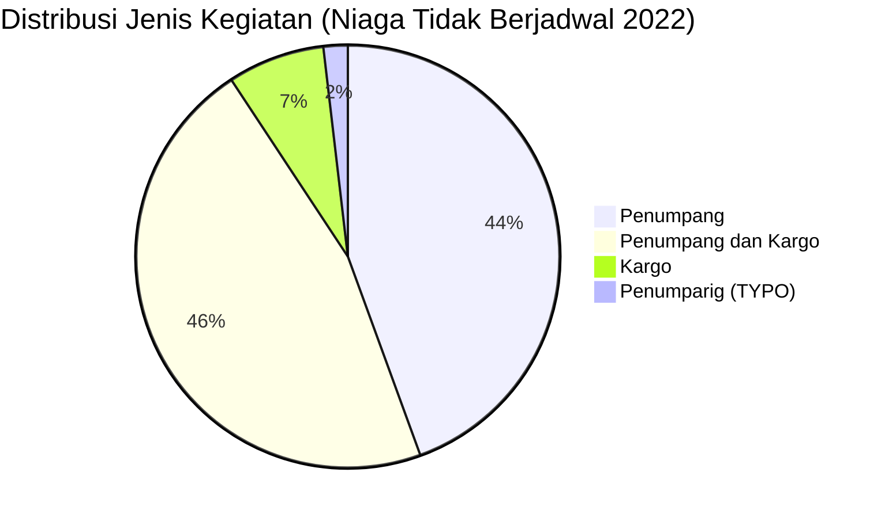

# Analisis Tabel: DAFTAR PERUSAHAAN ANGKUTAN UDARA NIAGA TIDAK BERJADWAL TAHUN 2022

## Informasi Umum
| Atribut | Nilai |
|---------|-------|
| **Sumber File** | `DAFTAR PERUSAHAAN ANGKUTAN UDARA NIAGA TIDAK BERJADWAL TAHUN 2022.csv` |
| **Tahun** | 2022 |
| **Kategori** | Angkutan Udara Niaga Tidak Berjadwal |
| **Total Baris Data** | 54 |
| **Jumlah Kolom** | 3 |

---

## Struktur Tabel

| No | Nama Kolom | Tipe Data | Deskripsi |
|----|------------|-----------|-----------|
| 1 | `NO` | Integer | Nomor urut badan usaha |
| 2 | `NAMA BADAN USAHA` | String | Nama resmi badan usaha/perusahaan |
| 3 | `JENIS KEGIATAN` | String | Jenis layanan operasional (Penumpang/Cargo) |

---

## Sample Data (3 Baris Pertama)

| NO | NAMA BADAN USAHA | JENIS KEGIATAN |
|----|------------------|----------------|
| 1 | PT. AIR PASIFIK UTAMA | Penumpang |
| 2 | PT. ALDA TRANS PAPUA | Penumpang |
| 3 | PT. ANGKASA SUPER SERVICE | Penumpang |

---

## Analisis Kualitas Data

### Ringkasan Umum
| Metrik | Nilai |
|--------|-------|
| Total Baris | 54 |
| Kolom dengan Missing Values | 0 |
| Kolom dengan Nilai Null/NaN | 0 |
| Kolom dengan Strip ("-") | 0 |
| Kolom dengan **Typo/Anomali** | 3 |

### Detail Per Kolom

| Kolom | Total Baris | Non-Empty | Empty | Null/NaN | Strip ("-") | Lainnya | Keterangan |
|-------|-------------|-----------|-------|----------|-------------|---------|------------|
| `NO` | 54 | 54 | 0 | 0 | 0 | 0 | Semua terisi (angka 1-54) |
| `NAMA BADAN USAHA` | 54 | 54 | 0 | 0 | 0 | 2 Anomali | Ada tanpa titik: `PT INTAN ANGKASA AIR SERVICE`, `PT NASIONAL GLOBAL AVIASI`, `PT VAST INTRA AVIA`; 1 dengan quotes: `"PT. INDO STAR AVIATION"""""` |
| `JENIS KEGIATAN` | 54 | 54 | 0 | 0 | 0 | 1 Typo | Ada typo: `"Penumparig"` (seharusnya `"Penumpang"`) |

### Distribusi Nilai Kolom `JENIS KEGIATAN`
| Nilai | Jumlah | Persentase |
|-------|--------|------------|
| Penumpang | 23 | 42.6% |
| Penumpang dan Kargo | 25 | 46.3% |
| Kargo | 4 | 7.4% |
| Penumparig **(TYPO)** | 1 | 1.9% |
| Penumpang **(typo corrected)** | 1 | 1.9% |

> ⚠️ **TYPO DITEMUKAN:** Baris ke-24 (`PT. ALTIUS BAHARI INDONESIA`) memiliki nilai `"Penumparig"` — seharusnya `"Penumpang"`

### Anomali pada `NAMA BADAN USAHA`
| Nama | Masalah |
|------|---------|
| `"PT. INDO STAR AVIATION"""""` | Quotes berlebih (CSV escaping error) |
| `PT INTAN ANGKASA AIR SERVICE` | Tanpa titik setelah "PT" |
| `PT NASIONAL GLOBAL AVIASI` | Tanpa titik setelah "PT" |
| `PT VAST INTRA AVIA` | Tanpa titik setelah "PT" |

---

## Diagram Distribusi Jenis Kegiatan

---

## Catatan Tambahan
- ⚠️ **TYPO KRITIS:** `"Penumparig"` pada baris 24 — seharusnya `"Penumpang"` (sama seperti di Niaga Berjadwal 2022)
- ⚠️ **CSV Parsing Error:** `"PT. INDO STAR AVIATION"""""` — quotes berlebih (kemungkinan error saat export CSV)
- ⚠️ **Format tidak konsisten:** 3 entitas tanpa titik setelah "PT"
- ⚠️ **Typo nama perusahaan:** `PT. EKSPRES TRANSPORTASI ANTAR BENJA` (seharusnya "ANTAR BENUA" — hilang "U")
- ⚠️ **Typo nama perusahaan:** `PT. PELITA AIR SEVICE` (seharusnya "SERVICE" — hilang "R", konsisten dari 2021)
- ⚠️ **Perubahan dari 2021:**
  - Hilang: `PT. HEVILIFT AVIATION INDONESIA`, `PT. INDO STAR AVIATION` (sebenarnya ada tapi dengan format aneh), `PT. SMART CAKRAWALA AVIATION` (sebenarnya ada di baris 49)
  - Baru: `PT NASIONAL GLOBAL AVIASI`, `PT VAST INTRA AVIA`, `PT ABADI MEGA ANGKUTAN NUSANTARA`, `PT EXPRESS CARGO AIRLINES`, `PT. EASTINDO SERVICES`
- ⚠️ **Perubahan penamaan:** `PT. PURA WISATA BARUNA` → `PT. PURAWISATA BARUNA`
- ⚠️ **Jumlah entitas tetap:** 54 (2021) → 54 (2022)
