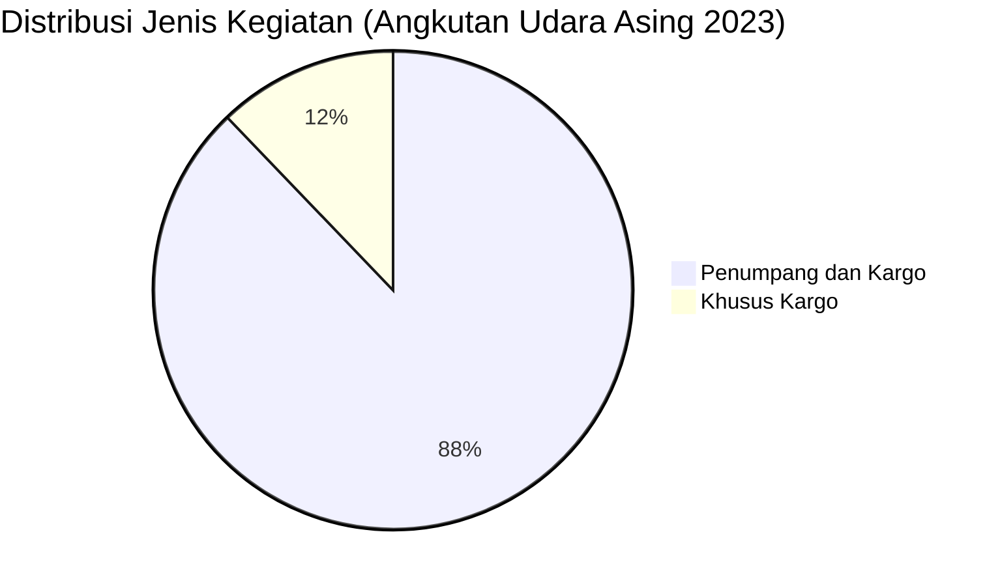

# Analisis Tabel: DAFTAR PERUSAHAAN ANGKUTAN UDARA ASING TAHUN 2023

## Informasi Umum
| Atribut | Nilai |
|---------|-------|
| **Sumber File** | `DAFTAR PERUSAHAAN ANGKUTAN UDARA ASING TAHUN 2023.csv` |
| **Tahun** | 2023 |
| **Kategori** | Angkutan Udara Asing |
| **Total Baris Data** | 74 |
| **Jumlah Kolom** | 4 |

---

## Struktur Tabel

| No | Nama Kolom | Tipe Data | Deskripsi |
|----|------------|-----------|-----------|
| 1 | `NO` | Integer | Nomor urut perusahaan |
| 2 | `NAMA PERUSAHAAN` | String | Nama resmi perusahaan asing |
| 3 | `NEGARA` | String | Negara asal perusahaan |
| 4 | `JENIS KEGIATAN` | String | Jenis layanan operasional |

---

## Sample Data (3 Baris Pertama)

| NO | NAMA PERUSAHAAN | NEGARA | JENIS KEGIATAN |
|----|-----------------|--------|----------------|
| 1 | AIRASIA | MALAYSIA | Penumpang dan Kargo |
| 2 | AIRASIA X | MALAYSIA | Penumpang dan Kargo |
| 3 | AERO DILI | TIMOR LESTE | Penumpang dan Kargo |

---

## Analisis Kualitas Data

### Ringkasan Umum
| Metrik | Nilai |
|--------|-------|
| Total Baris | 74 |
| Kolom dengan Missing Values | 0 |
| Kolom dengan Nilai Null/NaN | 0 |
| Kolom dengan Strip ("-") | 0 |
| Kolom dengan **Typo/Anomali** | 2 |

### Detail Per Kolom

| Kolom | Total Baris | Non-Empty | Empty | Null/NaN | Strip ("-") | Lainnya | Keterangan |
|-------|-------------|-----------|-------|----------|-------------|---------|------------|
| `NO` | 74 | 74 | 0 | 0 | 0 | 0 | Semua terisi (angka 1-74) |
| `NAMA PERUSAHAAN` | 74 | 74 | 0 | 0 | 0 | 1 Anomali | Ada karakter Yunani: `ΧΙΑΜΕN AIRLINES` |
| `NEGARA` | 74 | 74 | 0 | 0 | 0 | 0 | Semua terisi, ada perubahan penamaan negara |
| `JENIS KEGIATAN` | 74 | 74 | 0 | 0 | 0 | 0 | Semua terisi, nilai konsisten |

### Distribusi Nilai Kolom `JENIS KEGIATAN`
| Nilai | Jumlah | Persentase |
|-------|--------|------------|
| Penumpang dan Kargo | 65 | 87.8% |
| Khusus Kargo | 9 | 12.2% |

### Anomali pada `NAMA PERUSAHAAN`
| Nama | Masalah |
|------|---------|
| `ΧΙΑΜΕN AIRLINES` | Menggunakan karakter Yunani `Χ` (Chi) dan `Ι` (Iota) — seharusnya `XIAMEN AIRLINES` |

### Sufiks `*` pada `NAMA PERUSAHAAN`
| Nama Perusahaan | Ada Sufiks |
|-----------------|------------|
| FLYNAS* | ✅ |
| HAINAN AIRLINES* | ✅ |
| JORDAN AVIATION* | ✅ |
| JUNEYAO AIRLINES* | ✅ |
| LANMEI AIRLINES* | ✅ |
| MASWINGS* | ✅ |
| MY JET XPRESS AIRLINES* | ✅ |
| MYAIRLINES* | ✅ |
| ROSSIYA AIRLINES* | ✅ |
| SICHUAN AIRLINES* | ✅ |
| STARLUX AIRLINES* | ✅ |
| THAI SMILE AIRWAYS COMPANY LIMITED* | ✅ |
| THAI VIETJET AIR* | ✅ |
| VALUAIR* | ✅ |
| ZHEJIANG LOONG AIRLINES* | ✅ |
| LUFTHANSA CARGO* | ✅ |

> ⚠️ **Sufiks `*`** muncul pada 16 perusahaan — kemungkinan merujuk ke catatan kaki/status khusus (berbeda dari 2021 yang menggunakan `**`)

---

## Diagram Distribusi Jenis Kegiatan

---

## Catatan Tambahan
- ✅ **Tidak ada typo** `"Perumpang"` seperti di 2022 — data lebih bersih
- ✅ **Sufiks `*`** lebih konsisten (tanpa spasi sebelum `*`, berbeda dari 2021 yang ada spasi)
- ⚠️ **Perubahan nama negara:**
  - `CHINA` → `REPUBLIK RAKYAT TIONGKOK` (untuk China Airlines, China Eastern, China Southern)
  - `CHINA` → `REPUBLIK TIONGKOK (ROC)` (untuk Taiwan)
  - `UAE` → `UNI EMIRAT ARAB`
  - `NEW ZEALAND` → `NEW ZEALAND` (tetap, sebelumnya "SELANDIA BARU")
  - `HONGKONG` → `HONGKONG` (tetap)
  - `TIONGKOK` → `REPUBLIK RAKYAT TIONGKOK`
- ⚠️ **Perubahan nama perusahaan:**
  - `AIR ASIA BERHARD` → `AIRASIA`
  - `AIR ASIA X BERHARD` → `AIRASIA X`
  - `AIR CHINA LIMITED` → `AIR CHINA`
  - `ALL NIPPON AIRWAYS Co. Ltd` → `ALL NIPPON AIRWAYS`
  - `CEBU PACIFIC AIR` → `CEBU PACIFIC AIRLINES`
  - `EMIRATES AIRLINE` → `EMIRATES AIRLINES`
  - `FLY FIRE Sdn. Bhd.` → `FLYNAS*` (berbeda!)
  - `SCOOT PTE LTD` → tetap
- ⚠️ **Perusahaan baru di 2023:**
  - `AERO DILI` (TIMOR LESTE)
  - `AIR MACAU` (JEPANG) — kemungkinan typo negara?
  - `EGYPT AIRLINES` (MESIR)
  - `INTERGLOBE AVIATION (INDIGO)` (INDIA)
  - `JORDAN AVIATION*` (YORDANIA)
  - `JUNEYAO AIRLINES*` (TIONGKOK)
  - `MY JET XPRESS AIRLINES*` (MALAYSIA)
  - `MYAIRLINES*` (MALAYSIA)
  - `STARLUX AIRLINES*` (TIONGKOK)
  - `THAI VIETJET AIR*` (THAILAND)
  - `VALUAIR*` (SINGAPURA)
  - `VISTARA AIRLINES` (INDIA)
  - `LUFTHANSA CARGO*` (JERMAN)
- ⚠️ **Perusahaan yang hilang dari 2022:**
  - `SHENZEN AIRLINES` (sebenarnya ada sebagai `SHENZEN AIRLINES Co. Ltd.`)
  - `VIRGIN AUSTRALIA INTERNATIONAL AIRLINES` (masih ada)
- ⚠️ **Jumlah entitas bertambah signifikan:** 56 (2022) → 74 (2023) — bertambah 18 entitas
- ⚠️ **Perubahan `JENIS KEGIATAN`:** Semua perusahaan sekarang `"Penumpang dan Kargo"` (sebelumnya terpisah antara Penumpang, Cargo, Penumpang & Cargo)
- ⚠️ **Kemungkinan typo negara:** `AIR MACAU` terdaftar dengan negara `JEPANG` — seharusnya `MACAU`?
