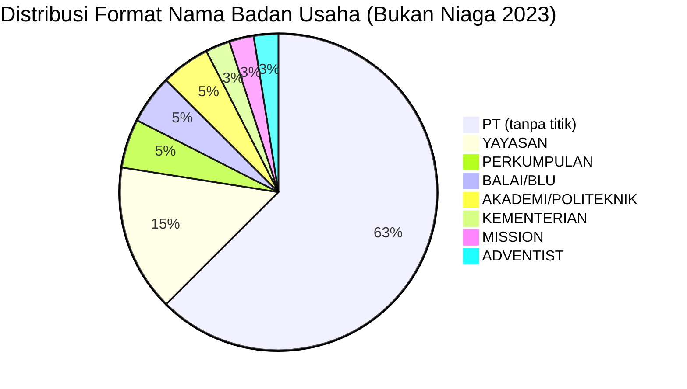

# Analisis Tabel: DAFTAR PEMEGANG PERIZINAN ANGKUTAN UDARA BUKAN NIAGA TAHUN 2023

## Informasi Umum
| Atribut | Nilai |
|---------|-------|
| **Sumber File** | `DAFTAR PEMEGANG PERIZINAN ANGKUTAN UDARA BUKAN NIAGA TAHUN 2023.csv` |
| **Tahun** | 2023 |
| **Kategori** | Angkutan Udara Bukan Niaga |
| **Total Baris Data** | 40 |
| **Jumlah Kolom** | 2 |

---

## Struktur Tabel

| No | Nama Kolom | Tipe Data | Deskripsi |
|----|------------|-----------|-----------|
| 1 | `NO` | Integer | Nomor urut perusahaan |
| 2 | `NAMA PERUSAHAAN` | String | Nama resmi badan usaha/lembaga |

---

## Sample Data (3 Baris Pertama)

| NO | NAMA PERUSAHAAN |
|----|-----------------|
| 1 | PT AERO FLYER INSTITUTE |
| 2 | PT AIR TRANSPORT SERVICES |
| 3 | PT ALFA FLYING SCHOOL |

---

## Analisis Kualitas Data

### Ringkasan Umum
| Metrik | Nilai |
|--------|-------|
| Total Baris | 40 |
| Kolom dengan Missing Values | 0 |
| Kolom dengan Nilai Null/NaN | 0 |
| Kolom dengan Strip ("-") | 0 |
| Kolom dengan **Typo/Anomali** | 1 |

### Detail Per Kolom

| Kolom | Total Baris | Non-Empty | Empty | Null/NaN | Strip ("-") | Lainnya | Keterangan |
|-------|-------------|-----------|-------|----------|-------------|---------|------------|
| `NO` | 40 | 40 | 0 | 0 | 0 | 0 | Semua terisi (angka 1-40) |
| `NAMA PERUSAHAAN` | 40 | 40 | 0 | 0 | 0 | 0 | Semua terisi, **semua tanpa titik** setelah "PT" |

### Catatan Khusus Kolom `NAMA PERUSAHAAN`
**Tidak ada kolom `JENIS KEGIATAN`** — konsisten dengan 2020-2021, tetapi **berbeda dari 2022 yang punya 3 kolom**.

#### Variasi Prefix/Format Nama Badan Usaha:
| Prefix/Format | Jumlah | Contoh |
|---------------|--------|--------|
| `PT` (tanpa titik) | 25 | PT AERO FLYER INSTITUTE, PT ALFA FLYING SCHOOL |
| `YAYASAN` | 6 | YAYASAN AVIASI NUSANTARA, YAYASAN HELIVIDA |
| `PERKUMPULAN` | 2 | PERKUMPULAN PENERBANGAN INDONESIA, PERKUMPULAN PENERBANGAN ALFA INDONESIA |
| `BALAI/BLU` | 2 | BALAI BESAR TEKNOLOGI MODIFIKASI CUACA, BLU BALAI KALIBRASI FASILITAS PENERBANGAN |
| `AKADEMI/POLITEKNIK` | 2 | AKADEMI PENERBANG INDONESIA BANYUWANGI, POLITEKNIK PENERBANGAN CURUG |
| `KEMENTERIAN` | 1 | KEMENTERIAN LINGKUNGAN HIDUP DAN KEHUTANAN |
| `MISSION` | 1 | MISSION AVIATION FELLOWSHIP (MAF) |
| `ADVENTIST` | 1 | ADVENTIST AVIATION INDONESIA |

---

## Diagram Distribusi Format Nama Badan Usaha

---

## Catatan Tambahan
- ✅ **Data bersih** tanpa nilai kosong/null/strip/typo seperti di 2022
- ⚠️ **JUDUL FILE BERUBAH:** `DAFTAR PEMEGANG PERIZINAN ANGKUTAN UDARA BUKAN NIAGA` (sebelumnya `DAFTAR PERUSAHAAN ANGKUTAN UDARA BUKAN NIAGA`)
- ⚠️ **NAMA KOLOM BERUBAH:** `NAMA PERUSAHAAN` (sebelumnya `NAMA BADAN USAHA` di 2020-2022)
- ⚠️ **STRUKTUR BERUBAH:** Kembali ke **2 kolom** (tidak ada `JENIS KEGIATAN` seperti di 2022)
- ⚠️ **Format nama perusahaan:** Semua **tanpa titik** setelah "PT" (konsisten dengan file Niaga Berjadwal 2023)
- ⚠️ **Perubahan nama dari 2022:**
  - `PT. SINAR PHOENIK ANGKASA PRIMA` → `PT SINAR PHOENIX ANGKASA PRIMA` (perbaikan ejaan: PHOENIK → PHOENIX)
  - `POLITEKNIK PENERBANGAN INDONESIA CURUG` → `POLITEKNIK PENERBANGAN CURUG` (disingkat)
  - `YAYASAN HELIVIDA INDONESIA` → `YAYASAN HELIVIDA`
  - `YAYASAN MAF INDONESIA (MISSION AVIATION FELLOWSHIP)` → `MISSION AVIATION FELLOWSHIP (MAF)`
- ⚠️ **Entitas baru di 2023:** `PT SINAR PHOENIX ANGKASA PRIMA`, `YAYASAN MISI MASYARAKAT PEDALAMAN`
- ⚠️ **Entitas hilang dari 2022:** `PT SOLO WINGS FLIGHT CLUB`
