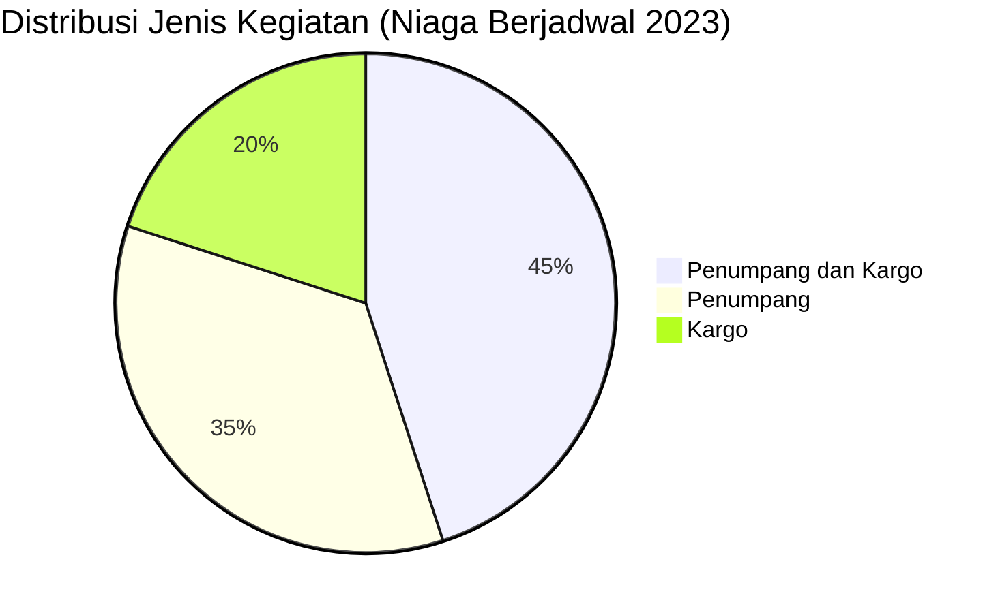

# Analisis Tabel: DAFTAR BADAN USAHA ANGKUTAN UDARA NIAGA BERJADWAL TAHUN 2023

## Informasi Umum
| Atribut | Nilai |
|---------|-------|
| **Sumber File** | `DAFTAR BADAN USAHA ANGKUTAN UDARA NIAGA BERJADWAL TAHUN 2023.csv` |
| **Tahun** | 2023 |
| **Kategori** | Angkutan Udara Niaga Berjadwal |
| **Total Baris Data** | 20 |
| **Jumlah Kolom** | 3 |

---

## Struktur Tabel

| No | Nama Kolom | Tipe Data | Deskripsi |
|----|------------|-----------|-----------|
| 1 | `NO` | Integer | Nomor urut badan usaha |
| 2 | `NAMA BADAN USAHA` | String | Nama resmi badan usaha/perusahaan |
| 3 | `JENIS KEGIATAN` | String | Jenis layanan operasional (Penumpang/Cargo) |

---

## Sample Data (3 Baris Pertama)

| NO | NAMA BADAN USAHA | JENIS KEGIATAN |
|----|------------------|----------------|
| 1 | PT SUPER AIR JET | Penumpang dan Kargo |
| 2 | PT PELITA AIR SERVICE | Penumpang dan Kargo |
| 3 | PT CITILINK INDONESIA | Penumpang dan Kargo |

---

## Analisis Kualitas Data

### Ringkasan Umum
| Metrik | Nilai |
|--------|-------|
| Total Baris | 20 |
| Kolom dengan Missing Values | 0 |
| Kolom dengan Nilai Null/NaN | 0 |
| Kolom dengan Strip ("-") | 0 |
| Kolom dengan **Typo/Anomali** | 1 |

### Detail Per Kolom

| Kolom | Total Baris | Non-Empty | Empty | Null/NaN | Strip ("-") | Lainnya | Keterangan |
|-------|-------------|-----------|-------|----------|-------------|---------|------------|
| `NO` | 20 | 20 | 0 | 0 | 0 | 0 | Semua terisi (angka 1-20) |
| `NAMA BADAN USAHA` | 20 | 20 | 0 | 0 | 0 | 0 | Semua terisi, **semua tanpa titik** setelah "PT" |
| `JENIS KEGIATAN` | 20 | 20 | 0 | 0 | 0 | 1 Anomali | Semua terisi, nilai konsisten |

### Distribusi Nilai Kolom `JENIS KEGIATAN`
| Nilai | Jumlah | Persentase |
|-------|--------|------------|
| Penumpang dan Kargo | 9 | 45% |
| Penumpang | 7 | 35% |
| Kargo | 4 | 20% |

### Anomali pada `NAMA BADAN USAHA`
| Nama | Masalah |
|------|---------|
| Semua entitas | **Tidak ada titik** setelah "PT" (konsisten berbeda dari tahun sebelumnya) |
| `PT TRI - M.G. INTRA ASIA AIRLINES` | Spasi berlebih di sekitar `-` |

---

## Diagram Distribusi Jenis Kegiatan

---

## Catatan Tambahan
- ✅ **Tidak ada typo** seperti `"Penumparig"` di 2022 — data lebih bersih
- ⚠️ **Perubahan format konsisten:** Semua nama perusahaan **tanpa titik** setelah "PT" (berbeda dari 2020-2022 yang menggunakan "PT.")
- ⚠️ **Perusahaan baru:**
  - `PT SURYA MATARAM AVIASI`
  - `PT BBN AIRLINES INDONESIA`
- ⚠️ **Perusahaan yang hilang dari 2022:**
  - `PT LINKAVIASI ASIA INDONESIA` (sebenarnya ada di baris 7)
  - `PT RUSKY AERO INDONESIA` (masih ada di baris 20)
- ⚠️ **Perubahan urutan:** Data diurutkan berdasarkan `JENIS KEGIATAN` (Penumpang dan Kargo dulu, baru Penumpang, lalu Kargo) — berbeda dari tahun sebelumnya yang diurutkan berdasarkan NO
- ⚠️ **Spasi anomali:** `PT TRI - M.G. INTRA ASIA AIRLINES` (spasi di sekitar `-`)
