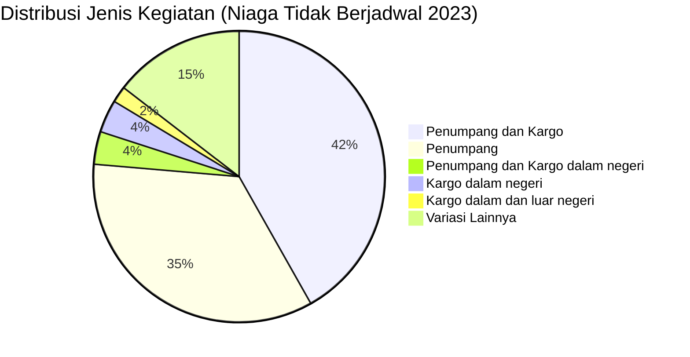

# Analisis Tabel: DAFTAR BADAN USAHA ANGKUTAN UDARA NIAGA TIDAK BERJADWAL TAHUN 2023

## Informasi Umum
| Atribut | Nilai |
|---------|-------|
| **Sumber File** | `DAFTAR BADAN USAHA ANGKUTAN UDARA NIAGA TIDAK BERJADWAL TAHUN 2023.csv` |
| **Tahun** | 2023 |
| **Kategori** | Angkutan Udara Niaga Tidak Berjadwal |
| **Total Baris Data** | 55 |
| **Jumlah Kolom** | 3 |

---

## Struktur Tabel

| No | Nama Kolom | Tipe Data | Deskripsi |
|----|------------|-----------|-----------|
| 1 | `NO` | Integer | Nomor urut badan usaha |
| 2 | `NAMA BADAN USAHA` | String | Nama resmi badan usaha/perusahaan |
| 3 | `JENIS KEGIATAN` | String | Jenis layanan operasional |

---

## Sample Data (3 Baris Pertama)

| NO | NAMA BADAN USAHA | JENIS KEGIATAN |
|----|------------------|----------------|
| 1 | PT Volta Pasifik Aviasi | Penumpang dan Kargo, angkutan udara niaga tidak berjadwal lainnya |
| 2 | PT Amarta Aviasi Mandiri | Penumpang dan Kargo dalam dan luar negeri, angkutan udara niaga tidak berjadwal lainnya |
| 3 | PT Nasional Global Aviasi | Penumpang dan Kargo dalam negeri, angkutan udara niaga tidak berjadwal lainnya |

---

## Analisis Kualitas Data

### Ringkasan Umum
| Metrik | Nilai |
|--------|-------|
| Total Baris | 55 |
| Kolom dengan Missing Values | 0 |
| Kolom dengan Nilai Null/NaN | 0 |
| Kolom dengan Strip ("-") | 0 |
| Kolom dengan **Typo/Anomali** | 2 |

### Detail Per Kolom

| Kolom | Total Baris | Non-Empty | Empty | Null/NaN | Strip ("-") | Lainnya | Keterangan |
|-------|-------------|-----------|-------|----------|-------------|---------|------------|
| `NO` | 55 | 55 | 0 | 0 | 0 | 0 | Semua terisi (angka 1-55) |
| `NAMA BADAN USAHA` | 55 | 55 | 0 | 0 | 0 | 2 Anomali | Ada tanpa titik setelah "PT"; 1 nama terpotong |
| `JENIS KEGIATAN` | 55 | 55 | 0 | 0 | 0 | 0 | Semua terisi, nilai sangat bervariasi |

### Distribusi Nilai Kolom `JENIS KEGIATAN`
| Nilai | Jumlah | Persentase |
|-------|--------|------------|
| Penumpang dan Kargo | 23 | 41.8% |
| Penumpang | 19 | 34.5% |
| Penumpang dan Kargo dalam negeri | 2 | 3.6% |
| Penumpang dan Kargo dalam dan luar negeri | 1 | 1.8% |
| Penumpang dan Kargo, angkutan udara niaga tidak berjadwal lainnya | 1 | 1.8% |
| Penumpang dan Kargo dalam dan luar negeri, angkutan udara niaga tidak berjadwal lainnya | 1 | 1.8% |
| Penumpang dan Kargo, khusus kargo dalam negeri dan luar negeri | 1 | 1.8% |
| Penumpang dan Kargo; khusus kargo | 1 | 1.8% |
| Penumpang dan Kargo dalam negeri | 2 | 3.6% |
| Kargo dalam dan luar negeri | 1 | 1.8% |
| Kargo dalam negeri | 2 | 3.6% |

> ⚠️ **Variasi penulisan sangat tinggi:** Ada 11 variasi berbeda untuk `JENIS KEGIATAN` — jauh lebih kompleks dari tahun sebelumnya

### Anomali pada `NAMA BADAN USAHA`
| Nama | Masalah |
|------|---------|
| Semua entitas | **Tidak ada titik** setelah "PT" (konsisten dengan file Niaga Berjadwal 2023) |
| `PT Eastindo Services (East Indonesia Air Taxi An` | **Nama terpotong** — kemungkinan seharusnya `...Taxi And Charter Service` |
| `PT Pelita Air Sevice` | **Typo:** "Sevice" seharusnya "Service" (konsisten dari 2021-2022) |

---

## Diagram Distribusi Jenis Kegiatan

---

## Catatan Tambahan
- ✅ **Tidak ada typo** `"Penumparig"` seperti di 2022 — data lebih bersih
- ⚠️ **Format nama perusahaan:** Semua **tanpa titik** setelah "PT" (konsisten dengan file lain di 2023)
- ⚠️ **Nama terpotong:** `PT Eastindo Services (East Indonesia Air Taxi An` — kemungkinan CSV terpotong atau limit karakter
- ⚠️ **Typo persisten:** `PT Pelita Air Sevice` (masih "Sevice", bukan "Service" — konsisten typo dari 2021)
- ⚠️ **Perubahan signifikan `JENIS KEGIATAN`:**
  - Nilai sekarang sangat detail dan bervariasi
  - Ada tambahan informasi lingkup operasi: "dalam negeri", "luar negeri", "khusus kargo"
  - Ada tambahan keterangan: "angkutan udara niaga tidak berjadwal lainnya"
- ⚠️ **Perusahaan baru di 2023:**
  - `PT Amarta Aviasi Mandiri`
  - `PT Ikairos Air Service`
  - `PT BBN Airlines Indonesia`
  - `PT Persada Perkasa Airnesia`
- ⚠️ **Perusahaan yang hilang dari 2022:**
  - `PT HEVILIFT AVIATION INDONESIA`
  - `PT INDO STAR AVIATION`
  - `PT PURAWISATA BARUNA` (sebenarnya ada sebagai `PT Purawisata Baruna`)
- ⚠️ **Jumlah entitas bertambah:** 54 (2022) → 55 (2023)
- ⚠️ **Perubahan penamaan:** `PT. Volta Pasifik Aviasi` → `PT Volta Pasifik Aviasi` (tanpa titik, huruf kecil "olta")
