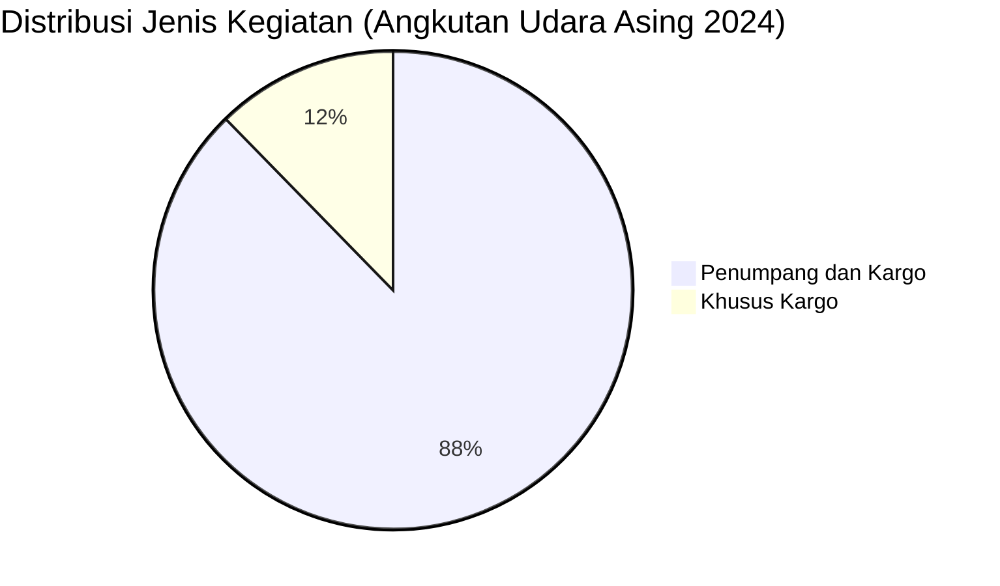

# Analisis Tabel: DAFTAR PERWAKILAN PERUSAHAAN ANGKUTAN UDARA ASING TAHUN 2024

## Informasi Umum
| Atribut | Nilai |
|---------|-------|
| **Sumber File** | `DAFTAR PERWAKILAN PERUSAHAAN ANGKUTAN UDARA ASING TAHUN 2024.csv` |
| **Tahun** | 2024 |
| **Kategori** | Angkutan Udara Asing |
| **Total Baris Data** | 65 |
| **Jumlah Kolom** | 4 |

---

## Struktur Tabel

| No | Nama Kolom | Tipe Data | Deskripsi |
|----|------------|-----------|-----------|
| 1 | `NO` | Integer | Nomor urut perusahaan |
| 2 | `NAMA ANGKUTAN UDARA ASING` | String | Nama resmi perusahaan asing |
| 3 | `NEGARA` | String | Negara asal perusahaan |
| 4 | `JENIS KEGIATAN` | String | Jenis layanan operasional |

---

## Sample Data (3 Baris Pertama)

| NO | NAMA ANGKUTAN UDARA ASING | NEGARA | JENIS KEGIATAN |
|----|---------------------------|--------|----------------|
| 1 | AIRASIA BERHAD | MALAYSIA | Penumpang dan Kargo |
| 2 | AIRASIA X BERHAD | MALAYSIA | Penumpang dan Kargo |
| 3 | AERO DILI | TIMOR LESTE | Penumpang dan Kargo |

---

## Analisis Kualitas Data

### Ringkasan Umum
| Metrik | Nilai |
|--------|-------|
| Total Baris | 65 |
| Kolom dengan Missing Values | 0 |
| Kolom dengan Nilai Null/NaN | 0 |
| Kolom dengan Strip ("-") | 0 |
| Kolom dengan **Typo/Anomali** | 2 |

### Detail Per Kolom

| Kolom | Total Baris | Non-Empty | Empty | Null/NaN | Strip ("-") | Lainnya | Keterangan |
|-------|-------------|-----------|-------|----------|-------------|---------|------------|
| `NO` | 65 | 65 | 0 | 0 | 0 | 0 | Semua terisi (angka 1-65) |
| `NAMA ANGKUTAN UDARA ASING` | 65 | 65 | 0 | 0 | 0 | 1 Anomali | Ada karakter Yunani: `ΧΙΑΜΕN AIRLINES` |
| `NEGARA` | 65 | 65 | 0 | 0 | 0 | 0 | Semua terisi, ada perubahan penamaan negara |
| `JENIS KEGIATAN` | 65 | 65 | 0 | 0 | 0 | 0 | Semua terisi, nilai konsisten |

### Distribusi Nilai Kolom `JENIS KEGIATAN`
| Nilai | Jumlah | Persentase |
|-------|--------|------------|
| Penumpang dan Kargo | 57 | 87.7% |
| Khusus Kargo | 8 | 12.3% |

### Anomali pada `NAMA ANGKUTAN UDARA ASING`
| Nama | Masalah |
|------|---------|
| `ΧΙΑΜΕN AIRLINES` | Menggunakan karakter Yunani `Χ` (Chi) dan `Ι` (Iota) — seharusnya `XIAMEN AIRLINES` (konsisten dari 2023) |
| `ΟΜΑΝ AIR` | Menggunakan karakter Yunani `Ο` (Omicron) dan `Μ` (Mu) — seharusnya `OMAN AIR` |

---

## Diagram Distribusi Jenis Kegiatan

---

## Catatan Tambahan
- ✅ **Sufiks `*` sudah hilang** — data lebih bersih dari 2023 (yang punya 16 sufiks `*`)
- ✅ **Tidak ada typo** `"Perumpang"` seperti di 2022
- ⚠️ **JUDUL FILE BERUBAH:** `DAFTAR PERWAKILAN PERUSAHAAN ANGKUTAN UDARA ASING` (sebelumnya `DAFTAR PERUSAHAAN ANGKUTAN UDARA ASING`)
- ⚠️ **NAMA KOLOM BERUBAH:** `NAMA ANGKUTAN UDARA ASING` (sebelumnya `NAMA PERUSAHAAN`)
- ⚠️ **Perubahan nama perusahaan dari 2023:**
  - `AIRASIA` → `AIRASIA BERHAD`
  - `AIRASIA X` → `AIRASIA X BERHAD`
  - `AIR CHINA` → `AIR CHINA LIMITED`
  - `CHINA AIRLINES` → `CHINA AIRLINES LIMITED`
  - `EGYPT AIRLINES` → `EGYPT AIR`
  - `EMIRATES AIRLINES` → `EMIRATES`
  - `FLY FIREFLY` (sebelumnya `FLYNAS*` di 2023, yang mana `FLYNAS` berbeda)
  - `QANTAS AIRWAYS` → `QANTAS AIRWAYS LIMITED`
  - `FEDERAL EXPRESS` → `FEDERAL EXPRESS CORPORATION`
- ⚠️ **Perusahaan yang hilang dari 2023:**
  - `MY JET XPRESS AIRLINES*`
  - `MYAIRLINES*`
  - `ROSSIYA AIRLINES*`
  - `MASWINGS*`
  - `THAI SMILE AIRWAYS COMPANY LIMITED*`
  - `VALUAIR*`
  - `LANMEI AIRLINES*`
  - `JORDAN AVIATION*`
  - `HAINAN AIRLINES*` (sebenarnya ada di baris 64 tanpa sufiks)
  - `LUFTHANSA CARGO*`
- ⚠️ **Perusahaan baru di 2024:**
  - `AEROFLOT RUSSIAN AIRLINES` (RUSIA)
  - `AIR BUSAN` (KOREA SELATAN)
  - `JEJU AIR CO. LTD.` (KOREA SELATAN)
  - `AIR INDIA LIMITED` (INDIA)
  - `YTO Cargo Airlines` (TIONGKOK)
- ⚠️ **Kemungkinan typo negara (persisten dari 2023):** `AIR MACAU` terdaftar dengan negara `JEPANG` — seharusnya `MACAU`?
- ⚠️ **Karakter Yunani persisten:** `ΧΙΑΜΕN AIRLINES` (masih sama dari 2023) dan `ΟΜΑΝ AIR` (baru di 2024)
- ⚠️ **Jumlah entitas berkurang:** 74 (2023) → 65 (2024) — berkurang 9 entitas
