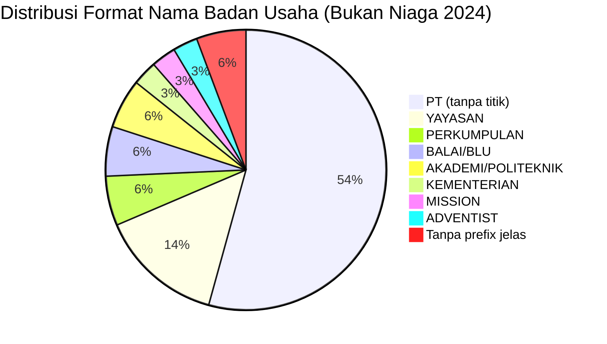

# Analisis Tabel: DAFTAR PEMEGANG PERIZINAN ANGKUTAN UDARA BUKAN NIAGA TAHUN 2024

## Informasi Umum
| Atribut | Nilai |
|---------|-------|
| **Sumber File** | `DAFTAR PEMEGANG PERIZINAN ANGKUTAN UDARA BUKAN NIAGA TAHUN 2024.csv` |
| **Tahun** | 2024 |
| **Kategori** | Angkutan Udara Bukan Niaga |
| **Total Baris Data** | 35 |
| **Jumlah Kolom** | 2 |

---

## Struktur Tabel

| No | Nama Kolom | Tipe Data | Deskripsi |
|----|------------|-----------|-----------|
| 1 | `NO` | Integer | Nomor urut perusahaan |
| 2 | `NAMA PERUSAHAAN` | String | Nama resmi badan usaha/lembaga |

---

## Sample Data (3 Baris Pertama)

| NO | NAMA PERUSAHAAN |
|----|-----------------|
| 1 | PT AERO FLYER INSTITUTE |
| 2 | PT ANGKASA SUPER SERVICES |
| 3 | PT AGRONUSA DIRGANTARA |

---

## Analisis Kualitas Data

### Ringkasan Umum
| Metrik | Nilai |
|--------|-------|
| Total Baris | 35 |
| Kolom dengan Missing Values | 0 |
| Kolom dengan Nilai Null/NaN | 0 |
| Kolom dengan Strip ("-") | 0 |
| Kolom dengan **Typo/Anomali** | 1 |

### Detail Per Kolom

| Kolom | Total Baris | Non-Empty | Empty | Null/NaN | Strip ("-") | Lainnya | Keterangan |
|-------|-------------|-----------|-------|----------|-------------|---------|------------|
| `NO` | 35 | 35 | 0 | 0 | 0 | 0 | Semua terisi (angka 1-35) |
| `NAMA PERUSAHAAN` | 35 | 35 | 0 | 0 | 0 | 1 Anomali | Ada karakter Yunani; 1 nama tanpa prefix jelas |

### Catatan Khusus Kolom `NAMA PERUSAHAAN`
**Tidak ada kolom `JENIS KEGIATAN`** — konsisten dengan 2020-2021 dan 2023 (tidak ada di 2022 yang punya 3 kolom).

#### Variasi Prefix/Format Nama Badan Usaha:
| Prefix/Format | Jumlah | Contoh |
|---------------|--------|--------|
| `PT` (tanpa titik) | 19 | PT AERO FLYER INSTITUTE, PT ANGKASA SUPER SERVICES |
| `YAYASAN` | 5 | YAYASAN AVIASI NUSANTARA, YAYASAN HELIVIDA |
| `PERKUMPULAN` | 2 | PERKUMPULAN PENERBANGAN INDONESIA, PERKUMPULAN PENERBANGAN ALFA INDONESIA |
| `BALAI/BLU` | 2 | BALAI BESAR TEKNOLOGI MODIFIKASI CUACA, BLU BALAI KALIBRASI FASILITAS PENERBANGAN |
| `AKADEMI/POLITEKNIK` | 2 | AKADEMI PENERBANG INDONESIA BANYUWANGI, POLITEKNIK PENERBANGAN CURUG |
| `KEMENTERIAN` | 1 | KEMENTERIAN LINGKUNGAN HIDUP DAN KEHUTANAN |
| `MISSION` | 1 | MISSION AVIATION FELLOWSHIP (MAF) |
| `ADVENTIST` | 1 | ADVENTIST AVIATION INDONESIA |
| Tanpa prefix jelas | 2 | LINTANG AIR SERVICE, SMART CAKRAWALA AVIATION |

### Anomali pada `NAMA PERUSAHAAN`
| Nama | Masalah |
|------|---------|
| `PT AVIATERRA DINΑΜΙΚΑ` | Menggunakan karakter Yunani `Α`, `Μ`, `Ι`, `Κ`, `Α` — seharusnya `DINAMIKA` |
| `LINTANG AIR SERVICE` | Tanpa prefix PT/Yayasan/Perkumpulan |
| `SMART CAKRAWALA AVIATION` | Tanpa prefix PT/Yayasan/Perkumpulan |
| `BALAI BESAR TEKNOLOGI MODIFIKASI CUACA BADAN PENGKAJIAN DAN PENERAPAN TEKNOLOGI BB-TMC BPPT) - BRIN (BADAN RISET DAN INOVASI NASIONAL)` | **Kurung buka hilang** — seharusnya `(BB-TMC BPPT)` bukan `BB-TMC BPPT)` |

---

## Diagram Distribusi Format Nama Badan Usaha

---

## Catatan Tambahan
- ✅ **Data bersih** tanpa nilai kosong/null/strip
- ⚠️ **Jumlah entitas berkurang:** 40 (2023) → 35 (2024) — berkurang 5 entitas
- ⚠️ **Entitas yang hilang dari 2023:**
  - `PT AIR TRANSPORT SERVICES`
  - `PT ALFA FLYING SCHOOL`
  - `PT BANDUNG INTERNASIONAL AVIATION`
  - `PT DIRGANTARA AVIATION ENGINEERING`
  - `PT NATIONAL AVIATION MANAGEMENT`
  - `PT SINAR PHOENIX ANGKASA PRIMA`
  - `PT SPEKTRUM DATA GEOSURVEY`
  - `PT TRI MG INTRA AIRLINES`
  - `YAYASAN MISI MASYARAKAT PEDALAMAN`
  - `PT SURYA AVIASI INTERNASIONAL`
- ⚠️ **Entitas baru di 2024:**
  - `LINTANG AIR SERVICE`
  - `SMART CAKRAWALA AVIATION`
- ⚠️ **Karakter Yunani persisten:** `PT AVIATERRA DINΑΜΙΚΑ` (masih sama dari 2022-2023)
- ⚠️ **Typo kurung:** `BB-TMC BPPT)` — kurung buka hilang (seharusnya `(BB-TMC BPPT)`)
