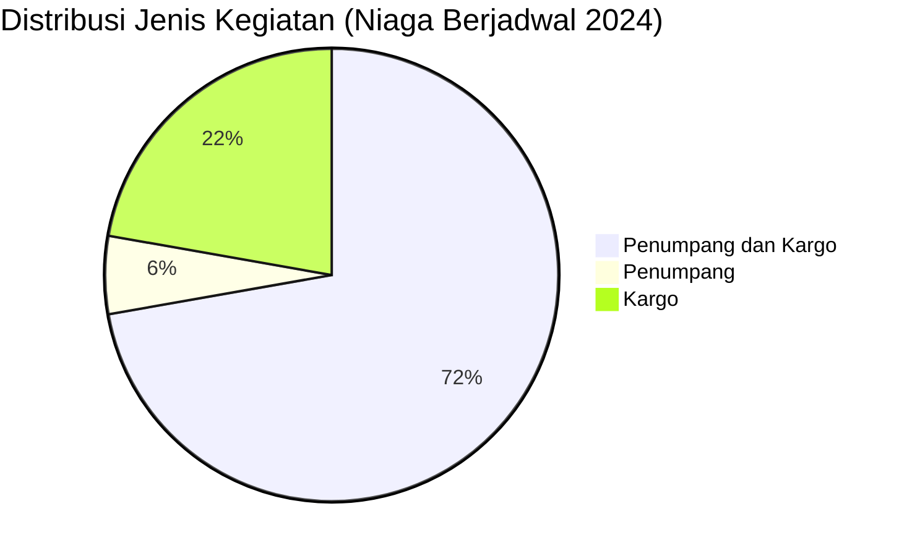

# Analisis Tabel: DAFTAR BADAN USAHA ANGKUTAN UDARA NIAGA BERJADWAL TAHUN 2024

## Informasi Umum
| Atribut | Nilai |
|---------|-------|
| **Sumber File** | `DAFTAR BADAN USAHA ANGKUTAN UDARA NIAGA BERJADWAL TAHUN 2024.csv` |
| **Tahun** | 2024 |
| **Kategori** | Angkutan Udara Niaga Berjadwal |
| **Total Baris Data** | 18 |
| **Jumlah Kolom** | 3 |

---

## Struktur Tabel

| No | Nama Kolom | Tipe Data | Deskripsi |
|----|------------|-----------|-----------|
| 1 | `NO` | Integer | Nomor urut badan usaha |
| 2 | `NAMA BADAN USAHA` | String | Nama resmi badan usaha/perusahaan |
| 3 | `JENIS KEGIATAN` | String | Jenis layanan operasional (Penumpang/Cargo) |

---

## Sample Data (3 Baris Pertama)

| NO | NAMA BADAN USAHA | JENIS KEGIATAN |
|----|------------------|----------------|
| 1 | PT ASI PUDJIASTUTI AVIATION | Penumpang dan Kargo |
| 2 | PT BATIK AIR INDONESIA | Penumpang dan Kargo |
| 3 | PT BBN AIRLINES INDONESIA | Penumpang dan Kargo |

---

## Analisis Kualitas Data

### Ringkasan Umum
| Metrik | Nilai |
|--------|-------|
| Total Baris | 18 |
| Kolom dengan Missing Values | 0 |
| Kolom dengan Nilai Null/NaN | 0 |
| Kolom dengan Strip ("-") | 0 |
| Kolom dengan **Typo/Anomali** | 0 |

### Detail Per Kolom

| Kolom | Total Baris | Non-Empty | Empty | Null/NaN | Strip ("-") | Lainnya | Keterangan |
|-------|-------------|-----------|-------|----------|-------------|---------|------------|
| `NO` | 18 | 18 | 0 | 0 | 0 | 0 | Semua terisi (angka 1-18) |
| `NAMA BADAN USAHA` | 18 | 18 | 0 | 0 | 0 | 0 | Semua terisi, **semua tanpa titik** setelah "PT" |
| `JENIS KEGIATAN` | 18 | 18 | 0 | 0 | 0 | 0 | Semua terisi, nilai konsisten |

### Distribusi Nilai Kolom `JENIS KEGIATAN`
| Nilai | Jumlah | Persentase |
|-------|--------|------------|
| Penumpang dan Kargo | 13 | 72.2% |
| Penumpang | 1 | 5.6% |
| Kargo | 4 | 22.2% |

---

## Diagram Distribusi Jenis Kegiatan

---

## Catatan Tambahan
- ✅ **Data paling bersih** dibanding tahun-tahun sebelumnya — tidak ada typo `"Penumparig"`
- ✅ **Format konsisten:** Semua nama perusahaan **tanpa titik** setelah "PT" (konsisten dengan 2023)
- ⚠️ **Perubahan nama:**
  - `PT RUSKY AERO INDONESIA` (2023) → `PT RUSKY AERO INTERNASIONAL` (2024)
  - `PT TRI - M.G. INTRA ASIA AIRLINES` (2023, spasi berlebih) → `PT TRI-M.G. INTRA ASIA AIRLINES` (2024, lebih rapi)
- ⚠️ **Perusahaan yang hilang dari 2023:**
  - `PT SURYA MATARAM AVIASI`
  - `PT LINKAVIASI ASIA INDONESIA`
- ⚠️ **Jumlah entitas berkurang:** 20 (2023) → 18 (2024) — berkurang 2 entitas
- ⚠️ **Perubahan distribusi:** Hanya 1 perusahaan yang murni `"Penumpang"` (`PT WINGS ABADI`), sisanya mayoritas `"Penumpang dan Kargo"`
