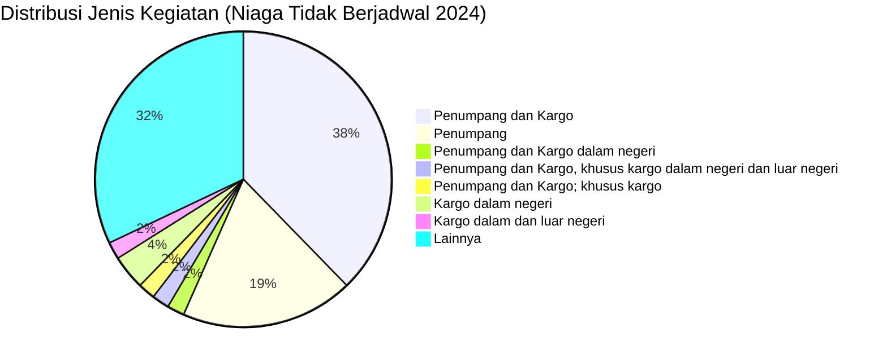

# Analisis Tabel: DAFTAR BADAN USAHA ANGKUTAN UDARA NIAGA TIDAK BERJADWAL TAHUN 2024

## Informasi Umum
| Atribut | Nilai |
|---------|-------|
| **Sumber File** | `DAFTAR BADAN USAHA ANGKUTAN UDARA NIAGA TIDAK BERJADWAL TAHUN 2024.csv` |
| **Tahun** | 2024 |
| **Kategori** | Angkutan Udara Niaga Tidak Berjadwal |
| **Total Baris Data** | 53 |
| **Jumlah Kolom** | 3 |

---

## Struktur Tabel

| No | Nama Kolom | Tipe Data | Deskripsi |
|----|------------|-----------|-----------|
| 1 | `NO` | Integer | Nomor urut badan usaha |
| 2 | `NAMA BADAN USAHA` | String | Nama resmi badan usaha/perusahaan |
| 3 | `JENIS KEGIATAN` | String | Jenis layanan operasional |

---

## Sample Data (3 Baris Pertama)

| NO | NAMA BADAN USAHA | JENIS KEGIATAN |
|----|------------------|----------------|
| 1 | PT Volta Pasifik Aviasi | Penumpang dan Kargo, angkutan udara niaga tidak berjadwal lainnya |
| 2 | PT Nasional Global Aviasi | Penumpang dan Kargo dalam negeri, angkutan udara niaga tidak berjadwal lainnya |
| 3 | PT Vast Intra Avia | Penumpang dan Kargo dalam negeri, angkutan udara niaga tidak berjadwal lainnya |

---

## Analisis Kualitas Data

### Ringkasan Umum
| Metrik | Nilai |
|--------|-------|
| Total Baris | 53 |
| Kolom dengan Missing Values | 0 |
| Kolom dengan Nilai Null/NaN | 0 |
| Kolom dengan Strip ("-") | 0 |
| Kolom dengan **Typo/Anomali** | 1 |

### Detail Per Kolom

| Kolom | Total Baris | Non-Empty | Empty | Null/NaN | Strip ("-") | Lainnya | Keterangan |
|-------|-------------|-----------|-------|----------|-------------|---------|------------|
| `NO` | 53 | 53 | 0 | 0 | 0 | 0 | Semua terisi (angka 1-53) |
| `NAMA BADAN USAHA` | 53 | 53 | 0 | 0 | 0 | 0 | Semua terisi, **semua tanpa titik** setelah "PT" |
| `JENIS KEGIATAN` | 53 | 53 | 0 | 0 | 0 | 0 | Semua terisi, nilai bervariasi |

### Distribusi Nilai Kolom `JENIS KEGIATAN`
| Nilai | Jumlah | Persentase |
|-------|--------|------------|
| Penumpang dan Kargo | 20 | 37.7% |
| Penumpang | 10 | 18.9% |
| Penumpang dan Kargo dalam negeri | 1 | 1.9% |
| Penumpang dan Kargo; khusus kargo | 1 | 1.9% |
| Penumpang dan Kargo, khusus kargo dalam negeri dan luar negeri | 1 | 1.9% |
| Penumpang dan Kargo, angkutan udara niaga tidak berjadwal lainnya | 1 | 1.9% |
| Penumpang dan Kargo dalam negeri, angkutan udara niaga tidak berjadwal lainnya | 2 | 3.8% |
| Kargo dalam dan luar negeri | 1 | 1.9% |
| Kargo dalam dan luar negeri serta Penumpang dan Kargo | 1 | 1.9% |
| Kargo dalam negeri | 2 | 3.8% |

### Anomali pada `NAMA BADAN USAHA`
| Nama | Masalah |
|------|---------|
| `PT Pelita Air Sevice` | **Typo persisten:** "Sevice" seharusnya "Service" (konsisten dari 2021-2023) |

---

## Diagram Distribusi Jenis Kegiatan

---

## Catatan Tambahan
- ✅ **Nama terpotong sudah diperbaiki:** `PT Eastindo Services (East Indonesia Air Taxi And Charter Service)` (sebelumnya terpotong di 2023: `...Taxi An`)
- ⚠️ **Typo persisten:** `PT Pelita Air Sevice` (masih "Sevice", bukan "Service" — konsisten typo dari 2021!)
- ⚠️ **Format nama perusahaan:** Semua **tanpa titik** setelah "PT" (konsisten dengan 2023)
- ⚠️ **Perusahaan yang hilang dari 2023:**
  - `PT Amarta Aviasi Mandiri`
  - `PT Tri - Mg Intra Asia Airlines`
  - `PT Asi Pudjiastuti Aviation` (sebenarnya ada di baris 13, berbeda kapitalisasi)
- ⚠️ **Perubahan dari 2023:**
  - Beberapa perusahaan yang sebelumnya murni `"Penumpang"` sekarang `"Penumpang dan Kargo"`:
    - `PT Alda Trans Papua`
    - `PT Angkasa Super Service`
    - `PT Asian One Air`
    - `PT Derazona Air Service`
    - `PT Ekspres Transportasi Antar Benua`
    - `PT Elang Lintas Indonesia`
    - `PT Elang Nusantara Air`
    - `PT Intan Angkasa Air Service`
    - `PT Jhonlin Air Transport`
    - dll.
- ⚠️ **Jumlah entitas berkurang:** 55 (2023) → 53 (2024) — berkurang 2 entitas
- ⚠️ **BBN Airlines:** `PT BBN Airlines Indonesia` sekarang punya nilai kompleks: `"Kargo dalam dan luar negeri serta Penumpang dan Kargo"`
