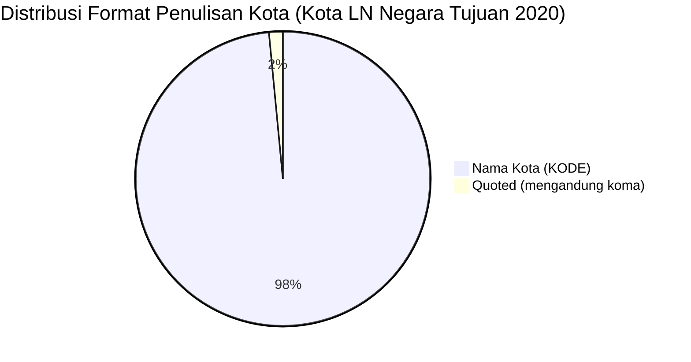

# Analisis Tabel: KOTA TERHUBUNGI OLEH RUTE ANGKUTAN UDARA NIAGA BERJADWAL LUAR NEGERI DI NEGARA TUJUAN TAHUN 2020

## Informasi Umum
| Atribut | Nilai |
|---------|-------|
| **Sumber File** | `KOTA TERHUBUNGI OLEH RUTE ANGKUTAN UDARA NIAGA BERJADWAL LUAR NEGERI DI NEGARA TUJUAN TAHUN 2020.csv` |
| **Tahun** | 2020 |
| **Kategori** | Kota Negara Tujuan — Rute Niaga Berjadwal Luar Negeri |
| **Total Baris Data** | 66 |
| **Jumlah Kolom** | 2 |

---

## Struktur Tabel

| No | Nama Kolom | Tipe Data | Deskripsi |
|----|------------|-----------|-----------|
| 1 | `NO` | Integer | Nomor urut kota |
| 2 | `KOTA` | String | Nama kota di negara tujuan yang terhubung oleh rute angkutan udara niaga berjadwal luar negeri dari Indonesia, dilengkapi kode bandara dalam kurung |

---

## Sample Data (3 Baris Pertama)

| NO | KOTA |
|----|------|
| 1 | Abu Dhabi (AUH) |
| 2 | Addis Ababa (ADD) |
| 3 | Adelaide (ADL) |

---

## Analisis Kualitas Data

### Ringkasan Umum
| Metrik | Nilai |
|--------|-------|
| Total Baris | 66 |
| Kolom dengan Missing Values | 0 |
| Kolom dengan Nilai Null/NaN | 0 |
| Kolom dengan Strip ("-") | 0 |

### Detail Per Kolom

| Kolom | Total Baris | Non-Empty | Empty | Null/NaN | Strip ("-") | Lainnya | Keterangan |
|-------|-------------|-----------|-------|----------|-------------|---------|------------|
| `NO` | 66 | 66 | 0 | 0 | 0 | 0 | Semua terisi (angka 1-66) |
| `KOTA` | 66 | 66 | 0 | 0 | 0 | 0 | Semua terisi, format umum: `Nama Kota (KODE)` |

### Catatan Khusus Kolom `KOTA`

#### Format Penulisan Nama Kota:
| Format | Jumlah | Contoh |
|--------|--------|--------|
| `Nama Kota (KODE)` | 65 | Abu Dhabi (AUH), Bangkok (BKK), Tokyo-Narita (NRT) |
| `"Nama, Keterangan (KODE)"` (quoted) | 1 | `"Catitipan, Barangay Buhangin (DVO)"` |

#### Format Kode Bandara:
| Tipe | Jumlah | Keterangan |
|------|--------|------------|
| 3 huruf (IATA standar) | 66 | Semua kode bandara IATA |
| uppercase penuh | 66 | Semua menggunakan huruf kapital |

#### Anomali Format:
| No | Nilai | Anomali |
|----|-------|---------|
| 12 | `"Catitipan, Barangay Buhangin (DVO)"` | Mengandung koma, di-quote dalam CSV; nama lokasi sangat spesifik (bukan nama kota umum) |

---

## Diagram Distribusi Format Penulisan Kota

---

## Catatan Tambahan
- ✅ Data bersih tanpa nilai kosong/null/strip
- ✅ Semua entri memiliki kode bandara IATA (3 huruf)
- ✅ Format penulisan konsisten (hanya 1 anomali)
- ⚠️ Terdapat 1 entri dengan format khusus: `"Catitipan, Barangay Buhangin (DVO)"` — nama lokasi sangat spesifik (Davao, Filipina), bukan nama kota internasional umum
