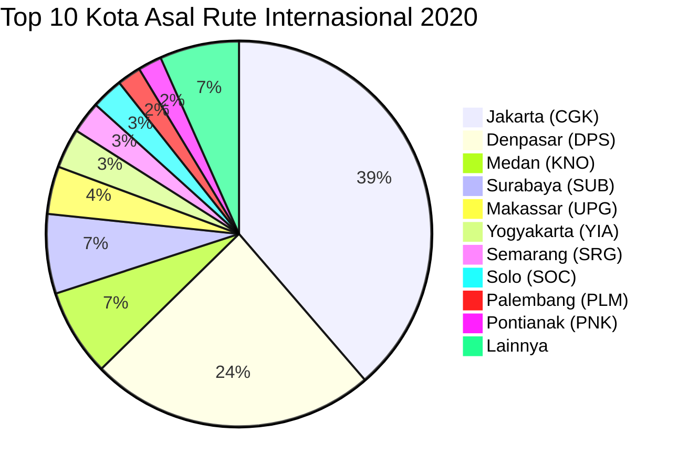
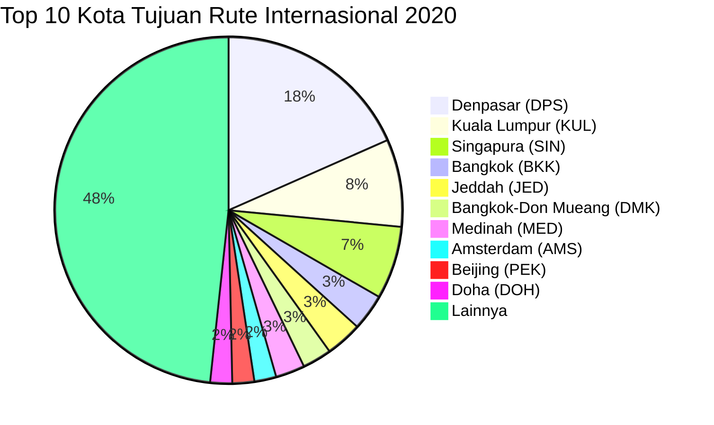

# Analisis Tabel: RUTE ANGKUTAN UDARA NIAGA BERJADWAL LUAR NEGERI TAHUN 2020

## Informasi Umum
| Atribut | Nilai |
|---------|-------|
| **Sumber File** | `RUTE ANGKUTAN UDARA NIAGA BERJADWAL LUAR NEGERI TAHUN 2020.csv` |
| **Tahun** | 2020 |
| **Kategori** | Rute Internasional — Niaga Berjadwal Luar Negeri |
| **Total Baris Data** | 157 |
| **Jumlah Kolom** | 3 |

---

## Struktur Tabel

| No | Nama Kolom | Tipe Data | Deskripsi |
|----|------------|-----------|-----------|
| 1 | `NO` | Integer | Nomor urut rute |
| 2 | `RUTE (ASAL)` | String | Kota asal penerbangan internasional, dilengkapi kode bandara dalam kurung |
| 3 | `RUTE (TUJUAN)` | String | Kota tujuan penerbangan internasional, dilengkapi kode bandara dalam kurung |

---

## Sample Data (3 Baris Pertama)

| NO | RUTE (ASAL) | RUTE (TUJUAN) |
|----|-------------|---------------|
| 1 | Denpasar (DPS) | Geelong (AVV) |
| 2 | Jakarta (CGK) | Addis Ababa (ADD) |
| 3 | Jakarta (CGK) | Doha (DOH) |

---

## Analisis Kualitas Data

### Ringkasan Umum
| Metrik | Nilai |
|--------|-------|
| Total Baris | 157 |
| Kolom dengan Missing Values | 0 |
| Kolom dengan Nilai Null/NaN | 0 |
| Kolom dengan Strip ("-") | 0 |

### Detail Per Kolom

| Kolom | Total Baris | Non-Empty | Empty | Null/NaN | Strip ("-") | Lainnya | Keterangan |
|-------|-------------|-----------|-------|----------|-------------|---------|------------|
| `NO` | 157 | 157 | 0 | 0 | 0 | 0 | Semua terisi (angka 1-157) |
| `RUTE (ASAL)` | 157 | 157 | 0 | 0 | 0 | 0 | Semua terisi, format umum: `Nama Kota (KODE)` |
| `RUTE (TUJUAN)` | 157 | 157 | 0 | 0 | 0 | 0 | Semua terisi, format umum: `Nama Kota (KODE)` |

### Catatan Khusus Kolom `RUTE (ASAL)`

#### Format Penulisan Rute Asal:
| Format | Jumlah | Contoh |
|--------|--------|--------|
| `Nama Kota (KODE)` | 154 | Jakarta (CGK), Denpasar (DPS), Medan (KNO) |
| `Nama Kota-KODE (KODE)` | 1 | Jakarta-HLP (HLP) |
| `"Nama, Keterangan (KODE)"` (quoted) | 2 | `"Praya, Lombok (LOP)"` |

#### Distribusi Kota Asal (Top 10):
| Kota Asal | Jumlah Rute | Persentase |
|-----------|-------------|------------|
| Jakarta (CGK) | 58 | 36.9% |
| Denpasar (DPS) | 36 | 22.9% |
| Medan (KNO) | 11 | 7.0% |
| Surabaya (SUB) | 10 | 6.4% |
| Makassar (UPG) | 6 | 3.8% |
| Yogyakarta (YIA) | 5 | 3.2% |
| Semarang (SRG) | 4 | 2.5% |
| Solo (SOC) | 4 | 2.5% |
| Palembang (PLM) | 3 | 1.9% |
| Pontianak (PNK) | 3 | 1.9% |

### Catatan Khusus Kolom `RUTE (TUJUAN)`

#### Format Penulisan Rute Tujuan:
| Format | Jumlah | Contoh |
|--------|--------|--------|
| `Nama Kota (KODE)` | 154 | Geelong (AVV), Bangkok (BKK), Singapura (SIN) |
| `"Nama, Keterangan (KODE)"` (quoted) | 3 | `"Catitipan, Barangay Buhangin (DVO)"`, `"Praya, Lombok (LOP)"` |

#### Distribusi Kota Tujuan (Top 10):
| Kota Tujuan | Jumlah Rute | Persentase |
|-------------|-------------|------------|
| Denpasar (DPS) | 27 | 17.2% |
| Kuala Lumpur (KUL) | 12 | 7.6% |
| Singapura (SIN) | 10 | 6.4% |
| Bangkok (BKK) | 5 | 3.2% |
| Jeddah (JED) | 5 | 3.2% |
| Bangkok-Don Mueang (DMK) | 4 | 2.5% |
| Medinah (MED) | 4 | 2.5% |
| Amsterdam (AMS) | 3 | 1.9% |
| Beijing (PEK) | 3 | 1.9% |
| Doha (DOH) | 3 | 1.9% |

---

## Diagram Distribusi Top 10 Kota Asal

---

## Diagram Distribusi Top 10 Kota Tujuan

---

## Catatan Tambahan
- ✅ Data bersih tanpa nilai kosong/null/strip
- ✅ Semua entri memiliki kode bandara IATA (3 huruf)
- ⚠️ Terdapat 1 entri asal `"Praya, Lombok (LOP)"` yang muncul di beberapa baris (mengandung koma, di-quote dalam CSV)
- ⚠️ Terdapat 1 entri tujuan `"Catitipan, Barangay Buhangin (DVO)"` — nama lokasi sangat spesifik (Davao, Filipina)
