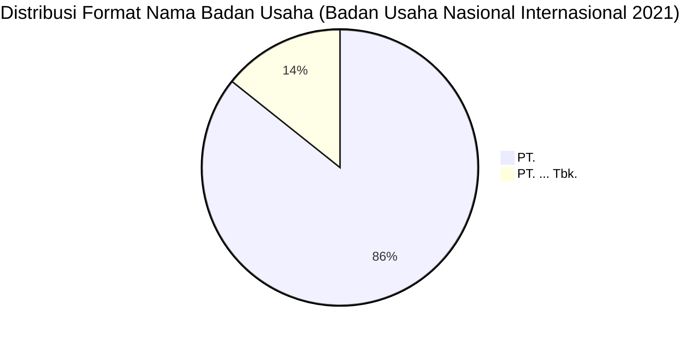

# Analisis Tabel: BADAN USAHA ANGKUTAN UDARA NASIONAL YANG MELAYANI PENUMPANG RUTE INTERNASIONAL TAHUN 2021

## Informasi Umum
| Atribut | Nilai |
|---------|-------|
| **Sumber File** | `BADAN USAHA ANGKUTAN UDARA NASIONAL YANG MELAYANI PENUMPANG RUTE INTERNASIONAL TAHUN 2021.csv` |
| **Tahun** | 2021 |
| **Kategori** | Badan Usaha Nasional — Rute Internasional (Penumpang) |
| **Total Baris Data** | 7 |
| **Jumlah Kolom** | 2 |

---

## Struktur Tabel

| No | Nama Kolom | Tipe Data | Deskripsi |
|----|------------|-----------|-----------|
| 1 | `NO` | Integer | Nomor urut badan usaha |
| 2 | `NAMA BADAN USAHA` | String | Nama resmi badan usaha angkutan udara nasional yang melayani penumpang rute internasional |

---

## Sample Data (3 Baris Pertama)

| NO | NAMA BADAN USAHA |
|----|------------------|
| 1 | PT. GARUDA INDONESIA (Persero) Tbk. |
| 2 | PT. LION MENTARI AIRLINES |
| 3 | PT. INDONESIA AIRASIA |

---

## Analisis Kualitas Data

### Ringkasan Umum
| Metrik | Nilai |
|--------|-------|
| Total Baris | 7 |
| Kolom dengan Missing Values | 0 |
| Kolom dengan Nilai Null/NaN | 0 |
| Kolom dengan Strip ("-") | 0 |

### Detail Per Kolom

| Kolom | Total Baris | Non-Empty | Empty | Null/NaN | Strip ("-") | Lainnya | Keterangan |
|-------|-------------|-----------|-------|----------|-------------|---------|------------|
| `NO` | 7 | 7 | 0 | 0 | 0 | 0 | Semua terisi (angka 1-7) |
| `NAMA BADAN USAHA` | 7 | 7 | 0 | 0 | 0 | 0 | Semua terisi, format konsisten "PT. ..." |

### Catatan Khusus Kolom `NAMA BADAN USAHA`

#### Variasi Prefix/Format Nama Badan Usaha:
| Prefix/Format | Jumlah | Contoh |
|---------------|--------|--------|
| `PT.` | 6 | PT. LION MENTARI AIRLINES, PT. INDONESIA AIRASIA, PT. WINGS ABADI |
| `PT. ... Tbk.` | 1 | PT. GARUDA INDONESIA (Persero) Tbk. |

---

## Diagram Distribusi Format Nama Badan Usaha

---

## Catatan Tambahan
- ✅ Data bersih tanpa nilai kosong/null/strip
- ✅ Format penamaan perusahaan konsisten menggunakan awalan "PT."
- ⚠️ Terdapat 1 perusahaan berstatus Tbk (perusahaan terbuka): `PT. GARUDA INDONESIA (Persero) Tbk.`
- ⚠️ Jumlah badan usaha berkurang 1 dari tahun 2020 (8 → 7): `PT. TRANSNUSA AVIATION MANDIRI` tidak lagi terdaftar
