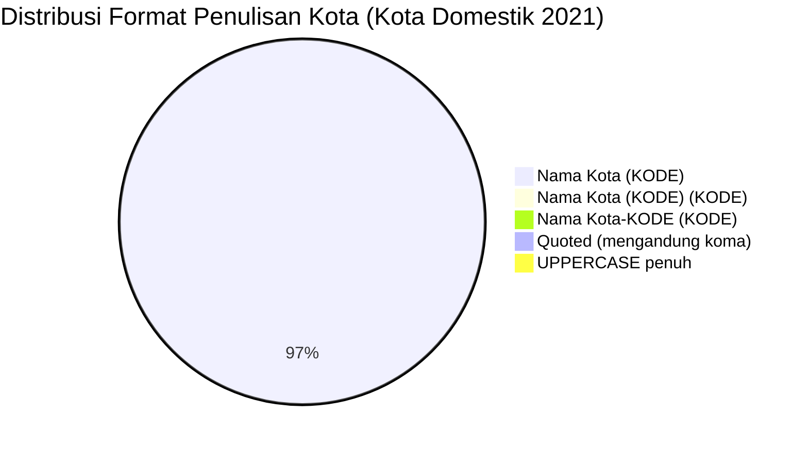

# Analisis Tabel: KOTA TERHUBUNGI OLEH RUTE ANGKUTAN UDARA NIAGA BERJADWAL DALAM NEGERI TAHUN 2021

## Informasi Umum
| Atribut | Nilai |
|---------|-------|
| **Sumber File** | `KOTA TERHUBUNGI OLEH RUTE ANGKUTAN UDARA NIAGA BERJADWAL DALAM NEGERI TAHUN 2021.csv` |
| **Tahun** | 2021 |
| **Kategori** | Kota Domestik — Rute Niaga Berjadwal Dalam Negeri |
| **Total Baris Data** | 135 |
| **Jumlah Kolom** | 2 |

---

## Struktur Tabel

| No | Nama Kolom | Tipe Data | Deskripsi |
|----|------------|-----------|-----------|
| 1 | `NO` | Integer | Nomor urut kota |
| 2 | `KOTA` | String | Nama kota yang terhubung oleh rute angkutan udara niaga berjadwal dalam negeri, dilengkapi kode bandara dalam kurung |

---

## Sample Data (3 Baris Pertama)

| NO | KOTA |
|----|------|
| 1 | Alor (ARD) |
| 2 | Ambon (AMQ) |
| 3 | Ampana (OJU) |

---

## Analisis Kualitas Data

### Ringkasan Umum
| Metrik | Nilai |
|--------|-------|
| Total Baris | 135 |
| Kolom dengan Missing Values | 0 |
| Kolom dengan Nilai Null/NaN | 0 |
| Kolom dengan Strip ("-") | 0 |

### Detail Per Kolom

| Kolom | Total Baris | Non-Empty | Empty | Null/NaN | Strip ("-") | Lainnya | Keterangan |
|-------|-------------|-----------|-------|----------|-------------|---------|------------|
| `NO` | 135 | 135 | 0 | 0 | 0 | 0 | Semua terisi (angka 1-135) |
| `KOTA` | 135 | 135 | 0 | 0 | 0 | 0 | Semua terisi, format umum: `Nama Kota (KODE)` |

### Catatan Khusus Kolom `KOTA`

#### Format Penulisan Nama Kota:
| Format | Jumlah | Contoh |
|--------|--------|--------|
| `Nama Kota (KODE)` | 131 | Alor (ARD), Ambon (AMQ), Balikpapan (BPN) |
| `Nama Kota (KODE) (KODE)` | 1 | Palopo (Bua) (LLO) |
| `Nama Kota-KODE (KODE)` | 1 | Jakarta-HLP (HLP) |
| `"Nama, Keterangan (KODE)"` (quoted) | 1 | `"Praya, Lombok (LOP)"` |
| `KOTA (KODE)` (uppercase penuh) | 1 | KEP.TALAUD (IAX) |

#### Format Kode Bandara:
| Tipe | Jumlah | Keterangan |
|------|--------|------------|
| 3 huruf (IATA standar) | 134 | Mayoritas kode bandara IATA |
| uppercase penuh | 135 | Semua menggunakan huruf kapital |

#### Anomali Format:
| No | Nilai | Anomali |
|----|-------|---------|
| 84 | `Palopo (Bua) (LLO)` | Format ganda: nama kota memiliki kurung tambahan "(Bua)" sebelum kode bandara |
| 33 | `Jakarta-HLP (HLP)` | Menggunakan format `Nama-KODE` sebelum kurung |
| 93 | `"Praya, Lombok (LOP)"` | Mengandung koma, di-quote dalam CSV |
| 41 | `KEP.TALAUD (IAX)` | Penulisan nama kota seluruhnya uppercase (berbeda dari pola Title Case umum) |

#### Perubahan Dibanding 2020 (Catatan Internal):
| Status 2020 | Status 2021 | Kota |
|-------------|-------------|------|
| Ada | Hilang | Galela (GLX) |
| Ada | Hilang | Peakon Seral (TFY) — sekarang ditulis `Peakon Serai (TFY)` |
| Ada (Siborongborong -(DTB)) | Diperbaiki | Siborong-borong (DTB) — strip diperbaiki |
| Ada (KEP TALAUD (IAX)) | Diperbaiki | KEP.TALAUD (IAX) — spasi diganti titik |
| Ada (Ampana (OJU)) | Ada | Ampana tetap ada |
| Baru | Ada | Banyumas (PWL), Cepu (CPF), Ewer (EWE), Kolaka (KXB), Toraja (TRT), Trinsing (HMS) |

---

## Diagram Distribusi Format Penulisan Kota

---

## Catatan Tambahan
- ✅ Data bersih tanpa nilai kosong/null/strip
- ✅ Semua entri memiliki kode bandara IATA (3 huruf)
- ⚠️ Terdapat anomali `Palopo (Bua) (LLO)` — format kurung ganda (nama kecamatan + kode)
- ⚠️ `Siborongborong -(DTB)` di 2020 → diperbaiki menjadi `Siborong-borong (DTB)` di 2021
- ⚠️ `KEP TALAUD (IAX)` di 2020 → `KEP.TALAUD (IAX)` di 2021 (spasi → titik)
