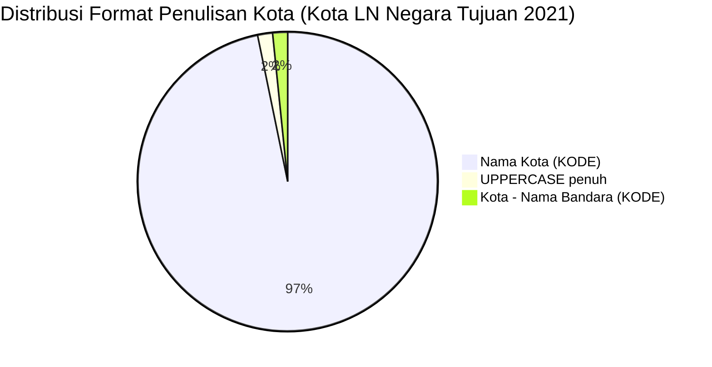

# Analisis Tabel: KOTA TERHUBUNGI OLEH RUTE ANGKUTAN UDARA NIAGA BERJADWAL LUAR NEGERI DI NEGARA TUJUAN TAHUN 2021

## Informasi Umum
| Atribut | Nilai |
|---------|-------|
| **Sumber File** | `KOTA TERHUBUNGI OLEH RUTE ANGKUTAN UDARA NIAGA BERJADWAL LUAR NEGERI DI NEGARA TUJUAN TAHUN 2021.csv` |
| **Tahun** | 2021 |
| **Kategori** | Kota Negara Tujuan — Rute Niaga Berjadwal Luar Negeri |
| **Total Baris Data** | 62 |
| **Jumlah Kolom** | 2 |

---

## Struktur Tabel

| No | Nama Kolom | Tipe Data | Deskripsi |
|----|------------|-----------|-----------|
| 1 | `NO` | Integer | Nomor urut kota |
| 2 | `KOTA` | String | Nama kota di negara tujuan yang terhubung oleh rute angkutan udara niaga berjadwal luar negeri dari Indonesia, dilengkapi kode bandara dalam kurung |

---

## Sample Data (3 Baris Pertama)

| NO | KOTA |
|----|------|
| 1 | Abu Dhabi (AUH) |
| 2 | Addis Ababa (ADD) |
| 3 | Adelaide (ADL) |

---

## Analisis Kualitas Data

### Ringkasan Umum
| Metrik | Nilai |
|--------|-------|
| Total Baris | 62 |
| Kolom dengan Missing Values | 0 |
| Kolom dengan Nilai Null/NaN | 0 |
| Kolom dengan Strip ("-") | 0 |

### Detail Per Kolom

| Kolom | Total Baris | Non-Empty | Empty | Null/NaN | Strip ("-") | Lainnya | Keterangan |
|-------|-------------|-----------|-------|----------|-------------|---------|------------|
| `NO` | 62 | 62 | 0 | 0 | 0 | 0 | Semua terisi (angka 1-62) |
| `KOTA` | 62 | 62 | 0 | 0 | 0 | 0 | Semua terisi, format umum: `Nama Kota (KODE)` |

### Catatan Khusus Kolom `KOTA`

#### Format Penulisan Nama Kota:
| Format | Jumlah | Contoh |
|--------|--------|--------|
| `Nama Kota (KODE)` | 61 | Abu Dhabi (AUH), Bangkok (BKK), Tokyo-Narita (NRT) |
| `NAMA (KODE)` (uppercase penuh) | 1 | DARWIN (DRW) |

#### Format Kode Bandara:
| Tipe | Jumlah | Keterangan |
|------|--------|------------|
| 3 huruf (IATA standar) | 62 | Semua kode bandara IATA |
| uppercase penuh | 62 | Semua menggunakan huruf kapital |

#### Anomali Format:
| No | Nilai | Anomali |
|----|-------|---------|
| 15 | `DARWIN (DRW)` | Nama kota seluruhnya uppercase (berbeda dari pola Title Case umum) |
| 18 | `Dubai - Al Maktoum (DWC)` | Menggunakan format `Kota - Nama Bandara (KODE)` — berbeda dari pola umum |

#### Perubahan Dibanding 2020 (Catatan Internal):
| Status 2020 | Status 2021 | Kota |
|-------------|-------------|------|
| Ada | Hilang | "Catitipan, Barangay Buhangin (DVO)", Nagoya (NGO), Kota Kinabalu (BKI), Tashkent (TAS), Changsha (CSX) |
| Baru | Ada | Chengdu (CTU), Dubai - Al Maktoum (DWC) |
| Ada (Dubai (DXB)) | Ada | Dubai (DXB) tetap ada |

---

## Diagram Distribusi Format Penulisan Kota

---

## Catatan Tambahan
- ✅ Data bersih tanpa nilai kosong/null/strip
- ✅ Semua entri memiliki kode bandara IATA (3 huruf)
- ⚠️ Jumlah kota berkurang dari 66 (2020) → 62 (2021)
- ⚠️ Entri `"Catitipan, Barangay Buhangin (DVO)` dari 2020 sudah **dihapus** — kemungkinan koreksi data
- ⚠️ Muncul `Dubai - Al Maktoum (DWC)` — bandara alternatif Dubai selain DXB
- ⚠️ `DARWIN (DRW)` ditulis uppercase penuh (berbeda dari pola Title Case umum)
