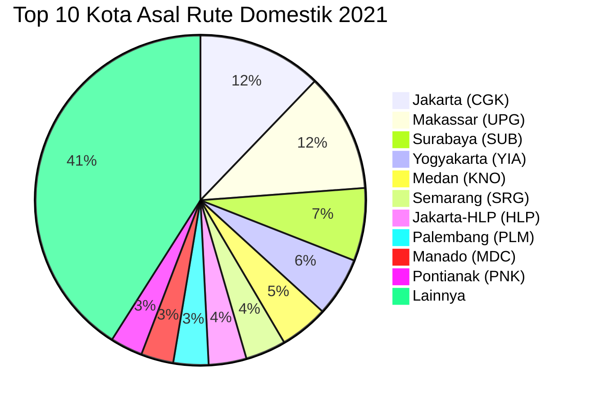

# Analisis Tabel: RUTE ANGKUTAN UDARA NIAGA BERJADWAL DALAM NEGERI TAHUN 2021

## Informasi Umum
| Atribut | Nilai |
|---------|-------|
| **Sumber File** | `RUTE ANGKUTAN UDARA NIAGA BERJADWAL DALAM NEGERI TAHUN 2021..csv` |
| **Tahun** | 2021 |
| **Kategori** | Rute Domestik — Niaga Berjadwal Dalam Negeri |
| **Total Baris Data** | 378 |
| **Jumlah Kolom** | 3 |

---

## Struktur Tabel

| No | Nama Kolom | Tipe Data | Deskripsi |
|----|------------|-----------|-----------|
| 1 | `NO` | Integer | Nomor urut rute |
| 2 | `RUTE (ASAL)` | String | Kota asal penerbangan, dilengkapi kode bandara dalam kurung |
| 3 | `RUTE (TUJUAN)` | String | Kota tujuan penerbangan, dilengkapi kode bandara dalam kurung |

---

## Sample Data (3 Baris Pertama)

| NO | RUTE (ASAL) | RUTE (TUJUAN) |
|----|-------------|---------------|
| 1 | Muara Teweh (HMS) | Banjarmasin (BDJ) |
| 2 | Fak-fak (FKQ) | Ambon (AMQ) |
| 3 | Fak-fak (FKQ) | Teluk Bintoni (BXB) |

---

## Analisis Kualitas Data

### Ringkasan Umum
| Metrik | Nilai |
|--------|-------|
| Total Baris | 378 |
| Kolom dengan Missing Values | 0 |
| Kolom dengan Nilai Null/NaN | 0 |
| Kolom dengan Strip ("-") | 0 |

### Detail Per Kolom

| Kolom | Total Baris | Non-Empty | Empty | Null/NaN | Strip ("-") | Lainnya | Keterangan |
|-------|-------------|-----------|-------|----------|-------------|---------|------------|
| `NO` | 378 | 378 | 0 | 0 | 0 | 0 | Semua terisi (angka 1-378) |
| `RUTE (ASAL)` | 378 | 378 | 0 | 0 | 0 | 0 | Semua terisi, format umum: `Nama Kota (KODE)` |
| `RUTE (TUJUAN)` | 378 | 378 | 0 | 0 | 0 | 0 | Semua terisi, format umum: `Nama Kota (KODE)` |

### Catatan Khusus Kolom `RUTE (ASAL)`

#### Format Penulisan Rute Asal:
| Format | Jumlah | Contoh |
|--------|--------|--------|
| `Nama Kota (KODE)` | 375 | Pontianak (PNK), Jakarta (CGK), Denpasar (DPS) |
| `Nama Kota-KODE (KODE)` | 2 | Jakarta-HLP (HLP) |
| `"Nama, Keterangan (KODE)"` (quoted) | 1 | `"Praya, Lombok (LOP)"` |

#### Distribusi Kota Asal (Top 10):
| Kota Asal | Jumlah Rute | Persentase |
|-----------|-------------|------------|
| Jakarta (CGK) | 46 | 12.2% |
| Makassar (UPG) | 44 | 11.6% |
| Surabaya (SUB) | 27 | 7.1% |
| Yogyakarta (YIA) | 22 | 5.8% |
| Medan (KNO) | 18 | 4.8% |
| Semarang (SRG) | 15 | 4.0% |
| Jakarta-HLP (HLP) | 14 | 3.7% |
| Palembang (PLM) | 13 | 3.4% |
| Manado (MDC) | 12 | 3.2% |
| Pontianak (PNK) | 12 | 3.2% |

### Catatan Khusus Kolom `RUTE (TUJUAN)`

#### Format Penulisan Rute Tujuan:
| Format | Jumlah | Contoh |
|--------|--------|--------|
| `Nama Kota (KODE)` | 375 | Banjarmasin (BDJ), Ambon (AMQ), Bandung (BDO) |
| `Nama Kota (KODE) (KODE)` | 1 | Palopo (Bua) (LLO) |
| `"Nama, Keterangan (KODE)"` (quoted) | 2 | `"Praya, Lombok (LOP)"` |

---

## Diagram Distribusi Top 10 Kota Asal

---

## Catatan Tambahan
- ✅ Data bersih tanpa nilai kosong/null/strip
- ✅ Semua entri memiliki kode bandara IATA (3 huruf)
- ✅ Anomali `TRT` dan `KXB` (kode tanpa nama kota) dari 2020 sudah **diperbaiki** di 2021
- ⚠️ Terdapat anomali `Palopo (Bua) (LLO)` — format kurung ganda (nama kecamatan + kode)
- ⚠️ Terdapat 1 entri `"Praya, Lombok (LOP)"` yang muncul di beberapa baris (mengandung koma, di-quote dalam CSV)
- ⚠️ Terdapat 2 entri `Jakarta-HLP (HLP)` dengan format penulisan ganda kode
- ⚠️ Nama file CSV memiliki double dot: `...TAHUN 2021..csv`
