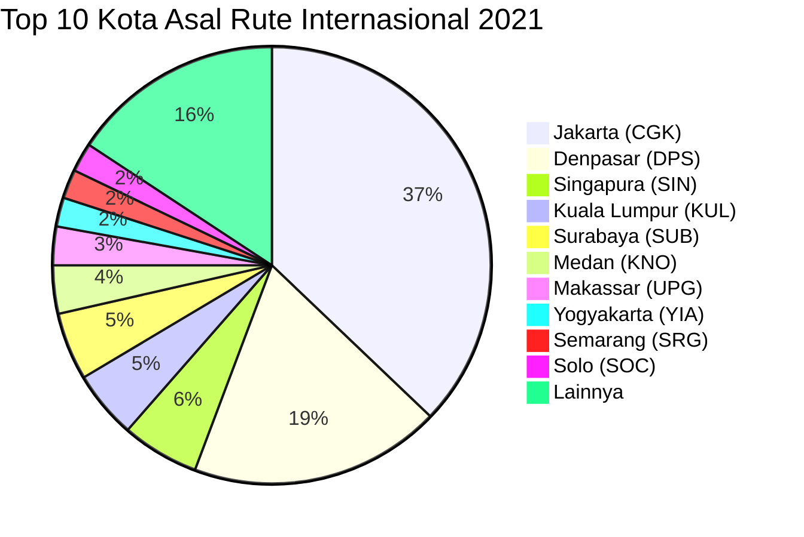
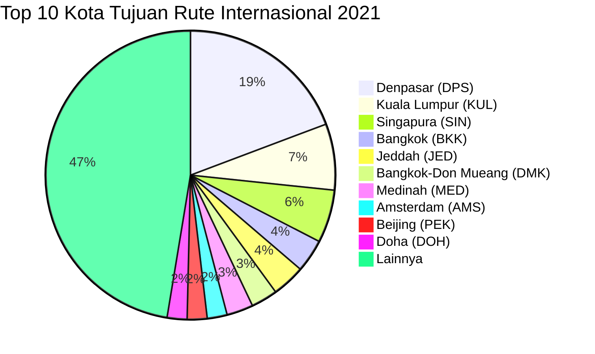

# Analisis Tabel: RUTE ANGKUTAN UDARA NIAGA BERJADWAL LUAR NEGERI TAHUN 2021

## Informasi Umum
| Atribut | Nilai |
|---------|-------|
| **Sumber File** | `RUTE ANGKUTAN UDARA NIAGA BERJADWAL LUAR NEGERI TAHUN 2021.csv` |
| **Tahun** | 2021 |
| **Kategori** | Rute Internasional — Niaga Berjadwal Luar Negeri |
| **Total Baris Data** | 145 |
| **Jumlah Kolom** | 3 |

---

## Struktur Tabel

| No | Nama Kolom | Tipe Data | Deskripsi |
|----|------------|-----------|-----------|
| 1 | `NO` | Integer | Nomor urut rute |
| 2 | `RUTE ASAL` | String | Kota asal penerbangan internasional, dilengkapi kode bandara dalam kurung |
| 3 | `RUTE TUJUAN` | String | Kota tujuan penerbangan internasional, dilengkapi kode bandara dalam kurung |

---

## Sample Data (3 Baris Pertama)

| NO | RUTE ASAL | RUTE TUJUAN |
|----|-----------|-------------|
| 1 | Jakarta (CGK) | Ho Chi Minh City (SGN) |
| 2 | Ho Chi Minh City (SGN) | Denpasar (DPS) |
| 3 | Jakarta (CGK) | Chengdu (CTU) |

---

## Analisis Kualitas Data

### Ringkasan Umum
| Metrik | Nilai |
|--------|-------|
| Total Baris | 145 |
| Kolom dengan Missing Values | 0 |
| Kolom dengan Nilai Null/NaN | 0 |
| Kolom dengan Strip ("-") | 0 |

### Detail Per Kolom

| Kolom | Total Baris | Non-Empty | Empty | Null/NaN | Strip ("-") | Lainnya | Keterangan |
|-------|-------------|-----------|-------|----------|-------------|---------|------------|
| `NO` | 145 | 145 | 0 | 0 | 0 | 0 | Semua terisi (angka 1-145) |
| `RUTE ASAL` | 145 | 145 | 0 | 0 | 0 | 0 | Semua terisi, format umum: `Nama Kota (KODE)` |
| `RUTE TUJUAN` | 145 | 145 | 0 | 0 | 0 | 0 | Semua terisi, format umum: `Nama Kota (KODE)` |

### Catatan Khusus Kolom `RUTE ASAL`

#### Format Penulisan Rute Asal:
| Format | Jumlah | Contoh |
|--------|--------|--------|
| `Nama Kota (KODE)` | 142 | Jakarta (CGK), Denpasar (DPS), Medan (KNO) |
| `"Nama, Keterangan (KODE)"` (quoted) | 1 | `"Praya, Lombok (LOP)"` |
| `NAMA (KODE)` (uppercase penuh) | 1 | KUCHING (KCH) — muncul di baris 17 sebagai tujuan |
| `Nama Kota-KODE (KODE)` | 1 | Jakarta-HLP (HLP) |

#### Distribusi Kota Asal (Top 10):
| Kota Asal | Jumlah Rute | Persentase |
|-----------|-------------|------------|
| Jakarta (CGK) | 52 | 35.9% |
| Denpasar (DPS) | 26 | 17.9% |
| Singapura (SIN) | 8 | 5.5% |
| Kuala Lumpur (KUL) | 7 | 4.8% |
| Surabaya (SUB) | 7 | 4.8% |
| Medan (KNO) | 5 | 3.4% |
| Makassar (UPG) | 4 | 2.8% |
| Yogyakarta (YIA) | 3 | 2.1% |
| Semarang (SRG) | 3 | 2.1% |
| Solo (SOC) | 3 | 2.1% |

### Catatan Khusus Kolom `RUTE TUJUAN`

#### Format Penulisan Rute Tujuan:
| Format | Jumlah | Contoh |
|--------|--------|--------|
| `Nama Kota (KODE)` | 142 | Ho Chi Minh City (SGN), Bangkok (BKK), Singapura (SIN) |
| `"Nama, Keterangan (KODE)"` (quoted) | 2 | `"Praya, Lombok (LOP)"` |
| `NAMA (KODE)` (uppercase penuh) | 1 | DARWIN (DRW) |

#### Distribusi Kota Tujuan (Top 10):
| Kota Tujuan | Jumlah Rute | Persentase |
|-------------|-------------|------------|
| Denpasar (DPS) | 26 | 17.9% |
| Kuala Lumpur (KUL) | 10 | 6.9% |
| Singapura (SIN) | 8 | 5.5% |
| Bangkok (BKK) | 5 | 3.4% |
| Jeddah (JED) | 5 | 3.4% |
| Bangkok-Don Mueang (DMK) | 4 | 2.8% |
| Medinah (MED) | 4 | 2.8% |
| Amsterdam (AMS) | 3 | 2.1% |
| Beijing (PEK) | 3 | 2.1% |
| Doha (DOH) | 3 | 2.1% |

---

## Diagram Distribusi Top 10 Kota Asal

---

## Diagram Distribusi Top 10 Kota Tujuan

---

## Catatan Tambahan
- ✅ Data bersih tanpa nilai kosong/null/strip
- ✅ Semua entri memiliki kode bandara IATA (3 huruf)
- ⚠️ **Perubahan nama kolom** dari 2020: `RUTE (ASAL)` → `RUTE ASAL`, `RUTE (TUJUAN)` → `RUTE TUJUAN` (tanpa tanda kurung di header)
- ⚠️ Terdapat 1 entri tujuan `"Praya, Lombok (LOP)"` yang muncul di beberapa baris (mengandung koma, di-quote dalam CSV)
- ⚠️ `DARWIN (DRW)` ditulis uppercase penuh (berbeda dari pola Title Case umum)
- ⚠️ Terdapat entri `KUCHING (KCH)` dengan uppercase di baris 17 (sebagai tujuan dari Pontianak)
