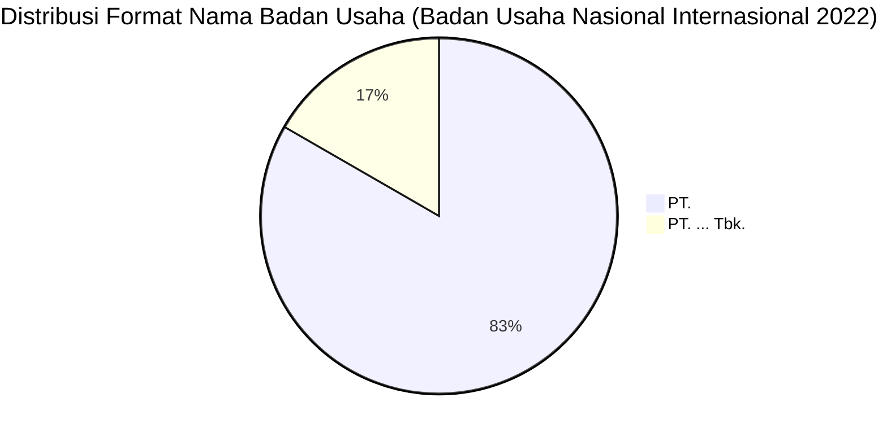

# Analisis Tabel: BADAN USAHA ANGKUTAN UDARA NASIONAL YANG MELAYANI PENUMPANG RUTE INTERNASIONAL TAHUN 2022

## Informasi Umum
| Atribut | Nilai |
|---------|-------|
| **Sumber File** | `BADAN USAHA ANGKUTAN UDARA NASIONAL YANG MELAYANI PENUMPANG RUTE INTERNASIONAL TAHUN 2022.csv` |
| **Tahun** | 2022 |
| **Kategori** | Badan Usaha Nasional — Rute Internasional (Penumpang) |
| **Total Baris Data** | 6 |
| **Jumlah Kolom** | 1 |

---

## Struktur Tabel

| No | Nama Kolom | Tipe Data | Deskripsi |
|----|------------|-----------|-----------|
| 1 | `NAMA BADAN USAHA` | String | Nama resmi badan usaha angkutan udara nasional yang melayani penumpang rute internasional |

---

## Sample Data (3 Baris Pertama)

| NAMA BADAN USAHA |
|------------------|
| PT. GARUDA INDONESIA(Persero) Tbk. |
| PT. LION MENTARI AIRLINES |
| PT. INDONESIA AIRASIA |

---

## Analisis Kualitas Data

### Ringkasan Umum
| Metrik | Nilai |
|--------|-------|
| Total Baris | 6 |
| Kolom dengan Missing Values | 0 |
| Kolom dengan Nilai Null/NaN | 0 |
| Kolom dengan Strip ("-") | 0 |

### Detail Per Kolom

| Kolom | Total Baris | Non-Empty | Empty | Null/NaN | Strip ("-") | Lainnya | Keterangan |
|-------|-------------|-----------|-------|----------|-------------|---------|------------|
| `NAMA BADAN USAHA` | 6 | 6 | 0 | 0 | 0 | 0 | Semua terisi, format konsisten "PT. ..." |

### Catatan Khusus Kolom `NAMA BADAN USAHA`

#### Variasi Prefix/Format Nama Badan Usaha:
| Prefix/Format | Jumlah | Contoh |
|---------------|--------|--------|
| `PT.` | 5 | PT. LION MENTARI AIRLINES, PT. INDONESIA AIRASIA, PT. SRIWIJAYA AIR |
| `PT. ... Tbk.` | 1 | PT. GARUDA INDONESIA(Persero) Tbk. |

#### Anomali Format:
| Nilai | Anomali |
|-------|---------|
| `PT. GARUDA INDONESIA(Persero) Tbk.` | Tidak ada spasi sebelum `(Persero)` — berbeda dari tahun sebelumnya: `PT. GARUDA INDONESIA (Persero) Tbk.` |

---

## Diagram Distribusi Format Nama Badan Usaha

---

## Catatan Tambahan
- ✅ Data bersih tanpa nilai kosong/null/strip
- ✅ Format penamaan perusahaan konsisten menggunakan awalan "PT."
- ⚠️ **Kolom `NO` dihapus** — file ini hanya memiliki 1 kolom (dari 2 kolom di 2020-2021)
- ⚠️ Jumlah badan usaha berkurang dari 7 (2021) → 6 (2022): `PT. WINGS ABADI` dan `PT. TRANSNUSA AVIATION MANDIRI` tidak lagi terdaftar
- ⚠️ `PT. SRIWIJAYA AIR` kembali muncul (hilang di 2021, ada lagi di 2022)
- ⚠️ Anomali spasi: `PT. GARUDA INDONESIA(Persero) Tbk.` — tidak ada spasi sebelum `(Persero)`
