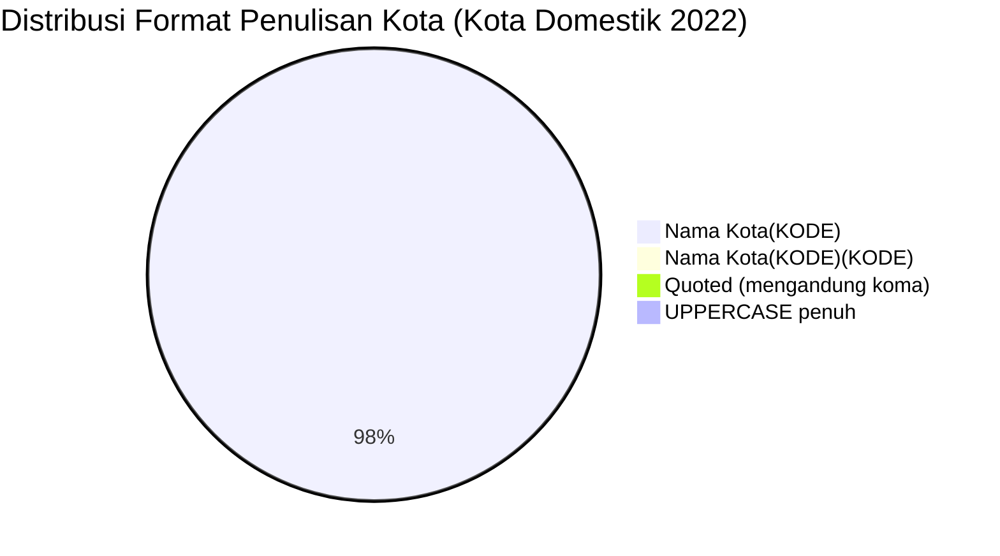

# Analisis Tabel: KOTA TERHUBUNGI OLEH RUTE ANGKUTAN UDARA NIAGA BERJADWAL DALAM NEGERI TAHUN 2022

## Informasi Umum
| Atribut | Nilai |
|---------|-------|
| **Sumber File** | `KOTA TERHUBUNGI OLEH RUTE ANGKUTAN UDARA NIAGA BERJADWAL DALAM NEGERI TAHUN 2022.csv` |
| **Tahun** | 2022 |
| **Kategori** | Kota Domestik — Rute Niaga Berjadwal Dalam Negeri |
| **Total Baris Data** | 133 |
| **Jumlah Kolom** | 2 |

---

## Struktur Tabel

| No | Nama Kolom | Tipe Data | Deskripsi |
|----|------------|-----------|-----------|
| 1 | `NO` | Integer | Nomor urut kota |
| 2 | `KOTA` | String | Nama kota yang terhubung oleh rute angkutan udara niaga berjadwal dalam negeri, dilengkapi kode bandara dalam kurung |

---

## Sample Data (3 Baris Pertama)

| NO | KOTA |
|----|------|
| 1 | Alor(ARD) |
| 2 | Ambon(AMQ) |
| 3 | Ampana(OJU) |

---

## Analisis Kualitas Data

### Ringkasan Umum
| Metrik | Nilai |
|--------|-------|
| Total Baris | 133 |
| Kolom dengan Missing Values | 0 |
| Kolom dengan Nilai Null/NaN | 0 |
| Kolom dengan Strip ("-") | 0 |

### Detail Per Kolom

| Kolom | Total Baris | Non-Empty | Empty | Null/NaN | Strip ("-") | Lainnya | Keterangan |
|-------|-------------|-----------|-------|----------|-------------|---------|------------|
| `NO` | 133 | 133 | 0 | 0 | 0 | 0 | Semua terisi (angka 1-133) |
| `KOTA` | 133 | 133 | 0 | 0 | 0 | 0 | Semua terisi, format umum: `Nama Kota(KODE)` — **tanpa spasi** sebelum kurung |

### Catatan Khusus Kolom `KOTA`

#### Format Penulisan Nama Kota:
| Format | Jumlah | Contoh |
|--------|--------|--------|
| `Nama Kota(KODE)` (tanpa spasi) | 130 | Alor(ARD), Ambon(AMQ), Balikpapan(BPN) |
| `Nama Kota(KODE)(KODE)` (tanpa spasi, kurung ganda) | 1 | Palopo(Bua)(LLO) |
| `"Nama, Lombok(KODE)"` (quoted, tanpa spasi) | 1 | `"Praya, Lombok(LOP)"` |
| `KOTA(KODE)` (uppercase penuh) | 1 | KEP.TALAUD(IAX) |

#### Format Kode Bandara:
| Tipe | Jumlah | Keterangan |
|------|--------|------------|
| 3 huruf (IATA standar) | 133 | Semua kode bandara IATA |
| uppercase penuh | 133 | Semua menggunakan huruf kapital |

#### Anomali Format:
| No | Nilai | Anomali |
|----|-------|---------|
| 33 | `Jakarta(PCB)` | Kota baru: Halim Perdanakusuma dengan kode PCB (bukan CGK/HLP) |
| 81 | `Palopo(Bua)(LLO)` | Format kurung ganda (nama kecamatan + kode) |
| 88 | `Pongtiku(TRT)` | Kota baru: TRT sekarang punya nama kota lengkap (sebelumnya hanya "TRT" di 2020) |
| 91 | `"Praya, Lombok(LOP)"` | Mengandung koma, di-quote dalam CSV |
| 114 | `Tambelan(TBX)` | Kota baru |
| 65 | `Merauke(EWE)` | Anomali: EWE adalah kode Ewer, bukan Merauke (MKQ) — kemungkinan kesalahan data |

#### Perubahan Dibanding 2021 (Catatan Internal):
| Status 2021 | Status 2022 | Kota |
|-------------|-------------|------|
| Ada | Hilang | Karimun Jawa (KWB), Sintang (SQG) — SQG ada di 2022 sebagai Sintang(SQG) |
| Baru | Ada | Jakarta(PCB), Pongtiku(TRT), Tambelan(TBX) |
| `Siborong-borong (DTB)` | Diperbaiki → `Siborong-borong(DTB)` | Spasi sebelum kurung dihapus |
| `Karimun Jawa (KWB)` | Hilang | — |
| **Perubahan format global** | **Semua entri kehilangan spasi sebelum kurung** | `Alor (ARD)` → `Alor(ARD)` |

---

## Diagram Distribusi Format Penulisan Kota

---

## Catatan Tambahan
- ✅ Data bersih tanpa nilai kosong/null/strip
- ✅ Semua entri memiliki kode bandara IATA (3 huruf)
- ⚠️ **Perubahan format global**: spasi sebelum kurung dihapus — `Alor (ARD)` → `Alor(ARD)`
- ⚠️ `Palopo(Bua)(LLO)` — format kurung ganda tetap ada dari 2021
- ⚠️ `Jakarta(PCB)` — kota baru (bandara Halim Perdanakusuma, kode PCB)
- ⚠️ `Pongtiku(TRT)` — TRT sekarang punya nama kota lengkap (perbaikan dari 2020)
- ⚠️ `Merauke(EWE)` — kemungkinan kesalahan data (EWE = Ewer, bukan Merauke)
- ⚠️ `Karimun Jawa(KWB)` hilang dari daftar 2022
