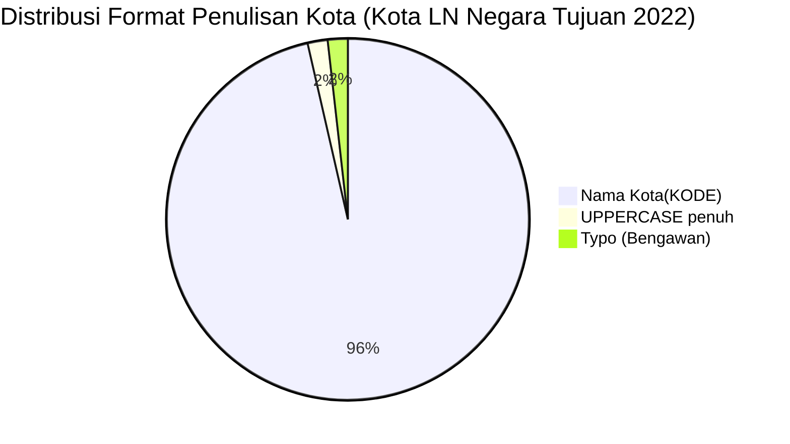

# Analisis Tabel: KOTA TERHUBUNGI OLEH RUTE ANGKUTAN UDARA NIAGA BERJADWAL LUAR NEGERI DI NEGARA TUJUAN TAHUN 2022

## Informasi Umum
| Atribut | Nilai |
|---------|-------|
| **Sumber File** | `KOTA TERHUBUNGI OLEH RUTE ANGKUTAN UDARA NIAGA BERJADWAL LUAR NEGERI DI NEGARA TUJUAN TAHUN 2022.csv` |
| **Tahun** | 2022 |
| **Kategori** | Kota Negara Tujuan — Rute Niaga Berjadwal Luar Negeri |
| **Total Baris Data** | 56 |
| **Jumlah Kolom** | 2 |

---

## Struktur Tabel

| No | Nama Kolom | Tipe Data | Deskripsi |
|----|------------|-----------|-----------|
| 1 | `NO` | Integer | Nomor urut kota |
| 2 | `KOTA` | String | Nama kota di negara tujuan yang terhubung oleh rute angkutan udara niaga berjadwal luar negeri dari Indonesia, dilengkapi kode bandara dalam kurung |

---

## Sample Data (3 Baris Pertama)

| NO | KOTA |
|----|------|
| 1 | Abu Dhabi(AUH) |
| 2 | Addis Ababa(ADD) |
| 3 | Adelaide(ADL) |

---

## Analisis Kualitas Data

### Ringkasan Umum
| Metrik | Nilai |
|--------|-------|
| Total Baris | 56 |
| Kolom dengan Missing Values | 0 |
| Kolom dengan Nilai Null/NaN | 0 |
| Kolom dengan Strip ("-") | 0 |

### Detail Per Kolom

| Kolom | Total Baris | Non-Empty | Empty | Null/NaN | Strip ("-") | Lainnya | Keterangan |
|-------|-------------|-----------|-------|----------|-------------|---------|------------|
| `NO` | 56 | 56 | 0 | 0 | 0 | 0 | Semua terisi (angka 1-56) |
| `KOTA` | 56 | 56 | 0 | 0 | 0 | 0 | Semua terisi, format umum: `Nama Kota(KODE)` — **tanpa spasi** sebelum kurung |

### Catatan Khusus Kolom `KOTA`

#### Format Penulisan Nama Kota:
| Format | Jumlah | Contoh |
|--------|--------|--------|
| `Nama Kota(KODE)` (tanpa spasi) | 55 | Abu Dhabi(AUH), Bangkok(BKK), Tokyo-Narita(NRT) |
| `KOTA(KODE)` (uppercase penuh) | 1 | DARWIN(DRW) |

#### Format Kode Bandara:
| Tipe | Jumlah | Keterangan |
|------|--------|------------|
| 3 huruf (IATA standar) | 56 | Semua kode bandara IATA |
| uppercase penuh | 56 | Semua menggunakan huruf kapital |

#### Anomali Format:
| No | Nilai | Anomali |
|----|-------|---------|
| 6 | `Bandar Sri Bengawan(BWN)` | **Typo**: seharusnya "Bandar Sri **Begawan**" (bukan "Bengawan") |
| 15 | `DARWIN(DRW)` | Nama kota seluruhnya uppercase (berbeda dari pola Title Case umum) |
| 18 | `Dubai(DWC)` | Bandara Al Maktoum — terpisah dari Dubai(DXB) |

#### Perubahan Dibanding 2021 (Catatan Internal):
| Status 2021 | Status 2022 | Kota |
|-------------|-------------|------|
| Ada | Hilang | Oblast Moskwa (SVO), Riyadh (RUH), Tashkent (TAS), Nanchang (KHN), Xian (XIY), Zhengshou (CGO), London (LHR), Kota Kinabalu (BKI), DILI (DIL), Findel (LUX) |
| Baru | Ada | Wenzhou(WNZ) |
| `Dubai - Al Maktoum (DWC)` | Diperbaiki → `Dubai(DWC)` | Format disederhanakan |
| `DARWIN (DRW)` | Tetap `DARWIN(DRW)` | Uppercase tetap dipertahankan |
| **Perubahan format global** | **Semua entri kehilangan spasi sebelum kurung** | `Abu Dhabi (AUH)` → `Abu Dhabi(AUH)` |
| `Bandar Sri Begawan (BWN)` | Typo → `Bandar Sri Bengawan(BWN)` | "Begawan" → "Bengawan" |

---

## Diagram Distribusi Format Penulisan Kota

---

## Catatan Tambahan
- ✅ Data bersih tanpa nilai kosong/null/strip
- ✅ Semua entri memiliki kode bandara IATA (3 huruf)
- ⚠️ **Perubahan format global**: spasi sebelum kurung dihapus
- ⚠️ Jumlah kota berkurang dari 62 (2021) → 56 (2022): 10 kota hilang, 1 kota baru (Wenzhou)
- ⚠️ **Typo**: `Bandar Sri Bengawan(BWN)` — seharusnya "Bandar Sri **Begawan**"
- ⚠️ `DARWIN(DRW)` tetap uppercase penuh
- ⚠️ `Dubai(DWC)` terpisah dari `Dubai(DXB)` — dua bandara berbeda di kota yang sama
- ⚠️ Banyak kota Eropa hilang: Amsterdam masih ada, tapi London, Moscow, dll tidak ada lagi
