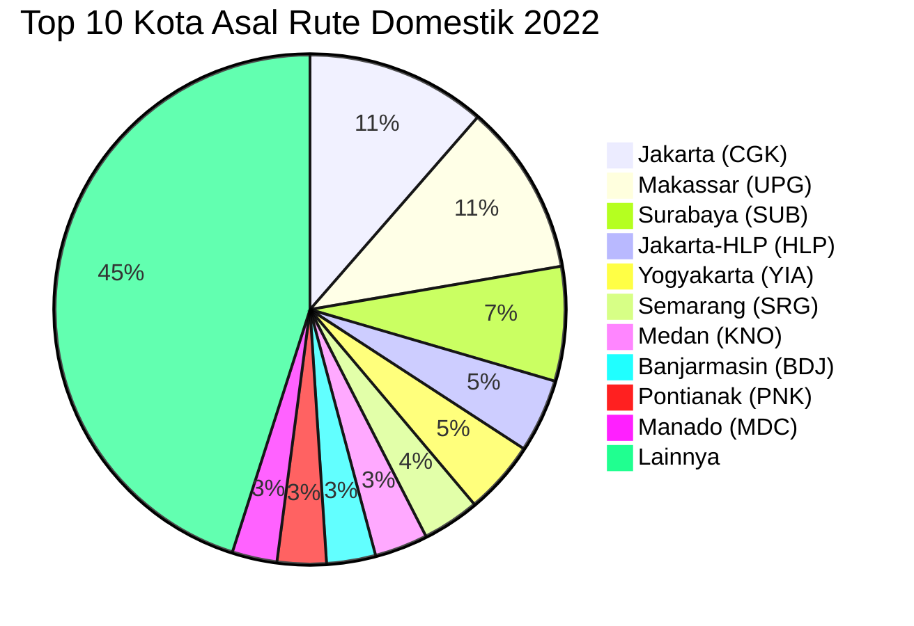

# Analisis Tabel: RUTE ANGKUTAN UDARA NIAGA BERJADWAL DALAM NEGERI TAHUN 2022

## Informasi Umum
| Atribut | Nilai |
|---------|-------|
| **Sumber File** | `RUTE ANGKUTAN UDARA NIAGA BERJADWAL DALAM NEGERI TAHUN 2022.csv` |
| **Tahun** | 2022 |
| **Kategori** | Rute Domestik — Niaga Berjadwal Dalam Negeri |
| **Total Baris Data** | 374 |
| **Jumlah Kolom** | 2 |

---

## Struktur Tabel

| No | Nama Kolom | Tipe Data | Deskripsi |
|----|------------|-----------|-----------|
| 1 | `NO` | Integer | Nomor urut rute |
| 2 | `RUTE (ASAL - TUJUAN)` | String | Rute penerbangan domestik dalam format `KotaAsal(KODE) - KotaTujuan(KODE)`, digabung dalam satu kolom |

---

## Sample Data (3 Baris Pertama)

| NO | RUTE (ASAL - TUJUAN) |
|----|----------------------|
| 1 | Balikpapan(BPN) - Samarinda(AAP) |
| 2 | Jakarta-HLP(HLP) - PANGANDARAN(CJN) |
| 3 | Pangkalan Bun(PKN) - Jakarta(PCB) |

---

## Analisis Kualitas Data

### Ringkasan Umum
| Metrik | Nilai |
|--------|-------|
| Total Baris | 374 |
| Kolom dengan Missing Values | 0 |
| Kolom dengan Nilai Null/NaN | 0 |
| Kolom dengan Strip ("-") | 0 |

### Detail Per Kolom

| Kolom | Total Baris | Non-Empty | Empty | Null/NaN | Strip ("-") | Lainnya | Keterangan |
|-------|-------------|-----------|-------|----------|-------------|---------|------------|
| `NO` | 374 | 374 | 0 | 0 | 0 | 0 | Semua terisi (angka 1-374) |
| `RUTE (ASAL - TUJUAN)` | 374 | 374 | 0 | 0 | 0 | 0 | Semua terisi, format umum: `KotaAsal(KODE) - KotaTujuan(KODE)` |

### Catatan Khusus Kolom `RUTE (ASAL - TUJUAN)`

#### ⚠️ Perubahan Struktur Signifikan:
File 2022 mengalami **perubahan struktur fundamental**: dari 3 kolom (`NO`, `RUTE (ASAL)`, `RUTE (TUJUAN)`) menjadi 2 kolom (`NO`, `RUTE (ASAL - TUJUAN)`). Asal dan tujuan digabung dalam satu kolom dengan pemisah ` - `.

#### Format Penulisan Rute:
| Format | Jumlah | Contoh |
|--------|--------|--------|
| `KotaAsal(KODE) - KotaTujuan(KODE)` | 368 | Balikpapan(BPN) - Samarinda(AAP), Jakarta(CGK) - Ambon(AMQ) |
| `"KotaAsal, Keterangan(KODE) - KotaTujuan(KODE)"` (quoted) | 4 | `"Praya, Lombok(LOP) - Labuhan Bajo(LBJ)"` |
| `"KotaAsal(KODE) - KotaTujuan, Keterangan(KODE)"` (quoted) | 2 | `"Sumbawa Besar(SWQ) - Praya, Lombok(LOP)"` |

#### Anomali pada `RUTE (ASAL - TUJUAN)`:
| No | Nilai | Anomali |
|----|-------|---------|
| 153 | `Makassar(UPG) - KXB` | Tujuan hanya kode bandara tanpa nama kota (sama seperti 2020) |
| 299 | `HMS - Banjarmasin(BDJ)` | Asal hanya kode bandara tanpa nama kota (HMS = Muara Teweh/Trinsing) |
| 119 | `Yogyakarta(YIA) - Padang Pariaman (PDG)` | Satu-satunya entri yang **masih memiliki spasi** sebelum kurung |

#### Distribusi Kota Asal (Top 10) — Diekstrak dari Kolom Gabungan:
| Kota Asal | Jumlah Rute | Persentase |
|-----------|-------------|------------|
| Jakarta (CGK) | 44 | 11.8% |
| Makassar (UPG) | 42 | 11.2% |
| Surabaya (SUB) | 28 | 7.5% |
| Jakarta-HLP (HLP) | 18 | 4.8% |
| Yogyakarta (YIA) | 18 | 4.8% |
| Semarang (SRG) | 14 | 3.7% |
| Medan (KNO) | 13 | 3.5% |
| Banjarmasin (BDJ) | 12 | 3.2% |
| Pontianak (PNK) | 12 | 3.2% |
| Manado (MDC) | 11 | 2.9% |

---

## Diagram Distribusi Top 10 Kota Asal

---

## Catatan Tambahan
- ✅ Mayoritas data bersih tanpa nilai kosong/null/strip
- ⚠️ **Perubahan struktur fundamental**: kolom `RUTE (ASAL)` dan `RUTE (TUJUAN)` digabung menjadi `RUTE (ASAL - TUJUAN)` (3 kolom → 2 kolom)
- ⚠️ **Format penulisan berubah**: spasi sebelum kurung dihapus — `Balikpapan (BPN)` → `Balikpapan(BPN)`
- ⚠️ Terdapat **2 anomali** kode tanpa nama kota:
  - Baris 153: `Makassar(UPG) - KXB` (KXB tanpa nama kota, sama seperti 2020)
  - Baris 299: `HMS - Banjarmasin(BDJ)` (HMS tanpa nama kota)
- ⚠️ `Yogyakarta(YIA) - Padang Pariaman (PDG)` — satu-satunya entri yang masih memiliki spasi sebelum kurung
- ⚠️ Muncul `Jakarta(PCB)` sebagai tujuan/asal — bandara Halim Perdanakusuma (PCB)
- ⚠️ Nama file CSV tetap normal (tidak ada double dot seperti 2021)
