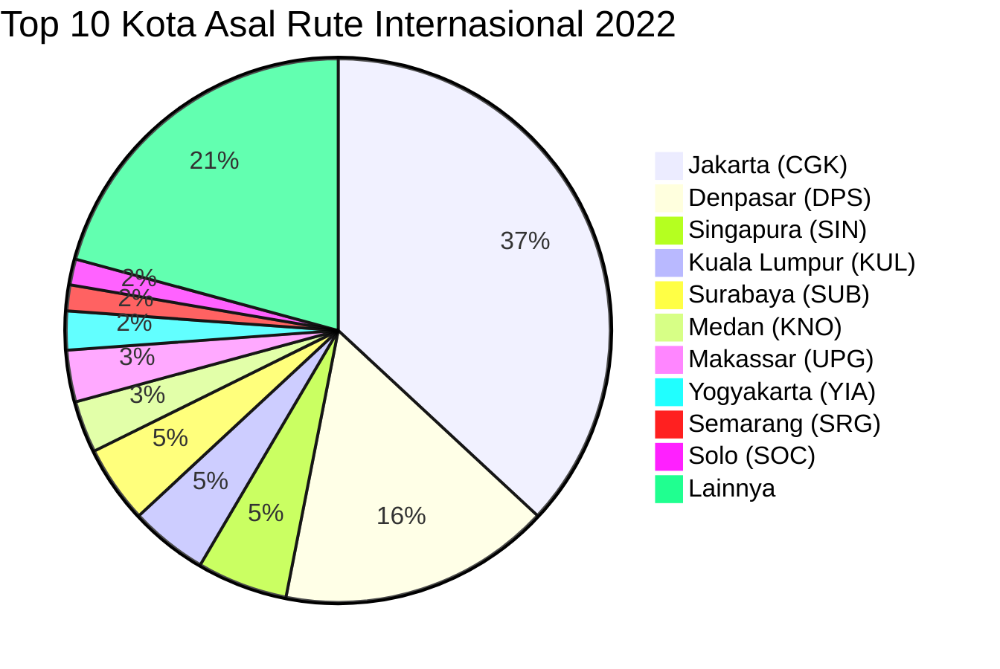
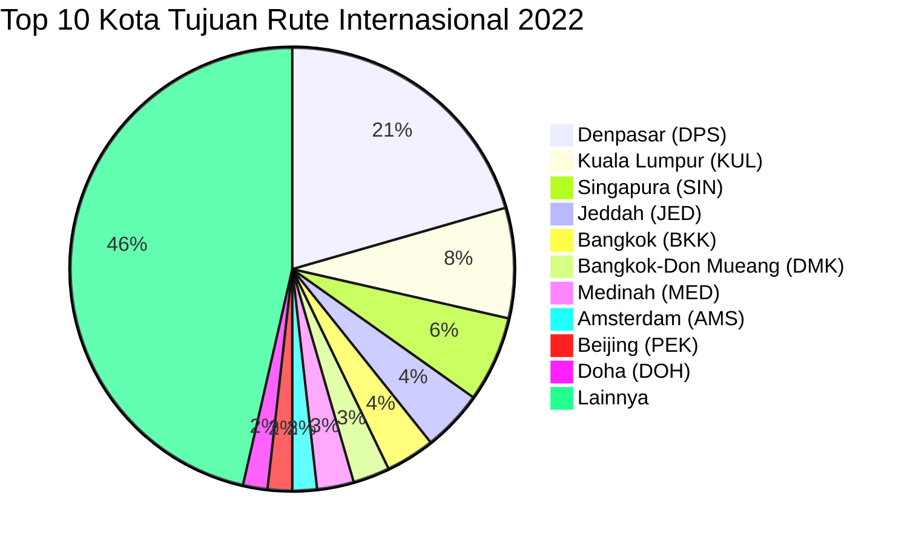

# Analisis Tabel: RUTE ANGKUTAN UDARA NIAGA BERJADWAL LUAR NEGERI TAHUN 2022

## Informasi Umum
| Atribut | Nilai |
|---------|-------|
| **Sumber File** | `RUTE ANGKUTAN UDARA NIAGA BERJADWAL LUAR NEGERI TAHUN 2022.csv` |
| **Tahun** | 2022 |
| **Kategori** | Rute Internasional — Niaga Berjadwal Luar Negeri |
| **Total Baris Data** | 133 |
| **Jumlah Kolom** | 2 |

---

## Struktur Tabel

| No | Nama Kolom | Tipe Data | Deskripsi |
|----|------------|-----------|-----------|
| 1 | `NO` | Integer | Nomor urut rute |
| 2 | `RUTE (ASAL - TUJUAN)` | String | Rute penerbangan internasional dalam format `KotaAsal(KODE) - KotaTujuan(KODE)`, digabung dalam satu kolom |

---

## Sample Data (3 Baris Pertama)

| NO | RUTE (ASAL - TUJUAN) |
|----|----------------------|
| 1 | Surabaya(SUB) - Jeddah(JED) |
| 2 | KUCHING(KCH) - Balikpapan(BPN) |
| 3 | Jakarta(CGK) - Dubai(DWC) |

---

## Analisis Kualitas Data

### Ringkasan Umum
| Metrik | Nilai |
|--------|-------|
| Total Baris | 133 |
| Kolom dengan Missing Values | 0 |
| Kolom dengan Nilai Null/NaN | 0 |
| Kolom dengan Strip ("-") | 0 |

### Detail Per Kolom

| Kolom | Total Baris | Non-Empty | Empty | Null/NaN | Strip ("-") | Lainnya | Keterangan |
|-------|-------------|-----------|-------|----------|-------------|---------|------------|
| `NO` | 133 | 133 | 0 | 0 | 0 | 0 | Semua terisi (angka 1-133) |
| `RUTE (ASAL - TUJUAN)` | 133 | 133 | 0 | 0 | 0 | 0 | Semua terisi, format umum: `KotaAsal(KODE) - KotaTujuan(KODE)` |

### Catatan Khusus Kolom `RUTE (ASAL - TUJUAN)`

#### ⚠️ Perubahan Struktur Signifikan:
File 2022 mengalami **perubahan struktur fundamental**: dari 3 kolom (`NO`, `RUTE ASAL`, `RUTE TUJUAN`) menjadi 2 kolom (`NO`, `RUTE (ASAL - TUJUAN)`). Asal dan tujuan digabung dalam satu kolom dengan pemisah ` - `.

#### Format Penulisan Rute:
| Format | Jumlah | Contoh |
|--------|--------|--------|
| `KotaAsal(KODE) - KotaTujuan(KODE)` | 129 | Surabaya(SUB) - Jeddah(JED), Jakarta(CGK) - Dubai(DWC) |
| `"KotaAsal, Keterangan(KODE) - KotaTujuan(KODE)"` (quoted) | 3 | `"Perth(PER) - Praya, Lombok(LOP)"` |
| `"KotaAsal(KODE) - KotaTujuan, Keterangan(KODE)"` (quoted) | 1 | `"Singapura(SIN) - Praya, Lombok(LOP)"` |

#### Anomali pada `RUTE (ASAL - TUJUAN)`:
| No | Nilai | Anomali |
|----|-------|---------|
| 2 | `KUCHING(KCH) - Balikpapan(BPN)` | Kota asal uppercase penuh |
| 26 | `DARWIN(DRW) - Denpasar(DPS)` | Kota asal uppercase penuh |

#### Distribusi Kota Asal (Top 10) — Diekstrak dari Kolom Gabungan:
| Kota Asal | Jumlah Rute | Persentase |
|-----------|-------------|------------|
| Jakarta (CGK) | 48 | 36.1% |
| Denpasar (DPS) | 21 | 15.8% |
| Singapura (SIN) | 7 | 5.3% |
| Kuala Lumpur (KUL) | 6 | 4.5% |
| Surabaya (SUB) | 6 | 4.5% |
| Medan (KNO) | 4 | 3.0% |
| Makassar (UPG) | 4 | 3.0% |
| Yogyakarta (YIA) | 3 | 2.3% |
| Semarang (SRG) | 2 | 1.5% |
| Solo (SOC) | 2 | 1.5% |

#### Distribusi Kota Tujuan (Top 10) — Diekstrak dari Kolom Gabungan:
| Kota Tujuan | Jumlah Rute | Persentase |
|-------------|-------------|------------|
| Denpasar (DPS) | 23 | 17.3% |
| Kuala Lumpur (KUL) | 9 | 6.8% |
| Singapura (SIN) | 7 | 5.3% |
| Jeddah (JED) | 5 | 3.8% |
| Bangkok (BKK) | 4 | 3.0% |
| Bangkok-Don Mueang (DMK) | 3 | 2.3% |
| Medinah (MED) | 3 | 2.3% |
| Amsterdam (AMS) | 2 | 1.5% |
| Beijing (PEK) | 2 | 1.5% |
| Doha (DOH) | 2 | 1.5% |

---

## Diagram Distribusi Top 10 Kota Asal

---

## Diagram Distribusi Top 10 Kota Tujuan

---

## Catatan Tambahan
- ✅ Data bersih tanpa nilai kosong/null/strip
- ⚠️ **Perubahan struktur fundamental**: kolom `RUTE ASAL` dan `RUTE TUJUAN` digabung menjadi `RUTE (ASAL - TUJUAN)` (3 kolom → 2 kolom)
- ⚠️ **Format penulisan berubah**: spasi sebelum kurung dihapus
- ⚠️ Nama kolom berubah dari `RUTE ASAL` / `RUTE TUJUAN` (2021) → `RUTE (ASAL - TUJUAN)` (2022) — kembali menggunakan tanda kurung
- ⚠️ Terdapat entri uppercase: `KUCHING(KCH)`, `DARWIN(DRW)` sebagai kota asal
- ⚠️ Terdapat 3 entri dengan `"Praya, Lombok(LOP)"` (mengandung koma, di-quote)
- ⚠️ Muncul `Dubai(DWC)` dan `Dubai(DXB)` sebagai dua bandara berbeda
