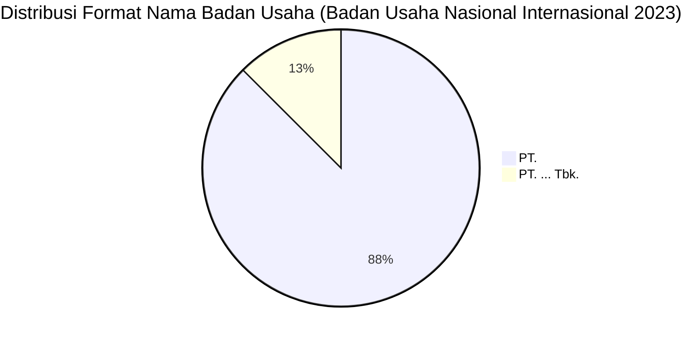

# Analisis Tabel: BADAN USAHA ANGKUTAN UDARA NASIONAL PENUMPANG YANG MELAYANI RUTE INTERNASIONAL TAHUN 2023

## Informasi Umum
| Atribut | Nilai |
|---------|-------|
| **Sumber File** | `BADAN USAHA ANGKUTAN UDARA NASIONAL PENUMPANG YANG MELAYANI RUTE INTERNASIONAL TAHUN 2023.csv` |
| **Tahun** | 2023 |
| **Kategori** | Badan Usaha Nasional — Rute Internasional (Penumpang) |
| **Total Baris Data** | 8 |
| **Jumlah Kolom** | 2 |

---

## Struktur Tabel

| No | Nama Kolom | Tipe Data | Deskripsi |
|----|------------|-----------|-----------|
| 1 | `NO` | Integer | Nomor urut badan usaha |
| 2 | `NAMA BADAN USAHA` | String | Nama resmi badan usaha angkutan udara nasional penumpang yang melayani rute internasional |

---

## Sample Data (3 Baris Pertama)

| NO | NAMA BADAN USAHA |
|----|------------------|
| 1 | PT. GARUDA INDONESIA(Persero) Tbk. |
| 2 | PT. LION MENTARI AIRLINES |
| 3 | PT. INDONESIA AIRASIA |

---

## Analisis Kualitas Data

### Ringkasan Umum
| Metrik | Nilai |
|--------|-------|
| Total Baris | 8 |
| Kolom dengan Missing Values | 0 |
| Kolom dengan Nilai Null/NaN | 0 |
| Kolom dengan Strip ("-") | 0 |

### Detail Per Kolom

| Kolom | Total Baris | Non-Empty | Empty | Null/NaN | Strip ("-") | Lainnya | Keterangan |
|-------|-------------|-----------|-------|----------|-------------|---------|------------|
| `NO` | 8 | 8 | 0 | 0 | 0 | 0 | Semua terisi (angka 1-8) |
| `NAMA BADAN USAHA` | 8 | 8 | 0 | 0 | 0 | 0 | Semua terisi, format konsisten "PT. ..." |

### Catatan Khusus Kolom `NAMA BADAN USAHA`

#### Variasi Prefix/Format Nama Badan Usaha:
| Prefix/Format | Jumlah | Contoh |
|---------------|--------|--------|
| `PT.` | 7 | PT. LION MENTARI AIRLINES, PT. INDONESIA AIRASIA, PT. SUPER AIR JET |
| `PT. ... Tbk.` | 1 | PT. GARUDA INDONESIA(Persero) Tbk. |

#### Anomali Format:
| Nilai | Anomali |
|-------|---------|
| `PT. GARUDA INDONESIA(Persero) Tbk.` | Tidak ada spasi sebelum `(Persero)` — konsisten dengan 2022 |

#### Perubahan Dibanding 2022 (Catatan Internal):
| Status 2022 | Status 2023 | Badan Usaha |
|-------------|-------------|-------------|
| Ada | Hilang | PT. SRIWIJAYA AIR |
| Baru | Ada | PT. SUPER AIR JET, PT. TRANSNUSA AVIATION MANDIRI, PT. WINGS ABADI AIRLINES |
| **Kolom NO** | **Kembali ada** | Dari 1 kolom (2022) → 2 kolom (2023) |
| **Judul file** | **Berubah** | "...YANG MELAYANI PENUMPANG..." → "...PENUMPANG YANG MELAYANI..." |

---

## Diagram Distribusi Format Nama Badan Usaha

---

## Catatan Tambahan
- ✅ Data bersih tanpa nilai kosong/null/strip
- ✅ Format penamaan perusahaan konsisten menggunakan awalan "PT."
- ⚠️ **Kolom `NO` kembali muncul** — dari 1 kolom (2022) → 2 kolom (2023)
- ⚠️ Jumlah badan usaha bertambah dari 6 (2022) → 8 (2023)
- ⚠️ `PT. SRIWIJAYA AIR` hilang, digantikan oleh `PT. SUPER AIR JET` (maskapai baru)
- ⚠️ `PT. WINGS ABADI AIRLINES` — penamaan berubah dari "PT. WINGS ABADI" (tambah "AIRLINES")
- ⚠️ `PT. TRANSNUSA AVIATION MANDIRI` kembali muncul (hilang di 2021-2022)
- ⚠️ Anomali spasi tetap ada: `PT. GARUDA INDONESIA(Persero) Tbk.` — tanpa spasi sebelum `(Persero)`
