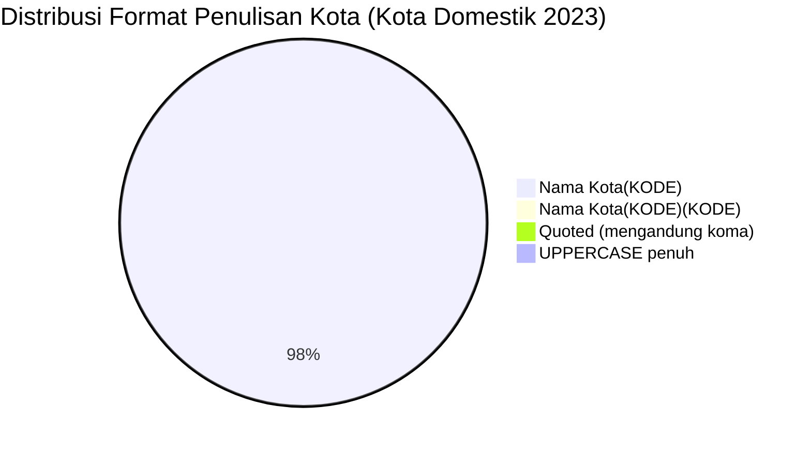

# Analisis Tabel: KOTA TERHUBUNGI OLEH RUTE ANGKUTAN UDARA NIAGA BERJADWAL DALAM NEGERI TAHUN 2023

## Informasi Umum
| Atribut | Nilai |
|---------|-------|
| **Sumber File** | `KOTA TERHUBUNGI OLEH RUTE ANGKUTAN UDARA NIAGA BERJADWAL DALAM NEGERI TAHUN 2023.csv` |
| **Tahun** | 2023 |
| **Kategori** | Kota Domestik — Rute Niaga Berjadwal Dalam Negeri |
| **Total Baris Data** | 128 |
| **Jumlah Kolom** | 2 |

---

## Struktur Tabel

| No | Nama Kolom | Tipe Data | Deskripsi |
|----|------------|-----------|-----------|
| 1 | `NO` | Integer | Nomor urut kota |
| 2 | `KOTA` | String | Nama kota yang terhubung oleh rute angkutan udara niaga berjadwal dalam negeri, dilengkapi kode bandara dalam kurung |

---

## Sample Data (3 Baris Pertama)

| NO | KOTA |
|----|------|
| 1 | Alor(ARD) |
| 2 | Ambon(AMQ) |
| 3 | Anambas(LMU) |

---

## Analisis Kualitas Data

### Ringkasan Umum
| Metrik | Nilai |
|--------|-------|
| Total Baris | 128 |
| Kolom dengan Missing Values | 0 |
| Kolom dengan Nilai Null/NaN | 0 |
| Kolom dengan Strip ("-") | 0 |

### Detail Per Kolom

| Kolom | Total Baris | Non-Empty | Empty | Null/NaN | Strip ("-") | Lainnya | Keterangan |
|-------|-------------|-----------|-------|----------|-------------|---------|------------|
| `NO` | 128 | 128 | 0 | 0 | 0 | 0 | Semua terisi (angka 1-128) |
| `KOTA` | 128 | 128 | 0 | 0 | 0 | 0 | Semua terisi, format umum: `Nama Kota(KODE)` — tanpa spasi sebelum kurung |

### Catatan Khusus Kolom `KOTA`

#### Format Penulisan Nama Kota:
| Format | Jumlah | Contoh |
|--------|--------|--------|
| `Nama Kota(KODE)` (tanpa spasi) | 125 | Alor(ARD), Ambon(AMQ), Balikpapan(BPN) |
| `Nama Kota(KODE)(KODE)` (tanpa spasi, kurung ganda) | 1 | Palopo(Bua)(LLO) |
| `"Nama, Lombok(KODE)"` (quoted, tanpa spasi) | 1 | `"Praya, Lombok(LOP)"` |
| `KOTA(KODE)` (uppercase penuh) | 1 | KEP.TALAUD(IAX) |

#### Format Kode Bandara:
| Tipe | Jumlah | Keterangan |
|------|--------|------------|
| 3 huruf (IATA standar) | 128 | Semua kode bandara IATA |
| uppercase penuh | 128 | Semua menggunakan huruf kapital |

#### Anomali Format:
| No | Nilai | Anomali |
|----|-------|---------|
| 40 | `Kufar-Seram Timur(KFR)` | Kota baru |
| 46 | `Lasikin(LKI)` | Kota baru |
| 64 | `Merauke(EWE)` | Anomali: EWE adalah kode Ewer, bukan Merauke (MKQ) — kemungkinan kesalahan data (sama seperti 2022) |
| 70 | `Muara Teweh(HMS)` | Kembali muncul (hilang di 2022, ada di 2021 sebagai Trinsing) |
| 80 | `Palopo(Bua)(LLO)` | Format kurung ganda tetap ada |
| 88 | `"Praya, Lombok(LOP)"` | Mengandung koma, di-quote dalam CSV |
| 119 | `Teluk Bintoni(TXB)` | Kode berubah dari BXB (2022) → TXB (2023) |

#### Perubahan Dibanding 2022 (Catatan Internal):
| Status 2022 | Status 2023 | Kota |
|-------------|-------------|------|
| Ada | Hilang | Dumai (DUM), Jember (JBB), Karimun Jawa (KWB), Sintang (SQG), Tasikmalaya (TSY) |
| Baru | Ada | Kufar-Seram Timur(KFR), Lasikin(LKI), Muara Teweh(HMS), Sabu(SAU) |
| `Teluk Bintoni(BXB)` | Kode berubah → `Teluk Bintoni(TXB)` | BXB → TXB |
| `TAKENGON(TXE)` | Case berubah → `Takengon(TXE)` | Title Case |
| `Pangandaran(CJN)` | Case berubah → `Pangandaran(CJN)` | Dari UPPERCASE → Title Case |
| **Format global** | **Tetap tanpa spasi** | Konsisten dengan 2022 |

---

## Diagram Distribusi Format Penulisan Kota

---

## Catatan Tambahan
- ✅ Data bersih tanpa nilai kosong/null/strip
- ✅ Semua entri memiliki kode bandara IATA (3 huruf)
- ⚠️ `Palopo(Bua)(LLO)` — format kurung ganda tetap ada dari 2021-2022
- ⚠️ `Merauke(EWE)` — kemungkinan kesalahan data tetap ada (EWE = Ewer, bukan Merauke)
- ⚠️ `Teluk Bintoni(TXB)` — kode bandara berubah dari BXB → TXB
- ⚠️ `Kufar-Seram Timur(KFR)` dan `Lasikin(LKI)` — kota baru
- ⚠️ `TAKENGON(TXE)` → `Takengon(TXE)` — case diperbaiki dari uppercase ke Title Case
- ⚠️ `PANGANDARAN(CJN)` → `Pangandaran(CJN)` — case diperbaiki dari uppercase ke Title Case
