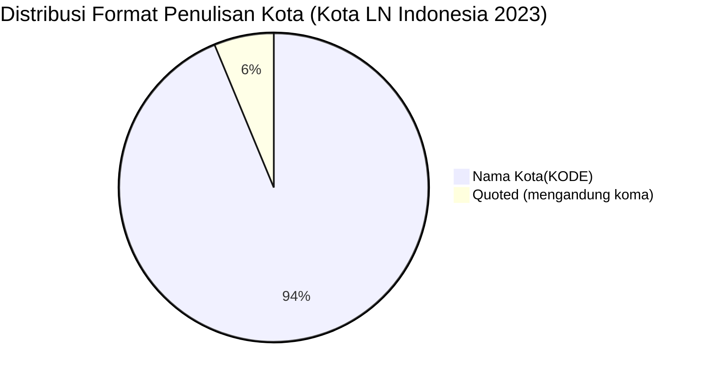

# Analisis Tabel: KOTA TERHUBUNGI OLEH RUTE ANGKUTAN UDARA NIAGA BERJADWAL LUAR NEGERI DI INDONESIA TAHUN 2023

## Informasi Umum
| Atribut | Nilai |
|---------|-------|
| **Sumber File** | `KOTA TERHUBUNGI OLEH RUTE ANGKUTAN UDARA NIAGA BERJADWAL LUAR NEGERI DI INDONESIA TAHUN 2023.csv` |
| **Tahun** | 2023 |
| **Kategori** | Kota Indonesia — Rute Niaga Berjadwal Luar Negeri |
| **Total Baris Data** | 16 |
| **Jumlah Kolom** | 2 |

---

## Struktur Tabel

| No | Nama Kolom | Tipe Data | Deskripsi |
|----|------------|-----------|-----------|
| 1 | `NO` | Integer | Nomor urut kota |
| 2 | `KOTA` | String | Nama kota di Indonesia yang terhubung oleh rute angkutan udara niaga berjadwal luar negeri, dilengkapi kode bandara dalam kurung |

---

## Sample Data (3 Baris Pertama)

| NO | KOTA |
|----|------|
| 1 | Balikpapan(BPN) |
| 2 | Banda Aceh(BTJ) |
| 3 | Batam(BTH) |

---

## Analisis Kualitas Data

### Ringkasan Umum
| Metrik | Nilai |
|--------|-------|
| Total Baris | 16 |
| Kolom dengan Missing Values | 0 |
| Kolom dengan Nilai Null/NaN | 0 |
| Kolom dengan Strip ("-") | 0 |

### Detail Per Kolom

| Kolom | Total Baris | Non-Empty | Empty | Null/NaN | Strip ("-") | Lainnya | Keterangan |
|-------|-------------|-----------|-------|----------|-------------|---------|------------|
| `NO` | 16 | 16 | 0 | 0 | 0 | 0 | Semua terisi (angka 1-16) |
| `KOTA` | 16 | 16 | 0 | 0 | 0 | 0 | Semua terisi, format umum: `Nama Kota(KODE)` — tanpa spasi sebelum kurung |

### Catatan Khusus Kolom `KOTA`

#### Format Penulisan Nama Kota:
| Format | Jumlah | Contoh |
|--------|--------|--------|
| `Nama Kota(KODE)` (tanpa spasi) | 15 | Balikpapan(BPN), Banda Aceh(BTJ), Denpasar(DPS) |
| `"Nama, Lombok(KODE)"` (quoted, tanpa spasi) | 1 | `"Praya, Lombok(LOP)"` |

#### Format Kode Bandara:
| Tipe | Jumlah | Keterangan |
|------|--------|------------|
| 3 huruf (IATA standar) | 16 | Semua kode bandara IATA |
| uppercase penuh | 16 | Semua menggunakan huruf kapital |

#### Anomali Format:
| No | Nilai | Anomali |
|----|-------|---------|
| 6 | `Jakarta(HLP)` | Format berubah dari `Jakarta-HLP(HLP)` → `Jakarta(HLP)` |
| 13 | `"Praya, Lombok(LOP)"` | Mengandung koma, di-quote dalam CSV |

#### Perubahan Dibanding 2022 (Catatan Internal):
| Status 2022 | Status 2023 | Kota |
|-------------|-------------|------|
| Ada | Hilang | Bandar Lampung (TKG), Palembang (PLM), Pontianak (PNK), Tarakan (TRK), Siborong-borong (DTB), Solo (SOC) |
| Baru | Ada | Jakarta(HLP), Majalengka(KJT) |
| `Jakarta-HLP(HLP)` | Format berubah → `Jakarta(HLP)` | Kode HLP langsung dalam kurung tanpa prefix "HLP" di nama |
| **Format global** | **Tetap tanpa spasi** | Konsisten dengan 2022 |

---

## Diagram Distribusi Format Penulisan Kota

---

## Catatan Tambahan
- ✅ Data bersih tanpa nilai kosong/null/strip
- ✅ Semua entri memiliki kode bandara IATA (3 huruf)
- ⚠️ Jumlah kota berkurang dari 21 (2022) → 16 (2023) — penurunan signifikan
- ⚠️ `Jakarta(HLP)` — format berubah dari `Jakarta-HLP(HLP)` → `Jakarta(HLP)`
- ⚠️ Terdapat 1 entri dengan format khusus: `"Praya, Lombok(LOP)"` — mengandung koma, di-quote dalam CSV
