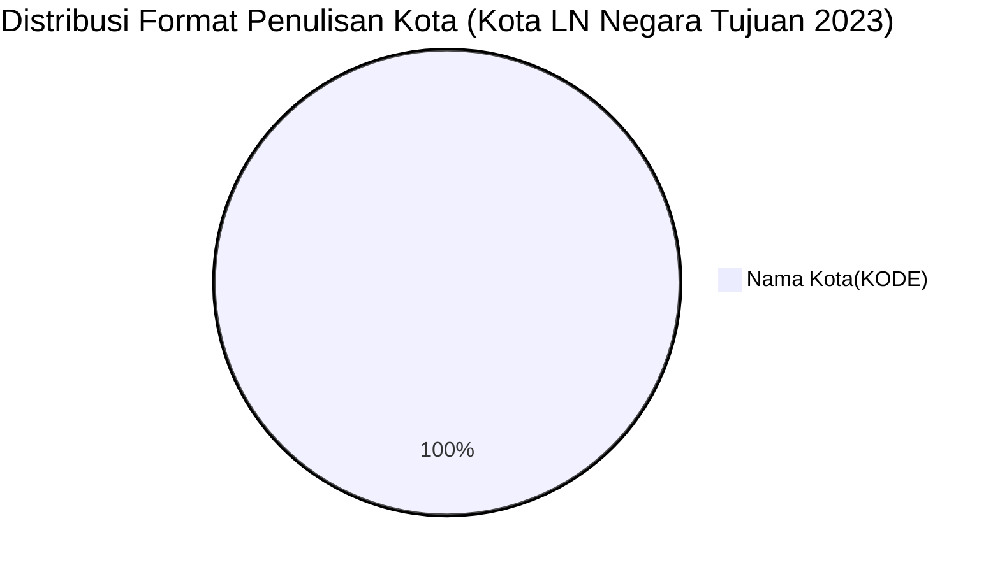

# Analisis Tabel: KOTA TERHUBUNGI OLEH RUTE ANGKUTAN UDARA NIAGA BERJADWAL LUAR NEGERI DI NEGARA TUJUAN TAHUN 2023

## Informasi Umum
| Atribut | Nilai |
|---------|-------|
| **Sumber File** | `KOTA TERHUBUNGI OLEH RUTE ANGKUTAN UDARA NIAGA BERJADWAL LUAR NEGERI DI NEGARA TUJUAN TAHUN 2023.csv` |
| **Tahun** | 2023 |
| **Kategori** | Kota Negara Tujuan — Rute Niaga Berjadwal Luar Negeri |
| **Total Baris Data** | 63 |
| **Jumlah Kolom** | 2 |

---

## Struktur Tabel

| No | Nama Kolom | Tipe Data | Deskripsi |
|----|------------|-----------|-----------|
| 1 | `NO` | Integer | Nomor urut kota |
| 2 | `KOTA` | String | Nama kota di negara tujuan yang terhubung oleh rute angkutan udara niaga berjadwal luar negeri dari Indonesia, dilengkapi kode bandara dalam kurung |

---

## Sample Data (3 Baris Pertama)

| NO | KOTA |
|----|------|
| 1 | Abu Dhabi(AUH) |
| 2 | Adelaide(ADL) |
| 3 | Amsterdam(AMS) |

---

## Analisis Kualitas Data

### Ringkasan Umum
| Metrik | Nilai |
|--------|-------|
| Total Baris | 63 |
| Kolom dengan Missing Values | 0 |
| Kolom dengan Nilai Null/NaN | 0 |
| Kolom dengan Strip ("-") | 0 |

### Detail Per Kolom

| Kolom | Total Baris | Non-Empty | Empty | Null/NaN | Strip ("-") | Lainnya | Keterangan |
|-------|-------------|-----------|-------|----------|-------------|---------|------------|
| `NO` | 63 | 63 | 0 | 0 | 0 | 0 | Semua terisi (angka 1-63) |
| `KOTA` | 63 | 63 | 0 | 0 | 0 | 0 | Semua terisi, format umum: `Nama Kota(KODE)` — tanpa spasi sebelum kurung |

### Catatan Khusus Kolom `KOTA`

#### Format Penulisan Nama Kota:
| Format | Jumlah | Contoh |
|--------|--------|--------|
| `Nama Kota(KODE)` (tanpa spasi) | 63 | Abu Dhabi(AUH), Bangkok(BKK), Tokyo-Narita(NRT) |

#### Format Kode Bandara:
| Tipe | Jumlah | Keterangan |
|------|--------|------------|
| 3 huruf (IATA standar) | 63 | Semua kode bandara IATA |
| uppercase penuh | 63 | Semua menggunakan huruf kapital |

#### Anomali Format:
Tidak ada anomali format penulisan di 2023.

#### Perubahan Dibanding 2022 (Catatan Internal):
| Status 2022 | Status 2023 | Kota |
|-------------|-------------|------|
| Ada | Hilang | Oblast Moskwa (SVO), Zhengshou (CGO), Xian (XIY), Nanning (NNG) |
| Baru | Ada | Chengdu(TFU), Cairo(CAI), Delhi(DEL), Gold Coast(OOL), Guilin(KWL), Macau(MFM), Mumbai(BOM), Phnom Penh(PNH), Port Moresby(POM), Riyadh(RUH), Tashkent(TAS) |
| `Bandar Sri Bengawan(BWN)` (typo) | **Diperbaiki** → `Bandar Sri Begawan(BWN)` | Typo sudah diperbaiki! |
| `DARWIN(DRW)` | **Diperbaiki** → `Darwin(DRW)` | Uppercase diperbaiki ke Title Case |
| `Dubai(DWC)` | Tetap ada | Konsisten |
| **Format global** | **Tetap tanpa spasi** | Konsisten dengan 2022 |

---

## Diagram Distribusi Format Penulisan Kota

---

## Catatan Tambahan
- ✅ Data bersih tanpa nilai kosong/null/strip
- ✅ Semua entri memiliki kode bandara IATA (3 huruf)
- ✅ **Tidak ada anomali format** — semua konsisten Title Case + tanpa spasi
- ✅ Typo `Bandar Sri Bengawan` dari 2022 sudah **diperbaiki** menjadi `Bandar Sri Begawan`
- ✅ `DARWIN(DRW)` dari 2022 sudah **diperbaiki** menjadi `Darwin(DRW)`
- ⚠️ Jumlah kota bertambah dari 56 (2022) → 63 (2023) — 11 kota baru, 4 kota hilang
- ⚠️ Chengdu memiliki 2 bandara: `Chengdu(CTU)` dan `Chengdu(TFU)`
