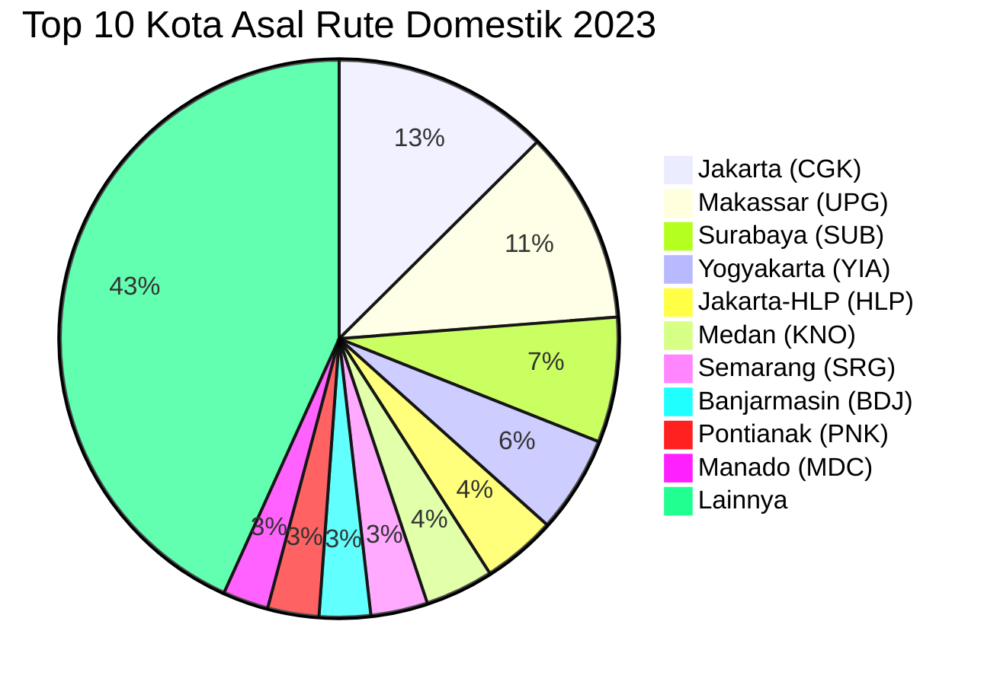

# Analisis Tabel: RUTE ANGKUTAN UDARA NIAGA BERJADWAL DALAM NEGERI TAHUN 2023

## Informasi Umum
| Atribut | Nilai |
|---------|-------|
| **Sumber File** | `RUTE ANGKUTAN UDARA NIAGA BERJADWAL DALAM NEGERI TAHUN 2023.csv` |
| **Tahun** | 2023 |
| **Kategori** | Rute Domestik — Niaga Berjadwal Dalam Negeri |
| **Total Baris Data** | 303 |
| **Jumlah Kolom** | 2 |

---

## Struktur Tabel

| No | Nama Kolom | Tipe Data | Deskripsi |
|----|------------|-----------|-----------|
| 1 | `NO` | Integer | Nomor urut rute |
| 2 | `RUTE (PP)` | String | Rute penerbangan domestik dalam format `KotaAsal(KODE) - KotaTujuan(KODE)`, digabung dalam satu kolom. PP = Pulang Pergi |

---

## Sample Data (3 Baris Pertama)

| NO | RUTE (PP) |
|----|-----------|
| 1 | Singkep(SIQ) - Pekanbaru(PKU) |
| 2 | Ternate(TTE) - Sanana(SQN) |
| 3 | Jakarta-HLP(HLP) - Bengkulu(BKS) |

---

## Analisis Kualitas Data

### Ringkasan Umum
| Metrik | Nilai |
|--------|-------|
| Total Baris | 303 |
| Kolom dengan Missing Values | 0 |
| Kolom dengan Nilai Null/NaN | 0 |
| Kolom dengan Strip ("-") | 0 |

### Detail Per Kolom

| Kolom | Total Baris | Non-Empty | Empty | Null/NaN | Strip ("-") | Lainnya | Keterangan |
|-------|-------------|-----------|-------|----------|-------------|---------|------------|
| `NO` | 303 | 303 | 0 | 0 | 0 | 0 | Semua terisi (angka 1-303) |
| `RUTE (PP)` | 303 | 303 | 0 | 0 | 0 | 0 | Semua terisi, format umum: `KotaAsal(KODE) - KotaTujuan(KODE)` |

### Catatan Khusus Kolom `RUTE (PP)`

#### ⚠️ Perubahan Nama Kolom:
File 2023 mengalami **perubahan nama kolom**: dari `RUTE (ASAL - TUJUAN)` (2022) → `RUTE (PP)` (2023). Struktur tetap 2 kolom, tetapi nama berubah. "PP" kemungkinan berarti "Pulang Pergi".

#### Format Penulisan Rute:
| Format | Jumlah | Contoh |
|--------|--------|--------|
| `KotaAsal(KODE) - KotaTujuan(KODE)` | 297 | Singkep(SIQ) - Pekanbaru(PKU), Jakarta(CGK) - Ambon(AMQ) |
| `"KotaAsal, Keterangan(KODE) - KotaTujuan(KODE)"` (quoted) | 3 | `"Praya, Lombok(LOP) - Bima(BMU)"` |
| `"KotaAsal(KODE) - KotaTujuan, Keterangan(KODE)"` (quoted) | 3 | `"Sumbawa Besar(SWQ) - Praya, Lombok(LOP)"` |

#### Anomali pada `RUTE (PP)`:
Tidak ada anomali kode tanpa nama kota di 2023 — semua entri memiliki format lengkap `Nama(KODE)`.

#### Distribusi Kota Asal (Top 10) — Diekstrak dari Kolom Gabungan:
| Kota Asal | Jumlah Rute | Persentase |
|-----------|-------------|------------|
| Jakarta (CGK) | 38 | 12.5% |
| Makassar (UPG) | 34 | 11.2% |
| Surabaya (SUB) | 22 | 7.3% |
| Yogyakarta (YIA) | 17 | 5.6% |
| Jakarta-HLP (HLP) | 13 | 4.3% |
| Medan (KNO) | 12 | 4.0% |
| Semarang (SRG) | 10 | 3.3% |
| Banjarmasin (BDJ) | 9 | 3.0% |
| Pontianak (PNK) | 9 | 3.0% |
| Manado (MDC) | 8 | 2.6% |

---

## Diagram Distribusi Top 10 Kota Asal

---

## Catatan Tambahan
- ✅ Data bersih tanpa nilai kosong/null/strip
- ✅ Tidak ada anomali kode tanpa nama kota (TRT/KXB/HMS dari tahun sebelumnya sudah bersih)
- ⚠️ **Nama kolom berubah**: `RUTE (ASAL - TUJUAN)` (2022) → `RUTE (PP)` (2023)
- ⚠️ Struktur tetap 2 kolom (NO + RUTE gabungan)
- ⚠️ "PP" kemungkinan berarti "Pulang Pergi"
- ⚠️ Terdapat 6 entri dengan `"Praya, Lombok(LOP)"` (mengandung koma, di-quote)
- ⚠️ Kota baru: `Kufar-Seram Timur(KFR)`, `Lasikin(LKI)` muncul di beberapa rute
