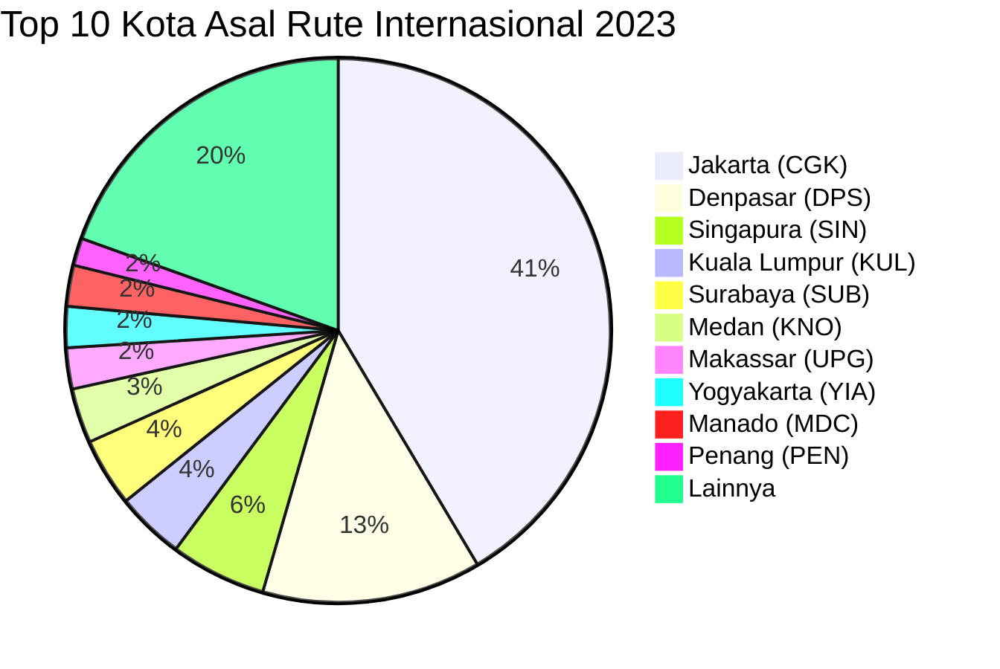
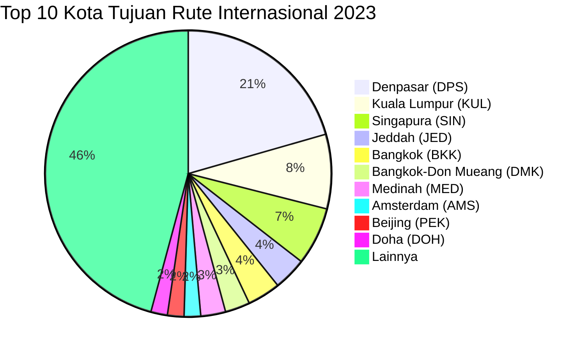

# Analisis Tabel: RUTE ANGKUTAN UDARA NIAGA BERJADWAL LUAR NEGERI TAHUN 2023

## Informasi Umum
| Atribut | Nilai |
|---------|-------|
| **Sumber File** | `RUTE ANGKUTAN UDARA NIAGA BERJADWAL LUAR NEGERI TAHUN 2023.csv` |
| **Tahun** | 2023 |
| **Kategori** | Rute Internasional — Niaga Berjadwal Luar Negeri |
| **Total Baris Data** | 125 |
| **Jumlah Kolom** | 2 |

---

## Struktur Tabel

| No | Nama Kolom | Tipe Data | Deskripsi |
|----|------------|-----------|-----------|
| 1 | `NO` | Integer | Nomor urut rute |
| 2 | `RUTE (PP)` | String | Rute penerbangan internasional dalam format `KotaAsal(KODE) - KotaTujuan(KODE)`, digabung dalam satu kolom. PP = Pulang Pergi |

---

## Sample Data (3 Baris Pertama)

| NO | RUTE (PP) |
|----|-----------|
| 1 | BANDAR SRI BEGAWAN(BWN) - Balikpapan(BPN) |
| 2 | Jakarta(CGK) - TFU |
| 3 | Dubai(DXB) - Denpasar(DPS) |

---

## Analisis Kualitas Data

### Ringkasan Umum
| Metrik | Nilai |
|--------|-------|
| Total Baris | 125 |
| Kolom dengan Missing Values | 0 |
| Kolom dengan Nilai Null/NaN | 0 |
| Kolom dengan Strip ("-") | 0 |

### Detail Per Kolom

| Kolom | Total Baris | Non-Empty | Empty | Null/NaN | Strip ("-") | Lainnya | Keterangan |
|-------|-------------|-----------|-------|----------|-------------|---------|------------|
| `NO` | 125 | 125 | 0 | 0 | 0 | 0 | Semua terisi (angka 1-125) |
| `RUTE (PP)` | 125 | 125 | 0 | 0 | 0 | 0 | Semua terisi, format umum: `KotaAsal(KODE) - KotaTujuan(KODE)` |

### Catatan Khusus Kolom `RUTE (PP)`

#### ⚠️ Perubahan Nama Kolom:
File 2023 mengalami **perubahan nama kolom**: dari `RUTE (ASAL - TUJUAN)` (2022) → `RUTE (PP)` (2023). Struktur tetap 2 kolom.

#### Format Penulisan Rute:
| Format | Jumlah | Contoh |
|--------|--------|--------|
| `KotaAsal(KODE) - KotaTujuan(KODE)` | 121 | Dubai(DXB) - Denpasar(DPS), Jakarta(CGK) - Riyadh(RUH) |
| `"KotaAsal(KODE) - KotaTujuan, Keterangan(KODE)"` (quoted) | 1 | `"SINGAPURA(SIN) - Praya, Lombok(LOP)"` |
| `KOTA(KODE) - KotaTujuan(KODE)` (uppercase) | 2 | `BANDAR SRI BEGAWAN(BWN) - Balikpapan(BPN)`, `SINGAPURA(SIN) - Jakarta-HLP(HLP)` |
| `KotaAsal(KODE) - KODE` (tujuan tanpa nama) | 1 | `Jakarta(CGK) - TFU` |

#### Anomali pada `RUTE (PP)`:
| No | Nilai | Anomali |
|----|-------|---------|
| 1 | `BANDAR SRI BEGAWAN(BWN) - Balikpapan(BPN)` | Kota asal uppercase penuh |
| 2 | `Jakarta(CGK) - TFU` | Tujuan hanya kode bandara tanpa nama kota (TFU = Chengdu Tianfu) |
| 31 | `SINGAPURA(SIN) - Jakarta-HLP(HLP)` | Kota asal uppercase penuh |
| 42 | `Jakarta(CGK) - KUCHING(KCH)` | Kota tujuan uppercase penuh |

#### Distribusi Kota Asal (Top 10) — Diekstrak dari Kolom Gabungan:
| Kota Asal | Jumlah Rute | Persentase |
|-----------|-------------|------------|
| Jakarta (CGK) | 51 | 40.8% |
| Denpasar (DPS) | 16 | 12.8% |
| Singapura (SIN) | 7 | 5.6% |
| Kuala Lumpur (KUL) | 5 | 4.0% |
| Surabaya (SUB) | 5 | 4.0% |
| Medan (KNO) | 4 | 3.2% |
| Makassar (UPG) | 3 | 2.4% |
| Yogyakarta (YIA) | 3 | 2.4% |
| Manado (MDC) | 3 | 2.4% |
| Penang (PEN) | 2 | 1.6% |

#### Distribusi Kota Tujuan (Top 10) — Diekstrak dari Kolom Gabungan:
| Kota Tujuan | Jumlah Rute | Persentase |
|-------------|-------------|------------|
| Denpasar (DPS) | 22 | 17.6% |
| Kuala Lumpur (KUL) | 9 | 7.2% |
| Singapura (SIN) | 7 | 5.6% |
| Jeddah (JED) | 4 | 3.2% |
| Bangkok (BKK) | 4 | 3.2% |
| Bangkok-Don Mueang (DMK) | 3 | 2.4% |
| Medinah (MED) | 3 | 2.4% |
| Amsterdam (AMS) | 2 | 1.6% |
| Beijing (PEK) | 2 | 1.6% |
| Doha (DOH) | 2 | 1.6% |

---

## Diagram Distribusi Top 10 Kota Asal

---

## Diagram Distribusi Top 10 Kota Tujuan

---

## Catatan Tambahan
- ✅ Mayoritas data bersih tanpa nilai kosong/null/strip
- ⚠️ **Nama kolom berubah**: `RUTE (ASAL - TUJUAN)` (2022) → `RUTE (PP)` (2023)
- ⚠️ Terdapat **1 anomali** kode tanpa nama kota:
  - Baris 2: `Jakarta(CGK) - TFU` — hanya kode bandara Chengdu Tianfu
- ⚠️ Terdapat beberapa entri uppercase penuh: `BANDAR SRI BEGAWAN(BWN)`, `SINGAPURA(SIN)`, `KUCHING(KCH)`
- ⚠️ Terdapat 1 entri dengan `"Praya, Lombok(LOP)"` (mengandung koma, di-quote)
- ⚠️ Jakarta (CGK) mendominasi sebagai kota asal dengan 40.8% dari total rute internasional
