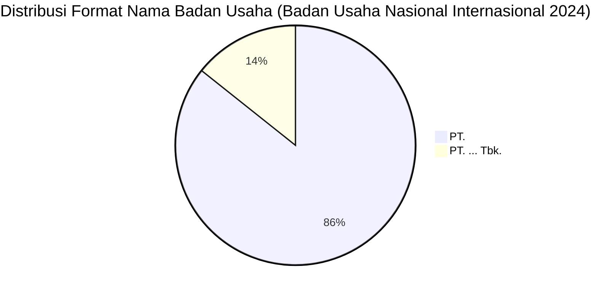

# Analisis Tabel: BADAN USAHA ANGKUTAN UDARA NASIONAL PENUMPANG YANG MELAYANI RUTE INTERNASIONAL TAHUN 2024

## Informasi Umum
| Atribut | Nilai |
|---------|-------|
| **Sumber File** | `BADAN USAHA ANGKUTAN UDARA NASIONAL PENUMPANG YANG MELAYANI RUTE INTERNASIONAL.csv` |
| **Tahun** | 2024 |
| **Kategori** | Badan Usaha Nasional — Rute Internasional (Penumpang) |
| **Total Baris Data** | 7 |
| **Jumlah Kolom** | 1 |

---

## Struktur Tabel

| No | Nama Kolom | Tipe Data | Deskripsi |
|----|------------|-----------|-----------|
| 1 | `NAMA BADAN USAHA` | String | Nama resmi badan usaha angkutan udara nasional penumpang yang melayani rute internasional |

---

## Sample Data (3 Baris Pertama)

| NAMA BADAN USAHA |
|------------------|
| PT. CITILINK INDONESIA |
| PT. GARUDA INDONESIA(Persero) Tbk. |
| PT. LION MENTARI AIRLINES |

---

## Analisis Kualitas Data

### Ringkasan Umum
| Metrik | Nilai |
|--------|-------|
| Total Baris | 7 |
| Kolom dengan Missing Values | 0 |
| Kolom dengan Nilai Null/NaN | 0 |
| Kolom dengan Strip ("-") | 0 |

### Detail Per Kolom

| Kolom | Total Baris | Non-Empty | Empty | Null/NaN | Strip ("-") | Lainnya | Keterangan |
|-------|-------------|-----------|-------|----------|-------------|---------|------------|
| `NAMA BADAN USAHA` | 7 | 7 | 0 | 0 | 0 | 0 | Semua terisi, format konsisten "PT. ..." |

### Catatan Khusus Kolom `NAMA BADAN USAHA`

#### Variasi Prefix/Format Nama Badan Usaha:
| Prefix/Format | Jumlah | Contoh |
|---------------|--------|--------|
| `PT.` | 6 | PT. CITILINK INDONESIA, PT. LION MENTARI AIRLINES, PT. SUPER AIR JET |
| `PT. ... Tbk.` | 1 | PT. GARUDA INDONESIA(Persero) Tbk. |

#### Anomali Format:
| Nilai | Anomali |
|-------|---------|
| `PT. GARUDA INDONESIA(Persero) Tbk.` | Tidak ada spasi sebelum `(Persero)` — konsisten dengan 2022-2023 |

#### Perubahan Dibanding 2023 (Catatan Internal):
| Status 2023 | Status 2024 | Badan Usaha |
|-------------|-------------|-------------|
| Ada | Hilang | PT. WINGS ABADI AIRLINES |
| **Kolom NO** | **Hilang** | Dari 2 kolom (2023) → 1 kolom (2024) |
| **Judul file** | **Sama** | Konsisten dengan 2023 (tanpa "TAHUN 2024") |

---

## Diagram Distribusi Format Nama Badan Usaha

---

## Catatan Tambahan
- ✅ Data bersih tanpa nilai kosong/null/strip
- ✅ Format penamaan perusahaan konsisten menggunakan awalan "PT."
- ⚠️ **Kolom `NO` hilang** — dari 2 kolom (2023) → 1 kolom (2024), sama seperti 2022
- ⚠️ Jumlah badan usaha berkurang dari 8 (2023) → 7 (2024): `PT. WINGS ABADI AIRLINES` tidak lagi terdaftar
- ⚠️ `PT. CITILINK INDONESIA` sekarang di urutan pertama (sebelumnya Garuda di 2020-2023)
- ⚠️ Anomali spasi tetap ada: `PT. GARUDA INDONESIA(Persero) Tbk.` — tanpa spasi sebelum `(Persero)`
