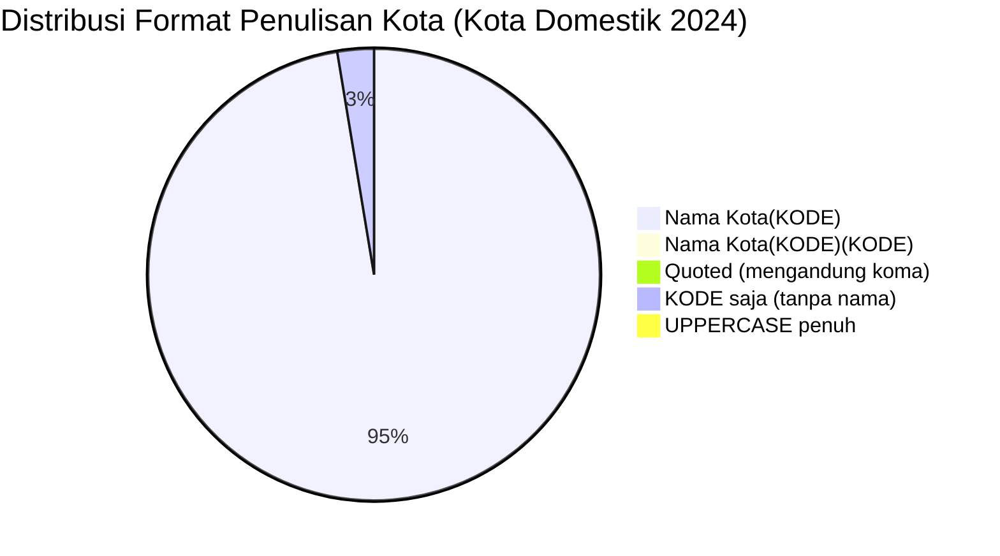

# Analisis Tabel: KOTA TERHUBUNG OLEH ANGKUTAN UDARA NIAGA BERJADWAL DALAM NEGERI TAHUN 2024

## Informasi Umum
| Atribut | Nilai |
|---------|-------|
| **Sumber File** | `KOTA TERHUBUNG OLEH ANGKUTAN UDARA NIAGA BERJADWAL DALAM NEGERI TAHUN 2024.csv` |
| **Tahun** | 2024 |
| **Kategori** | Kota Domestik — Rute Niaga Berjadwal Dalam Negeri |
| **Total Baris Data** | 118 |
| **Jumlah Kolom** | 2 |

---

## Struktur Tabel

| No | Nama Kolom | Tipe Data | Deskripsi |
|----|------------|-----------|-----------|
| 1 | `NO` | Integer | Nomor urut kota |
| 2 | `KOTA` | String | Nama kota yang terhubung oleh angkutan udara niaga berjadwal dalam negeri, dilengkapi kode bandara dalam kurung |

---

## Sample Data (3 Baris Pertama)

| NO | KOTA |
|----|------|
| 1 | Alor(ARD) |
| 2 | Ambon(AMQ) |
| 3 | Anambas(LMU) |

---

## Analisis Kualitas Data

### Ringkasan Umum
| Metrik | Nilai |
|--------|-------|
| Total Baris | 118 |
| Kolom dengan Missing Values | 0 |
| Kolom dengan Nilai Null/NaN | 0 |
| Kolom dengan Strip ("-") | 0 |

### Detail Per Kolom

| Kolom | Total Baris | Non-Empty | Empty | Null/NaN | Strip ("-") | Lainnya | Keterangan |
|-------|-------------|-----------|-------|----------|-------------|---------|------------|
| `NO` | 118 | 118 | 0 | 0 | 0 | 0 | Semua terisi (angka 1-118) |
| `KOTA` | 118 | 118 | 0 | 0 | 0 | 0 | Semua terisi, format umum: `Nama Kota(KODE)` — tanpa spasi sebelum kurung |

### Catatan Khusus Kolom `KOTA`

#### Format Penulisan Nama Kota:
| Format | Jumlah | Contoh |
|--------|--------|--------|
| `Nama Kota(KODE)` (tanpa spasi) | 112 | Alor(ARD), Ambon(AMQ), Balikpapan(BPN) |
| `Nama Kota(KODE)(KODE)` (tanpa spasi, kurung ganda) | 1 | Palopo(Bua)(LLO) |
| `"Nama, Lombok(KODE)"` (quoted, tanpa spasi) | 1 | `"Praya, Lombok(LOP)"` |
| `KODE` (tanpa nama kota) | 2 | `HMS`, `LKI` |
| `KOTA(KODE)` (uppercase penuh) | 1 | PANGANDARAN(CJN) |
| `NAMA_REGION(KODE)` (uppercase penuh) | 1 | KALIMANTAN TIMUR(RTU) |

#### Format Kode Bandara:
| Tipe | Jumlah | Keterangan |
|------|--------|------------|
| 3 huruf (IATA standar) | 118 | Semua kode bandara IATA |
| uppercase penuh | 118 | Semua menggunakan huruf kapital |

#### Anomali Format:
| No | Nilai | Anomali |
|----|-------|---------|
| 27 | `HMS` | Hanya kode bandara tanpa nama kota (HMS = Muara Teweh) |
| 47 | `LKI` | Hanya kode bandara tanpa nama kota (LKI = Lasikin) |
| 76 | `Palopo(Bua)(LLO)` | Format kurung ganda tetap ada dari 2021 |
| 83 | `"Praya, Lombok(LOP)"` | Mengandung koma, di-quote dalam CSV |
| 112 | `TRT` | Hanya kode bandara tanpa nama kota (TRT = Pongtiku/Toraja) |
| 33 | `KALIMANTAN TIMUR(RTU)` | Nama region, bukan nama kota — uppercase penuh |
| 78 | `PANGANDARAN(CJN)` | Uppercase penuh (kembali dari Title Case di 2023) |

#### Perubahan Dibanding 2023 (Catatan Internal):
| Status 2023 | Status 2024 | Kota |
|-------------|-------------|------|
| Ada | Hilang | Banyumas (PWL), Dhoho (DHX) — DHX ada sebagai kota asal di rute, Cepu (CPF), Dumai (DUM), Jember (JBB), Karimun Jawa (KWB), Lasikin (LKI) — muncul sebagai LKI tanpa nama, Muara Teweh (HMS) — muncul sebagai HMS tanpa nama, Sintang (SQG), Tasikmalaya (TSY), Teluk Bintoni (TXB) |
| Baru | Ada | Kalimantan Timur(RTU) |
| `TRT` | Kembali sebagai kode tanpa nama | Sebelumnya "Pongtiku(TRT)" di 2022-2023 |
| **Judul file** | **Berubah** | "TERHUBUNGI OLEH RUTE" → "TERHUBUNG OLEH" (tanpa "RUTE") |
| **Format global** | **Tetap tanpa spasi** | Konsisten dengan 2022-2023 |

---

## Diagram Distribusi Format Penulisan Kota

---

## Catatan Tambahan
- ✅ Data bersih tanpa nilai kosong/null/strip
- ⚠️ **3 entri hanya kode bandara tanpa nama kota**: `HMS`, `LKI`, `TRT` — anomali yang sama seperti 2020 (TRT, KXB)
- ⚠️ `Palopo(Bua)(LLO)` — format kurung ganda tetap ada sejak 2021
- ⚠️ `KALIMANTAN TIMUR(RTU)` — nama region provinsi, bukan nama kota spesifik
- ⚠️ `PANGANDARAN(CJN)` — kembali ke uppercase penuh (sempat Title Case di 2023)
- ⚠️ **Judul file berubah**: "TERHUBUNGI OLEH RUTE" → "TERHUBUNG OLEH"
- ⚠️ Jumlah kota berkurang dari 128 (2023) → 118 (2024) — penurunan 10 kota
