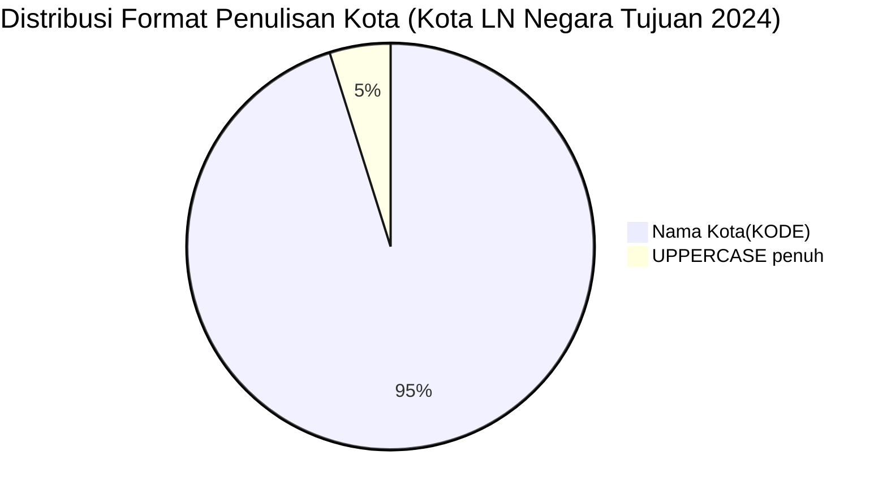

# Analisis Tabel: KOTA TERHUBUNG OLEH RUTE ANGKUTAN UDARA NIAGA BERJADWAL LUAR NEGERI DI NEGARA TUJUAN TAHUN 2024

## Informasi Umum
| Atribut | Nilai |
|---------|-------|
| **Sumber File** | `KOTA TERHUBUNG OLEH RUTE ANGKUTAN UDARA NIAGA BERJADWAL LUAR NEGERI DI NEGARA TUJUAN TAHUN 2024.csv` |
| **Tahun** | 2024 |
| **Kategori** | Kota Negara Tujuan — Rute Niaga Berjadwal Luar Negeri |
| **Total Baris Data** | 62 |
| **Jumlah Kolom** | 2 |

---

## Struktur Tabel

| No | Nama Kolom | Tipe Data | Deskripsi |
|----|------------|-----------|-----------|
| 1 | `NO` | Integer | Nomor urut kota |
| 2 | `KOTA` | String | Nama kota di negara tujuan yang terhubung oleh rute angkutan udara niaga berjadwal luar negeri dari Indonesia, dilengkapi kode bandara dalam kurung |

---

## Sample Data (3 Baris Pertama)

| NO | KOTA |
|----|------|
| 1 | Abu Dhabi(AUH) |
| 2 | Adelaide(ADL) |
| 3 | Amsterdam(AMS) |

---

## Analisis Kualitas Data

### Ringkasan Umum
| Metrik | Nilai |
|--------|-------|
| Total Baris | 62 |
| Kolom dengan Missing Values | 0 |
| Kolom dengan Nilai Null/NaN | 0 |
| Kolom dengan Strip ("-") | 0 |

### Detail Per Kolom

| Kolom | Total Baris | Non-Empty | Empty | Null/NaN | Strip ("-") | Lainnya | Keterangan |
|-------|-------------|-----------|-------|----------|-------------|---------|------------|
| `NO` | 62 | 62 | 0 | 0 | 0 | 0 | Semua terisi (angka 1-62) |
| `KOTA` | 62 | 62 | 0 | 0 | 0 | 0 | Semua terisi, format umum: `Nama Kota(KODE)` — tanpa spasi sebelum kurung |

### Catatan Khusus Kolom `KOTA`

#### Format Penulisan Nama Kota:
| Format | Jumlah | Contoh |
|--------|--------|--------|
| `Nama Kota(KODE)` (tanpa spasi) | 59 | Abu Dhabi(AUH), Bangkok(BKK), Tokyo-Narita(NRT) |
| `KOTA(KODE)` (uppercase penuh) | 3 | DARWIN(DRW), KUCHING(KCH), SINGAPURA(SIN) |

#### Format Kode Bandara:
| Tipe | Jumlah | Keterangan |
|------|--------|------------|
| 3 huruf (IATA standar) | 62 | Semua kode bandara IATA |
| uppercase penuh | 62 | Semua menggunakan huruf kapital |

#### Anomali Format:
| No | Nilai | Anomali |
|----|-------|---------|
| 17 | `DARWIN(DRW)` | Nama kota seluruhnya uppercase (kembali muncul setelah diperbaiki di 2023) |
| 37 | `KUCHING(KCH)` | Nama kota seluruhnya uppercase |
| 57 | `SINGAPURA(SIN)` | Nama kota seluruhnya uppercase |

#### Perubahan Dibanding 2023 (Catatan Internal):
| Status 2023 | Status 2024 | Kota |
|-------------|-------------|------|
| Ada | Hilang | Chengdu (CTU), Hangzhou (HGH), Nanjing (NKG), Wuhan (WUH), Phuket (HKT) |
| Baru | Ada | Bangalore(BLR), Busan(PUS), Canberra(CBR), Langkawi(LGK), Phuket(HKT) |
| `Darwin(DRW)` (2023, Title Case) | Kembali UPPERCASE → `DARWIN(DRW)` | Anomali uppercase muncul kembali |
| `SINGAPURA(SIN)` | Baru uppercase | Sebelumnya "Singapura(SIN)" di 2020-2023 |
| `Oblast Moskva(SVO)` | Kembali muncul | Hilang di 2023, ada lagi di 2024 |
| **Format global** | **Tetap tanpa spasi** | Konsisten dengan 2022-2023 |
| **Judul file** | **Berubah** | "TERHUBUNGI OLEH RUTE" → "TERHUBUNG OLEH RUTE" |

---

## Diagram Distribusi Format Penulisan Kota

---

## Catatan Tambahan
- ✅ Data bersih tanpa nilai kosong/null/strip
- ✅ Semua entri memiliki kode bandara IATA (3 huruf)
- ⚠️ Jumlah kota berkurang dari 63 (2023) → 62 (2024)
- ⚠️ **Anomali uppercase muncul kembali**: `DARWIN(DRW)`, `KUCHING(KCH)`, `SINGAPURA(SIN)` — setelah sempat diperbaiki di 2023
- ⚠️ `Oblast Moskva(SVO)` kembali muncul (hilang di 2023)
- ⚠️ Kota baru: Bangalore, Busan, Canberra, Langkawi, Phuket
