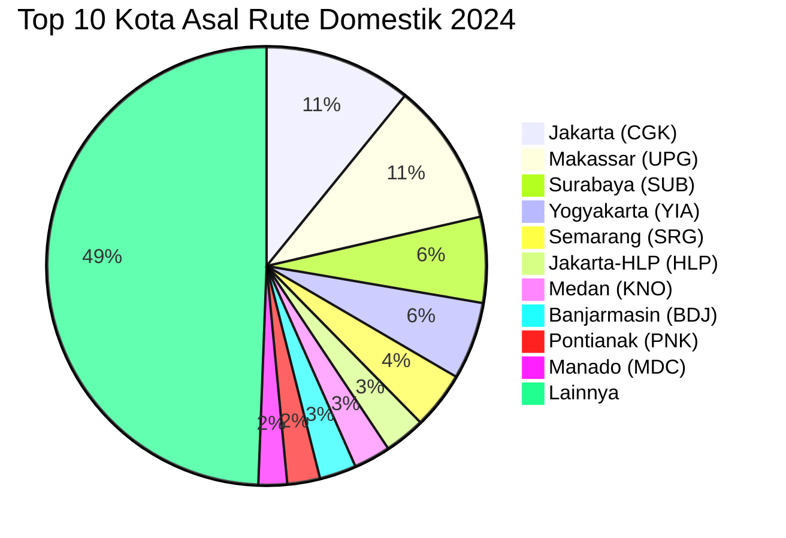

# Analisis Tabel: RUTE ANGKUTAN UDARA NIAGA BERJADWAL DALAM NEGERI TAHUN 2024

## Informasi Umum
| Atribut | Nilai |
|---------|-------|
| **Sumber File** | `RUTE ANGKUTAN UDARA NIAGA BERJADWAL DALAM NEGERI TAHUN 2024.csv` |
| **Tahun** | 2024 |
| **Kategori** | Rute Domestik — Niaga Berjadwal Dalam Negeri |
| **Total Baris Data** | 312 |
| **Jumlah Kolom** | 2 |

---

## Struktur Tabel

| No | Nama Kolom | Tipe Data | Deskripsi |
|----|------------|-----------|-----------|
| 1 | `NO` | Integer | Nomor urut rute |
| 2 | `RUTE (PP)` | String | Rute penerbangan domestik dalam format `KotaAsal(KODE) - KotaTujuan(KODE)`, digabung dalam satu kolom. PP = Pulang Pergi |

---

## Sample Data (3 Baris Pertama)

| NO | RUTE (PP) |
|----|-----------|
| 1 | Dhoho(DHX) - Balikpapan(BPN) |
| 2 | Medan(KNO) - Jambi(DJB) |
| 3 | Pangkalan Bun(PKN) - Balikpapan(BPN) |

---

## Analisis Kualitas Data

### Ringkasan Umum
| Metrik | Nilai |
|--------|-------|
| Total Baris | 312 |
| Kolom dengan Missing Values | 0 |
| Kolom dengan Nilai Null/NaN | 0 |
| Kolom dengan Strip ("-") | 0 |

### Detail Per Kolom

| Kolom | Total Baris | Non-Empty | Empty | Null/NaN | Strip ("-") | Lainnya | Keterangan |
|-------|-------------|-----------|-------|----------|-------------|---------|------------|
| `NO` | 312 | 312 | 0 | 0 | 0 | 0 | Semua terisi (angka 1-312) |
| `RUTE (PP)` | 312 | 312 | 0 | 0 | 0 | 0 | Semua terisi, format umum: `KotaAsal(KODE) - KotaTujuan(KODE)` |

### Catatan Khusus Kolom `RUTE (PP)`

#### Format Penulisan Rute:
| Format | Jumlah | Contoh |
|--------|--------|--------|
| `KotaAsal(KODE) - KotaTujuan(KODE)` | 304 | Dhoho(DHX) - Balikpapan(BPN), Jakarta(CGK) - Ambon(AMQ) |
| `"KotaAsal, Keterangan(KODE) - KotaTujuan(KODE)"` (quoted) | 4 | `"Praya, Lombok(LOP) - Banjarmasin(BDJ)"` |
| `"KotaAsal(KODE) - KotaTujuan, Keterangan(KODE)"` (quoted) | 4 | `"Sumbawa Besar(SWQ) - Praya, Lombok(LOP)"` |

#### Anomali pada `RUTE (PP)`:
| No | Nilai | Anomali |
|----|-------|---------|
| 58 | `KALIMANTAN TIMUR(RTU) - Tanjung Redeb(BEJ)` | Asal adalah nama region (bukan kota spesifik), uppercase penuh |
| 161 | `HMS - Banjarmasin(BDJ)` | Asal hanya kode bandara tanpa nama kota |
| 244 | `TRT - Balikpapan(BPN)` | Asal hanya kode bandara tanpa nama kota |
| 280 | `Makassar(UPG) - TRT` | Tujuan hanya kode bandara tanpa nama kota |
| 293 | `LKI - Medan(KNO)` | Asal hanya kode bandara tanpa nama kota |

#### Distribusi Kota Asal (Top 10) — Diekstrak dari Kolom Gabungan:
| Kota Asal | Jumlah Rute | Persentase |
|-----------|-------------|------------|
| Jakarta (CGK) | 36 | 11.5% |
| Makassar (UPG) | 35 | 11.2% |
| Surabaya (SUB) | 21 | 6.7% |
| Yogyakarta (YIA) | 19 | 6.1% |
| Semarang (SRG) | 14 | 4.5% |
| Jakarta-HLP (HLP) | 10 | 3.2% |
| Medan (KNO) | 9 | 2.9% |
| Banjarmasin (BDJ) | 9 | 2.9% |
| Pontianak (PNK) | 8 | 2.6% |
| Manado (MDC) | 7 | 2.2% |

---

## Diagram Distribusi Top 10 Kota Asal

---

## Catatan Tambahan
- ✅ Mayoritas data bersih tanpa nilai kosong/null/strip
- ⚠️ Terdapat **5 anomali** kode tanpa nama kota:
  - Baris 161: `HMS - Banjarmasin(BDJ)` — asal hanya kode
  - Baris 244: `TRT - Balikpapan(BPN)` — asal hanya kode
  - Baris 280: `Makassar(UPG) - TRT` — tujuan hanya kode
  - Baris 293: `LKI - Medan(KNO)` — asal hanya kode
  - Baris 58: `KALIMANTAN TIMUR(RTU)` — nama region, bukan kota
- ⚠️ Anomali TRT/KXB/HMS/LKI tanpa nama kota **masih ada** — konsisten dengan masalah data tahun sebelumnya
- ⚠️ Nama kolom `RUTE (PP)` tetap konsisten dengan 2023
- ⚠️ Kota baru: `Dhoho(DHX)` muncul di beberapa rute
