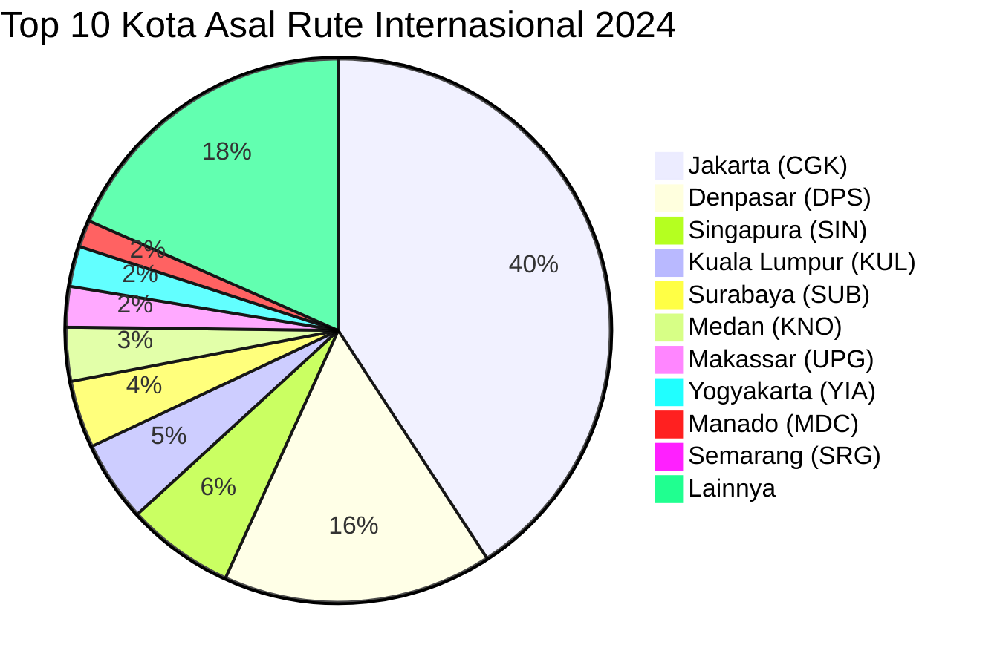
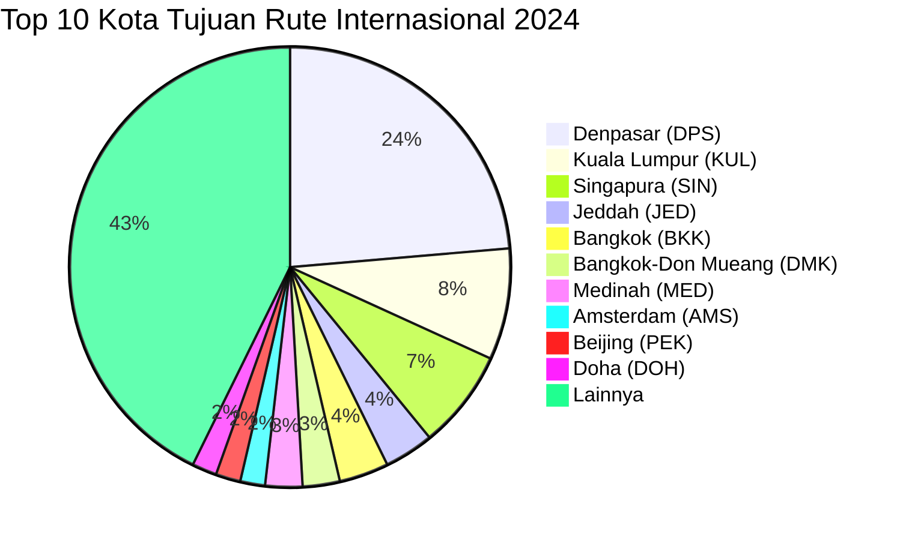

# Analisis Tabel: RUTE ANGKUTAN UDARA NIAGA BERJADWAL LUAR NEGERI TAHUN 2024

## Informasi Umum
| Atribut | Nilai |
|---------|-------|
| **Sumber File** | `RUTE ANGKUTAN UDARA NIAGA BERJADWAL LUAR NEGERI TAHUN 2024.csv` |
| **Tahun** | 2024 |
| **Kategori** | Rute Internasional — Niaga Berjadwal Luar Negeri |
| **Total Baris Data** | 128 |
| **Jumlah Kolom** | 2 |

---

## Struktur Tabel

| No | Nama Kolom | Tipe Data | Deskripsi |
|----|------------|-----------|-----------|
| 1 | `NO` | Integer | Nomor urut rute |
| 2 | `RUTE (PP)` | String | Rute penerbangan internasional dalam format `KotaAsal(KODE) - KotaTujuan(KODE)`, digabung dalam satu kolom. PP = Pulang Pergi |

---

## Sample Data (3 Baris Pertama)

| NO | RUTE (PP) |
|----|-----------|
| 1 | Port Moresby(POM) - Denpasar(DPS) |
| 2 | Denpasar(DPS) - Abu Dhabi(AUH) |
| 3 | Phuket(HKT) - Denpasar(DPS) |

---

## Analisis Kualitas Data

### Ringkasan Umum
| Metrik | Nilai |
|--------|-------|
| Total Baris | 128 |
| Kolom dengan Missing Values | 0 |
| Kolom dengan Nilai Null/NaN | 0 |
| Kolom dengan Strip ("-") | 0 |

### Detail Per Kolom

| Kolom | Total Baris | Non-Empty | Empty | Null/NaN | Strip ("-") | Lainnya | Keterangan |
|-------|-------------|-----------|-------|----------|-------------|---------|------------|
| `NO` | 128 | 128 | 0 | 0 | 0 | 0 | Semua terisi (angka 1-128) |
| `RUTE (PP)` | 128 | 128 | 0 | 0 | 0 | 0 | Semua terisi, format umum: `KotaAsal(KODE) - KotaTujuan(KODE)` |

### Catatan Khusus Kolom `RUTE (PP)`

#### Format Penulisan Rute:
| Format | Jumlah | Contoh |
|--------|--------|--------|
| `KotaAsal(KODE) - KotaTujuan(KODE)` | 125 | Port Moresby(POM) - Denpasar(DPS), Jakarta(CGK) - Jeddah(JED) |
| `"KotaAsal, Keterangan(KODE) - KotaTujuan(KODE)"` (quoted) | 1 | `"SINGAPURA(SIN) - Praya, Lombok(LOP)"` |
| `"KotaAsal(KODE) - KotaTujuan, Keterangan(KODE)"` (quoted) | 2 | `"Praya, Lombok(LOP) - Kuala Lumpur(KUL)"` |

#### Anomali pada `RUTE (PP)`:
| No | Nilai | Anomali |
|----|-------|---------|
| 77 | `Jakarta(CGK) - TFU` | Tujuan hanya kode bandara tanpa nama kota (TFU = Chengdu Tianfu) — sama seperti 2023 |

#### Distribusi Kota Asal (Top 10) — Diekstrak dari Kolom Gabungan:
| Kota Asal | Jumlah Rute | Persentase |
|-----------|-------------|------------|
| Jakarta (CGK) | 51 | 39.8% |
| Denpasar (DPS) | 20 | 15.6% |
| Singapura (SIN) | 8 | 6.3% |
| Kuala Lumpur (KUL) | 6 | 4.7% |
| Surabaya (SUB) | 5 | 3.9% |
| Medan (KNO) | 4 | 3.1% |
| Makassar (UPG) | 3 | 2.3% |
| Yogyakarta (YIA) | 3 | 2.3% |
| Manado (MDC) | 2 | 1.6% |
| Semarang (SRG) | 1 | 0.8% |

#### Distribusi Kota Tujuan (Top 10) — Diekstrak dari Kolom Gabungan:
| Kota Tujuan | Jumlah Rute | Persentase |
|-------------|-------------|------------|
| Denpasar (DPS) | 26 | 20.3% |
| Kuala Lumpur (KUL) | 9 | 7.0% |
| Singapura (SIN) | 8 | 6.3% |
| Jeddah (JED) | 4 | 3.1% |
| Bangkok (BKK) | 4 | 3.1% |
| Bangkok-Don Mueang (DMK) | 3 | 2.3% |
| Medinah (MED) | 3 | 2.3% |
| Amsterdam (AMS) | 2 | 1.6% |
| Beijing (PEK) | 2 | 1.6% |
| Doha (DOH) | 2 | 1.6% |

---

## Diagram Distribusi Top 10 Kota Asal

---

## Diagram Distribusi Top 10 Kota Tujuan

---

## Catatan Tambahan
- ✅ Mayoritas data bersih tanpa nilai kosong/null/strip
- ⚠️ Terdapat **1 anomali** kode tanpa nama kota:
  - Baris 77: `Jakarta(CGK) - TFU` — hanya kode bandara Chengdu Tianfu (sama seperti 2023)
- ⚠️ Nama kolom `RUTE (PP)` tetap konsisten dengan 2023
- ⚠️ Terdapat beberapa entri uppercase: `SINGAPURA(SIN)`, `BANDAR SRI BEGAWAN(BWN)`, `KUCHING(KCH)`, `DARWIN(DRW)`
- ⚠️ Jakarta (CGK) mendominasi sebagai kota asal dengan 39.8% dari total rute internasional
- ⚠️ Kota baru di rute: Phuket(HKT), Busan(PUS), Canberra(CBR), Langkawi(LGK), Bangalore(BLR)
