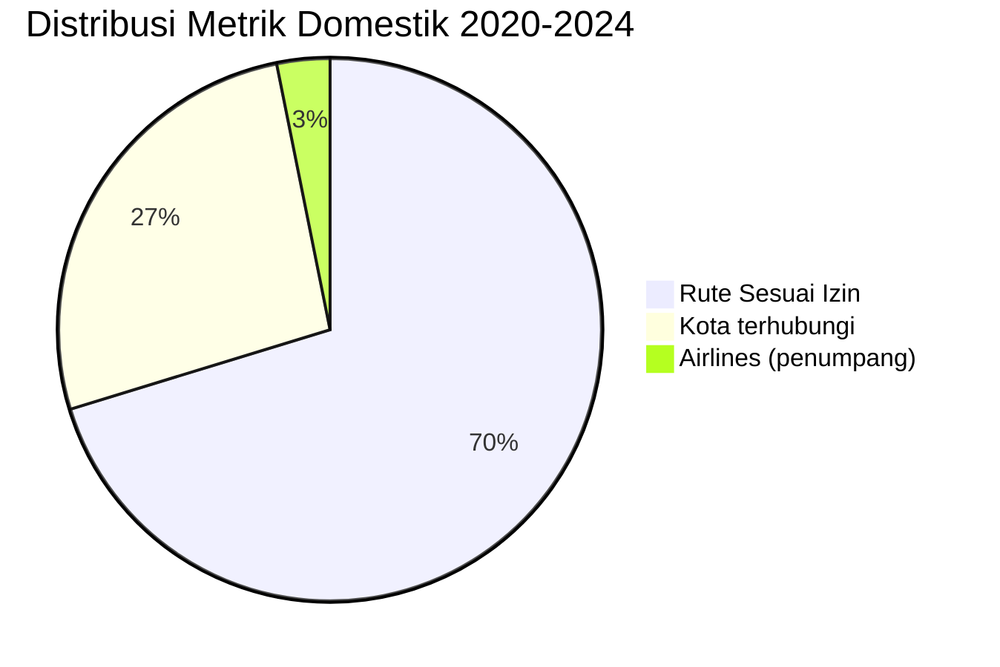

# Analisis Tabel: TOTAL JUMLAH RUTE DOMESTIK ANGKUTAN UDARA NIAGA BERJADWAL TAHUN 2020-2024

## Informasi Umum
| Atribut | Nilai |
|---------|-------|
| **Sumber File** | `TOTAL JUMLAH RUTE DOMESTIK ANGKUTAN UDARA NIAGA BERJADWAL TAHUN 2020-2024.csv` |
| **Tahun** | 2020-2024 (Agregat 5 Tahun) |
| **Kategori** | Agregat — Rute Domestik |
| **Total Baris Data** | 5 |
| **Jumlah Kolom** | 6 |

---

## Struktur Tabel

| No | Nama Kolom | Tipe Data | Deskripsi |
|----|------------|-----------|-----------|
| 1 | `DOMESTIK` | String | Kategori metrik (Rute Sesuai Izin, Kapasitas Sesuai Izin, Penumpang, Kota terhubungi, Airlines (penumpang)) |
| 2 | `2020` | Integer/Numeric | Nilai metrik untuk tahun 2020 |
| 3 | `2021` | Integer/Numeric | Nilai metrik untuk tahun 2021 |
| 4 | `2022` | Integer/Numeric | Nilai metrik untuk tahun 2022 |
| 5 | `2023` | Integer/Numeric | Nilai metrik untuk tahun 2023 |
| 6 | `2024` | Integer/Numeric | Nilai metrik untuk tahun 2024 |

---

## Sample Data (3 Baris Pertama)

| DOMESTIK | 2020 | 2021 | 2022 | 2023 | 2024 |
|----------|------|------|------|------|------|
| Rute Sesuai Izin | 410 | 378 | 374 | 303 | 312 |
| Kapasitas Sesuai Izin | 148.601.851 | 145.524.821 | 126.352.499 | 104.981.570 | 104.812.656 |
| Penumpang | 35.393.966 | 33.364.980 | 56.415.234 | 65.950.181 | 65.795.924 |

---

## Analisis Kualitas Data

### Ringkasan Umum
| Metrik | Nilai |
|--------|-------|
| Total Baris | 5 |
| Kolom dengan Missing Values | 0 |
| Kolom dengan Nilai Null/NaN | 0 |
| Kolom dengan Strip ("-") | 0 |

### Detail Per Kolom

| Kolom | Total Baris | Non-Empty | Empty | Null/NaN | Strip ("-") | Lainnya | Keterangan |
|-------|-------------|-----------|-------|----------|-------------|---------|------------|
| `DOMESTIK` | 5 | 5 | 0 | 0 | 0 | 0 | Semua terisi, 5 kategori metrik unik |
| `2020` | 5 | 5 | 0 | 0 | 0 | 0 | Semua terisi, numeric dengan separator titik |
| `2021` | 5 | 5 | 0 | 0 | 0 | 0 | Semua terisi, numeric dengan separator titik |
| `2022` | 5 | 5 | 0 | 0 | 0 | 0 | Semua terisi, numeric dengan separator titik |
| `2023` | 5 | 5 | 0 | 0 | 0 | 0 | Semua terisi, numeric dengan separator titik |
| `2024` | 5 | 5 | 0 | 0 | 0 | 0 | Semua terisi, numeric dengan separator titik |

### Distribusi Nilai Kolom `DOMESTIK`:
| Nilai | 2020 | 2021 | 2022 | 2023 | 2024 | Tren |
|-------|------|------|------|------|------|------|
| Rute Sesuai Izin | 410 | 378 | 374 | 303 | 312 | ↘️ Menurun |
| Kapasitas Sesuai Izin | 148.601.851 | 145.524.821 | 126.352.499 | 104.981.570 | 104.812.656 | ↘️ Menurun |
| Penumpang | 35.393.966 | 33.364.980 | 56.415.234 | 65.950.181 | 65.795.924 | ↗️ Meningkat (pulih pasca pandemi) |
| Kota terhubungi | 138 | 135 | 133 | 128 | 118 | ↘️ Menurun |
| Airlines (penumpang) | 12 | 11 | 13 | 13 | 14 | ↗️ Meningkat |

---

## Diagram Tren Agregat

---

## Catatan Tambahan
- ✅ Data bersih tanpa nilai kosong/null/strip
- ✅ File agregat ini memuat rekapitulasi 5 tahun dalam 1 tabel
- ⚠️ Format angka menggunakan separator titik (format Indonesia/Eropa)
- ⚠️ **Tren menarik**: Jumlah rute menurun, tapi jumlah penumpang meningkat (efisiensi rute)
- ⚠️ Jumlah airlines (penumpang) cenderung meningkat: 12 → 14
