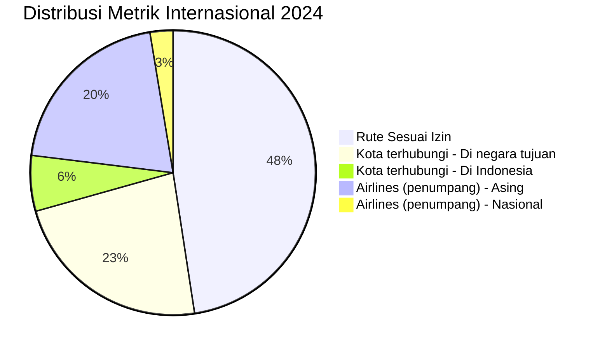

# Analisis Tabel: TOTAL JUMLAH RUTE INTERNATIONAL TAHUN 2020-2024

## Informasi Umum
| Atribut | Nilai |
|---------|-------|
| **Sumber File** | `TOTAL JUMLAH RUTE INTERNATIONAL TAHUN 2020-2024.csv` |
| **Tahun** | 2018-2024 (Agregat 7 Tahun) |
| **Kategori** | Agregat — Rute Internasional |
| **Total Baris Data** | 7 |
| **Jumlah Kolom** | 8 |

---

## Struktur Tabel

| No | Nama Kolom | Tipe Data | Deskripsi |
|----|------------|-----------|-----------|
| 1 | `INTERNATIONAL` | String | Kategori metrik (Rute Sesuai Izin, Kapasitas Sesuai Izin, Penumpang, Kota terhubungi - Di Indonesia, Kota terhubungi - Di negara tujuan, Airlines (penumpang) - Nasional, Airlines (penumpang) - Asing) |
| 2 | `2018` | Integer/Numeric | Nilai metrik untuk tahun 2018 |
| 3 | `2019` | Integer/Numeric | Nilai metrik untuk tahun 2019 |
| 4 | `2020` | Integer/Numeric | Nilai metrik untuk tahun 2020 |
| 5 | `2021` | Integer/Numeric | Nilai metrik untuk tahun 2021 |
| 6 | `2022` | Integer/Numeric | Nilai metrik untuk tahun 2022 |
| 7 | `2023` | Integer/Numeric | Nilai metrik untuk tahun 2023 |
| 8 | `2024` | Integer/Numeric | Nilai metrik untuk tahun 2024 |

---

## Sample Data (3 Baris Pertama)

| INTERNATIONAL | 2018 | 2019 | 2020 | 2021 | 2022 | 2023 | 2024 |
|---------------|------|------|------|------|------|------|------|
| Rute Sesuai Izin | 153 | 170 | 157 | 145 | 133 | 125 | 128 |
| Kapasitas Sesuai Izin | 56.374.344 | 57.407.948 | 45.037.060 | 51.321.478 | 45.119.412 | 50.670.828 | 54.315.664 |
| Penumpang | 36.337.912 | 37.278.343 | 7.187.439 | 1.397.380 | 12.564.511 | 29.189.842 | 36.073.733 |

---

## Analisis Kualitas Data

### Ringkasan Umum
| Metrik | Nilai |
|--------|-------|
| Total Baris | 7 |
| Kolom dengan Missing Values | 0 |
| Kolom dengan Nilai Null/NaN | 0 |
| Kolom dengan Strip ("-") | 0 |

### Detail Per Kolom

| Kolom | Total Baris | Non-Empty | Empty | Null/NaN | Strip ("-") | Lainnya | Keterangan |
|-------|-------------|-----------|-------|----------|-------------|---------|------------|
| `INTERNATIONAL` | 7 | 7 | 0 | 0 | 0 | 0 | Semua terisi, 7 kategori metrik unik |
| `2018` | 7 | 7 | 0 | 0 | 0 | 0 | Semua terisi, numeric dengan separator titik |
| `2019` | 7 | 7 | 0 | 0 | 0 | 0 | Semua terisi, numeric dengan separator titik |
| `2020` | 7 | 7 | 0 | 0 | 0 | 0 | Semua terisi, numeric dengan separator titik |
| `2021` | 7 | 7 | 0 | 0 | 0 | 0 | Semua terisi, numeric dengan separator titik |
| `2022` | 7 | 7 | 0 | 0 | 0 | 0 | Semua terisi, numeric dengan separator titik |
| `2023` | 7 | 7 | 0 | 0 | 0 | 0 | Semua terisi, numeric dengan separator titik |
| `2024` | 7 | 7 | 0 | 0 | 0 | 0 | Semua terisi, numeric dengan separator titik |

### Distribusi Nilai Kolom `INTERNATIONAL`:
| Nilai | 2018 | 2019 | 2020 | 2021 | 2022 | 2023 | 2024 | Tren |
|-------|------|------|------|------|------|------|------|------|
| Rute Sesuai Izin | 153 | 170 | 157 | 145 | 133 | 125 | 128 | ↘️ Menurun |
| Kapasitas Sesuai Izin | 56.374.344 | 57.407.948 | 45.037.060 | 51.321.478 | 45.119.412 | 50.670.828 | 54.315.664 | ↘️→↗️ V (pulih) |
| Penumpang | 36.337.912 | 37.278.343 | 7.187.439 | 1.397.380 | 12.564.511 | 29.189.842 | 36.073.733 | ↘️→↗️ V (pulih ke level 2018) |
| Kota terhubungi - Di Indonesia | 22 | 23 | 26 | 22 | 21 | 16 | 17 | ↘️ Menurun |
| Kota terhubungi - Di negara tujuan | 68 | 66 | 66 | 62 | 56 | 63 | 62 | ↘️→↗️ Stabil |
| Airlines (penumpang) - Nasional | 10 | 9 | 8 | 7 | 6 | 8 | 7 | ↘️→↗️ Stabil |
| Airlines (penumpang) - Asing | 50 | 53 | 48 | 47 | 56 | 55 | 55 | ↗️ Meningkat |

---

## Diagram Tren Agregat

---

## Catatan Tambahan
- ✅ Data bersih tanpa nilai kosong/null/strip
- ✅ File agregat ini memuat rekapitulasi 7 tahun (2018-2024) dalam 1 tabel
- ⚠️ Format angka menggunakan separator titik (format Indonesia/Eropa)
- ⚠️ **Tren menarik**: Jumlah penumpang turun drastis di 2021 (pandemi), lalu pulih ke level 2018 di 2024
- ⚠️ Airlines asing meningkat: 50 (2018) → 55 (2024), airlines nasional menurun: 10 → 7
- ⚠️ Nama kolom menggunakan ejaan "INTERNATIONAL" (Inggris) bukan "INTERNASIONAL" (Indonesia)
