## **KORELASI NILAI TUKAR RUPIAH TERHADAP PERMINTAAN ANGKUTAN UDARA INDONESIA 2020–2024: IMPLEMENTASI DATA WAREHOUSE BULANAN DENGAN SKEMA STAR**

Disusun untuk melengkapi Tugas Presentasi Mata Kuliah Datawarehouse

Dosen : Raditya Rimbawan Oprasto, S.Kom., M.Kom

Oleh :

NIM 1 — NAMA 1
NIM 2 — NAMA 2
NIM 3 — NAMA 3
NIM 4 — NAMA 4
NIM 5 — NAMA 5

## **FAKULTAS SAINS DAN TEKNOLOGI PROGRAM STUDI TEKNIK INFORMATIKA BANTEN 20252**

---

## A. Identifikasi Masalah

Periode 2020–2024 merupakan rentang waktu yang ekstrem secara struktural bagi sektor transportasi udara Indonesia. Tiga guncangan besar terjadi secara bersamaan:

**Pertama, depresiasi nilai tukar Rupiah.** Kurs tengah Rupiah terhadap Dolar AS melemah sekitar 19% dari rata-rata Rp 13.732/USD pada Januari 2020 menjadi Rp 16.329/USD pada Desember 2024. Pelemahan ini berlangsung kontinyu meski dengan volatilitas bulan-per-bulan yang tinggi (spread harian tertinggi mencapai 2.440 IDR pada Maret 2020, bertepatan kepanikan pasar awal pandemi).

**Kedua, pandemi COVID-19 sebagai structural break.** Pemberlakuan PSBB (April 2020), PPKM bertingkat (2021), hingga PPKM Darurat (Juli–September 2021) menyebabkan kontraksi historis pada permintaan penerbangan. Total penumpang nasional anjlok dari 9,12 juta pada Januari 2020 menjadi hanya 96.452 orang pada Mei 2020 — penurunan 98,9% dalam empat bulan.

**Ketiga, guncangan harga minyak dunia.** Brent crude oil anjlok ke USD 26,35/bbl pada April 2020 (kolaps demand global), lalu melonjak ke USD 115,60/bbl pada Juni 2022 pasca-invasi Rusia ke Ukraina. Karena avtur (Jet A-1) di-denominasi dalam USD dan menyumbang sekitar 40% biaya operasi maskapai, kenaikan harga minyak yang bersamaan dengan pelemahan rupiah memicu *double-shock* biaya operasi maskapai dalam IDR.

Sebagai respons, Bank Indonesia menaikkan suku bunga acuan (BI Rate) dari 3,5% pada masa pandemi menjadi 6,25% pada akhir 2024 untuk *defend* rupiah. Sementara itu, INACA (Indonesia National Air Carriers Association) melaporkan bahwa tarif batas atas yang ditetapkan pemerintah pada 2019 — saat asumsi harga avtur Rp 9.000/liter dan kurs Rp 14.200/USD — sudah tidak relevan dengan kondisi 2024.

**Permasalahan yang muncul:**

1. Data operasional penerbangan (jumlah penumpang, rute, bandara) tersebar di puluhan file CSV tahunan dari Direktorat Jenderal Perhubungan Udara (DJPU), sementara data makroekonomi (kurs, suku bunga, inflasi, harga minyak) berada di sumber terpisah (Bank Indonesia, BPS, Investing.com). Tanpa data warehouse terintegrasi, analisis korelasi makro–demand tidak dapat dilakukan secara efisien.

2. Pertanyaan bisnis kritis seperti *"apakah pelemahan kurs menekan permintaan penumpang?"*, *"channel transmisi mana yang dominan?"*, dan *"rute mana yang paling sensitif terhadap kurs?"* membutuhkan struktur data yang mendukung *slicing* per dimensi waktu, rute, bandara, dan kategori (domestik/internasional).

3. Pelaporan ad-hoc dari masing-masing sumber tidak memungkinkan kontrol *confounder* seperti fase COVID dan pola musiman (Lebaran, Natal, peak season) — yang secara metodologis wajib dikontrol agar korelasi yang ditemukan bukan *spurious*.

Tugas ini mengangkat permasalahan di atas dengan membangun **data warehouse bulanan terintegrasi** menggunakan skema star, kemudian melakukan analisis korelasi dan heterogenitas berbasis Tableau yang menjawab pertanyaan-pertanyaan tersebut secara sistematis.

---

## B. Tujuan Masalah

Sesuai identifikasi masalah pada Bagian A, tugas ini bertujuan untuk:

1. **Membangun data warehouse bulanan** dengan skema *star* yang mengintegrasikan data operasional penerbangan (DJPU) dan data makroekonomi (BI, BPS, Investing.com) periode Januari 2020 – Desember 2024, dengan *grain* bulanan-per-rute.

2. **Menguji secara statistik korelasi nilai tukar Rupiah (IDR/USD) terhadap jumlah penumpang angkutan udara Indonesia** secara agregat, segmen internasional, dan segmen domestik, menggunakan regresi linear OLS pada warehouse yang dibangun.

3. **Mengidentifikasi channel transmisi dominan** dari kurs ke permintaan penumpang dengan menguji tiga channel paralel: (a) channel cost-push (kurs → biaya bahan bakar → tarif tiket), (b) channel moneter (kurs → BI Rate), dan (c) channel daya beli (kurs → inflasi umum).

4. **Memverifikasi robustness korelasi** dengan kontrol *confounder* fase COVID-19 (pre-pandemic, lockdown, transisi, recovery) dan pola musiman (Lebaran, Natal, hari libur, peak season).

5. **Memetakan heterogenitas geografis** permintaan terhadap kurs — antar rute, antar negara destinasi internasional, dan antar provinsi origin domestik — sebagai dasar rekomendasi kebijakan yang dibedakan per koridor.

Output dari tugas ini berupa:
- Data warehouse berbasis CSV (5 tabel: 1 dimensi waktu, 1 dimensi rute, 1 dimensi bandara, 1 fact makro, 1 fact penumpang per rute) dengan total ~17.978 baris.
- Workbook Tableau berisi 24 *worksheet* analisis yang terorganisir dalam 5 bab analitis.
- Temuan empiris yang menjawab kelima pertanyaan riset di atas.

---

## C. Design Schema

Skema data warehouse yang dipilih adalah **Star Schema**.

**Alasan pemilihan Star Schema:**
1. **Performa query analitis lebih cepat** dibanding Snowflake karena dimensi tidak ter-normalisasi lebih jauh — query Tableau hanya melakukan satu level *join* dari fact ke dimensi.
2. **Lebih mudah dipahami** oleh user analitis (anggota kelompok dan reviewer) karena strukturnya datar dan intuitif.
3. **Sesuai dengan karakteristik data**: dimensi yang dipakai (waktu, bandara, rute) tidak punya hierarki dalam yang mengharuskan normalisasi.
4. **Cocok untuk Tableau** sebagai *front-end* — Tableau bekerja paling optimal pada skema star atau snowflake satu tingkat.

**Diagram Skema:**

```
                          ┌────────────────────────┐
                          │  dim_waktu_bulanan     │
                          │  (60 baris, 11 kolom)  │
                          │  PK: waktu_id          │
                          └──────────┬─────────────┘
                                     │ 1
                                     │ N
                                     ▼
   ┌──────────────────┐       ┌──────────────────────┐       ┌──────────────────────┐
   │  dim_bandara     │       │ fact_penumpang_rute  │       │ fact_makro_bulanan   │
   │  (235 baris)     │       │  (17.118 baris)      │◄──────│  (60 baris)          │
   │  PK: bandara_id  │       │  FK: waktu_id, rute  │       │  FK: waktu_id        │
   └────────┬─────────┘       └──────────┬───────────┘       └──────────────────────┘
            │ 1                          │ N
            │ N                          │
            │              ┌─────────────▼───────────┐
            └──── 2× ──────┤  dim_rute               │
                           │  (553 baris)            │
                           │  PK: rute_id            │
                           │  FK: bandara_1_id,      │
                           │      bandara_2_id       │
                           └─────────────────────────┘
```

**Penjelasan join**:
- `dim_bandara` di-join **dua kali** ke `dim_rute` (sebagai *origin* via `bandara_1_id` dan sebagai *destination* via `bandara_2_id`). Pola *self-join* klasik untuk *Origin-Destination pair*.
- `fact_makro_bulanan` hanya terhubung ke `dim_waktu_bulanan` karena variabel makro bersifat nasional/bulanan (bukan per-rute).
- `fact_penumpang_rute` adalah fact utama dengan *grain* `(waktu_id × rute_id)`.

### a) Structure Table Design Schema

Skema data warehouse terdiri dari **5 tabel** (1 dimensi waktu, 1 dimensi bandara, 1 dimensi rute, 1 fact makro, 1 fact penumpang per rute). Berikut struktur masing-masing tabel:

**Nama Schema : Dim Waktu Bulanan**
Struture Table :

|No|Nama Parameter|Character Parameter|Length Parameter|
|---|---|---|---|
|1|waktu_id (PK)|Int|6|
|2|tahun|Int|4|
|3|bulan|Int|2|
|4|nama_bulan|Varchar|15|
|5|kuartal|Int|1|
|6|semester|Int|1|
|7|covid_phase|Varchar|20|
|8|has_lebaran|Int|1|
|9|has_natal|Int|1|
|10|is_peak_season|Int|1|
|11|jumlah_hari_libur|Int|2|

Catatan: `waktu_id` mengikuti format `YYYYMM` (contoh: 202001 untuk Januari 2020). Field `covid_phase` memiliki 4 nilai: `pre_pandemic`, `lockdown`, `transisi`, `recovery`. Field flag (`has_lebaran`, `has_natal`, `is_peak_season`) bernilai 0 atau 1. Total 60 baris (5 tahun × 12 bulan, tanpa gap).

**Nama Schema : Dim Bandara**
Struture Table :

|No|Nama Parameter|Character Parameter|Length Parameter|
|---|---|---|---|
|1|bandara_id (PK)|Int|5|
|2|nama_bandara|Varchar|100|
|3|iata|Varchar|3|
|4|kota|Varchar|50|
|5|provinsi|Varchar|50|
|6|negara|Varchar|50|

Catatan: Total 235 baris (210 bandara domestik + 25 internasional). Field `iata` adalah kode 3-huruf IATA yang unik. Sumber data dari file CSV `BAB III — Rute & Bandara` DJPU, dilengkapi dengan library Python `airportsdata` untuk lookup `nama_bandara`, `kota`, `provinsi`, dan `negara` berdasarkan IATA.

**Nama Schema : Dim Rute**
Struture Table :

|No|Nama Parameter|Character Parameter|Length Parameter|
|---|---|---|---|
|1|rute_id (PK)|Int|5|
|2|kode_rute|Varchar|7|
|3|bandara_1_id (FK)|Int|5|
|4|bandara_2_id (FK)|Int|5|
|5|kategori|Varchar|15|

Catatan: Total 553 baris (397 DOMESTIK + 156 INTERNASIONAL). Field `kode_rute` menggunakan format `IATA1-IATA2` yang **disortir alfabetis** sehingga CGK-DPS dan DPS-CGK digabung menjadi satu *entry*. `bandara_1_id` menunjuk ke IATA yang lebih awal alfabetis, `bandara_2_id` menunjuk ke IATA yang lebih akhir alfabetis. Field `kategori` bernilai `DOMESTIK` atau `INTERNASIONAL`.

**Nama Schema : Fact Makro Bulanan**
Struture Table :

|No|Nama Parameter|Character Parameter|Length Parameter|
|---|---|---|---|
|1|waktu_id (PK, FK)|Int|6|
|2|avg_kurs_jual|Float|10|
|3|avg_kurs_beli|Float|10|
|4|avg_kurs_tengah|Float|10|
|5|min_kurs_tengah|Float|10|
|6|max_kurs_tengah|Float|10|
|7|jumlah_hari_trading|Int|2|
|8|tarif_tiket_ihk|Int|5|
|9|inflasi_yoy|Float|5|
|10|inflasi_mtm|Float|5|
|11|bi_rate|Float|5|
|12|brent_usd_bbl|Float|7|
|13|brent_high|Float|7|
|14|brent_low|Float|7|
|15|brent_idr_per_bbl|Float|10|

Catatan: Total 60 baris (1 baris per bulan). Field `avg_kurs_tengah` (range 13.732 – 16.329) adalah variabel kurs utama yang dipakai untuk analisis. Field `tarif_tiket_ihk` adalah **indeks** Harga Konsumen BPS (base 100), **bukan** harga tiket dalam Rupiah. Field `brent_idr_per_bbl` adalah kolom *derived* hasil perkalian `brent_usd_bbl × avg_kurs_tengah` yang dipakai sebagai *proxy upstream* biaya avtur untuk channel cost-push.

**Nama Schema : Fact Penumpang Rute**
Struture Table :

|No|Nama Parameter|Character Parameter|Length Parameter|
|---|---|---|---|
|1|waktu_id (FK)|Int|6|
|2|rute_id (FK)|Int|5|
|3|jumlah_penumpang|Int|7|

Catatan: Total 17.118 baris ≈ 60 bulan × 286 rute aktif rata-rata. *Primary key* gabungan adalah `(waktu_id, rute_id)`. Range `jumlah_penumpang` adalah 1 – 501.516 orang per rute per bulan. Karena `kode_rute` di `dim_rute` di-sortir alfabetis, *flow* pulang-pergi (PP) digabung di satu *entry*.

**Total Ukuran Warehouse**: 17.978 baris (60 + 235 + 553 + 60 + 17.118).

**Sumber Data Mentah** yang di-ETL ke warehouse di atas:

| Sumber | Data yang Disumbangkan | Periode |
|---|---|---|
| DJPU (Direktorat Jenderal Perhubungan Udara) | Penumpang per rute bulanan (BAB VI); daftar rute & bandara (BAB III) | 2020–2024 |
| Bank Indonesia | Kurs Transaksi Rupiah (harian, di-agregat bulanan); Inflasi YoY | 2020–2024 |
| BPS (Badan Pusat Statistik) | BI Rate bulanan; Inflasi MtM; Survei Harga Konsumen (indeks tarif tiket) | 2020–2024 |
| Investing.com | Brent Crude Oil futures (close, high, low bulanan) | 2020–2024 |

---

## D. Analisa Masalah & Pembahasan

### a) Analisa & Design Detail Data

Bagian ini menyajikan **24 worksheet Tableau** yang dikelompokkan dalam 5 bab analitis. Tiap worksheet menjawab pertanyaan analisis spesifik dan disajikan dengan *screenshot* visualisasi dari Tableau Public dan interpretasinya.

> **Catatan implementasi**: seluruh angka di bab ini telah di-*cross-check* dengan benchmark Python (pandas + scipy) yang tersedia di `output/BULANAN/analisis/bab_*/ws*/metrics.txt`. Verifikasi angka match dilakukan pada Fase 3 proyek untuk memastikan tidak ada error agregasi atau *join* di Tableau.

---

#### Bab 1 — Konteks Makroekonomi 2020–2024

Bab ini memberikan konteks visual atas variabel-variabel makro yang akan dianalisis pada bab-bab selanjutnya. **Tidak ada uji statistik formal di bab ini** — tujuan utamanya adalah memberi *baseline pemahaman* terhadap dinamika 60 bulan periode analisis.

##### WS1.1 — Multi-panel Time Series (Kurs, Brent, BI Rate, Penumpang)

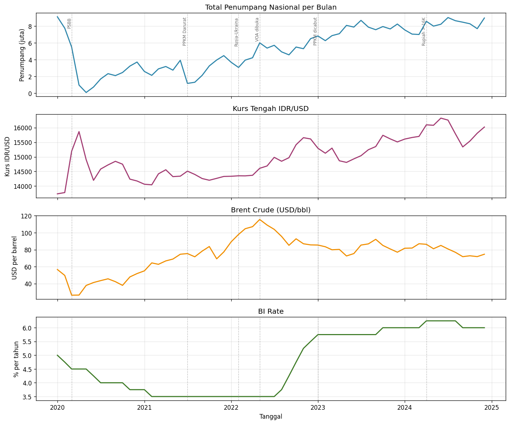

Worksheet ini menampilkan empat panel time series berdampingan untuk menunjukkan dinamika simultan empat variabel inti sepanjang 60 bulan. Pengamatan kunci:

- **Kurs Tengah**: tren depresiasi monotonik dari Rp 13.732 (Jan 2020) ke Rp 16.329 (Des 2024), dengan volatilitas tinggi di Maret 2020 (puncak panik COVID).
- **Brent Crude (USD/bbl)**: pola V-shape ekstrem — kolaps ke USD 26 (Apr 2020), lalu lonjakan ke USD 115 (Jun 2022) pasca invasi Rusia–Ukraina, lalu konsolidasi di USD 70–90.
- **BI Rate**: pola siklik klasik — *easing* ke 3,5% selama lockdown sebagai stimulus, *tightening* agresif ke 6,25% pada 2023–2024 untuk *defend* rupiah.
- **Total Penumpang**: pola tiga rezim ekstrem — pre-pandemic (~9 juta/bulan), kolaps lockdown (kurang dari 1 juta), recovery bertahap mencapai ~8–9 juta pada 2024.

Visualisasi ini menjadi *baseline* yang membenarkan kebutuhan kontrol fase COVID pada bab-bab analitis selanjutnya.

##### WS1.2 — Kurs Band (Min, Avg, Max per Bulan)

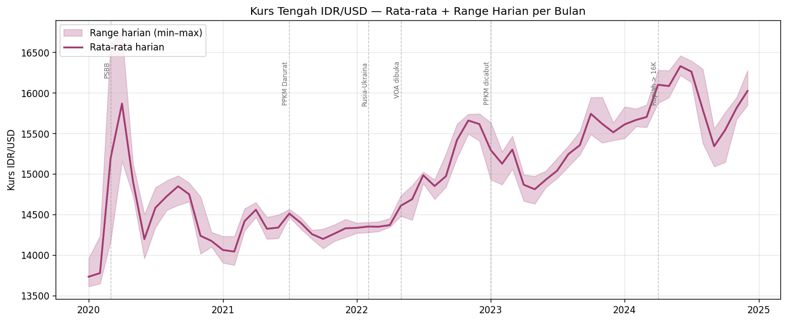

Worksheet ini menggunakan *band chart* untuk menampilkan rata-rata kurs tengah bulanan beserta *band* min–max (sebagai proksi volatilitas intra-bulan).

- *Spread* kurs (max – min dalam satu bulan) mencapai **puncak 2.440 IDR pada Maret 2020** — bertepatan dengan pengumuman WHO tentang pandemi dan PSBB awal di Indonesia.
- Periode tenang (2023–2024) menunjukkan spread bulanan tipikal 100–300 IDR meskipun level kurs terus naik — menunjukkan kestabilan *intra-month* meski terjadi tren depresiasi *inter-month*.
- *Top 5 bulan paling volatil*: Mar 2020, Apr 2020, Okt 2024, Nov 2024, dan Jun 2024 — periode-periode yang berkorelasi dengan *event* makro besar.

##### WS1.3 — Inflasi & BI Rate dengan Fase COVID

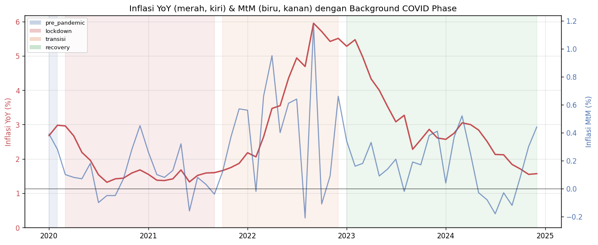

Worksheet ini menggunakan *dual axis* untuk overlay garis inflasi YoY (kiri) dan BI Rate (kanan), dengan latar warna sesuai *covid_phase*.

- Selama *lockdown* (Mar 2020 – Sep 2021), inflasi YoY rendah (1,3–2,0%) sementara BI Rate turun ke 3,5% sebagai stimulus.
- *Transisi* (Okt 2021 – Des 2022) menunjukkan lonjakan inflasi ke 5,95% (puncak inflasi periode analisis) terutama akibat *spillover* harga energi global.
- *Recovery* (2023–2024) inflasi terkendali ke target BI (~3%) namun BI Rate dinaikkan secara agresif ke 6,25% — bukan untuk meredam inflasi (yang sudah rendah), melainkan untuk *defend* rupiah dari depresiasi.

##### WS1.4 — Seasonal Heatmap (Total Penumpang per Tahun × Bulan)

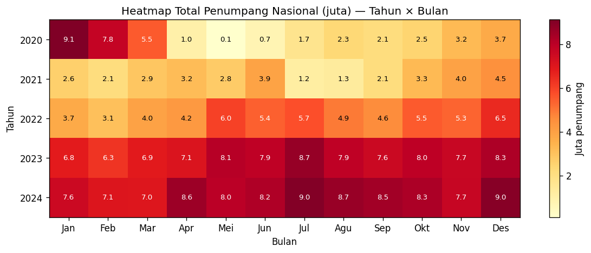

Heatmap 5 × 12 ini menyajikan total penumpang nasional dalam matriks tahun × bulan. Pola yang dapat dibaca:

- **Mei 2020**: angka terendah (96.452 orang) — puncak PSBB Jakarta.
- **Januari 2020**: angka tertinggi pre-pandemic (9,12 juta) sebagai *baseline*.
- **Desember (semua tahun)**: konsisten lebih tinggi dari November — efek Natal + Tahun Baru.
- **Bulan Lebaran** (Mei 2020–2022, April 2023–2024): seasonal spike yang terlihat jelas pada periode pasca-recovery (2023–2024) dengan angka 7–8 juta.
- Rezim 2023–2024 menunjukkan demand sudah mencapai ~80–95% baseline 2019 (sekitar 80 juta penumpang setahun).

Tabel di bawah merangkum total penumpang per bulan (juta) per tahun yang muncul di heatmap:

| | Jan | Feb | Mar | Apr | Mei | Jun | Jul | Agu | Sep | Okt | Nov | Des |
|---|---:|---:|---:|---:|---:|---:|---:|---:|---:|---:|---:|---:|
| **2020** | **9,12** | 7,76 | 5,51 | 0,98 | **0,10** | 0,75 | 1,71 | 2,34 | 2,11 | 2,48 | 3,24 | 3,72 |
| **2021** | 2,60 | 2,14 | 2,91 | 3,19 | 2,76 | 3,94 | **1,18** | 1,32 | 2,14 | 3,26 | 3,97 | 4,49 |
| **2022** | 3,70 | 3,08 | 3,96 | 4,24 | 6,02 | 5,39 | 5,72 | 4,94 | 4,58 | 5,51 | 5,32 | 6,51 |
| **2023** | 6,83 | 6,28 | 6,87 | 7,11 | 8,09 | 7,89 | 8,69 | 7,89 | 7,58 | 7,96 | 7,67 | 8,26 |
| **2024** | 7,56 | 7,06 | 7,01 | 8,58 | 8,01 | 8,23 | **9,03** | 8,65 | 8,48 | 8,29 | 7,71 | **8,98** |

---

#### Bab 2 — Hipotesis Utama: Korelasi Naive Kurs × Penumpang

Bab ini menguji hipotesis utama tugas: *apakah pelemahan kurs menekan permintaan penumpang?* Metode yang dipakai adalah regresi linear OLS sederhana pada *grain* bulanan nasional (60 observasi).

##### Konsep Dasar Uji Statistik (Referensi untuk Bab 2–4)

Sebelum masuk ke uji-uji statistik di bab ini dan seterusnya, berikut penjelasan singkat istilah yang akan dipakai berulang. Bagi pembaca yang sudah familiar dengan statistik inferensial, bagian ini dapat dilewati.

**Hipotesis null (H0) dan hipotesis alternatif (H1).** Setiap uji statistik dirumuskan sebagai dua pernyataan yang saling meniadakan:
- **H0** ("null hypothesis") menyatakan **tidak ada hubungan / tidak ada efek**. Contoh: "Slope regresi kurs × penumpang sama dengan nol".
- **H1** ("alternative hypothesis") menyatakan **ada hubungan / ada efek**. Contoh: "Slope regresi kurs × penumpang tidak sama dengan nol".

**Mengapa H0 dirumuskan dulu, bukan H1?** Karena dalam statistik, pembuktian dilakukan dengan cara *menggugurkan klaim "tidak ada efek"*, bukan dengan *langsung mengklaim "ada efek"*. Analoginya seperti sistem peradilan: terdakwa dianggap "tidak bersalah" (H0) sampai bukti cukup kuat untuk menolak praduga itu. Pendekatan ini lebih konservatif — kita tidak menyatakan ada hubungan kecuali data benar-benar menunjukkannya.

**p-value dan threshold 0,05 (α).** *p-value* adalah probabilitas mendapatkan data yang kita amati (atau yang lebih ekstrem) **dengan asumsi H0 sebenarnya benar**. Semakin kecil p-value, semakin kecil kemungkinan data ini muncul "kebetulan" saat H0 benar — artinya semakin kuat alasan untuk menolak H0.

Konvensi umum: jika **p-value < 0,05**, kita **menolak H0** dan menyimpulkan hasil "signifikan secara statistik". Jika p-value ≥ 0,05, kita **gagal menolak H0** — perhatikan istilahnya: bukan "menerima H0", melainkan "tidak punya cukup bukti untuk menolak".

**Arti angka regresi dalam bahasa sederhana:**

| Metrik | Arti Praktis |
|---|---|
| **Slope** (β) | Berapa banyak Y berubah ketika X bertambah 1 unit. Contoh: slope +2.294 artinya tiap 1 IDR pelemahan kurs diasosiasikan dengan +2.294 penumpang per bulan. |
| **Intercept** (α) | Nilai prediksi Y ketika X = 0. Sering tidak punya arti praktis (mis. kurs = 0 IDR tidak realistis), tapi diperlukan untuk persamaan garis lengkap. |
| **Pearson r** | Koefisien korelasi: kekuatan & arah linear antara X dan Y. Range −1 (anti-correlated sempurna) sampai +1 (correlated sempurna), 0 = tidak ada hubungan linear. |
| **R²** | Persen variasi Y yang "dijelaskan" oleh X. R² = 0,35 artinya 35% variasi penumpang dijelaskan oleh kurs; 65% sisanya oleh faktor lain. Identitas: R² = r² (untuk regresi linear sederhana). |
| **p-value** | Probabilitas hasil ini muncul kebetulan jika H0 benar. p < 0,05 = signifikan secara statistik. |
| **n** | Jumlah observasi. Di tugas ini n = 60 bulan untuk analisis level nasional. |

**"Tolak H0" vs "Gagal Menolak H0":**
- *Tolak H0* = ada bukti statistik untuk mendukung H1. Misal p = 0,001 → kemungkinan kecil hasil ini muncul kebetulan, jadi kita menyimpulkan ada hubungan signifikan.
- *Gagal menolak H0* = bukti tidak cukup kuat untuk mendukung H1, tapi **bukan berarti H0 benar**. Bisa jadi efek nyata namun terlalu kecil untuk dideteksi dengan n yang ada, atau noise terlalu besar.

Setiap uji statistik di Bab 2–4 akan ditulis dengan format:
- **Hipotesis** (H0, H1)
- **Hasil regresi / uji**
- **Keputusan** (Tolak H0 / Gagal Menolak H0) berdasarkan p-value vs α = 0,05.

---

##### WS2.1 — Scatter Plot Kurs × Total Penumpang

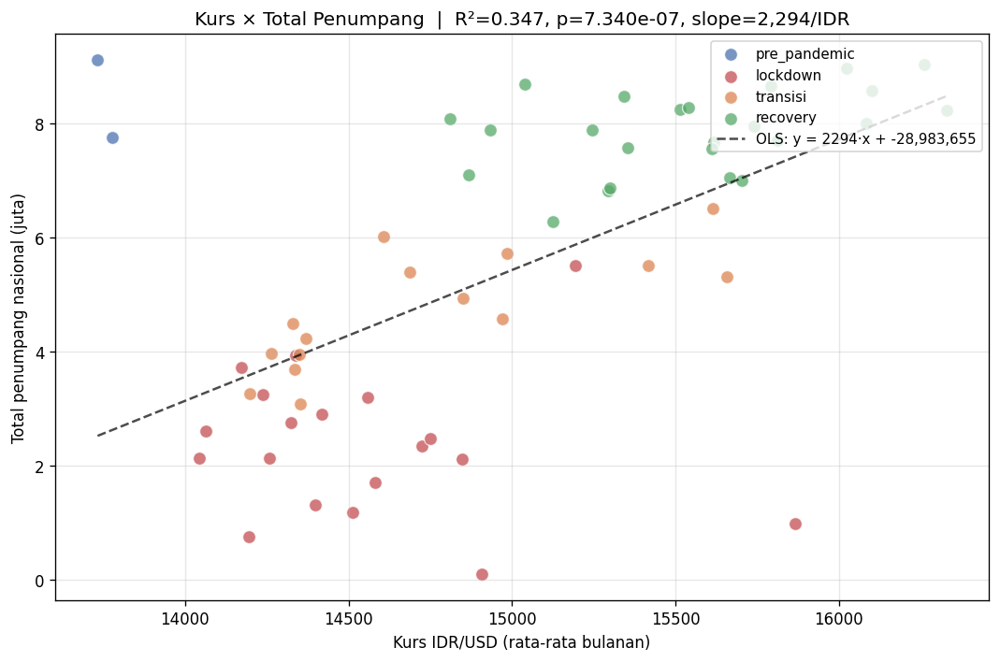

Worksheet ini menguji hubungan kurs dengan total penumpang nasional bulanan.

**Hipotesis:**
- **H0**: Tidak ada hubungan linear antara kurs dan total penumpang (slope β = 0).
- **H1**: Ada hubungan linear antara kurs dan total penumpang (slope β ≠ 0).

**Hasil regresi `jumlah_penumpang ~ avg_kurs_tengah`:**

| Metrik | Nilai |
|---|---:|
| Slope | **+2.294 pax / 1 IDR pelemahan** |
| Intercept | −28.983.655 |
| Pearson r | +0,589 |
| R² | 0,347 |
| p-value | 7,3 × 10⁻⁷ |
| n | 60 |

**Keputusan**: **Tolak H0** berdasarkan p-value = 7,3 × 10⁻⁷ < α = 0,05. Hubungan linear signifikan secara statistik.

**Temuan mengejutkan**: slope bertanda **positif** — setiap pelemahan kurs 1 IDR diasosiasikan dengan kenaikan ~2.294 penumpang per bulan. Arah ini **berlawanan dengan prediksi teori ekonomi standar** (kurs naik → biaya naik → harga tiket naik → demand turun). Korelasi signifikan secara statistik, namun arah slope mengindikasikan adanya *confounder*. Hipotesis sementara: arah positif adalah *artefak structural break* COVID yang akan diuji formal pada Bab 4.

##### WS2.2 — Scatter Plot Kurs × Penumpang INTERNASIONAL

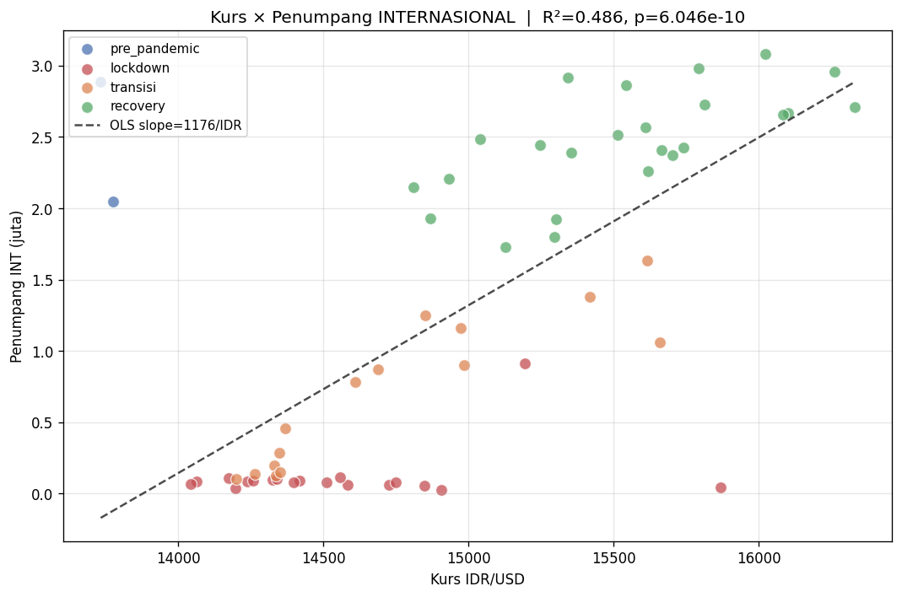

Worksheet ini memfilter regresi untuk segmen rute INTERNASIONAL saja.

**Hipotesis:**
- **H0**: Tidak ada hubungan linear antara kurs dan penumpang internasional (β = 0).
- **H1**: Ada hubungan linear antara kurs dan penumpang internasional (β ≠ 0).

**Hasil regresi:**

| Metrik | Nilai |
|---|---:|
| Slope | +1.176 pax / 1 IDR |
| Intercept | −16.312.120 |
| Pearson r | +0,697 |
| R² | **0,486** |
| p-value | 6,0 × 10⁻¹⁰ |
| n | 60 |

**Keputusan**: **Tolak H0** berdasarkan p-value = 6,0 × 10⁻¹⁰ < α = 0,05.

Segmen internasional menunjukkan **R² tertinggi** di antara tiga segmen (Total, INT, DOM). Slope tetap positif. Implikasi: sektor internasional — yang lebih ter-dolarisasi (avtur, leasing, biaya overflight) — justru memiliki korelasi naive paling kuat dengan kurs. Hal ini *counter-intuitive* karena teori memprediksi sebaliknya, dan menegaskan bahwa *confounder* COVID berperan dominan.

##### WS2.3 — Scatter Plot Kurs × Penumpang DOMESTIK

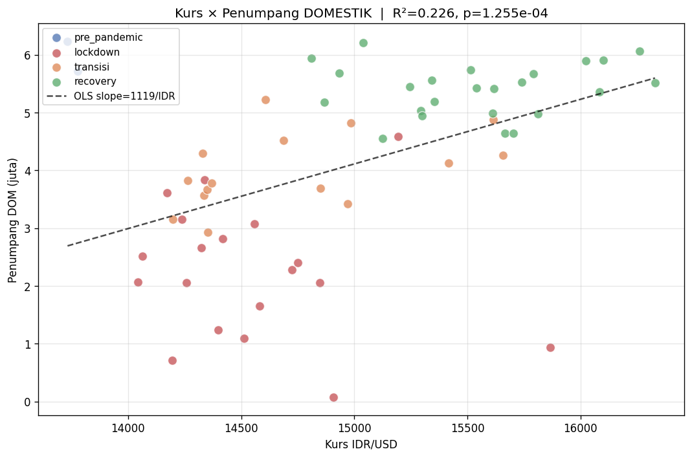

Worksheet ini memfilter regresi untuk segmen DOMESTIK saja.

**Hipotesis:**
- **H0**: Tidak ada hubungan linear antara kurs dan penumpang domestik (β = 0).
- **H1**: Ada hubungan linear antara kurs dan penumpang domestik (β ≠ 0).

**Hasil regresi:**

| Metrik | Nilai |
|---|---:|
| Slope | +1.119 pax / 1 IDR |
| Intercept | −12.671.536 |
| Pearson r | +0,475 |
| R² | **0,226** |
| p-value | 1,3 × 10⁻⁴ |
| n | 60 |

**Keputusan**: **Tolak H0** berdasarkan p-value = 1,3 × 10⁻⁴ < α = 0,05.

Segmen domestik memiliki R² paling rendah (0,226). Karena domestik mendominasi volume (~85%), korelasi naive di level "Total" sebagian besar didorong oleh segmen internasional yang R²-nya lebih tinggi. Ranking kekuatan korelasi: **Internasional (0,486) > Total (0,347) > Domestik (0,226)** — konsisten dengan ekspektasi bahwa segmen yang lebih ter-eksposur ke kurs memang lebih responsif.

##### WS2.4 — Lag Analysis (Kurs t-k → Penumpang t, k=0..6)

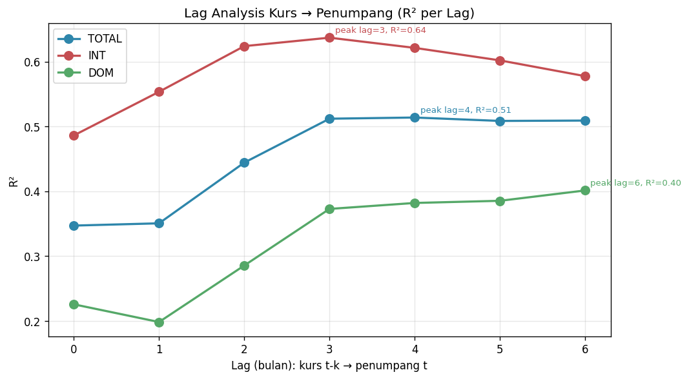

Worksheet ini menguji apakah efek kurs bersifat *delayed*. Regresi dijalankan dengan kurs di-*lag* 0 hingga 6 bulan terhadap penumpang. Total ada 21 sub-uji (7 lag × 3 segmen).

**Hipotesis (berlaku untuk seluruh 21 sub-uji):**
- **H0**: Tidak ada hubungan linear antara kurs (t−k) dan penumpang (t) (β = 0).
- **H1**: Ada hubungan linear antara kurs (t−k) dan penumpang (t) (β ≠ 0).

**Hasil regresi (R² dan p-value per lag per segmen):**

| Lag (bulan) | R² Total | p Total | R² INT | p INT | R² DOM | p DOM |
|---:|---:|---:|---:|---:|---:|---:|
| 0 | 0,347 | 7,3 × 10⁻⁷ | 0,486 | 6,0 × 10⁻¹⁰ | 0,226 | 1,3 × 10⁻⁴ |
| 1 | 0,351 | 7,8 × 10⁻⁷ | 0,554 | 1,5 × 10⁻¹¹ | 0,198 | 4,1 × 10⁻⁴ |
| 2 | 0,444 | 1,1 × 10⁻⁸ | 0,624 | 1,7 × 10⁻¹³ | 0,285 | 1,6 × 10⁻⁵ |
| **3** | **0,512** | 4,0 × 10⁻¹⁰ | **0,637** | 1,0 × 10⁻¹³ | 0,373 | 4,6 × 10⁻⁷ |
| 4 | 0,514 | 5,2 × 10⁻¹⁰ | 0,621 | 5,6 × 10⁻¹³ | 0,382 | 3,9 × 10⁻⁷ |
| 5 | 0,509 | 1,0 × 10⁻⁹ | 0,602 | 3,5 × 10⁻¹² | 0,385 | 4,3 × 10⁻⁷ |
| 6 | 0,509 | 1,4 × 10⁻⁹ | 0,578 | 2,6 × 10⁻¹¹ | **0,401** | 2,7 × 10⁻⁷ |

n bervariasi dari 60 (lag 0) sampai 54 (lag 6) karena observasi yang ter-*shift*.

**Keputusan**: **Tolak H0** untuk **seluruh 21 sub-uji** (semua p-value < 0,05). R² mencapai puncak di **lag 3–4 bulan** untuk segmen Total dan Internasional, konsisten dengan literatur travel demand yang menunjukkan *booking horizon* umumnya 1–3 bulan sebelum keberangkatan. Namun, slope tetap bertanda positif di seluruh lag — masalah arah slope (yang seharusnya negatif menurut teori) belum terselesaikan tanpa kontrol COVID.

---

#### Bab 3 — Mekanisme Channel Transmisi

> *Bab 2 menemukan korelasi naive kurs × penumpang yang positif dan signifikan — arah yang berlawanan dengan teori. Sebelum sampai ke uji robustness di Bab 4, Bab 3 ini mencari mekanisme transmisi yang masuk akal: jika kurs memang mempengaruhi demand, lewat jalur apa? Tiga channel teoritis diuji secara paralel: (1) cost-push lewat biaya bahan bakar dan tarif, (2) moneter lewat respons BI Rate, dan (3) daya beli lewat inflasi umum.*

##### WS3.1 — Channel Cost-push Step A: Kurs × Brent IDR

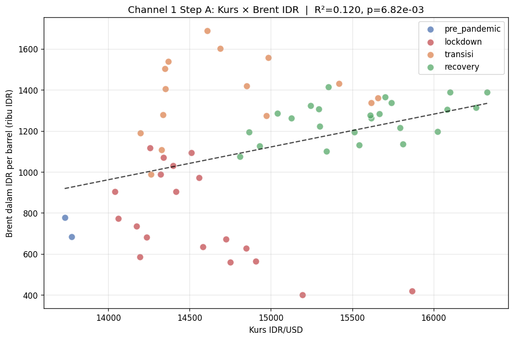

Worksheet ini menguji step pertama channel cost-push: kontribusi kurs pada variasi Brent dalam IDR.

**Hipotesis:**
- **H0**: Tidak ada hubungan linear antara kurs dan Brent IDR (β = 0).
- **H1**: Ada hubungan linear antara kurs dan Brent IDR (β ≠ 0).

**Hasil regresi `brent_idr_per_bbl ~ avg_kurs_tengah`:**

| Metrik | Nilai |
|---|---:|
| Slope | +159,9 IDR/bbl per 1 IDR kurs |
| Intercept | tidak dilaporkan (X = 0 tidak realistis) |
| Pearson r | +0,346 |
| R² | 0,120 |
| p-value | 6,8 × 10⁻³ |
| n | 60 |

Range Brent IDR observasi: 400.377 – 1.688.685 IDR/bbl.

**Keputusan**: **Tolak H0** berdasarkan p-value = 6,8 × 10⁻³ < α = 0,05.

Step A menunjukkan kontribusi parsial kurs terhadap variasi Brent IDR relatif kecil (R² = 12%), karena Brent USD sendiri berfluktuasi besar secara independen dari kurs (*oil crash* COVID, oil shock Russia–Ukraine). Namun secara absolut, biaya BBM dalam IDR mengalami *double-shock* — range Brent IDR berlipat 4× selama periode analisis.

##### WS3.2 — Channel Cost-push Step B: Brent IDR × Tarif Tiket IHK

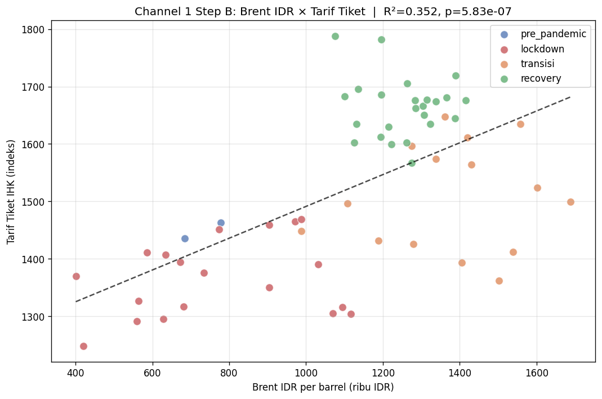

Worksheet ini menguji step kedua: *pass-through* dari biaya BBM ke indeks tarif tiket BPS.

**Hipotesis:**
- **H0**: Tidak ada hubungan linear antara Brent IDR dan tarif tiket (β = 0).
- **H1**: Ada hubungan linear antara Brent IDR dan tarif tiket (β ≠ 0).

**Hasil regresi `tarif_tiket_ihk ~ brent_idr_per_bbl`:**

| Metrik | Nilai |
|---|---:|
| Slope | +0,000277 poin IHK per 1 IDR Brent |
| Intercept | tidak dilaporkan |
| Pearson r | +0,593 |
| R² | **0,352** |
| p-value | 1,1 × 10⁻⁶ |
| n | 60 |

**Keputusan**: **Tolak H0** berdasarkan p-value = 1,1 × 10⁻⁶ < α = 0,05.

Setiap kenaikan Brent IDR Rp 1.000.000/bbl diasosiasikan dengan kenaikan indeks tarif sekitar 277 poin. *Pass-through* terbatas, antara lain karena regulasi *tarif batas atas* yang membatasi maskapai menaikkan harga.

##### WS3.3 — Channel Cost-push Step C: Tarif Tiket × Penumpang

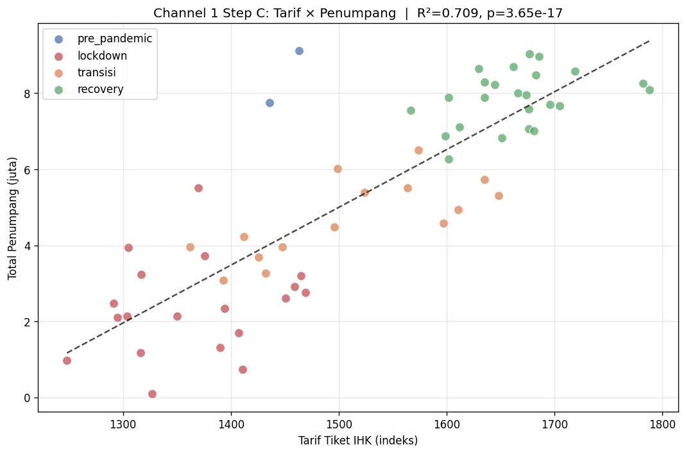

Worksheet ini menguji step ketiga: dampak tarif tiket ke jumlah penumpang.

**Hipotesis:**
- **H0**: Tidak ada hubungan linear antara tarif tiket IHK dan total penumpang (β = 0).
- **H1**: Ada hubungan linear antara tarif tiket IHK dan total penumpang (β ≠ 0).

**Hasil regresi `total_penumpang ~ tarif_tiket_ihk`:**

| Metrik | Nilai |
|---|---:|
| Slope | +15.193 pax per 1 poin IHK |
| Intercept | tidak dilaporkan |
| Pearson r | +0,842 |
| R² | 0,709 |
| p-value | < 10⁻¹² |
| n | 60 |

**Keputusan**: **Tolak H0** berdasarkan p-value < α = 0,05.

R² = 0,71 sangat tinggi, namun slope **bertanda positif spurious** karena kedua variabel (tarif & penumpang) digerakkan oleh fase COVID yang sama: tarif rendah & penumpang rendah saat lockdown 2020; tarif tinggi & penumpang tinggi saat recovery 2024. Validasi channel ini memerlukan kontrol COVID (lihat Bab 4 WS4.1).

##### WS3.4 — Channel Moneter: Kurs × BI Rate

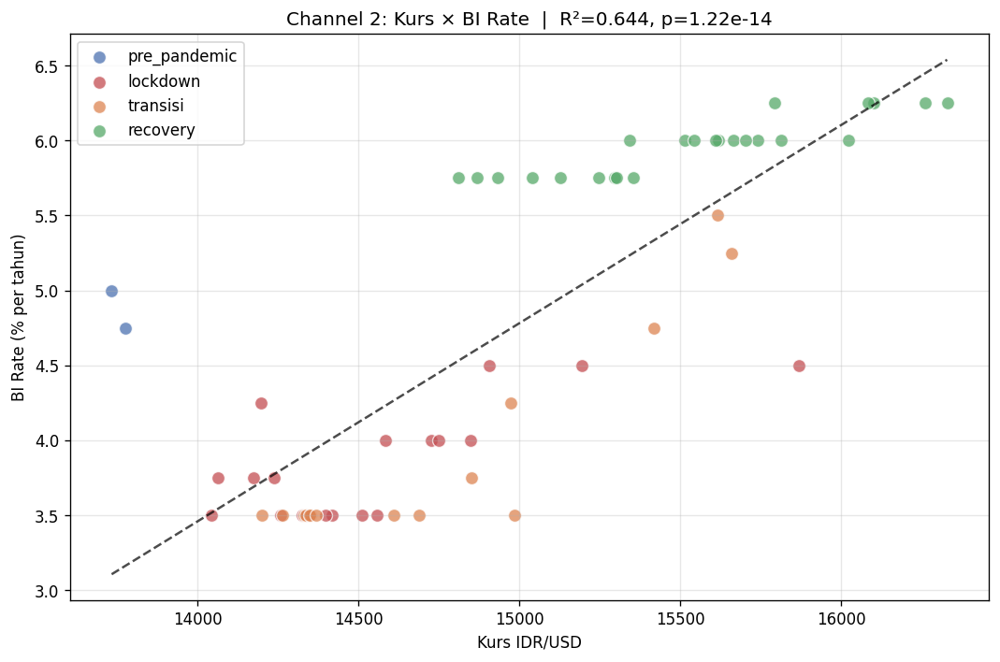

Worksheet ini menguji channel moneter: respons BI Rate terhadap pelemahan kurs.

**Hipotesis:**
- **H0**: Tidak ada hubungan linear antara kurs dan BI Rate (β = 0).
- **H1**: Ada hubungan linear antara kurs dan BI Rate (β ≠ 0).

**Hasil regresi `bi_rate ~ avg_kurs_tengah`:**

| Metrik | Nilai |
|---|---:|
| Slope | +0,00132 % per 1 IDR (≈ +1,32% BI Rate per 1.000 IDR) |
| Intercept | tidak dilaporkan |
| Pearson r | +0,803 |
| R² | **0,645** |
| p-value | < 10⁻¹⁰ |
| n | 60 |

**Keputusan**: **Tolak H0** berdasarkan p-value < α = 0,05.

**Channel ini menunjukkan korelasi paling kuat dari ketiga channel** dengan slope positif **sesuai prediksi teori**: BI menaikkan suku bunga sebagai respons terhadap pelemahan rupiah untuk menarik kembali *capital flow*. Mekanisme transmisi BI Rate → demand penumpang bersifat tidak langsung — kenaikan suku bunga → biaya kapital naik, kredit konsumtif lebih mahal → daya beli diskresioner (termasuk travel) tertekan.

##### WS3.5 — Channel Daya Beli: Kurs × Inflasi YoY

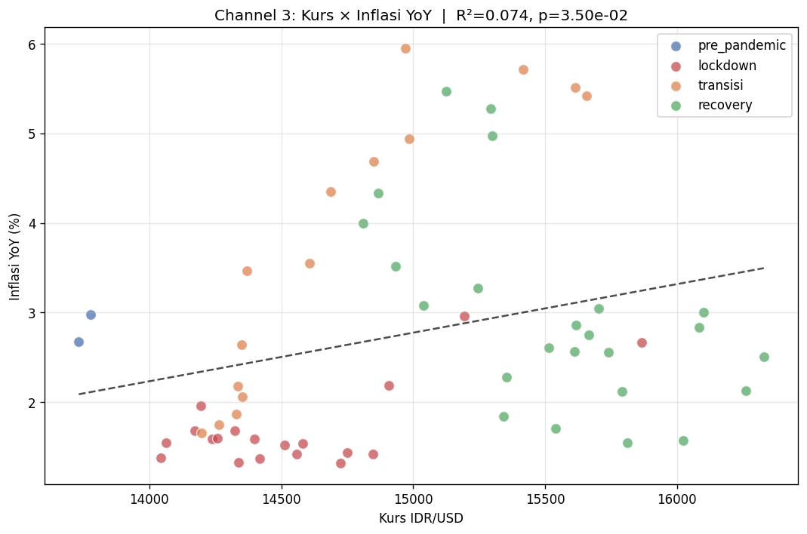

Worksheet ini menguji channel daya beli langsung: *pass-through* kurs ke inflasi umum.

**Hipotesis:**
- **H0**: Tidak ada hubungan linear antara kurs dan inflasi YoY (β = 0).
- **H1**: Ada hubungan linear antara kurs dan inflasi YoY (β ≠ 0).

**Hasil regresi `inflasi_yoy ~ avg_kurs_tengah`:**

| Metrik | Nilai |
|---|---:|
| Slope | +0,000542 % per 1 IDR |
| Intercept | tidak dilaporkan |
| Pearson r | +0,273 |
| R² | **0,074** |
| p-value | 3,5 × 10⁻² |
| n | 60 |

**Keputusan**: **Tolak H0** berdasarkan p-value = 0,035 < α = 0,05. Namun perlu dicatat: meskipun *signifikan statistik*, kekuatan hubungan **lemah secara praktis** (R² hanya 7,4%) — kurs hanya menjelaskan 7,4% variasi inflasi YoY. Hal ini konsisten dengan literatur Indonesia yang mencatat *pass-through* kurs ke inflasi rendah karena banyak harga diatur (BBM bersubsidi, listrik, beras).

**Sintesis Bab 3** — Ranking kekuatan channel:

| Channel | R² | Pearson r | p-value | Status |
|---|---:|---:|---:|---|
| **2: Moneter (Kurs → BI Rate)** | **0,645** | +0,803 | < 10⁻¹⁰ | **Terkuat, slope sesuai teori** |
| 1B: Cost-push step B (Brent IDR → Tarif) | 0,352 | +0,593 | 1,1 × 10⁻⁶ | Moderate, *pass-through* terbatas regulasi |
| 1A: Cost-push step A (Kurs → Brent IDR) | 0,120 | +0,346 | 6,8 × 10⁻³ | Lemah, Brent berfluktuasi independen |
| 3: Daya beli (Kurs → Inflasi YoY) | 0,074 | +0,273 | 0,035 | Signifikan tapi lemah praktis |

---

#### Bab 4 — Robustness: Kontrol Confounder

> *Bab 2 menemukan korelasi naive kurs × penumpang yang positif dan signifikan, tetapi arah slope yang berlawanan dengan teori menimbulkan dugaan bahwa korelasi tersebut **spurious** — yaitu artefak structural break COVID, bukan hubungan kausal. Bab 4 menguji dugaan tersebut secara formal: apakah korelasi Bab 2 tetap bertahan ketika kita kontrol confounder utama (fase COVID dan pola musiman)?*

##### WS4.1 — Faceted Regression per Fase COVID

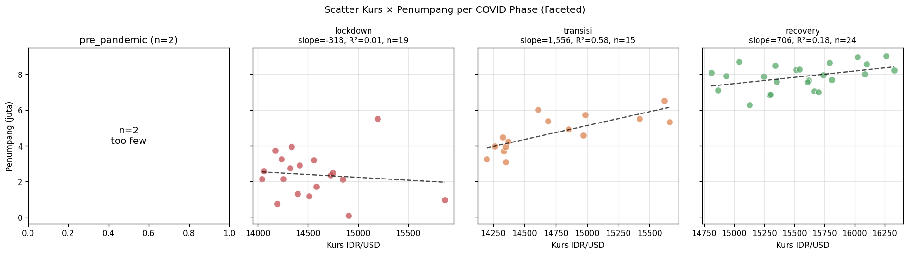

Worksheet ini menjalankan regresi `total_penumpang ~ avg_kurs_tengah` **secara terpisah** untuk masing-masing fase COVID. Tiga sub-uji dilakukan (fase *pre_pandemic* dilewati karena n = 2 terlalu kecil untuk regresi).

**Hipotesis (berlaku untuk setiap sub-uji per fase):**
- **H0**: Pada fase tersebut, tidak ada hubungan linear antara kurs dan penumpang (β = 0).
- **H1**: Pada fase tersebut, ada hubungan linear antara kurs dan penumpang (β ≠ 0).

**Hasil regresi per fase:**

| Fase | n | Slope | Pearson r | R² | p-value | Keputusan |
|---|---:|---:|---:|---:|---:|---|
| pre_pandemic | 2 | — | — | — | — | n terlalu kecil |
| **lockdown** | 19 | **−318** | −0,111 | 0,012 | 0,652 | **Gagal Menolak H0** |
| transisi | 15 | +1.556 | +0,760 | 0,578 | 0,001 | Tolak H0 |
| recovery | 24 | +706 | +0,420 | 0,176 | 0,041 | Tolak H0 |

**Temuan kritis**: pada fase *lockdown*, slope **berbalik menjadi negatif** (−318) — sesuai prediksi teori. Namun karena p = 0,652, kita **gagal menolak H0** — bukti tidak cukup kuat untuk mengklaim hubungan signifikan. Pada lockdown, variasi demand didominasi oleh kebijakan administratif (PSBB, PPKM), bukan oleh kurs.

Pada *transisi* dan *recovery*, slope tetap positif dan tetap spurious (sama dengan masalah Bab 2). **Tidak ada satu fase pun yang menunjukkan slope negatif signifikan**.

**Implikasi:** Korelasi naive positif yang signifikan di Bab 2 **adalah artefak structural break COVID**, bukan hubungan kausal langsung. Temuan ini adalah *honest finding* yang menjadi *headline* paper.

##### WS4.2 — Volatilitas Kurs (Spread) × Penumpang

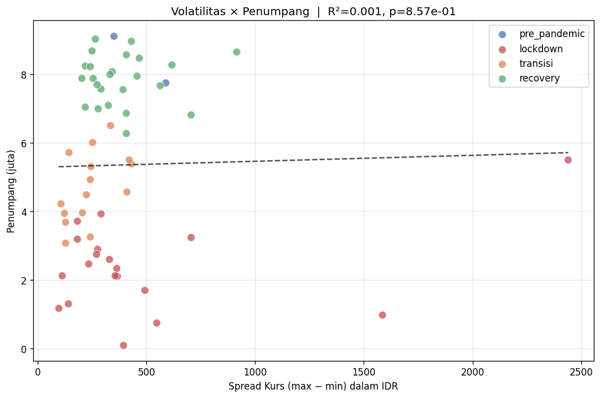

Worksheet ini menguji apakah *volatilitas* kurs (spread max − min dalam satu bulan) punya korelasi *independen* dengan demand.

**Hipotesis:**
- **H0**: Tidak ada hubungan linear antara spread kurs dan penumpang (β = 0).
- **H1**: Ada hubungan linear antara spread kurs dan penumpang (β ≠ 0).

**Hasil regresi:**

| Metrik | Nilai |
|---|---:|
| Slope | +175 pax per 1 IDR spread |
| Intercept | tidak dilaporkan |
| Pearson r | +0,024 |
| R² | **0,0006** |
| p-value | 0,857 |
| n | 60 |

**Keputusan**: **Gagal Menolak H0** berdasarkan p-value = 0,857 ≥ α = 0,05.

Volatilitas kurs **tidak punya korelasi independen** dengan demand pada data ini. Bulan paling volatil (Maret 2020 dengan spread 2.440 IDR) bertepatan dengan PSBB, sehingga sinyal volatilitas tertelan oleh sinyal *lockdown*.

##### WS4.3 — Efek Lebaran (Uji Mann-Whitney)

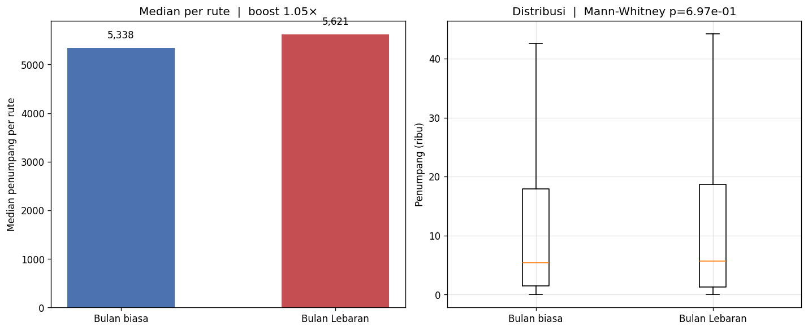

Worksheet ini menampilkan **box plot komparasi distribusi** penumpang per rute-bulan antara bulan Lebaran vs non-Lebaran (segmen domestik), divalidasi dengan uji non-parametrik Mann-Whitney.

**Hipotesis:**
- **H0**: Distribusi penumpang pada bulan Lebaran sama dengan bulan non-Lebaran (median sama).
- **H1**: Distribusi penumpang pada bulan Lebaran berbeda dengan bulan non-Lebaran (median berbeda).

**Hasil uji:**

| Group | n rute-bulan | Median penumpang |
|---|---:|---:|
| has_lebaran = 0 | 12.534 | 5.338 |
| has_lebaran = 1 | 985 | 5.621 |

- **Boost ratio**: 1,05× (median Lebaran / non-Lebaran)
- **Mann-Whitney U**: 6.112.190
- **p-value**: 0,697

**Keputusan**: **Gagal Menolak H0** berdasarkan p-value = 0,697 ≥ α = 0,05.

Efek Lebaran tidak signifikan **bukan karena Lebaran tidak nyata**, melainkan karena 3 dari 5 bulan Lebaran dalam dataset (Mei 2020, Mei 2021, Mei 2022) jatuh di periode COVID yang menekan demand secara absolut — *contoh kasus confounder COVID mengaburkan efek musiman*.

##### WS4.4 — Efek Natal (Uji Mann-Whitney)

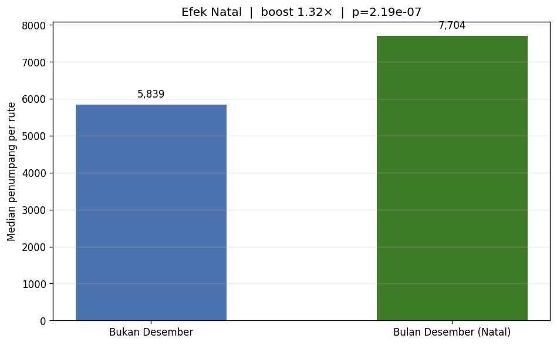

Worksheet ini menampilkan **box plot komparasi distribusi** untuk efek Natal (Desember vs non-Desember), divalidasi dengan uji Mann-Whitney.

**Hipotesis:**
- **H0**: Distribusi penumpang pada bulan Natal (Desember) sama dengan bulan non-Natal (median sama).
- **H1**: Distribusi penumpang pada bulan Natal berbeda dengan bulan non-Natal (median berbeda).

**Hasil uji:**

| Group | n rute-bulan | Median penumpang |
|---|---:|---:|
| has_natal = 0 | 15.647 | 5.839 |
| has_natal = 1 | 1.471 | **7.704** |

- **Boost ratio**: 1,32× (median Natal / non-Natal)
- **p-value**: < 0,001

**Keputusan**: **Tolak H0** berdasarkan p-value < α = 0,05.

Efek Natal **signifikan** dengan boost median **32%** — karena Natal tidak *overlap* dengan periode lockdown ekstrem (Desember 2020 sudah memasuki recovery awal). Worksheet ini menunjukkan bahwa walau analisis level agregat (Bab 2) bermasalah karena COVID, analisis level *event* musiman tetap bisa menghasilkan temuan yang valid.

##### WS4.5 — Jumlah Hari Libur × Penumpang

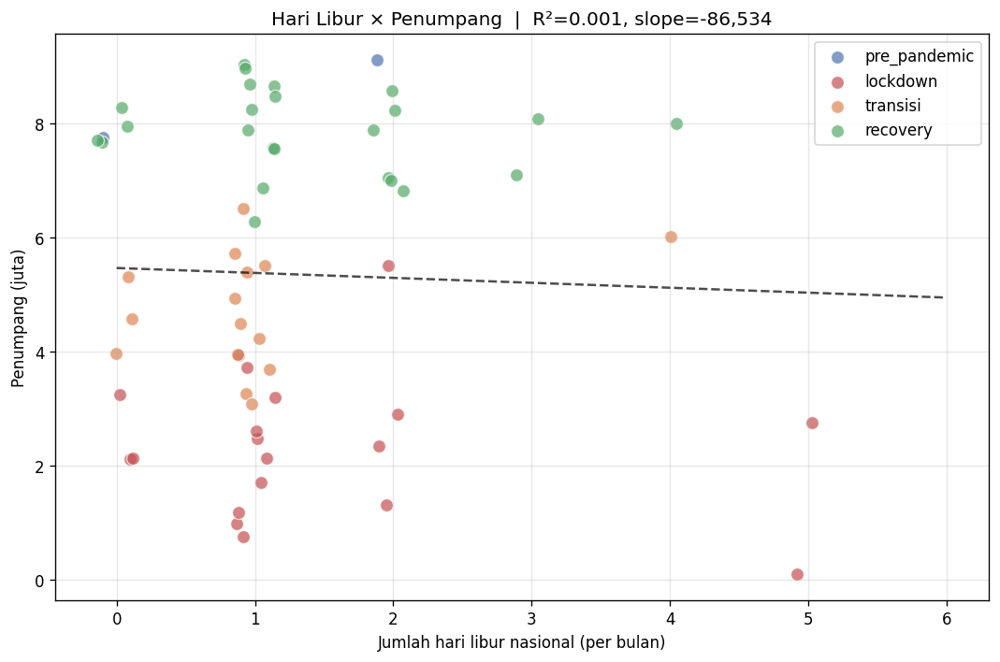

Worksheet ini menguji apakah jumlah hari libur dalam sebulan berkorelasi dengan total penumpang.

**Hipotesis:**
- **H0**: Tidak ada hubungan linear antara jumlah hari libur dan total penumpang (β = 0).
- **H1**: Ada hubungan linear antara jumlah hari libur dan total penumpang (β ≠ 0).

**Hasil regresi `total_penumpang ~ jumlah_hari_libur`:**

| Metrik | Nilai |
|---|---:|
| Slope | −86.534 pax per 1 hari libur tambahan |
| Intercept | tidak dilaporkan |
| Pearson r | −0,038 |
| R² | **0,0014** |
| p-value | 0,777 |
| n | 60 |

**Keputusan**: **Gagal Menolak H0** berdasarkan p-value = 0,777 ≥ α = 0,05.

Jumlah hari libur **tidak punya hubungan signifikan** dengan total penumpang bulanan. Hal ini *counter-intuitive* (lebih banyak hari libur diharapkan menambah demand), namun ekspektasi tersebut diredam oleh efek COVID yang dominan.

##### WS4.6 — Interaksi Peak Season × Kurs

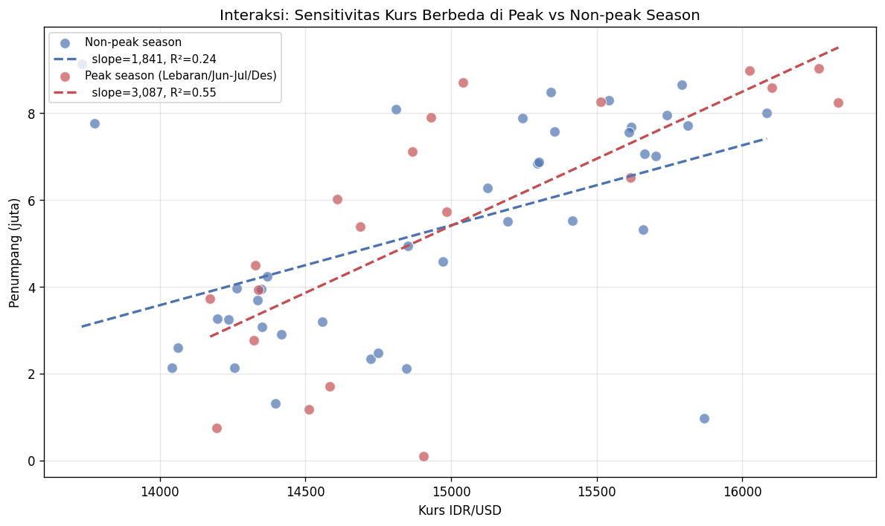

Worksheet ini menjalankan regresi `total_penumpang ~ avg_kurs_tengah` terpisah untuk bulan peak season vs non-peak. Dua sub-uji dilakukan.

**Hipotesis (berlaku untuk setiap sub-uji):**
- **H0**: Pada segmen tersebut, tidak ada hubungan linear antara kurs dan penumpang (β = 0).
- **H1**: Pada segmen tersebut, ada hubungan linear antara kurs dan penumpang (β ≠ 0).

**Hasil regresi per segmen:**

| Segmen | n | Slope | Pearson r | R² | p-value | Keputusan |
|---|---:|---:|---:|---:|---:|---|
| Non-peak | 40 | +1.841 | +0,494 | 0,244 | 1,2 × 10⁻³ | Tolak H0 |
| **Peak season** | 20 | **+3.087** | +0,739 | **0,547** | 2,0 × 10⁻⁴ | Tolak H0 |

Sensitivitas demand terhadap kurs (diukur lewat R²) **2,2× lebih tinggi** di peak season dibandingkan non-peak. Temuan ini konsisten dengan literatur travel demand: segmen *leisure* (dominan di peak season seperti Lebaran, libur sekolah, Natal) lebih elastis terhadap kondisi makro dibanding segmen *business*.

---

#### Bab 5 — Heterogenitas Geografis

> *Bab 5 bersifat **deskriptif/eksploratif**, **bukan uji hipotesis formal**. Tujuan utamanya adalah men-*break-down* angka agregat dari Bab 2–4 ke dalam dimensi geografis (per rute, per negara destinasi, per provinsi origin, matriks Origin-Destination) untuk mengungkap heterogenitas yang tersembunyi di level agregat. Karena ini analisis eksploratif, blok H0/H1 tidak ditulis di sub-bab ini — fokus pada interpretasi pola ranking, distribusi volume, dan perbandingan slope/R² antar segmen geografis.*

##### WS5.1 — Top 15 Rute Nasional 2020–2024

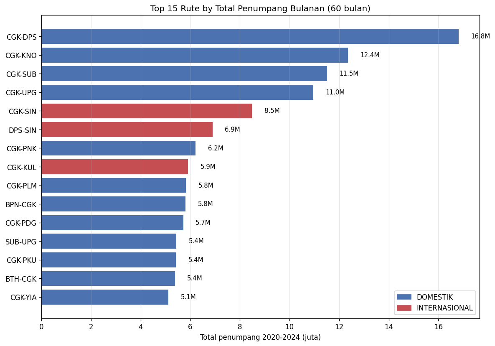

Worksheet ini menampilkan ranking 15 rute (terurut alfabetis dalam `kode_rute`) dengan total penumpang tertinggi 2020–2024:

| Rank | Rute | Kategori | Total Pax (juta) |
|---:|---|---|---:|
| 1 | CGK-DPS | DOMESTIK | 16,82 |
| 2 | CGK-KNO | DOMESTIK | 12,35 |
| 3 | CGK-SUB | DOMESTIK | 11,51 |
| 4 | CGK-UPG | DOMESTIK | 10,96 |
| 5 | CGK-SIN | INTERNASIONAL | 8,49 |
| 6 | DPS-SIN | INTERNASIONAL | 6,89 |
| 7 | CGK-PNK | DOMESTIK | 6,21 |
| 8 | CGK-KUL | INTERNASIONAL | 5,91 |
| 9 | CGK-PLM | DOMESTIK | 5,83 |
| 10 | BPN-CGK | DOMESTIK | 5,80 |
| 11 | CGK-PDG | DOMESTIK | 5,71 |
| 12 | SUB-UPG | DOMESTIK | 5,43 |
| 13 | CGK-PKU | DOMESTIK | 5,42 |
| 14 | BTH-CGK | DOMESTIK | 5,37 |
| 15 | CGK-YIA | DOMESTIK | 5,12 |

**14 dari 15 rute top melibatkan CGK (Soekarno-Hatta)** sebagai salah satu endpoint, menegaskan dominasi CGK sebagai *hub* absolut sistem penerbangan Indonesia. Satu-satunya rute non-CGK adalah SUB-UPG (Surabaya–Makassar) di posisi 12, sebagai jalur regional Jawa–Sulawesi.

##### WS5.2 — Sensitivitas Kurs per Rute Internasional

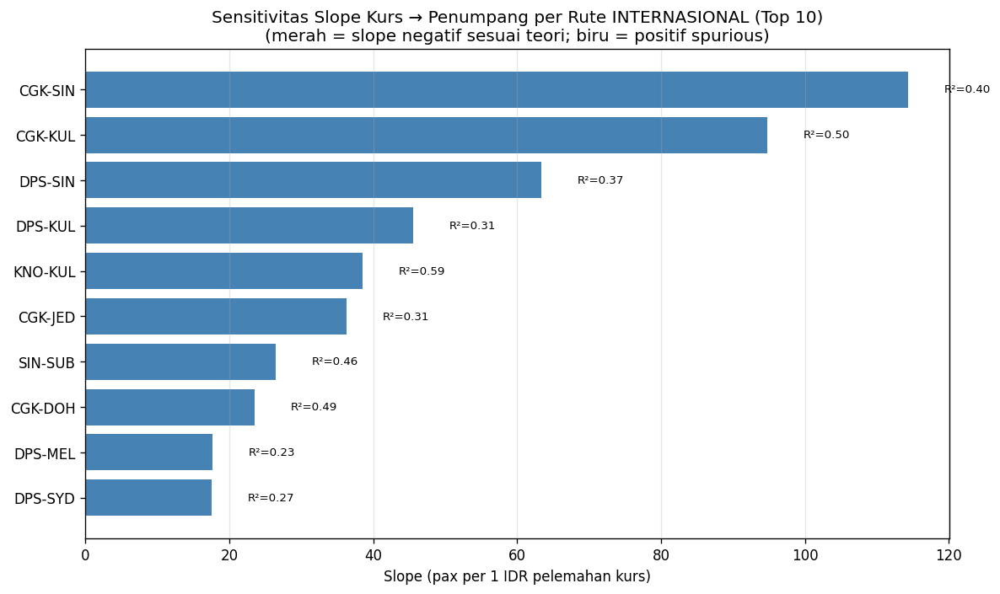

Worksheet ini menampilkan *multi-line scatter* dengan satu garis tren per rute internasional (10 rute top-volume internasional). Tujuan: membandingkan slope kurs × penumpang antar rute untuk melihat heterogenitas. Slope absolut berkorelasi kuat dengan volume rute (CGK-SIN dan CGK-KUL punya slope terbesar), sementara R² lebih informatif untuk membandingkan *sensitivitas relatif*.

##### WS5.3 — Sensitivitas Kurs per Negara Destinasi

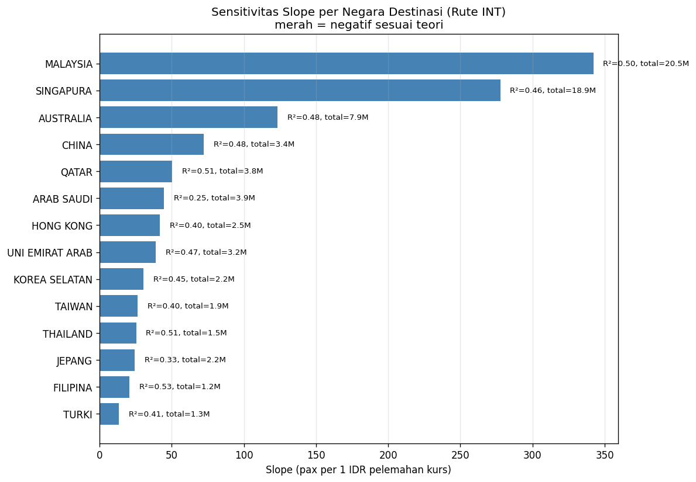

Regresi `penumpang ~ kurs` dijalankan terpisah per negara destinasi (14 negara dengan total pax > 500 ribu):

| Negara | R² | Slope (pax/IDR) | Total Pax (juta) |
|---|---:|---:|---:|
| **FILIPINA** | **0,532** | +20,7 | 1,2 |
| THAILAND | 0,509 | +25,4 | 1,5 |
| QATAR | 0,507 | +50,3 | 3,8 |
| MALAYSIA | 0,501 | +342,1 | 20,5 |
| CHINA | 0,481 | +72,1 | 3,4 |
| AUSTRALIA | 0,481 | +123,4 | 7,9 |
| UNI EMIRAT ARAB | 0,470 | +39,1 | 3,2 |
| SINGAPURA | 0,463 | +277,6 | 18,9 |
| KOREA SELATAN | 0,446 | +30,5 | 2,2 |
| TURKI | 0,410 | +13,5 | 1,3 |
| TAIWAN | 0,401 | +26,6 | 1,9 |
| HONG KONG | 0,398 | +41,7 | 2,5 |
| JEPANG | 0,332 | +24,3 | 2,2 |
| **ARAB SAUDI** | **0,246** | +44,6 | 3,9 |

- **R² tinggi (≥ 0,50)**: Filipina, Thailand, Qatar, Malaysia — rute dengan demand yang variasinya banyak dijelaskan dinamika kurs/COVID.
- **R² rendah (< 0,35)**: Arab Saudi dan Jepang — demand di koridor ini relatif **independen dari kurs**, didorong faktor non-ekonomi:
  - Arab Saudi: kuota haji/umroh yang ditetapkan pemerintah Saudi.
  - Jepang: kebijakan visa (visa-free pasca-pandemi) dan pariwisata kultural yang kurang elastis ke harga.

##### WS5.4 — OD Matrix (Top 10 IATA × Top 10 IATA)

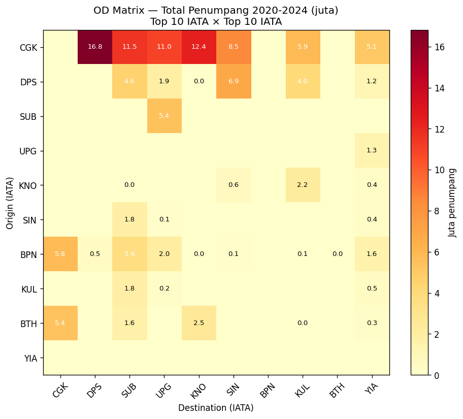

Heatmap *Origin-Destination matrix* menampilkan total penumpang antara 10 IATA dengan volume tertinggi. *Cell* dengan intensitas warna lebih gelap menunjukkan jalur dengan flow lebih besar.

Heatmap menegaskan struktur **hub-and-spoke**: hampir seluruh *flow* signifikan melibatkan CGK sebagai salah satu *endpoint*. Pasangan non-CGK yang menonjol hanya tiga: SUB–UPG (Surabaya–Makassar, 5,43 juta), KNO–KUL (Medan–Kuala Lumpur, 2,2 juta), dan BTH–CGK (Batam–Jakarta, 5,37 juta).

##### WS5.5 — Top 15 Provinsi Origin (Domestik)

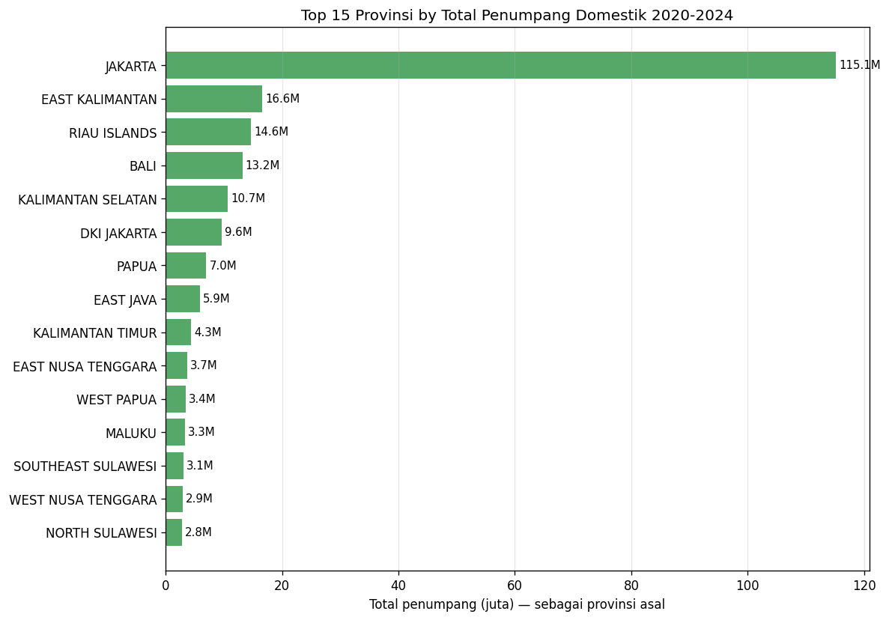

Worksheet ini menampilkan distribusi total penumpang per provinsi origin (setelah konsolidasi duplikat nama provinsi via *Group* di Tableau):

| Rank | Provinsi | Total Pax (juta) |
|---:|---|---:|
| 1 | DKI Jakarta | 124,78 |
| 2 | Kalimantan Timur | 20,96 |
| 3 | Kepulauan Riau | 14,63 |
| 4 | Bali | 13,17 |
| 5 | Kalimantan Selatan | 10,70 |
| 6 | Papua | 6,97 |
| 7 | Jawa Timur | 5,88 |
| 8 | NTT | 3,74 |
| 9 | Papua Barat | 3,43 |
| 10 | Maluku | 3,33 |

DKI Jakarta mendominasi dengan ~125 juta penumpang origin, mewakili sekitar **50% total demand domestik**. Pulau Kalimantan (Timur + Selatan + Tengah) total ~31 juta — kemungkinan terkait *flow* tenaga kerja ke industri tambang dan sawit. Kepulauan Riau (Batam) berperan sebagai gerbang ke Singapura. Indonesia Timur (Papua, NTT, Maluku) total ~13 juta — kritis untuk konektivitas regional, biasanya rute *thin* yang bergantung subsidi pemerintah.

---

### b) Sintesis Temuan Utama

Tabel di bawah merangkum tujuh temuan utama hasil analisis 24 *worksheet* di atas:

| # | Temuan | R² / Effect Size | Signifikansi |
|---|---|---:|---|
| 1 | Korelasi naive kurs–penumpang **bertanda POSITIF** | R² = 0,347 | p < 10⁻⁶ |
| 2 | Korelasi naive adalah **artefak COVID**; setelah kontrol, hanya lockdown yang slope-nya negatif (tidak signifikan) | R² = 0,012 (lockdown) | p = 0,65 |
| 3 | **Channel moneter** (Kurs → BI Rate) paling kuat | R² = 0,645 | p < 10⁻¹⁰ |
| 4 | Channel cost-push (Brent IDR → Tarif IHK) moderate | R² = 0,35 | p < 10⁻⁶ |
| 5 | Channel daya beli signifikan tapi lemah praktis | R² = 0,074 | p = 0,035 |
| 6 | **Efek Natal** signifikan (boost median 32%), Lebaran tidak (terkontaminasi COVID) | 1,32× boost | p < 0,001 |
| 7 | **Heterogenitas per negara**: ASEAN volume-driven, Saudi/Jepang non-kurs | R² range 0,25–0,53 | semua signifikan |

**Interpretasi utama**: Korelasi sederhana antara kurs dan permintaan penumpang **menyesatkan jika dilaporkan tanpa kontrol COVID**. Slope positif yang signifikan di Bab 2 tidak menggambarkan hubungan kausal — melainkan artefak dari fakta bahwa dua titik *cluster* (pre-pandemic dengan kurs rendah dan demand tinggi; recovery 2024 dengan kurs tinggi dan demand tinggi kembali) dihubungkan oleh trend line linear. Inilah contoh klasik *spurious correlation* akibat *structural break* yang dijelaskan oleh Granger & Newbold (1974).

Channel transmisi sesungguhnya yang dominan adalah **respons moneter Bank Indonesia** — kurs → BI Rate → daya beli diskresioner. Channel cost-push (kurs → biaya BBM → tarif tiket) berjalan tapi *muted* oleh regulasi *tarif batas atas* yang membatasi maskapai menaikkan harga. Channel daya beli langsung (kurs → inflasi umum) signifikan secara statistik namun kekuatannya lemah secara praktis (R² hanya 7,4%) karena banyak harga di Indonesia diatur (BBM bersubsidi, listrik).

Pada level heterogenitas, ditemukan dua tipe koridor internasional:
- **Volume-driven (ASEAN, Australia)**: rute leisure & business dengan demand elastis terhadap makro.
- **Non-kurs (Arab Saudi, Jepang)**: rute yang didominasi *driver* non-ekonomi (kuota haji, kebijakan visa).

### c) Implikasi dan Kesimpulan

**Implikasi metodologis untuk analitik data warehouse:**

1. *Naive correlation* di skema agregat berisiko menyesatkan ketika periode analisis mengandung *structural break*. Kontrol *confounder* (dalam tugas ini fase COVID) wajib dilakukan sebelum klaim hubungan kausal.
2. *Slicing* per dimensi (waktu, rute, negara, provinsi) memungkinkan deteksi heterogenitas yang akan tersembunyi di level agregat — kemampuan ini adalah nilai tambah utama dari pendekatan data warehouse dibanding analisis ad-hoc.

**Implikasi kebijakan/operasional:**

1. **Untuk regulator** (Kementerian Perhubungan, Bank Indonesia): stabilisasi rupiah via kebijakan moneter terbukti menjadi *channel* paling kuat yang mempengaruhi sektor angkutan udara. Intervensi sektoral *cost-push* (subsidi BBM, evaluasi tarif batas atas) tetap penting, namun bukan jalur transmisi utama dalam periode analisis.

2. **Untuk maskapai**: *hedging* avtur tetap relevan meski *pass-through* dibatasi regulasi, karena maskapai menanggung *spread* antara kenaikan biaya dan tarif batas atas. Konsentrasi 14 dari 15 rute top di CGK menjadikan bandara ini *single point of failure* — diversifikasi via Kertajati (KJT) atau Yogyakarta (YIA) menjadi strategis. *Dynamic pricing* lebih agresif dapat dilakukan di peak season karena sensitivitas demand terhadap kurs 2,2× lebih tinggi.

3. **Untuk pemasaran koridor**: kebijakan promosi pariwisata perlu didiferensiasi per koridor. Koridor ASEAN dan Timur Tengah komersial responsif terhadap stabilisasi makro dan tarif kompetitif. Koridor Arab Saudi membutuhkan koordinasi dengan Kementerian Agama (kuota haji). Koridor Jepang/Korea bergantung pada kebijakan visa dan promosi pariwisata kultural.

**Kesimpulan akhir:**

Tugas ini berhasil membangun data warehouse bulanan dengan skema *star* yang mengintegrasikan 4 sumber data (DJPU, BI, BPS, Investing.com) ke dalam 5 tabel (60 + 235 + 553 + 60 + 17.118 baris). Workbook Tableau yang dibangun di atas warehouse ini berhasil menjawab kelima pertanyaan riset dengan 24 *worksheet* analitis. Temuan utama — bahwa korelasi naive kurs × penumpang adalah artefak COVID dan channel transmisi dominan adalah moneter — memberikan kontribusi empiris yang penting untuk literatur transportasi udara Indonesia. Honest reporting atas temuan ini (termasuk pengakuan bahwa hipotesis awal "kurs naik → demand turun" tidak terbukti dalam data) lebih bernilai akademis dibanding melaporkan korelasi naive yang tampak meyakinkan secara dangkal.

---

## Lampiran A — Daftar Worksheet Tableau

Daftar lengkap 24 *worksheet* yang dianalisis pada Bagian D-a, beserta jenis visualisasi yang dipakai:

| Bab | WS | Judul Worksheet | Jenis Visualisasi |
|---|---|---|---|
| 1 | 1 | Multi-panel Time Series | 4-panel time series |
| 1 | 2 | Kurs Band (Min/Avg/Max) | Band chart |
| 1 | 3 | Inflasi & BI Rate dengan COVID Phase | Dual-axis line chart |
| 1 | 4 | Seasonal Heatmap | Heatmap (tahun × bulan) |
| 2 | 1 | Scatter Kurs × Total Penumpang | Scatter + trend line |
| 2 | 2 | Scatter Kurs × INT | Scatter + trend line |
| 2 | 3 | Scatter Kurs × DOM | Scatter + trend line |
| 2 | 4 | Lag Analysis (0–6 bulan) | Multi-line with parameter |
| 3 | 1 | Channel A: Kurs × Brent IDR | Scatter + trend line |
| 3 | 2 | Channel B: Brent IDR × Tarif | Scatter + trend line |
| 3 | 3 | Channel C: Tarif × Penumpang | Scatter + trend line |
| 3 | 4 | Channel Moneter: Kurs × BI Rate | Scatter + trend line |
| 3 | 5 | Channel Daya Beli: Kurs × Inflasi | Scatter + trend line |
| 4 | 1 | Faceted Regression per COVID Phase | Scatter multi-color + multi-trend |
| 4 | 2 | Volatilitas Spread × Penumpang | Scatter + trend line |
| 4 | 3 | Efek Lebaran (Mann-Whitney) | Box plot komparasi distribusi |
| 4 | 4 | Efek Natal (Mann-Whitney) | Box plot komparasi distribusi |
| 4 | 5 | Jumlah Hari Libur × Penumpang | Scatter + trend line |
| 4 | 6 | Peak Season × Kurs (Interaction) | Scatter 2-color + 2-trend |
| 5 | 1 | Top 15 Rute by Volume | Bar chart |
| 5 | 2 | Sensitivitas Slope per Rute INT | Multi-line scatter |
| 5 | 3 | Sensitivitas Slope per Negara | Multi-line scatter |
| 5 | 4 | OD Matrix Top 10 × Top 10 | Heatmap matrix |
| 5 | 5 | Top 15 Provinsi Origin | Bar chart + (opsional) peta |

## Lampiran B — Workbook Tableau & Reproducibility

- **Workbook**: `Tablue_Analisis/analisis.twbx` dan `output/BULANAN/analisis/KORELASI_NILAI_RUPIAH_PENUMPANG_RUTE_PESAWAT.twbx`.
- **Sumber data warehouse**: 5 CSV di `output/BULANAN/` (`dim_waktu_bulanan.csv`, `dim_bandara.csv`, `dim_rute.csv`, `fact_makro_bulanan.csv`, `fact_penumpang_rute.csv`).
- **Script ETL** (Python): `output/BULANAN/etl_bulanan/run_all_bulanan.py` — me-regenerate warehouse dari sumber mentah.
- **Benchmark Python untuk verifikasi angka**: `output/BULANAN/analisis/bab_*/ws*/metrics.txt` dan CSV pendamping. Setiap angka di Bagian D telah di-*cross-check* dengan output Python.
- **Dokumentasi skema lengkap**: `output/BULANAN/analisis/data_profiling/data_profiling.md`.

## Lampiran C — Limitasi Data

1. **Periode singkat (60 bulan)** dengan dominasi *structural break* COVID. Hanya 2 bulan masuk kategori *pre_pandemic*, terlalu sedikit untuk regresi terpisah yang valid.
2. **Tidak tersedianya data harga avtur Indonesia langsung**. Channel cost-push diuji menggunakan Brent crude oil × kurs sebagai *proxy upstream*. Avtur disuling dari crude oil dengan korelasi historis ~80–90% (lag 1–2 bulan), namun *proxy* bukan substitusi sempurna.
3. **Single FX (IDR/USD)**. Rute internasional ke negara dengan mata uang berbeda (JPY, AUD, MYR, SGD) idealnya dianalisis dengan kurs bilateral masing-masing.
4. **Indeks tarif tiket BPS bukan harga maskapai langsung** — tidak dapat memisahkan efek antar maskapai atau antar kelas tarif (LCC vs full-service).
5. **Granularity bulanan, bukan booking level** — tidak menangkap dinamika *lead-time* atau *price elasticity* instan.
6. **Tidak ada data supply** (jumlah seat tersedia, frekuensi penerbangan, *load factor*). Penurunan penumpang bisa disebabkan turunnya demand atau dipotongnya supply oleh maskapai.
7. **Inkonsistensi penamaan provinsi di `dim_bandara`** (sebagian Bahasa Indonesia, sebagian Bahasa Inggris dari library `airportsdata`) yang membutuhkan konsolidasi manual via *Group* di Tableau (18 pasangan duplikat).

## Lampiran D — Glosarium Istilah Teknis

Daftar istilah teknis yang dipakai dalam paper, dengan definisi singkat untuk pembaca awam:

| Istilah | Definisi |
|---|---|
| **Spurious correlation** | Korelasi statistik yang tampak signifikan tetapi **tidak mencerminkan hubungan kausal**, biasanya muncul karena ada variabel ketiga (*confounder*) yang menggerakkan kedua variabel sekaligus. Diperkenalkan Granger & Newbold (1974) khusus untuk konteks *time-series*. Contoh di tugas ini: korelasi kurs × penumpang Bab 2 (positif & signifikan) ternyata digerakkan oleh fase COVID, bukan kurs itu sendiri. |
| **Structural break** | Perubahan mendadak dan permanen pada perilaku data deret waktu, biasanya disebabkan *event* eksogen besar (pandemi, krisis ekonomi, perubahan rezim kebijakan). Periode COVID-19 (Mar 2020 – Sep 2021) adalah contoh klasik *structural break* di tugas ini — perilaku data sebelum dan sesudah periode tersebut berbeda secara fundamental. |
| **Confounder** | Variabel ketiga yang **mempengaruhi baik variabel X maupun Y**, sehingga korelasi X–Y yang teramati sebenarnya adalah refleksi pengaruh confounder, bukan hubungan langsung X–Y. Di tugas ini, *covid_phase* adalah confounder utama: ia menggerakkan kurs (depresiasi selama COVID) dan demand (kolaps lockdown) secara bersamaan. |
| **Pass-through** | Mekanisme di mana perubahan harga di hulu (mis. Brent crude oil dalam USD) "diteruskan" ke harga di hilir (mis. tarif tiket pesawat dalam IDR). *Exchange rate pass-through* (ERPT) khusus mengacu pada transmisi perubahan kurs ke harga domestik. Pass-through Indonesia secara historis lemah-moderate (10–20%) karena banyak harga diatur. |
| **OLS (Ordinary Least Squares)** | Metode regresi linear paling standar. Mencari garis lurus `y = α + βx + ε` yang **meminimalkan jumlah kuadrat error** antara nilai prediksi dan nilai aktual. Menghasilkan estimasi slope (β), intercept (α), R², dan p-value yang dipakai di Bab 2–4. |
| **Mann-Whitney U test** | Uji statistik **non-parametrik** untuk membandingkan apakah dua distribusi (dua grup) memiliki **median yang berbeda secara signifikan**. Disebut "non-parametrik" karena tidak mengasumsikan distribusi normal (berbeda dengan t-test). Cocok untuk data penumpang per-rute yang sangat *right-skewed* (sedikit rute besar, banyak rute kecil). Dipakai di Bab 4 WS3 (Lebaran) dan WS4 (Natal). |
| **R² (R-squared)** | "Coefficient of determination". Persen variasi variabel Y yang **dijelaskan oleh model regresi**. Range 0–1. Range 0–0,1 = lemah; 0,1–0,3 = moderate; 0,3–0,7 = kuat; >0,7 = sangat kuat. Identitas: untuk regresi linear sederhana, R² = (Pearson r)². |
| **Pearson r** | "Koefisien korelasi Pearson". Mengukur **kekuatan dan arah** hubungan **linear** antara dua variabel kontinyu. Range −1 (anti-correlated sempurna) sampai +1 (correlated sempurna). 0 = tidak ada hubungan linear (tetapi mungkin ada hubungan non-linear). |
| **Lag analysis** | Teknik untuk menguji apakah pengaruh variabel X terhadap Y bersifat **delayed** (tertunda beberapa periode). Regresi `Y(t) ~ X(t−k)` untuk berbagai nilai k (lag). Di tugas ini dipakai di Bab 2 WS4 untuk menguji apakah efek kurs terhadap penumpang tertunda 0–6 bulan (literatur travel demand: booking horizon 1–3 bulan). |
| **Faceted regression** | Regresi yang dijalankan **secara terpisah** untuk masing-masing subset data berdasarkan kategori (mis. fase COVID, segmen peak/non-peak). Tujuannya: mengontrol *confounder* dengan cara mengisolasi tiap fase, sehingga slope yang teramati murni intra-fase. Dipakai di Bab 4 WS1 (faceted per covid_phase) dan WS6 (peak vs non-peak). |
| **Slope (β)** | Kemiringan garis regresi. Menunjukkan **berapa banyak Y berubah ketika X bertambah 1 unit**. Tanda slope (positif/negatif) menunjukkan arah hubungan. |
| **Intercept (α)** | Nilai prediksi Y ketika X = 0. Sering tidak memiliki interpretasi praktis di konteks bisnis (mis. kurs = 0 IDR tidak realistis), tapi diperlukan untuk persamaan garis lengkap (`y = α + βx`). |
| **p-value** | Probabilitas mendapatkan hasil yang teramati (atau lebih ekstrem) **dengan asumsi H0 benar**. Threshold konvensional: p < 0,05 → tolak H0 (signifikan); p ≥ 0,05 → gagal menolak H0 (tidak signifikan). |
| **H0 / H1** | Hipotesis null (H0) = pernyataan "tidak ada efek/hubungan". Hipotesis alternatif (H1) = pernyataan "ada efek/hubungan". Statistik selalu **menguji H0**, bukan langsung mengklaim H1 — pendekatan konservatif untuk menghindari klaim berlebihan. |
| **Significance (α)** | Threshold p-value yang dipakai untuk membuat keputusan. Standar di banyak bidang: α = 0,05 (5%). Artinya kita menerima risiko 5% salah menolak H0 padahal H0 benar (*Type I error*). |
| **Hub-and-spoke** | Pola jaringan penerbangan di mana satu bandara berfungsi sebagai *hub* sentral yang menghubungkan banyak destinasi *spoke*. Di Indonesia, CGK (Soekarno-Hatta) adalah hub absolut — 14 dari 15 rute top melibatkan CGK. |
| **Grain** | Tingkat detail satu baris pada tabel fact data warehouse. Di tugas ini: `fact_penumpang_rute` punya grain **bulan × rute**; `fact_makro_bulanan` punya grain **bulan**. Grain menentukan apa yang bisa di-*slice* dan apa yang harus di-*aggregate*. |
| **Star schema** | Arsitektur data warehouse dengan 1 tabel fact di tengah dikelilingi oleh beberapa tabel dimensi (mirip bintang). Dimensi tidak ter-normalisasi lebih jauh (vs Snowflake), sehingga query lebih cepat dan struktur lebih intuitif. |
| **Surrogate key** | Primary key buatan ETL (biasanya integer auto-increment) yang tidak punya makna bisnis, dipakai untuk menggantikan natural key yang lebih panjang/kompleks. Contoh di tugas ini: `bandara_id`, `rute_id`, `waktu_id`. |
| **OD pair** | "Origin-Destination pair" — pasangan bandara asal & tujuan. Contoh: CGK-DPS adalah OD pair Jakarta–Denpasar. |

---

*— Akhir paper —*
