## Profil per Tabel

### `dim_bandara`

Grain: satu baris per bandara unik. Total **235 bandara** dari **35 negara** (135 di Indonesia, 20 di China, 16 berstatus `UNKNOWN`).

| Field | Tipe | Kunci | Satuan/nilai | Catatan |
|---|---|---|---|---|
| `bandara_id` | INT | PK | — | surrogate key, unik 1-235 |
| `nama_bandara` | TEXT | — | nama resmi | 233 unik (2 nama duplikat antar negara) |
| `iata` | TEXT | UQ | kode 3-huruf | unik 235 (mis. `CGK`, `DPS`, `SUB`) |
| `kota` | TEXT | — | nama kota | 225 unik |
| `provinsi` | TEXT | — | provinsi/region | 122 unik, untuk bandara LN diisi region asing |
| `negara` | TEXT | — | nama negara | 35 unik, `INDONESIA` dominan |

Catatan: 16 baris `negara = UNKNOWN` perlu di-cleanup kalau analisis tergantung negara tujuan.

### `dim_rute`

Grain: satu baris per pasangan bandara (rute), arah disimpan implisit. Total **553 rute** = 397 domestik + 156 internasional.

| Field | Tipe | Kunci | Satuan/nilai | Catatan |
|---|---|---|---|---|
| `rute_id` | INT | PK | — | surrogate key, unik 1-553 |
| `kode_rute` | TEXT | UQ | format `IATA-IATA` | mis. `CGK-DPS` |
| `bandara_1_id` | INT | FK → `dim_bandara` | — | hanya 123 unik (origin lebih terkonsentrasi) |
| `bandara_2_id` | INT | FK → `dim_bandara` | — | 155 unik |
| `kategori` | ENUM | — | `DOMESTIK`/`INTERNASIONAL` | hanya 2 nilai |

Catatan penting: `dim_bandara` direferensikan **dua kali** lewat `bandara_1_id` dan `bandara_2_id`. Di Tableau, ini yang membutuhkan dua physical join terpisah dengan alias `dim_bandara_origin` dan `dim_bandara_destination`.

### `dim_waktu_bulanan`

Grain: satu baris per bulan. Total **60 baris** (Jan 2020 - Des 2024, lengkap tanpa gap).

| Field | Tipe | Kunci | Satuan/nilai | Catatan |
|---|---|---|---|---|
| `waktu_id` | INT | PK | format `YYYYMM` | range 202001-202412 |
| `tahun` | INT | — | 2020-2024 | — |
| `bulan` | INT | — | 1-12 | — |
| `nama_bulan` | TEXT | — | nama Indonesia | `Januari` ... `Desember` |
| `kuartal` | INT | — | 1-4 | — |
| `semester` | INT | — | 1-2 | — |
| `covid_phase` | ENUM | — | 4 fase | `pre_pandemic`(2) / `lockdown`(19) / `transisi`(15) / `recovery`(24) |
| `has_lebaran` | FLAG | — | 0/1 | aktif di 202005, 202105, 202205, 202304, 202404 |
| `has_natal` | FLAG | — | 0/1 | aktif di setiap Desember |
| `is_peak_season` | FLAG | — | 0/1 | Lebaran ∪ Jun ∪ Jul ∪ Des |
| `jumlah_hari_libur` | INT | — | hari (0-5) | hand-curated libur nasional, exclude cuti bersama |

### `fact_makro_bulanan`

Grain: satu baris per bulan, **1:1 dengan `dim_waktu_bulanan`** (degenerate fact). Total **60 baris**.

| Field | Tipe | Kunci | Satuan | Range | Catatan |
|---|---|---|---|---|---|
| `waktu_id` | INT | PK, FK → `dim_waktu_bulanan` | YYYYMM | 202001-202412 | — |
| `avg_kurs_jual` | FLOAT | — | IDR/USD | 13.801-16.411 | rata-rata bulanan |
| `avg_kurs_beli` | FLOAT | — | IDR/USD | 13.664-16.248 | rata-rata bulanan |
| `avg_kurs_tengah` | FLOAT | — | IDR/USD | 13.732-16.329 | indikator utama untuk korelasi |
| `min_kurs_tengah` | FLOAT | — | IDR/USD | 13.612-16.218 | nilai terendah dalam bulan |
| `max_kurs_tengah` | FLOAT | — | IDR/USD | 13.961-16.741 | nilai tertinggi dalam bulan |
| `jumlah_hari_trading` | INT | — | hari | 14-23 | hari kerja kurs ada |
| `tarif_tiket_ihk` | INT | — | indeks IHK | 1.248-1.788 | komponen IHK BPS, bukan harga absolut |
| `inflasi_yoy` | FLOAT | — | % | 1,32-5,95 | year-on-year (BI) |
| `inflasi_mtm` | FLOAT | — | % | −0,21 - 1,17 | month-to-month (BPS) |
| `bi_rate` | FLOAT | — | % | 3,50-6,25 | suku bunga acuan BI |
| `brent_usd_bbl` | FLOAT | — | USD/barel | 26,35-115,60 | harga close bulanan |
| `brent_high` | FLOAT | — | USD/barel | 38,17-134,91 | high bulanan |
| `brent_low` | FLOAT | — | USD/barel | 19,99-104,35 | low bulanan |

Catatan: ingat di Tableau set **default aggregation = Average** untuk semua kolom makro selain `jumlah_hari_trading` (yang bisa SUM atau AVG tergantung konteks).

### `fact_penumpang_rute`

Grain: satu baris per kombinasi (bulan × rute). Total **17.118 baris** — bukan 60×553=33.180 karena tidak semua rute beroperasi di semua bulan. **515 dari 553 rute** punya data (38 rute kosong sepanjang 2020-2024, kemungkinan rute baru atau rute tutup).

| Field | Tipe | Kunci | Satuan | Range | Catatan |
|---|---|---|---|---|---|
| `waktu_id` | INT | PK (komposit), FK → `dim_waktu_bulanan` | YYYYMM | 202001-202412 | semua 60 bulan terwakili |
| `rute_id` | INT | PK (komposit), FK → `dim_rute` | — | 515 unik | 38 rute tidak punya data |
| `jumlah_penumpang` | FLOAT | — | orang | 1 - 501.516 | total all-time 321,4 juta penumpang |

Catatan data quality: `jumlah_penumpang` bertipe FLOAT, dan **294 dari 17.118 baris (1,7%) memiliki nilai non-integer**. Penyebabnya kemungkinan averaging atau weighting di proses ETL sebelumnya. Untuk presentasi: aman dibulatkan saat ditampilkan; untuk korelasi: tidak masalah dipakai apa adanya.

## ERD
