## Tutorial physical join di Tableau

Mari mulai dari konsep penting, lalu ke langkah konkret.

### Struktur join yang akan dibuat

Pusat physical join adalah `fact_penumpang_rute` (17.118 baris, grain bulanan × rute). Empat tabel lain di-join masuk sebagai konteks. Karena setiap join adalah many-to-one (atau one-to-one), **tidak akan ada fan-out** — hasil akhir tetap 17.118 baris.

### Langkah konkret di Tableau Desktop

1. **Buka Tableau** → `Connect` → `Text File` → pilih `fact_penumpang_rute.csv`. Setelah connect, kamu akan masuk ke **Data Source page**.

2. **Pastikan kamu di Physical Layer.** Setelah Tableau 2020.2 ada dua layer: Logical (default, untuk relationships) dan Physical (untuk joins). Cara masuk Physical Layer: **double-click** logical table `fact_penumpang_rute` yang muncul di kanvas atas. Akan terbuka kanvas bawah dengan tabel itu di physical layer. Semua join berikutnya kamu tarik ke kanvas bawah ini, bukan kanvas atas.

3. **Drag `fact_makro_bulanan.csv`** ke kanvas physical layer di sebelah `fact_penumpang_rute`. Tableau otomatis akan menebak join condition. Klik ikon Venn diagram di antara dua tabel → pilih **Inner Join**, dan pastikan kondisi `waktu_id = waktu_id`.

4. **Drag `dim_waktu_bulanan.csv`** ke kanvas physical layer. Inner Join, condition `waktu_id = waktu_id`.

5. **Drag `dim_rute.csv`** ke kanvas. Inner Join, condition `rute_id = rute_id`.

6. **Drag `dim_bandara.csv`** ke kanvas. Tableau akan tanya tabel sumber-nya — pilih `dim_rute`. Inner Join, klik dropdown field di kolom kiri (dim_rute), pilih `bandara_1_id`. Di kolom kanan (dim_bandara), pilih `bandara_id`. Setelah join terbentuk, **rename alias** tabel ini di Tableau menjadi `dim_bandara_origin` (klik kanan tabel di canvas → Rename).

7. **Drag `dim_bandara.csv` lagi** (instance kedua). Source: `dim_rute`. Inner Join, `bandara_2_id = bandara_id`. Rename alias menjadi `dim_bandara_destination`.

8. **Verifikasi**: di preview bawah, jumlah baris seharusnya tetap 17.118. Kalau lebih besar (mis. ratusan ribu), berarti ada fan-out — cek ulang join condition.

9. **Kembali ke kanvas atas (logical layer).** Yang tampil tinggal satu tabel terpadu — ini yang akan kamu pakai di Sheets. Beri nama data source yang descriptive, mis. `DW Korelasi Rupiah Angkutan Udara`.

### Catatan agregasi yang krusial — sering disalahpahami

`fact_makro_bulanan` punya banyak kolom yang **sudah merupakan rata-rata bulanan** (avg_kurs_tengah, tarif_tiket_ihk, inflasi_yoy, dst). Setelah physical join, nilai-nilai ini ter-replikasi ke setiap baris rute di bulan yang sama. Kalau kamu drag salah satu ke worksheet, Tableau secara default akan aggregate dengan SUM — ini **salah** karena akan menjumlahkan rata-rata bulanan yang sama berkali-kali.

Solusi: di Data pane, klik kanan setiap measure makro → **Default Properties → Aggregation → Average**. Lakukan ini sekali untuk: `avg_kurs_jual`, `avg_kurs_beli`, `avg_kurs_tengah`, `min_kurs_tengah`, `max_kurs_tengah`, `jumlah_hari_trading`, `tarif_tiket_ihk`, `inflasi_yoy`, `inflasi_mtm`, `bi_rate`, `brent_usd_bbl`, `brent_high`, `brent_low`. Setelah itu, di mana pun mereka dipakai default agg-nya AVG, dan secara matematis hasil AVG dari n duplicate rows berisi nilai sama = nilai asli, jadi angka jadi benar.

Satu pengecualian: **`jumlah_penumpang`** dari `fact_penumpang_rute` itu *additive* — tetap pakai SUM (default).

Quick rule yang gampang diingat: **`jumlah_penumpang` = SUM. Semua makro = AVG.**

## 18 ide analisis dengan tutorial Tableau

Ada 5 tema dengan 3-4 analisis per tema. Tiap orang bisa "own" satu tema

### Tema A — Tren Foundational (orang 1)

**Analisis 1. Tren total penumpang Indonesia 2020-2024**
Tujuan: setup konteks COVID dip + recovery curve.
Tableau: New Sheet. **Columns**: `nama_bulan` (atau `MONTH(date)` jika dibuatkan field date). Sebenarnya lebih bersih: Columns = `waktu_id` ubah ke continuous (klik kanan → Continuous). **Rows**: `SUM(jumlah_penumpang)`. **Marks**: Line. Tambahkan **Reference Line** di Mar 2020 (label "PSBB"), Jul 2021 (label "Delta wave"), Mei 2022 (label "VOA dibuka"). Yang dilihat: anjlok parah di Apr 2020, dasar di Jul-Sep 2021 (Delta), rebound mulai Q2 2022.

**Analisis 2. Penumpang domestik vs internasional**
Tujuan: melihat asymmetric recovery — domestik biasanya pulih lebih cepat.
Tableau: Sama dengan #1, tapi tambahkan **Color**: `kategori` (dari dim_rute). Pilih Line chart. Filter: optional, kalau mau bersihkan rute hybrid.

**Analisis 3. Heatmap seasonal penumpang**
Tujuan: melihat pola seasonal (Lebaran, Natal) dan COVID year-on-year.
Tableau: **Columns**: `nama_bulan` (Discrete, sorted Jan-Des). **Rows**: `tahun` (Discrete). **Marks**: Square. **Color**: `SUM(jumlah_penumpang)`, pilih sequential palette. Akan kelihatan "garis gelap" April 2020-Jul 2021, dan spike kuning di Mei/Jun-Jul setiap tahun (Lebaran + libur sekolah).

**Analisis 4. Tren makro overlay (kurs, BI rate, inflasi, Brent)**
Tujuan: visualisasi semua indikator makro di satu chart untuk konteks.
Tableau: **Columns**: `waktu_id` continuous. **Rows**: drag `AVG(avg_kurs_tengah)`. Lalu drag `AVG(brent_usd_bbl)` ke kanan dari axis kurs (akan minta dual-axis). Right-click axis kanan → Synchronize Axis kalau skalanya sama (jangan kalau beda jauh). Untuk lebih dari 2 measures, pakai **Measure Names** trick: drag `Measure Names` to Columns or Color, dan `Measure Values` to Rows, lalu filter Measure Names ke kolom yang mau ditampilkan.

### Tema B — Korelasi Inti (orang 2, headline analysis)

**Analisis 5. Scatter kurs × total penumpang (per bulan)**
Tujuan: korelasi sederhana, tapi bermakna sebagai baseline.
Tableau: New Sheet. **Columns**: `AVG(avg_kurs_tengah)`. **Rows**: `SUM(jumlah_penumpang)`. **Marks**: Circle. **Detail**: `waktu_id` (Discrete) — supaya satu titik per bulan. **Color**: `covid_phase` (akan langsung kelihatan dua "cluster"). Tambahkan **Trend Line**: Analytics pane → drag Trend Line ke chart → pilih Linear. Tableau akan kasih R² dan p-value di tooltip.

**Analisis 6. Scatter kurs × penumpang INTERNASIONAL saja**
Tujuan: ini lebih theory-driven karena demand internasional lebih elastis ke kurs.
Tableau: duplicate Analisis 5. **Filter**: `kategori` = INTERNASIONAL. Bandingkan slope dan R² dengan #5. Biasanya hubungan jadi lebih jelas.

**Analisis 7. Scatter kurs × tarif tiket IHK**
Tujuan: pas-through kurs ke harga tiket.
Tableau: New Sheet. **Columns**: `AVG(avg_kurs_tengah)`. **Rows**: `AVG(tarif_tiket_ihk)`. **Detail**: `waktu_id`. **Color**: `covid_phase`. Trend line linear. Harapan: positive slope — rupiah melemah, tiket naik.

**Analisis 8. Scatter Brent × tarif tiket (proxy avtur)**
Tujuan: channel biaya bahan bakar ke harga.
Tableau: New Sheet. **Columns**: `AVG(brent_usd_bbl)`. **Rows**: `AVG(tarif_tiket_ihk)`. Detail waktu_id, color covid_phase, trend linear.

**Analisis 9. Correlation matrix (heatmap)**
Tujuan: overview semua hubungan sekaligus.
Tableau: ini agak advanced. Cara cepat: pakai **Measure Names × Measure Names** dengan calculated correlations. Atau lebih praktis: di Tableau klik **Analytics** → drag *Reference Distribution* untuk masing-masing pair. Untuk full correlation matrix, lebih mudah hitung di Python dulu, lalu impor sebagai CSV terpisah. Atau pakai LOD untuk mendapatkan single-row-per-variable nilai korelasi via `CORR()` calculation (Tableau 2020.4+).

### Tema C — Conditional / Subgroup (orang 3)

**Analisis 10. Korelasi per `covid_phase` (small multiples)**
Tujuan: kontrol confounder COVID — apakah hubungan kurs-penumpang bertahan di setiap fase?
Tableau: duplicate Analisis 5. **Columns**: tambahkan `covid_phase` di sebelah kiri pill `AVG(avg_kurs_tengah)`. Hasil: 4 scatter plots side-by-side, satu per fase. Trend line di-fit per panel. Bandingkan slope — kalau hubungan tetap stabil di recovery phase, baru kamu bisa argue ini bukan artefak COVID.

**Analisis 11. Slope kurs-penumpang: lockdown vs recovery**
Tujuan: ekstensi dari #10, tapi single chart untuk dibandingkan.
Tableau: scatter dengan **Color** = `covid_phase`, tapi **Filter** ke 2 fase saja (lockdown + recovery). Trend line: dari Analytics pane → drag Trend Line → check "Show me" → "Linear trend lines per Color". Maka tiap fase punya line sendiri di chart yang sama.

**Analisis 12. Lebaran effect quantification**
Tujuan: seberapa besar boost penumpang saat bulan Lebaran?
Tableau: **Columns**: `has_lebaran` (Discrete, akan show 0/1). **Rows**: `AVG(jumlah_penumpang)` per rute, atau lebih bermakna `MEDIAN(jumlah_penumpang)`. Bandingkan dua bar. Atau lebih kaya: tambah filter `tahun` ke see year-by-year stability. Filter: kategori = DOMESTIK karena mudik lebih relevan domestik.

**Analisis 13. Peak season vs non-peak**
Tujuan: validasi `is_peak_season` flag.
Tableau: similar dengan #12 tapi pakai `is_peak_season`. Box plot juga bagus di sini — Show Me → box-and-whisker plot.

### Tema D — Geographic / Rute Spesifik (orang 4)

**Analisis 14. Top 10 rute by penumpang total**
Tujuan: konteks "rute mana yang penting".
Tableau: **Rows**: `kode_rute`. **Columns**: `SUM(jumlah_penumpang)`. Sort descending. **Filter**: Top 10 by sum penumpang (kanan-klik field → Filter → Top → Top 10 by SUM). Color: `kategori`. Akan kelihatan dominasi rute CGK-DPS, CGK-SUB, dll.

**Analisis 15. Sensitivitas rute internasional terhadap kurs**
Tujuan: rute internasional mana yang paling elastis terhadap pelemahan rupiah?
Tableau: agak advanced. **Filter**: kategori = INTERNASIONAL. **Columns**: `AVG(avg_kurs_tengah)`. **Rows**: `SUM(jumlah_penumpang)`. **Detail**: `waktu_id`. **Color**: `kode_rute`. **Trend Line**: Linear *per color* (tiap rute dapat trend line sendiri). Identifikasi rute dengan slope paling curam negatif → itu yang paling sensitif. Misal: rute Indonesia-Jepang biasanya lebih sensitif daripada Indonesia-Singapore karena tiket Singapore lebih murah secara absolut.

**Analisis 16. Hub bandara: CGK/DPS/SUB sebagai origin vs destination**
Tujuan: melihat asymmetric flow.
Tableau: pakai `dim_bandara_origin.iata` di **Rows** dan `dim_bandara_destination.iata` di **Columns**. **Marks**: Square. **Color**: `SUM(jumlah_penumpang)`. Hasil: matrix flow seperti origin-destination table. Klasik dan informatif. Filter ke top 10 bandara saja kalau mau dibatasi.

**Analisis 17. Penumpang per provinsi (map)**
Tujuan: distribusi geografis.
Tableau: **Map**: Tableau auto-detect kalau `dim_bandara_origin.provinsi` ada nama provinsi yang dikenal. Drag `provinsi` ke worksheet, Tableau akan suggest map (Show Me → symbol map). **Size**: `SUM(jumlah_penumpang)`. **Color**: `AVG(avg_kurs_tengah)` atau leave default. Filter: tahun atau covid_phase untuk before-after view.

### Tema E — Time-Series Advanced (orang 5)

**Analisis 18. Lag analysis kurs → penumpang**
Tujuan: efek kurs biasanya delayed 1-3 bulan (booking happens early).
Tableau: ini butuh calculated field. Buat field baru: `Kurs Lag 1 Month = LOOKUP(AVG([avg_kurs_tengah]), -1)`. **Columns**: kurs lag 1. **Rows**: SUM penumpang. Detail waktu_id. Bandingkan R² dengan scatter tanpa lag. Lakukan untuk lag 1, 2, 3 bulan — biasanya R² puncak di lag 1-2 bulan.

**Analisis 19. Volatilitas kurs vs penumpang**
Tujuan: di bulan dengan kurs volatil (spread max-min besar), apakah penumpang lebih turun?
Tableau: buat calculated field `Spread Kurs = AVG([max_kurs_tengah]) - AVG([min_kurs_tengah])`. **Columns**: spread kurs. **Rows**: SUM penumpang. Scatter. Color by covid_phase. Akan kelihatan apakah volatilitas alone (bukan level) mempengaruhi demand.

**Analisis 20. YoY growth penumpang dengan annotations event**
Tujuan: highlight pengaruh peristiwa eksternal.
Tableau: buat calculated field `YoY Growth = (SUM([jumlah_penumpang]) - LOOKUP(SUM([jumlah_penumpang]), -12)) / LOOKUP(SUM([jumlah_penumpang]), -12)`. Plot sebagai line. Tambahkan **Annotation** manual di poin penting: Mar 2020 (COVID start), Feb 2022 (Russia-Ukraine), Sep 2022 (Garuda restrukturisasi PKPU), Mei 2023 (akhir status pandemi WHO), Q3-Q4 2024 (pelemahan rupiah).

Itu 20 ide (over-deliver dari "lebih dari 5"). 5 tema, masing-masing 3-4 analisis. Tiap orang punya storyline koheren.

Sekarang aku cari berita biar narasinya kuat.

## Ide Berita untuk membangun narasi analisis

Aku susun per story arc — tiap arc bisa kamu pakai sebagai konteks untuk beberapa analisis sekaligus.

### A. Channel transmisi kurs → avtur → tarif tiket

Ini story arc paling penting karena dia menggambarkan mekanisme kausal yang sedang kamu uji. Yang menarik: industri penerbangan dan regulator Indonesia secara terbuka mengakui channel ini.

Per Mei 2024, Direktur Utama Garuda Indonesia menyatakan tarif batas atas dibuat tahun 2019 ketika harga avtur masih sekitar Rp 9.000 dan kurs USD di kisaran Rp 14.200, dan kurs serta avtur sekarang sudah jauh di atas asumsi tersebut. INACA pada Juli 2024 mengonfirmasi harga avtur saat itu sudah di atas Rp 14.000 dan kurs USD di atas Rp 16.000. Skala biaya avtur secara struktural: avtur menyumbang sekitar 40 persen dari total biaya maskapai — porsi sebesar ini berarti gerakan harga avtur akan langsung tertranslate ke harga tiket. 
"[Harga Avtur Dan Nilai Kurs Sudah Naik Garuda Minta Tarif Pesawat Dievaluasi](https://rm.id/baca-berita/ekonomi-bisnis/221636/harga-avtur-dan-nilai-kurs-sudah-naik-garuda-minta-tarif-pesawat-dievaluasi)",
"[INACA Beberkan Penyebab Tiket Pesawat Mahal: Harga Avtur hingga Retribusi Bandara](https://www.tempo.co/ekonomi/inaca-beberkan-penyebab-tiket-pesawat-mahal-harga-avtur-hingga-retribusi-bandara-39387#google_vignette)","[Harga Avtur Naik 70%, Bagaimana Nasib Tiket Pesawat di Indonesia?](https://goodstats.id/article/harga-avtur-naik-70-bagaimana-nasib-tiket-pesawat-di-indonesia-EqvHH)"
Pasangkan dengan: Analisis 5, 7, 8, 15.

### B. Timeline COVID dan recovery

Periode 2020-2024 secara jelas terbagi ke fase yang aku encode di `covid_phase`:

PSBB Maret 2020 → puncak Delta wave (PPKM Darurat) Jul-Sep 2021 → reopening progresif termasuk Visa on Arrival Mei 2022 → PPKM resmi dicabut Januari 2023. Angka recovery: 2019 baseline domestik 79,5 juta penumpang; 2023 estimate INACA 70,8 juta (89% recovery). Untuk 2024, BPS akhirnya mencatat angkutan udara domestik 63,69 juta dan internasional naik 21,46% menjadi 19 juta dari 15,64 juta di 2023. Pola asimetris ini penting: domestik sudah hampir kembali ke baseline 2019, internasional masih kuat tumbuh tapi belum penuh.
"[Kaleidoskop 2023: Naik-Turun Industri Penerbangan Indonesia](https://money.kompas.com/read/2023/12/31/073200426/kaleidoskop-2023--naik-turun-industri-penerbangan-indonesia?page=all)","[BPS Catat Kenaikan Jumlah Penumpang untuk Semua Moda Transportasi pada 2024](https://www.tempo.co/ekonomi/bps-catat-kenaikan-jumlah-penumpang-untuk-semua-moda-transportasi-pada-2024-1202317)"
Pasangkan dengan: Analisis 1, 2, 3, 10, 11.

### C. Shock minyak Russia-Ukraine Februari 2022

Bulan ini di datamu, harga Brent melompat dari ~$87 di Jan 2022 ke $115+ di Mei 2022. Sumber industri menjelaskan dampaknya ke avtur: harga tiket sempat melonjak akibat menurunnya jumlah penerbangan dan kenaikan harga avtur sebagai imbas invasi Rusia ke Ukraina pada Februari 2022. Buat reference line di chart tren-mu di waktu_id 202202.
"[Jumlah Penumpang Pesawat Diperkirakan Tembus 98,67 Juta pada 2023](https://www.marketeers.com/jumlah-penumpang-pesawat-diperkirakan-tembus-9867-juta-pada-2023/)"
Pasangkan dengan: Analisis 4, 8, 20.

### D. Pelemahan rupiah 2024 dan dampak ganda

2024 adalah tahun yang menarik karena rupiah konsisten lemah. Per Oktober 2024, BI menjelaskan pelemahan terutama dipengaruhi oleh peningkatan ketidakpastian global akibat eskalasi ketegangan geopolitik di Timur Tengah. Untuk angkutan udara, ini dampak ganda: penumpang outbound (orang Indonesia ke luar negeri) terbebani karena tiket USD jadi mahal di kantong rupiah, sementara penumpang inbound (wisman) justru terdorong karena daya beli mereka di IDR meningkat — jadi rute internasional menarik untuk dipecah berdasar arah flow ini di analisis 15.
[BI Bongkar Alasan Rupiah Melemah sepanjang Oktober 2024](https://finansial.bisnis.com/read/20241019/11/1808321/bi-bongkar-alasan-rupiah-melemah-sepanjang-oktober-2024#goog_rewarded)
Pasangkan dengan: Analisis 6, 14, 15, 17.

### E. Pola seasonal: Lebaran, Libur Sekolah, Natal-TBN

Lebaran menghasilkan spike yang sangat konsisten setiap tahun (Mei 2020-2022, April 2023-2024). Untuk Natal-TBN, Kementerian Perhubungan memperkirakan jumlah penumpang Natal dan Tahun Baru 2023/2024 akan mencapai sekitar 4 juta atau 19 persen lebih tinggi dibandingkan periode sebelumnya. Pola ini juga bagus untuk dijadikan ground-truth waktu validasi flag `has_lebaran` dan `has_natal` di dim_waktu.
"[Tahun 2024, Industri Penerbangan Optimistis Pulih dan Bangkit](https://www.kompas.id/artikel/tahun-2024-industri-penerbangan-optimis-pulih-dan-bangkit)"
Pasangkan dengan: Analisis 3, 12, 13.

### F. Event annotations untuk timeline

Buat reference line/anotasi di chart waktu pakai event-event ini: Mar 2020 (PSBB pertama), Jul 2021 (PPKM Darurat / Delta wave puncak), Feb 2022 (invasi Rusia-Ukraina), Mei 2022 (VOA dibuka, reopening internasional), Jan 2023 (PPKM dicabut), sekitar Apr 2024 (rupiah tembus Rp 16.000), Okt 2024 (rupiah melemah lagi karena eskalasi Timur Tengah). 

Pasangkan dengan: Analisis 4, 20.

---

# Pake Yang Ini Aja :

Alur naratifnya: Bab 1 set the stage (konteks 2020-2024), Bab 2 sajikan hipotesis utama (apakah kurs mempengaruhi demand), Bab 3 jelaskan mekanisme transmisi (lewat channel apa), Bab 4 isolasi efek kurs dari confounder (terutama COVID dan seasonality), Bab 5 segmentasi (apakah semua rute sama). Mengalir dari makro ke mikro, dari hipotesis ke nuance — pola standar paper akademik.

## Bab 1 — Konteks (Anggota 1)

Pertanyaan utama: bagaimana lanskap industri penerbangan Indonesia dan indikator makro berkembang sepanjang 2020-2024?

Story arc: bab ini setting the stage. Sebelum ngomong korelasi, audience harus melihat dulu apa yang terjadi. COVID memukul keras 2020-2021, recovery progresif 2022, hampir normal 2023-2024 tapi dengan struktur biaya baru. Kurs bergerak dari ~13.700 di awal 2020 ke 16.000+ di akhir 2024. Brent crash di Apr 2020, lalu melonjak Mei 2022 (Russia-Ukraine), tetap elevated. BI rate dari 5% turun ke 3,5% selama COVID lalu naik agresif ke 6%+ di 2023-2024.

Core analysis adalah dashboard multi-panel time series dengan event annotations. Di Tableau, buat satu worksheet dengan langkah ini: Pertama, buat `Calculated Field` baru bernama `Tanggal Analisis` dengan rumus `DATEPARSE('yyyyMM', STR([waktu_id]))`(sesuaikan dengan penamaan waktu_id dari table dim_waktu_bulanan) agar sumbu X dikenali sebagai kalender tanpa membuat error pada Join tabel. Drag `Tanggal Analisis` ke Columns (klik kanan pil hijau tersebut, pilih format `'Month'` atau `'Month Year'` di bagian bawah agar bersifat Continuous). Lalu, drag masing-masing measure ini ke rak `Rows` secara berderet menyamping (jangan pakai Measure Values): `SUM(jumlah_penumpang)`, `AVG(avg_kurs_tengah)`, `AVG(brent_usd_bbl)`, dan `AVG(bi_rate)`. Marks: Line. Hasilnya akan langsung membentuk 4 panel grafik independen yang tersusun rapi ke bawah dengan skala sumbu Y masing-masing. Terakhir, tambahkan `Reference Lines` (dari Analytics pane) pada area grafik untuk sumbu tanggal di posisi: 01/03/2020 (PSBB), 01/07/2021 (PPKM Darurat), 01/02/2022 (Russia-Ukraine), 01/05/2022 (VOA dibuka), 01/01/2023 (PPKM dicabut), 01/04/2024 (rupiah tembus 16.000).

Extension opsional untuk depth: (a) **seasonal heatmap** terpisah — worksheet baru, Columns = `nama_bulan` (discrete, sort Jan-Des manual), Rows = `tahun` (discrete), Marks Square, Color = `SUM(jumlah_penumpang)`; (b) **decomposition domestik vs internasional** sebagai dual-line dengan Color = `kategori`.

Berita pendukung: pelemahan rupiah Oktober 2024 oleh BI dijelaskan sebagai imbas peningkatan ketidakpastian global akibat eskalasi ketegangan geopolitik di Timur Tengah. Untuk angka recovery, BPS mencatat di 2024 angkutan udara domestik mencapai 63,69 juta penumpang (naik tipis dari 62,56 juta di 2023) dan internasional melesat 21,46% ke 19 juta dari 15,64 juta mengindikasikan pemulihan yang kuat di sektor perjalanan internasional. Sebagai pembanding, baseline 2019 (pra-pandemi) adalah 79,5 juta untuk domestik — artinya 2024 masih ~20% di bawah level pra-pandemi untuk domestik, sementara internasional masih dalam fase recovery agresif. "[BI Bongkar Alasan Rupiah Melemah sepanjang Oktober 2024](https://finansial.bisnis.com/read/20241019/11/1808321/bi-bongkar-alasan-rupiah-melemah-sepanjang-oktober-2024#goog_rewarded)","[BPS Catat Kenaikan Jumlah Penumpang untuk Semua Moda Transportasi pada 2024](https://www.tempo.co/ekonomi/bps-catat-kenaikan-jumlah-penumpang-untuk-semua-moda-transportasi-pada-2024-1202317)"

## Bab 2 — Hipotesis Utama: Apakah pelemahan rupiah menekan demand? (Anggota 2)

Pertanyaan utama: apakah ada hubungan signifikan antara level kurs IDR/USD dan jumlah penumpang angkutan udara, dan apakah hubungan ini berbeda antara segmen domestik dan internasional?

Story arc: ini headline finding paper kamu. Teori ekonomi memprediksi hubungan negatif untuk internasional (tiket dalam USD jadi mahal di kantong rupiah) dan ambigu untuk domestik (tergantung sejauh mana cost pressure di-pass-through). Empirically, kalau kita lihat data Oktober 2024 — saat rupiah sedang lemah-lemahnya — BPS justru melaporkan penurunan penumpang udara karena harga tiket masih tinggi.

Core analysis adalah scatterplot kurs × penumpang dengan multiple cuts dalam satu dashboard. Worksheet 1: scatter total penumpang. Columns = `AVG(avg_kurs_tengah)`, Rows = `SUM(jumlah_penumpang)`, Detail = `waktu_id` (discrete, supaya satu titik per bulan), Color = `covid_phase`. Tambah trend line dari Analytics pane → Linear. Tableau akan menampilkan R² dan p-value di tooltip. Worksheet 2: duplicate worksheet 1, tambahkan Filter `kategori` = INTERNASIONAL. Worksheet 3: filter `kategori` = DOMESTIK. Combine ketiganya dalam satu Dashboard. Tag insight di tiap panel: "Total: R²=...", "Internasional: R²=...", "Domestik: R²=...". Biasanya R² internasional > total > domestik.

Extension opsional: (a) **lag analysis** — calculated field `Kurs Lag 1 = LOOKUP(AVG([avg_kurs_tengah]), -1)`, lalu scatter dengan Columns = Kurs Lag 1 instead of kurs current. Bandingkan R² lag-0, lag-1, lag-2. Efek kurs biasanya delayed 1-3 bulan karena booking happens early; (b) **volatility check** — calculated field `Spread Kurs = AVG([max_kurs_tengah]) - AVG([min_kurs_tengah])`, scatter spread × penumpang.

Berita pendukung: pelemahan rupiah 2024 berbarengan dengan tekanan demand yang terdokumentasi. BPS melaporkan untuk Oktober 2024, jumlah penumpang domestik turun 1,87% ke 5,3 juta dan internasional turun 2,22% ke 1,7 juta, dengan alasan harga pesawat yang masih tinggi dan peningkatan penumpang kereta api. Ini bukti substitution effect yang langsung mendukung hipotesis. Tapi untuk full year 2024 Jan-Okt, internasional tumbuh 22,39% YoY — menunjukkan pola yang kompleks, demand tertekan secara month-on-month tapi struktural masih dalam recovery dari basis 2023."[Jumlah Penumpang Pesawat Turun Gegara Harga Tiket Masih Mahal](https://finance.detik.com/berita-ekonomi-bisnis/d-7667139/jumlah-penumpang-pesawat-turun-gegara-harga-tiket-masih-mahal)"

## Bab 3 — Mekanisme Transmisi: Lewat channel apa kurs mempengaruhi demand? (Anggota 3)

Pertanyaan utama: jika rupiah melemah, lewat jalur apa efeknya sampai ke jumlah penumpang? Apakah lewat harga bahan bakar yang naik (channel cost-push), atau lewat harga tiket yang ikut naik (channel pricing), atau langsung lewat daya beli?

Story arc: bab ini yang membedakan paper kalian dari analisis korelasi naif. Kalian tidak cuma menunjukkan "X dan Y berhubungan", tapi menelusuri *bagaimana*. Strukturnya: kurs → harga minyak global dalam IDR (kurs × Brent) → proxy biaya avtur → tarif tiket IHK → demand penumpang. Industri penerbangan secara terbuka mengakui rantai kausal ini.

Core analysis adalah path analysis dalam satu dashboard berisi 3 scatter berurutan: step 1 kurs × Brent (apakah keduanya bergerak bersama), step 2 Brent × tarif tiket IHK (apakah harga BBM dunia ter-translate ke tarif domestik), step 3 tarif tiket × penumpang (apakah tarif lebih tinggi mengurangi demand). Setiap scatter dibuat seperti pattern di Bab 2 (Columns numeric, Rows numeric, Detail waktu_id, Color covid_phase, Trend Line Linear). Susun ketiganya berurutan di Dashboard dengan title "Step 1 → 2 → 3" yang menceritakan flow. Annotation R² di setiap panel.

### Langkah detail di Tableau

#### Worksheet 1: Step 1 (Kurs vs Brent)

- **Columns**: Drag `avg_kurs_tengah`. Pastikan pilnya berwarna hijau dan tulisannya `AVG(Avg Kurs Tengah)`. (Ubah agg-nya jadi Average jika masih SUM)
- **Rows**: Drag `brent_usd_bbl`. Pastikan hijau dan tulisannya `AVG(Brent Usd Bbl)`
- **Marks Card (Shape)**: Pilih Circle di dropdown Marks agar bentuknya titik
- **Detail (Pecah Titik)**: Drag `waktu_id` ke kotak Detail di Marks Card. Klik kanan pil `waktu_id`, lalu pastikan memilih Dimension (jangan Measure/Sum). Titik di layar harus langsung menyebar menjadi 60 titik
- **Color**: Drag `covid_phase` ke kotak Color
- **Trend Line**: Buka tab Analytics (panel kiri atas) → Drag Trend Line ke kanvas grafik → Lepaskan di opsi Linear (akan terbentuk garis per warna covid phase)

#### Worksheet 2: Step 2 (Brent vs Tarif Tiket)

Lakukan cara yang persis sama dengan Worksheet 1, tetapi ubah sumbunya:

- **Columns**: `AVG(Brent Usd Bbl)`
- **Rows**: `AVG(Tarif Tiket Ihk)`
- **Detail**: `waktu_id` (Dimension)
- **Color**: `covid_phase`
- **Trend Line**: Linear

#### Worksheet 3: Step 3 (Tarif Tiket vs Penumpang)

- **Columns**: `AVG(Tarif Tiket Ihk)`
- **Rows**: `SUM(Jumlah Penumpang)` (Ingat: khusus penumpang harus SUM)
- **Detail**: `waktu_id` (Dimension)
- **Color**: `covid_phase`
- **Trend Line**: Linear

### Penyusunan Dashboard

Buat New Dashboard, lalu drag ketiga worksheet tersebut agar berjajar berdampingan dari kiri ke kanan. Beri judul **"Step 1 (Kurs → Minyak) → Step 2 (Minyak → Tarif) → Step 3 (Tarif → Penumpang)"**. Untuk mendapatkan nilai R², arahkan kursor (hover) ke garis Trend Line di masing-masing grafik, lalu catat angka R-Squared dan tambahkan sebagai teks (Annotation) manual di atas setiap grafik agar audiens langsung melihat kekuatan korelasinya tanpa harus hover.

### Extension opsional

- **(a) Correlation matrix lengkap** — paling praktis hitung di Python (pandas .corr()) dan import sebagai CSV jadi data source baru, lalu di Tableau buat heatmap dengan Rows = variable1, Columns = variable2, Color = correlation_value
- **(b) Bubble chart** — Columns = kurs, Rows = tarif tiket, Color = covid_phase, Size = penumpang. Ini memperlihatkan 4 dimensi dalam 1 chart

### Berita pendukung

Ini bab dengan amunisi berita paling kaya karena pelaku industri eksplisit mengakui channel ini:

- Direktur Garuda Indonesia pada 2024 menjelaskan tarif batas atas dibuat tahun 2019 dengan harga avtur Rp 9.000-an saat itu dan kurs USD Rp 14.200, sementara 2024 keduanya sudah jauh di atas
- INACA memperkuat bahwa kontribusi avtur mencapai sekitar 40% dari total biaya maskapai, sehingga gerakan harga BBM langsung tertranslate ke tarif
- Kementerian Pariwisata pada September 2024 mencatat harga avtur Indonesia masih lebih mahal Rp 4.000-5.000 dibandingkan dengan avtur di Singapura, menjelaskan kenapa Jakarta-Bali bisa lebih mahal daripada Jakarta-Singapura
- Kenaikan harga avtur global pasca-invasi Russia ke Ukraina Februari 2022 menjadi shock eksogen yang ideal untuk diidentifikasi di chart

**Referensi:**

- [Harga Avtur Dan Nilai Kurs Sudah Naik Garuda Minta Tarif Pesawat Dievaluasi](https://rm.id/baca-berita/ekonomi-bisnis/221636/harga-avtur-dan-nilai-kurs-sudah-naik-garuda-minta-tarif-pesawat-dievaluasi)
- [Harga Avtur Naik 70%, Bagaimana Nasib Tiket Pesawat di Indonesia?](https://goodstats.id/article/harga-avtur-naik-70-bagaimana-nasib-tiket-pesawat-di-indonesia-EqvHH)
- [Wacana Kemenparekraf Turunkan Harga Tiket Pesawat hingga 10 Persen pada Akhir Oktober 2024](https://travel.kompas.com/read/2024/09/30/111100227/wacana-kemenparekraf-turunkan-harga-tiket-pesawat-hingga-10-persen-pada-akhir)
- [Jumlah Penumpang Pesawat Diperkirakan Tembus 98,67 Juta pada 2023](https://www.marketeers.com/jumlah-penumpang-pesawat-diperkirakan-tembus-9867-juta-pada-2023/)

## Bab 4 — Kontrol Confounder: Memisahkan efek kurs dari COVID dan musim (Anggota 4)

Pertanyaan utama: korelasi yang ditemukan di Bab 2 — apakah benar-benar efek kurs, atau artefak dari COVID dan pola musiman yang kebetulan bergerak paralel?

Story arc: ini bab "jangan terburu-buru menyimpulkan". Periode 2020-2024 mengandung structural break parah (COVID) dan pola seasonal kuat (Lebaran, Natal). Kalau tidak dikontrol, korelasi yang kelihatan signifikan bisa misleading. Kalau slope kurs-penumpang tetap konsisten setelah dikontrol untuk fase COVID dan seasonality, baru kita bisa argue korelasi itu real.

Core analysis adalah faceted scatter per `covid_phase` plus seasonal effect quantification. Worksheet 1: scatter kurs × penumpang dengan Columns: `covid_phase` di kiri pill `AVG(avg_kurs_tengah)`, Rows: `SUM(jumlah_penumpang)`, Detail: `waktu_id`, Color: `covid_phase`, Trend Line Linear per pane. Hasilnya 4 mini scatter side-by-side, satu per fase. Bandingkan slope dan R² antar panel — kalau hubungan kurs-penumpang muncul di pre_pandemic, lockdown, dan recovery secara konsisten (tidak hanya muncul di satu fase), berarti bukan artefak COVID. Worksheet 2: Lebaran effect — Columns `has_lebaran` (discrete, akan show 0 dan 1), Rows `MEDIAN(jumlah_penumpang)` per rute (Detail: `kode_rute`), Filter `kategori` = DOMESTIK (karena Lebaran lebih relevan domestik). Lalu duplicate untuk `has_natal`. Susun dalam dashboard berjudul "Hubungan kurs setelah dikontrol untuk fase COVID dan musim libur".

### Langkah detail di Tableau
#### Worksheet 1: Mengontrol Fase COVID (Scatter Plot 4 Panel)

**Sumbu X:**
Drag `avg_kurs_tengah` ke **Columns**. Pastikan hijau dan bertuliskan `AVG(Avg Kurs Tengah)`.

**Sumbu Y:**
Drag `jumlah_penumpang` ke **Rows**. Pastikan hijau dan bertuliskan `SUM(Jumlah Penumpang)`.

**Pecah Titik per Bulan:**
Drag `waktu_id` ke kotak **Detail** di **Marks Card**. Klik kanan pil tersebut, pilih **Dimension**. Titik akan menyebar.

**Membuat 4 Panel:**
Drag `covid_phase` ke rak **Columns**, lalu letakkan letakkan persis di sebelah kiri pil `AVG(Avg Kurs Tengah)`. Layarmu otomatis terbelah menjadi 4 kolom berjejer (*side-by-side*) sesuai fase COVID.

**Warna & Trend Line:**
Drag `covid_phase` ke kotak **Color**. Buka tab **Analytics**, tarik **Trend Line** ke grafik, lepaskan di opsi **Linear**.

**Hasil:**
Kamu bisa membandingkan kemiringan (*slope*) garis antar panel. Kalau garisnya tetap turun di fase `recovery` dan `pre_pandemic`, berarti itu murni efek kurs, bukan gara-gara COVID.

---

#### Worksheet 2: Efek Lebaran (Bar Chart)

**Filter Domestik:**
Drag `kategori` ke kotak **Filters**, centang hanya `DOMESTIK` (karena mudik sangat kuat di rute domestik).

**Sumbu X:**
Drag `has_lebaran` ke **Columns**. Klik kanan pilnya, pastikan memilih **Discrete** (pil berubah jadi biru). Ini akan membuat 2 kolom: `0` (Bukan bulan Lebaran) dan `1` (Bulan Lebaran).

**Sumbu Y:**
Drag `jumlah_penumpang` ke **Rows**. Klik kanan pil hijau tersebut, pilih **Measure (Sum)** lalu ubah menjadi **Median**. (Kita pakai Median agar angkanya tidak terdistorsi oleh rute super sibuk seperti Jakarta-Bali).

**Marks:**
Pilih **Bar** di dropdown **Marks Card**.

**Hasil:**
Dua bar chart sederhana yang menunjukkan perbedaan rata-rata tengah (*median*) penumpang saat bulan biasa vs bulan Lebaran.

---

#### Worksheet 3: Efek Natal

**Caranya paling mudah:**
Klik kanan pada nama tab **Worksheet 2** di bawah layar, pilih **Duplicate**.

**Pada sheet hasil duplikat:**
Tarik buang `has_lebaran` dari **Columns**, lalu ganti dengan mendrag `has_natal` ke **Columns** (pastikan **Discrete/biru**).

---

#### Penyusunan Dashboard

Buat **New Dashboard**, masukkan **Worksheet 1** di bagian atas (memanjang dari kiri ke kanan), lalu letakkan **Worksheet 2** dan **Worksheet 3** berdampingan di bagian bawah.

**Beri judul dashboard:**

> "Hubungan Kurs Setelah Dikontrol untuk Fase COVID dan Musim Libur"

Extension opsional: (a) **inflasi dan BI rate sebagai control** — pakai colour ganda atau dual scatter dengan Color = covid_phase + Shape = `Bins(inflasi_yoy)`; (b) **seasonal decomposition** lewat Tableau Quick Table Calculation → Moving Average untuk smoothing, plus residual analysis.

Berita pendukung: timeline COVID Indonesia mencakup PSBB Maret 2020, PPKM Darurat Juli 2021 saat Delta wave, reopening Mei 2022 dengan dibukanya Visa on Arrival, dan PPKM resmi dicabut Januari 2023. Untuk validasi flag `has_lebaran` dan `has_natal`, Kementerian Perhubungan memperkirakan jumlah penumpang Natal dan Tahun Baru 2023/2024 akan melonjak naik dari tahun lalu sekitar 4 juta orang atau 19% lebih tinggi dari periode sebelumnya — pattern ini harus muncul jelas di analisis Worksheet 2. "[Tahun 2024, Industri Penerbangan Optimistis Pulih dan Bangkit](https://www.kompas.id/artikel/tahun-2024-industri-penerbangan-optimis-pulih-dan-bangkit)"

## Bab 5 — Heterogenitas: Apakah semua rute terdampak sama? (Anggota 5)

Pertanyaan utama: apakah respons demand terhadap kurs seragam, atau ada rute/bandara/segmentasi yang lebih sensitif? Implikasi kebijakan dan operasional sangat berbeda antara "demand drop umum" vs "demand drop terkonsentrasi di rute tertentu".

Story arc: ini bab yang membawa analisis dari level nasional ke level rute, sehingga "audience operasional" (maskapai, regulator) langsung bisa pakai. Teori prediksi: rute internasional ke negara dengan mata uang kuat (Jepang, Australia, Eropa) lebih sensitif terhadap pelemahan rupiah dibanding rute ke ASEAN. Rute domestik leisure (Bali, Lombok) lebih sensitif daripada rute bisnis (Jakarta-Surabaya). Hub utama (CGK, DPS, SUB) akan menunjukkan pattern berbeda dari spoke airports.

Core analysis adalah dashboard tiga komponen: ranking rute, sensitivity per rute, dan flow matrix. Worksheet 1: ranking — Rows `kode_rute`, Columns `SUM(jumlah_penumpang)`, Sort descending, Filter Top 15 by SUM, Color `kategori`. Worksheet 2: sensitivity — Filter `kategori` = INTERNASIONAL; Columns `AVG(avg_kurs_tengah)`, Rows `SUM(jumlah_penumpang)`, Detail `waktu_id`, Color `kode_rute`, Trend Line Linear per Color (tiap rute dapat trendline sendiri). Identifikasi rute dengan slope paling curam — itu yang paling elastis terhadap kurs. Worksheet 3: OD matrix — Rows `[dim_bandara_origin].iata`, Columns `[dim_bandara_destination].iata`, Marks Square, Color `SUM(jumlah_penumpang)`, filter Top 10 di kedua axis. Bisa ditambah Worksheet 4 berupa symbol map per provinsi kalau `dim_bandara_origin.provinsi` ter-recognize sebagai geographic.

Extension opsional: (a) **per negara tujuan** — pakai `[dim_bandara_destination].negara` sebagai Rows, urutkan by sensitivity; (b) **hub vs spoke** — Calculated field `Is Hub Origin = IF [dim_bandara_origin].iata IN ('CGK', 'DPS', 'SUB', 'KNO') THEN "Hub" ELSE "Spoke" END`, lalu pakai sebagai Color untuk bandingkan pattern.

Berita pendukung: ada bukti supply-side reduction yang membuat analisis lebih nuanced. Menteri Pariwisata Sandiaga Uno pada Juni 2024 mencontohkan rute Bali: meskipun wisatawan domestik jumlah wisatawan domestik yang berminat untuk berkunjung ke Bali meningkat sekitar sepuluh persen, jumlah penerbangan menuju Bali justru turun 20%. Artinya load factor naik (kursi lebih penuh) tapi total penumpang bisa turun jika kapasitas dikurangi lebih dari demand. Ini caveat penting saat menafsirkan slope sensitivity — penurunan penumpang bisa karena supply cut, bukan demand drop, dan ini perlu didiskusikan di paper. Untuk angka heterogenitas konkret 2024: domestik tumbuh tipis +1,76% sementara internasional melesat +21,46% YoY mengindikasikan pemulihan yang kuat di sektor perjalanan internasional — asimetri ini bagus untuk dijadikan setup angle di pembukaan Bab 5. "[Menparekraf segera tindak lanjuti harga tiket pesawat mahal](https://www.antaranews.com/berita/4158861/menparekraf-segera-tindak-lanjuti-harga-tiket-pesawat-mahal)","[BPS Catat Kenaikan Jumlah Penumpang untuk Semua Moda Transportasi pada 2024](https://www.tempo.co/ekonomi/bps-catat-kenaikan-jumlah-penumpang-untuk-semua-moda-transportasi-pada-2024-1202317#google_vignette)"

## Tips alur presentasi & paper

Urutan presentasi (50 menit total, 10 menit per orang) mengalir paling baik kalau dimulai Anggota 1 (Bab 1 Konteks) untuk set the stage, dilanjut Anggota 2 (Bab 2) yang menjawab pertanyaan riset utama langsung — ini titik klimaks pertama yang menjaga audience engaged. Anggota 3 (Bab 3) memperdalam dengan "kok bisa" lewat mekanisme transmisi. Anggota 4 (Bab 4) berperan critical thinker yang menguji robustness — ini bagian yang membuat paper kalian terlihat rigorous, bukan cuma chart-cantik. Anggota 5 (Bab 5) menutup dengan implikasi praktis per segmen.

Untuk paper, pertanyaan riset di tiap bab bisa langsung jadi sub-section title. Story arc setiap bab di atas itu sebenarnya outline draft introduction setiap section. Yang perlu kamu tambahkan secara terpisah cuma: abstract (highlight Bab 2 finding), methodology section (jelaskan data warehouse + Tableau workflow), dan conclusion + limitations (akui keterbatasan tanpa data avtur langsung, COVID sebagai confounder yang sulit dipisahkan tuntas, supply-side dynamics yang dicatat di Bab 5).

Kalau di tengah proses presentasi atau penyusunan paper kamu butuh: drafting abstract, struktur methodology section, atau help interpret R² dan slope hasil scatter saat data sudah masuk Tableau — kasih tahu, aku bisa bantu spesifik.