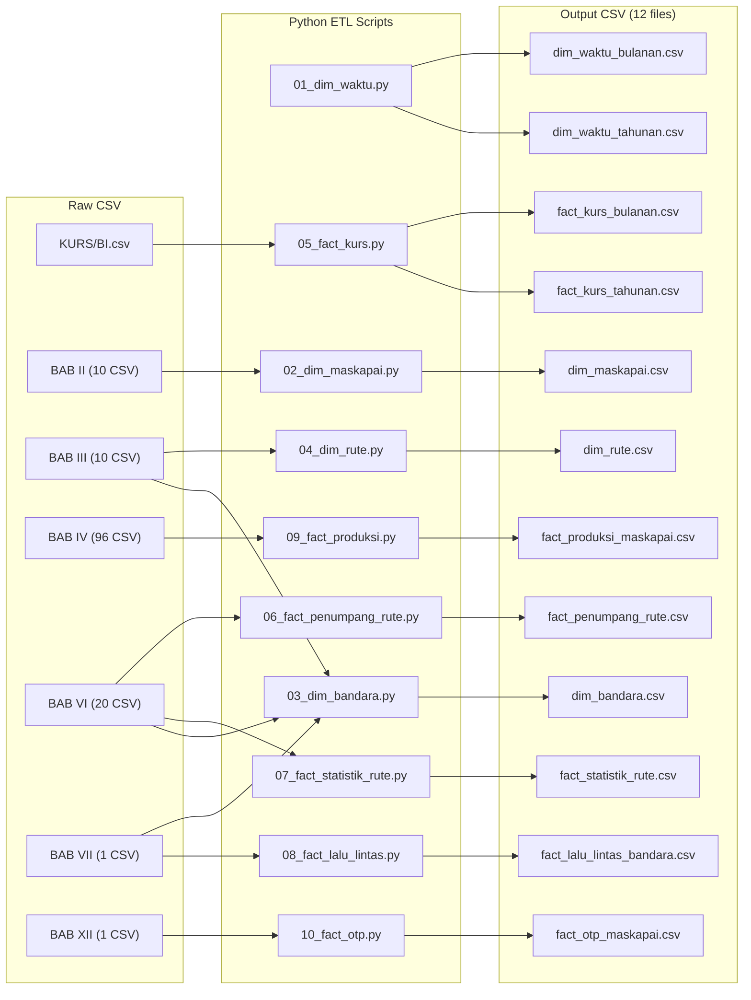
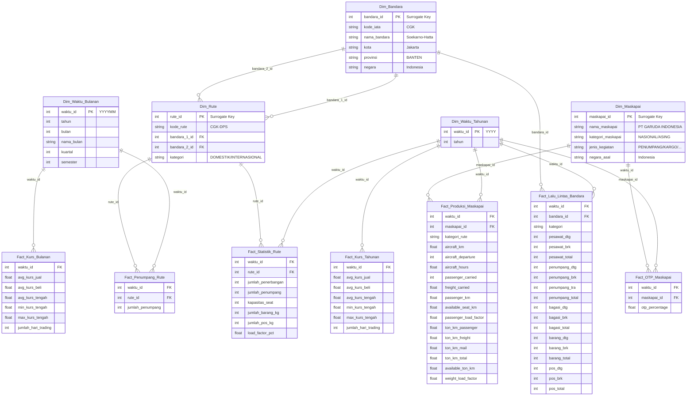

# Implementation Plan v3.1 — Master Blueprint Aligned
# Data Warehouse: Korelasi Nilai Rupiah terhadap Angkutan Udara Indonesia (2020–2024)

> [!IMPORTANT]
> Mengikuti `Master_DWH_Blueprint_dan_Strategi_ETL.md` sebagai **satu-satunya sumber kebenaran**.
> Jalur: `CSV Mentah → Python ETL (Clean Rewrite) → 12 File CSV Bersih (5 dim + 7 fact) → Tableau → Star Schema → Visualisasi`

> [!CAUTION]
> **Insight #14 — Clean Rewrite Policy:** Semua script ETL ditulis ulang dari nol mengacu ke blueprint. Script v2.2 lama boleh dibaca sebagai referensi, tapi TIDAK boleh di-copy-paste tanpa verifikasi. Setiap script di bawah ini adalah spesifikasi mandiri.

---

## STATUS EKSEKUSI (Final)

| Fase | Progress | Status | Checkpoint | Output |
|:---|:---:|:---:|:---:|:---|
| **Gelombang 1** | 100% | ✅ DONE | `checkpoint_g1.py` PASSED | `dim_waktu_*`, `dim_maskapai` |
| **Gelombang 2** | 100% | ✅ DONE | `checkpoint_g2.py` PASSED | `dim_bandara`, `dim_rute` |
| **Gelombang 3** | 100% | ✅ DONE | `checkpoint_g3.py` PASSED | `fact_kurs_*`, `fact_penumpang_*`, `fact_statistik_*`, `fact_lalu_lintas`, `fact_produksi`, `fact_otp` |
| **Orchestrator**| 100% | ✅ DONE | `run_all.py` READY | Full Pipeline Execution |

**Hasil Akhir:** 12 file CSV di folder `output/` siap untuk di-load ke Tableau.

---

## Apa yang Berubah dari v2.2?

| Aspek | v2.2 (Lama) | v3.1 (Blueprint) |
|:---|:---|:---|
| **Dim_Waktu** | 1 tabel (YYYYMM, 60 baris) | **2 tabel**: `Dim_Waktu_Bulanan` (60 baris) + `Dim_Waktu_Tahunan` (5 baris) |
| **Dim_Bandara** | ❌ Tidak ada | ✅ **BARU** — dari BAB VII + BAB III/VI (IATA matching) |
| **Dim_Rute** | Extracted dari BAB VI saja, kode PP alphabetical | Dari **BAB III** (sumber utama), FK ke `Dim_Bandara` |
| **Dim_Maskapai** | 3 kolom (id, nama, nama_pendek) | **5 kolom** (+`jenis_kegiatan`, +`negara_asal`) dari BAB II |
| **Fact_Statistik_Rute** | ❌ Tidak ada | ✅ **BARU** — dari BAB VI Statistik (10 file, tahunan) |
| **Fact_Kurs_Tahunan** | ❌ Tidak ada | ✅ **BARU** — agregat tahunan langsung dari BI.csv harian (5 baris) |
| **Fact_Penumpang_Agregat** | ✅ Ada (120 baris) | ❌ **DIHAPUS** — tidak ada di Blueprint |
| **Fact_Lalu_Lintas_Bandara** | Denormalisasi (propinsi, bandara in-fact) | FK ke `Dim_Bandara` + `Dim_Waktu_Tahunan` + kolom `kategori` |
| **Fact_OTP** | Range 2018–2024 | Range **2020–2024 saja** (buang 2018–2019) |
| **Output folder** | `fase1_core/` + `fase2_enrichment/` | **Flat**: `output/` (semua 12 file 1 folder) |
| **Fact_Produksi** | Kolom sederhana | 14 kolom metrik penuh sesuai Blueprint |
| **Script approach** | Update/patch dari v2.2 | **Clean rewrite** dari nol (Insight #14) |

---

## 1. ARSITEKTUR — Alur Data



---

## 2. STAR SCHEMA DESIGN



**Total: 5 Dimensi + 7 Fakta = 12 Tabel**

---

## 3. DETAIL OUTPUT FILES (12 File Total)

### 3.1 Dimension Files (5)

#### `dim_waktu_bulanan.csv`
| Kolom | Tipe | Keterangan |
|:---|:---|:---|
| `waktu_id` | INT (PK) | YYYYMM (misal: 202001) |
| `tahun` | INT | 2020–2024 |
| `bulan` | INT | 1–12 |
| `nama_bulan` | STRING | Januari–Desember |
| `kuartal` | INT | 1–4 |
| `semester` | INT | 1–2 |

**Total: 60 baris.** Generate via Python loop 2020–2024, bulan 1–12.

---

#### `dim_waktu_tahunan.csv`
| Kolom | Tipe | Keterangan |
|:---|:---|:---|
| `waktu_id` | INT (PK) | YYYY (misal: 2020) |
| `tahun` | INT | 2020–2024 |

**Total: 5 baris.** Generate sederhana.

---

#### `dim_maskapai.csv`
| Kolom | Tipe | Keterangan |
|:---|:---|:---|
| `maskapai_id` | INT (PK) | Surrogate Key (auto-increment) |
| `nama_maskapai` | STRING | Uppercase standar (misal: PT GARUDA INDONESIA) |
| `kategori_maskapai` | STRING | NASIONAL / ASING |
| `jenis_kegiatan` | STRING | PENUMPANG / KARGO / PENUMPANG & KARGO |
| `negara_asal` | STRING | Indonesia (nasional) / nama negara (asing) |

**Total: ~40–60 baris** (semua maskapai unik dari BAB II, 2020–2024).

**Sumber:** BAB II CSV Berjadwal (nasional) + CSV Asing per tahun.

---

#### `dim_bandara.csv` ⚡ PALING KOMPLEKS
| Kolom | Tipe | Keterangan |
|:---|:---|:---|
| `bandara_id` | INT (PK) | Surrogate Key (auto-increment) |
| `kode_iata` | STRING | CGK, DPS, dll. (bisa NULL jika belum match) |
| `nama_bandara` | STRING | Nama bandara bersih (tanpa tag DOM/INT) |
| `kota` | STRING | Nama kota |
| `provinsi` | STRING | Nama provinsi (NULL untuk bandara asing) |
| `negara` | STRING | Indonesia / nama negara asing |

**Total: ~250–350 baris.**

**Strategi 2 tahap:**
1. **Tahap A**: Fondasi dari BAB VII — extract kombinasi unik `(airport_name bersih, propinsi_name)`. Strip tag `(DOM)/(INT)/(DOMESTIK)/(INTERNASIONAL)`. Parse `NAMA_BANDARA - KOTA` via dash split.
2. **Tahap B**: Enrich dengan kode IATA dari BAB III + BAB VI string rute → exact match → manual mapping dict → fuzzy match assist.

---

#### `dim_rute.csv`
| Kolom | Tipe | Keterangan |
|:---|:---|:---|
| `rute_id` | INT (PK) | Surrogate Key (auto-increment) |
| `kode_rute` | STRING (Natural Key) | CGK-DPS (alphabetical) |
| `bandara_1_id` | INT (FK) | FK → dim_bandara |
| `bandara_2_id` | INT (FK) | FK → dim_bandara |
| `kategori` | STRING | DOMESTIK / INTERNASIONAL |

**Total: ~500–700 baris.**

**Sumber:** BAB III (file RUTE ANGKUTAN UDARA NIAGA BERJADWAL, Domestik + Luar Negeri, 2020–2024).

---

### 3.2 Fact Files (7)

#### `fact_kurs_bulanan.csv`
| Kolom | Tipe | Keterangan |
|:---|:---|:---|
| `waktu_id` | INT (FK → dim_waktu_bulanan) | YYYYMM |
| `avg_kurs_jual` | FLOAT | Rata-rata harian per bulan |
| `avg_kurs_beli` | FLOAT | |
| `avg_kurs_tengah` | FLOAT | (jual+beli)/2 |
| `min_kurs_tengah` | FLOAT | |
| `max_kurs_tengah` | FLOAT | |
| `jumlah_hari_trading` | INT | |

**Total: 60 baris.** Dihitung langsung dari data harian BI.csv, GroupBy `(tahun, bulan)`.

---

#### `fact_kurs_tahunan.csv` — BARU (Insight #13)
| Kolom | Tipe | Keterangan |
|:---|:---|:---|
| `waktu_id` | INT (FK → dim_waktu_tahunan) | YYYY |
| `avg_kurs_jual` | FLOAT | Rata-rata harian per tahun |
| `avg_kurs_beli` | FLOAT | |
| `avg_kurs_tengah` | FLOAT | (jual+beli)/2 |
| `min_kurs_tengah` | FLOAT | |
| `max_kurs_tengah` | FLOAT | |
| `jumlah_hari_trading` | INT | |

**Total: 5 baris.** Dihitung **langsung dari data harian BI.csv**, GroupBy `(tahun)`. BUKAN agregasi dari `fact_kurs_bulanan` — karena AVG dari 12 rata-rata bulanan ≠ AVG dari ~250 data harian (bulan punya jumlah hari trading berbeda). Menghitung langsung dari harian = presisi sempurna.

> [!IMPORTANT]
> `Fact_Kurs_Tahunan` menjembatani semua tabel fakta tahunan (Produksi, OTP, Lalu Lintas, Statistik Rute) ke data kurs melalui `Dim_Waktu_Tahunan`. Tanpa tabel ini, jalur korelasi kurs↔fakta tahunan buntu.

---

#### `fact_penumpang_rute.csv`
| Kolom | Tipe | Keterangan |
|:---|:---|:---|
| `waktu_id` | INT (FK → dim_waktu_bulanan) | YYYYMM |
| `rute_id` | INT (FK → dim_rute) | Surrogate key |
| `jumlah_penumpang` | INT | |

**Total: ~19.000–35.000 baris.** Kolom `kategori` tidak ada di fact (sudah terwariskan dari `Dim_Rute`).

---

#### `fact_statistik_rute.csv`
| Kolom | Tipe | Keterangan |
|:---|:---|:---|
| `waktu_id` | INT (FK → dim_waktu_tahunan) | YYYY |
| `rute_id` | INT (FK → dim_rute) | Surrogate key |
| `jumlah_penerbangan` | INT | |
| `jumlah_penumpang` | INT | |
| `kapasitas_seat` | INT | |
| `jumlah_barang_kg` | INT | |
| `jumlah_pos_kg` | INT | |
| `load_factor_pct` | FLOAT | Desimal (misal 0.87) |

**Total: ~3.000–5.000 baris.** Sumber: BAB VI — Statistik Per Rute (10 file).

---

#### `fact_lalu_lintas_bandara.csv`
| Kolom | Tipe | Keterangan |
|:---|:---|:---|
| `waktu_id` | INT (FK → dim_waktu_tahunan) | YYYY |
| `bandara_id` | INT (FK → dim_bandara) | Surrogate key |
| `kategori` | STRING | DOMESTIK / INTERNASIONAL |
| `pesawat_dtg` | INT | |
| `pesawat_brk` | INT | |
| `pesawat_total` | INT | |
| `penumpang_dtg` | INT | |
| `penumpang_brk` | INT | |
| `penumpang_tra` | INT | Transit |
| `penumpang_total` | INT | |
| `bagasi_dtg` | INT | |
| `bagasi_brk` | INT | |
| `bagasi_total` | INT | |
| `barang_dtg` | INT | |
| `barang_brk` | INT | |
| `barang_total` | INT | |
| `pos_dtg` | INT | |
| `pos_brk` | INT | |
| `pos_total` | INT | |

**Total: ~1.281 baris.** Full 19 kolom metrik sesuai Blueprint.

---

#### `fact_produksi_maskapai.csv`
| Kolom | Tipe | Keterangan |
|:---|:---|:---|
| `waktu_id` | INT (FK → dim_waktu_tahunan) | YYYY |
| `maskapai_id` | INT (FK → dim_maskapai) | Surrogate key |
| `kategori_rute` | STRING | DOMESTIK / INTERNASIONAL |
| `aircraft_km` | FLOAT | |
| `aircraft_departure` | INT | |
| `aircraft_hours` | FLOAT | Desimal jam |
| `passenger_carried` | INT | |
| `freight_carried` | FLOAT | Ton |
| `passenger_km` | FLOAT | |
| `available_seat_km` | FLOAT | |
| `passenger_load_factor` | FLOAT | % |
| `ton_km_passenger` | FLOAT | |
| `ton_km_freight` | FLOAT | |
| `ton_km_mail` | FLOAT | |
| `ton_km_total` | FLOAT | |
| `available_ton_km` | FLOAT | |
| `weight_load_factor` | FLOAT | % |

**Total: ~200–300 baris.** 14 kolom metrik penuh.

---

#### `fact_otp_maskapai.csv`
| Kolom | Tipe | Keterangan |
|:---|:---|:---|
| `waktu_id` | INT (FK → dim_waktu_tahunan) | YYYY |
| `maskapai_id` | INT (FK → dim_maskapai) | Surrogate key |
| `otp_percentage` | FLOAT | Desimal (0.8619 = 86.19%) |

**Total: ~50–70 baris.** Hanya 2020–2024 (2018–2019 dibuang).

---

## 4. PYTHON ETL SCRIPTS

### 4.1 Struktur Folder

```
d:\Kuliah\projek_dw\
├── etl/
│   ├── config.py                     # Paths & constants
│   ├── utils.py                      # Shared parsing functions
│   ├── 01_dim_waktu.py               # → 2 output files
│   ├── 02_dim_maskapai.py            # → BAB II, 5 kolom
│   ├── 03_dim_bandara.py             # → BAB VII + IATA matching
│   ├── 04_dim_rute.py                # → BAB III + FK dim_bandara
│   ├── 05_fact_kurs.py               # → 2 output files (bulanan + tahunan)
│   ├── 06_fact_penumpang_rute.py     # → BAB VI Jumlah, FK int
│   ├── 07_fact_statistik_rute.py     # → BAB VI Statistik
│   ├── 08_fact_lalu_lintas.py        # → BAB VII, FK bandara_id
│   ├── 09_fact_produksi.py           # → BAB IV, 14 kolom
│   ├── 10_fact_otp.py                # → BAB XII, 2020+ decimal
│   └── run_all.py                    # Orchestrator
├── output/                           # FLAT (12 files, no subfolder)
│   ├── dim_waktu_bulanan.csv
│   ├── dim_waktu_tahunan.csv
│   ├── dim_maskapai.csv
│   ├── dim_bandara.csv
│   ├── dim_rute.csv
│   ├── fact_kurs_bulanan.csv
│   ├── fact_kurs_tahunan.csv
│   ├── fact_penumpang_rute.csv
│   ├── fact_statistik_rute.csv
│   ├── fact_lalu_lintas_bandara.csv
│   ├── fact_produksi_maskapai.csv
│   └── fact_otp_maskapai.csv
└── requirements.txt
```

### 4.2 Delta Analysis — Semua CLEAN REWRITE

> [!CAUTION]
> Semua script ditulis ulang dari nol (Insight #14). Script v2.2 lama boleh dibaca sebagai referensi tapi TIDAK di-copy-paste.

| Script | Status | Deskripsi |
|:---|:---|:---|
| `config.py` | **CLEAN REWRITE** | Output path flat `output/`. Definisi path ke semua BAB (II, III, IV, VI, VII, XII, KURS). |
| `utils.py` | **CLEAN REWRITE** | Fungsi: `parse_airport_name()`, `extract_iata_from_route()`, `standardize_maskapai()`, `parse_angka_indonesia()`, `BANDARA_IATA_MAP` dict. |
| `01_dim_waktu.py` | **CLEAN REWRITE** | Generate 2 file: `dim_waktu_bulanan.csv` (60 baris) + `dim_waktu_tahunan.csv` (5 baris). |
| `02_dim_maskapai.py` | **CLEAN REWRITE** | Sumber BAB II CSV. 5 kolom. INT surrogate key. Union nasional+asing 2020–2024. Cleansing typo. |
| `03_dim_bandara.py` | **CLEAN REWRITE** | 2-phase build. Phase A: BAB VII unique bandara. Phase B: IATA enrichment dari BAB III+VI. Manual mapping dict. |
| `04_dim_rute.py` | **CLEAN REWRITE** | BAB III CSV. Schema drift 2020–2021 vs 2022+. Parse IATA. FK ke dim_bandara. Deduplikasi. |
| `05_fact_kurs.py` | **CLEAN REWRITE** | Sumber KURS/BI.csv. **2 output**: `fact_kurs_bulanan.csv` (60 baris) + `fact_kurs_tahunan.csv` (5 baris). Shared preprocessing, 2× GroupBy. |
| `06_fact_penumpang_rute.py` | **CLEAN REWRITE** | BAB VI Jumlah (20 file). Unpivot 12 bulan. `rute_id` INT FK lookup. Tanpa kolom `kategori`. |
| `07_fact_statistik_rute.py` | **CLEAN REWRITE** | BAB VI Statistik (10 file). Schema header mapping. Inject tahun. Parse rute. FK lookup. |
| `08_fact_lalu_lintas.py` | **CLEAN REWRITE** | BAB VII single CSV. Extract kategori DOM/INT. FK `bandara_id` INT. 19 kolom metrik. |
| `09_fact_produksi.py` | **CLEAN REWRITE** | BAB IV (96 file). Unpivot+pivot. 14 kolom metrik penuh. FK INT. `kategori_rute` dari folder. |
| `10_fact_otp.py` | **CLEAN REWRITE** | BAB XII single CSV. Unpivot. Filter 2020–2024. OTP ÷ 100. FK INT. |
| `run_all.py` | **CLEAN REWRITE** | Orchestrator: 10 scripts, 3 gelombang. Checkpoint validasi antar gelombang. |

---

## 5. URUTAN EKSEKUSI (3 Gelombang + Checkpoint)

### Gelombang 1 — Dimensi Independen

| Step | Script | Output | Dependensi |
|:---|:---|:---|:---|
| 1 | `01_dim_waktu.py` | `dim_waktu_bulanan.csv` + `dim_waktu_tahunan.csv` | Tidak ada |
| 2 | `02_dim_maskapai.py` | `dim_maskapai.csv` | Tidak ada |

**✅ CHECKPOINT VALIDASI Gelombang 1:**
- `dim_waktu_bulanan.csv` = 60 baris, `waktu_id` range 202001–202412
- `dim_waktu_tahunan.csv` = 5 baris, `waktu_id` range 2020–2024
- `dim_maskapai.csv`: tidak ada NULL di `kategori_maskapai`, tidak ada duplikat `nama_maskapai`

---

### Gelombang 2 — Dimensi dengan Integrasi Silang

| Step | Script | Output | Dependensi |
|:---|:---|:---|:---|
| 3 | `03_dim_bandara.py` | `dim_bandara.csv` | Butuh BAB III/VI CSV untuk IATA |
| 4 | `04_dim_rute.py` | `dim_rute.csv` | Butuh `dim_bandara.csv` (step 3) |

**✅ CHECKPOINT VALIDASI Gelombang 2:**
- `dim_bandara.csv`: semua bandara Indonesia punya `provinsi` (tidak NULL). Semua punya `negara`. Tidak ada duplikat `nama_bandara` + `kota` combo.
- `dim_rute.csv`: tidak ada duplikat `kode_rute`. Semua `bandara_1_id` dan `bandara_2_id` valid (ada di `dim_bandara.csv`).

---

### Gelombang 3 — Tabel Fakta

| Step | Script | Output | Dependensi |
|:---|:---|:---|:---|
| 5 | `05_fact_kurs.py` | `fact_kurs_bulanan.csv` + `fact_kurs_tahunan.csv` | `dim_waktu_bulanan` + `dim_waktu_tahunan` |
| 6 | `06_fact_penumpang_rute.py` | `fact_penumpang_rute.csv` | `dim_waktu_bulanan` + `dim_rute` |
| 7 | `07_fact_statistik_rute.py` | `fact_statistik_rute.csv` | `dim_waktu_tahunan` + `dim_rute` |
| 8 | `08_fact_lalu_lintas.py` | `fact_lalu_lintas_bandara.csv` | `dim_waktu_tahunan` + `dim_bandara` |
| 9 | `09_fact_produksi.py` | `fact_produksi_maskapai.csv` | `dim_waktu_tahunan` + `dim_maskapai` |
| 10 | `10_fact_otp.py` | `fact_otp_maskapai.csv` | `dim_waktu_tahunan` + `dim_maskapai` |

**✅ CHECKPOINT VALIDASI Gelombang 3:**
- `fact_kurs_bulanan.csv` = 60 baris. `fact_kurs_tahunan.csv` = 5 baris
- **Cross-check kurs**: AVG `avg_kurs_tengah` bulanan per tahun ≈ `avg_kurs_tengah` tahunan (expected sedikit beda karena jumlah hari trading per bulan tidak merata)
- Semua FK di setiap fact table valid (match ke dimensi terkait)
- `fact_otp_maskapai.csv`: tahun min ≥ 2020, `otp_percentage` range 0.0–1.0
- `fact_lalu_lintas_bandara.csv` ≈ 1.281 baris

---

## 6. DETAIL LOGIC PER SCRIPT

### 6.0 `config.py` + `utils.py` — Shared Infrastructure

#### `config.py` — Paths & Constants

```python
# === BASE PATHS ===
BASE_DIR       # Root project: d:\Kuliah\projek_dw
OUTPUT_DIR     # output/ (flat, semua 12 file di sini)

# === INPUT PATHS ===
KURS_CSV       # KURS/BI.csv
BAB_II_DIR     # DJPU/Table_Pilihan/BAB II — Perusahaan Angkutan Udara/
BAB_III_DIR    # DJPU/Table_Pilihan/BAB III — Rute & Bandara/
BAB_IV_DIR     # DJPU/Table_Pilihan/BAB IV — Produksi/
BAB_VI_DIR     # DJPU/Table_Pilihan/BAB VI — Penumpang Per Rute/
BAB_VII_CSV    # DJPU/Table_Pilihan/BAB VII — .../DATA LALU LINTAS...2020-2024.csv
BAB_XII_CSV    # DJPU/Table_Pilihan/BAB XII — .../TINGKAT KETEPATAN WAKTU...2024.csv

# === CONSTANTS ===
TAHUN_MULAI = 2020
TAHUN_AKHIR = 2024
TAHUN_RANGE = range(2020, 2025)  # [2020, 2021, 2022, 2023, 2024]

NAMA_BULAN = {
    1: "Januari", 2: "Februari", 3: "Maret", 4: "April",
    5: "Mei", 6: "Juni", 7: "Juli", 8: "Agustus",
    9: "September", 10: "Oktober", 11: "November", 12: "Desember"
}
```

#### `utils.py` — Shared Parsing Functions

**Fungsi 1: `parse_angka_indonesia(val: str) -> int | float | None`**

Konversi string angka format Indonesia ke numerik Python.

```
Input/Output examples:
  "1.234.567"     → 1234567      (titik = ribuan, semua segmen setelah titik pertama panjang 3)
  "363789"         → 363789       (integer langsung)
  "1549163.0"      → 1549163      (float .0 → truncate ke int)
  "-"              → 0            (dash → nol)
  ""               → None         (kosong → None)
  "nan"            → None
  "61,07"          → 61.07        (koma = desimal eropa → float)
  '"43,76"'        → 43.76        (strip quotes dulu, lalu koma → titik)

Logic:
  1. Strip whitespace dan quotes (", ')
  2. Jika val in ('-', '', 'nan', 'None', None) → return 0 untuk '-', None untuk sisanya
  3. Jika ada koma DAN tidak ada titik → koma = desimal eropa → replace(',' , '.') → float
  4. Jika ada titik:
     a. Split by '.'. Jika semua segmen setelah pertama panjang 3 → titik = ribuan → hapus titik → int
     b. Else → titik = desimal biasa → float → int jika .0
  5. Else → int langsung
```

---

**Fungsi 2: `parse_airport_name(raw: str) -> tuple[str, str, str]`**

Parse kolom `airport_name` dari BAB VII CSV.

```
Input:  "SULTAN ISKANDAR MUDA - BANDA ACEH (DOM)"
Output: ("SULTAN ISKANDAR MUDA", "BANDA ACEH", "DOMESTIK")

Input:  "KUALANAMU - MEDAN (INT)"
Output: ("KUALANAMU", "MEDAN", "INTERNASIONAL")

Input:  "KUALANAMU - MEDAN (INTERNASIONAL)"
Output: ("KUALANAMU", "MEDAN", "INTERNASIONAL")

Input:  "CUT NYAK DHIEN - NAGAN RAYA"
Output: ("CUT NYAK DHIEN", "NAGAN RAYA", "DOMESTIK")  # tanpa tag → default DOMESTIK

Input:  "HALIM PERDANAKUSUMA"  # tanpa dash, tanpa tag
Output: ("HALIM PERDANAKUSUMA", "", "DOMESTIK")

Logic:
  1. Regex search pattern \s*\((DOM|INT|DOMESTIK|INTERNASIONAL)\)\s*$ di akhir string
  2. Jika match → extract tag, strip tag dari string
  3. Map tag: DOM/DOMESTIK → 'DOMESTIK', INT/INTERNASIONAL → 'INTERNASIONAL'
  4. Jika tidak match → kategori = 'DOMESTIK' (default bandara kecil/perintis)
  5. Split sisa string by ' - ' (spasi-dash-spasi):
     a. Jika ada dash → bagian kiri = nama_bandara, bagian kanan = kota
     b. Jika tidak ada dash → nama_bandara = seluruh string, kota = ''
  6. Strip whitespace kedua hasil
  7. Return (nama_bandara, kota, kategori)
```

---

**Fungsi 3: `extract_iata_from_route(route_str: str) -> tuple[str, str, str, str]`**

Parse string rute dari BAB III/VI CSV.

```
Input:  "Jakarta (CGK) - Denpasar (DPS)"    # format 2020-2021
Output: ("CGK", "DPS", "Jakarta", "Denpasar")

Input:  "CGK-DPS"                            # format 2022-2024
Output: ("CGK", "DPS", "", "")

Input:  "Praya, Lombok (LOP) - Jakarta (CGK)" # edge case: koma dalam nama kota
Output: ("LOP", "CGK", "Praya, Lombok", "Jakarta")

Input:  "CGK - DPS"                          # dengan spasi
Output: ("CGK", "DPS", "", "")

Logic:
  1. Coba regex: r'(.+?)\s*\(([A-Z]{3}\*?)\)\s*[-–]\s*(.+?)\s*\(([A-Z]{3}\*?)\)'
     → match = format panjang (kota + IATA) → extract 4 grup
  2. Jika tidak match, split by '-' atau '–' → strip masing-masing
     → jika kedua sisi panjang 3 dan semua uppercase → format pendek (IATA saja)
  3. Strip asterisk (*) dari kode IATA jika ada (codeshare marker)
  4. Return (iata_asal, iata_tujuan, kota_asal, kota_tujuan)
```

---

**Fungsi 4: `standardize_maskapai(nama: str) -> str`**

Standardisasi nama maskapai ke format konsisten.

```
Input:  "PT. Garuda Indonesia"  → "PT GARUDA INDONESIA"
Input:  "pt Pelita Air Sevice"  → "PT PELITA AIR SERVICE"  # fix typo
Input:  "  Lion Air  "          → "LION AIR"

Logic:
  1. Strip whitespace
  2. Uppercase
  3. Replace 'PT.' → 'PT' (hapus titik singkatan)
  4. Apply typo corrections dict:
     MASKAPAI_TYPO_MAP = {
         "SEVICE": "SERVICE",
         "PELITA AIR SEVICE": "PELITA AIR SERVICE",
         "BATIK INDONESIA AIR": "BATIK AIR INDONESIA",
         ... (dikembangkan saat implementasi)
     }
  5. Collapse multiple spaces → single space
  6. Return result
```

---

**Fungsi 5: `normalize_jenis_kegiatan(val: str) -> str`**

Standardisasi kolom jenis_kegiatan dari BAB II ke ENUM.

```
Input:  "Penumparig"           → "PENUMPANG"  # typo
Input:  "Perumpang"            → "PENUMPANG"  # typo
Input:  "Cargo"                → "KARGO"
Input:  "Khusus Kargo"         → "KARGO"
Input:  "Penumpang dan Kargo"  → "PENUMPANG & KARGO"
Input:  "Penumpang & Kargo"    → "PENUMPANG & KARGO"

Logic:
  1. Uppercase, strip
  2. Apply typo map: PENUMPARIG/PERUMPANG → PENUMPANG, CARGO → KARGO
  3. If contains 'PENUMPANG' AND ('KARGO' or 'CARGO') → 'PENUMPANG & KARGO'
  4. If 'KARGO' or 'CARGO' or 'KHUSUS KARGO' → 'KARGO'
  5. If 'PENUMPANG' → 'PENUMPANG'
  6. Else → original (log warning)
```

---

**Konstanta 6: `BANDARA_IATA_MAP` — Manual Mapping Dictionary**

> [!IMPORTANT]
> **BLOCKER untuk Gelombang 2.** Dictionary ini HARUS terisi sebelum `03_dim_bandara.py` bisa berjalan dengan benar. Tanpa ini, sebagian besar bandara akan punya `kode_iata = NULL`.

**Cara membangun `BANDARA_IATA_MAP`:**
```
Step 1: Jalankan 03_dim_bandara.py Phase A saja
        → hasilkan list ~250-350 nama bandara unik dari BAB VII
            ↓
Step 2: Jalankan exact match + fuzzy match otomatis
        → generate kandidat pasangan nama↔IATA
            ↓
Step 3: Review manual, isi yang miss/salah
        → finalisasi dict di utils.py
            ↓
Step 4: Jalankan ulang 03_dim_bandara.py Phase A+B
        → dim_bandara.csv siap ✅
```

```python
# Format: nama_bandara (dari BAB VII, setelah strip tag) → kode IATA
BANDARA_IATA_MAP = {
    # Bandara utama (akan diisi ~200-300 entri)
    "SOEKARNO-HATTA": "CGK",
    "NGURAH RAI": "DPS",
    "JUANDA": "SUB",
    "SULTAN HASANUDDIN": "UPG",
    "KUALANAMU": "KNO",
    "SULTAN AJI MUHAMMAD SULAIMAN SEPINGGAN": "BPN",
    "HANG NADIM": "BTH",
    "ADIAN SUCIPTO": "JOG",
    "HUSEIN SASTRANEGARA": "BDO",
    "MINANGKABAU": "PDG",
    # ... (dikembangkan via Phase B step 1-3)
}

# Reverse lookup: IATA → kota (dari BAB III/VI parsing)
IATA_KOTA_MAP = {
    "CGK": "Jakarta",
    "DPS": "Denpasar",
    "SUB": "Surabaya",
    # ... (auto-populated dari extract_iata_from_route)
}
```

---

### 6.1 `01_dim_waktu.py`

**Sumber:** Generate manual via Python (tidak dari CSV).

**Output:** 2 file CSV.

**Logic:**
1. Loop tahun 2020–2024, bulan 1–12
2. Untuk setiap kombinasi, generate: `waktu_id = tahun * 100 + bulan`, `tahun`, `bulan`, `nama_bulan` (Januari–Desember), `kuartal` (ceil(bulan/3)), `semester` (1 jika bulan ≤ 6, else 2)
3. Simpan sebagai `dim_waktu_bulanan.csv` (60 baris)
4. Generate `dim_waktu_tahunan.csv`: 5 baris, kolom `waktu_id` (YYYY) dan `tahun`

---

### 6.2 `02_dim_maskapai.py`

**Sumber:** BAB II CSV per tahun (DAFTAR BADAN USAHA...BERJADWAL + DAFTAR PERWAKILAN...ASING)

**Logic:**
1. Loop tahun 2020–2024
2. Baca CSV berjadwal (nasional) → extract `nama_maskapai`, `jenis_kegiatan`
3. Baca CSV asing → extract `nama_maskapai`, `jenis_kegiatan`, `negara`
4. Handle schema drift: header berbeda per tahun → mapping kolom
5. Handle missing: asing 2020 tanpa kolom `negara` → NULL
6. Cleansing: uppercase, strip, koreksi typo (Penumparig→Penumpang, Perumpang→Penumpang, Cargo→Kargo, Khusus Kargo→Kargo)
7. Standardisasi `jenis_kegiatan`: PENUMPANG | KARGO | PENUMPANG & KARGO
8. Derive `kategori_maskapai`: nasional→NASIONAL, asing→ASING
9. Derive `negara_asal`: nasional→Indonesia, asing→dari kolom negara
10. Deduplikasi by `nama_maskapai`
11. Generate `maskapai_id` (auto-increment integer)

---

### 6.3 `03_dim_bandara.py` ⚡

**Phase A — Fondasi dari BAB VII:**
1. Baca CSV BAB VII (`DATA LALU LINTAS...2020-2024.csv`)
2. Regex extract tag dari `airport_name`: `(DOM)`, `(INT)`, `(DOMESTIK)`, `(INTERNASIONAL)` → strip, simpan tag sebagai metadata
3. Parse `NAMA_BANDARA - KOTA` via dash split → pisahkan nama bandara & kota
4. Ambil kombinasi unik `(nama_bandara_bersih, kota, propinsi_name)`
5. Set `negara = 'Indonesia'`
6. Drop `airport_code` (fake index, bukan IATA)

**Phase B — Perkaya dengan IATA:**
1. Baca semua RUTE CSV dari BAB III (domestik+internasional, 2020–2024) → extract `(nama_kota, kode_iata)`
2. Baca semua JUMLAH/STATISTIK CSV dari BAB VI → extract `(nama_kota, kode_iata)` dari string rute
3. Union semua pasangan unik kota↔IATA
4. Match ke fondasi Phase A:
   - **Pass 1**: Exact match kota (uppercase/strip)
   - **Pass 2**: Manual mapping dictionary (`BANDARA_IATA_MAP` di utils.py)
   - **Pass 3**: Fuzzy matching candidates → review manual
5. Bandara asing (muncul di rute internasional, tidak ada di BAB VII) → tambah sebagai baris baru dengan `provinsi=NULL`
6. Generate `bandara_id` (auto-increment integer)

> [!WARNING]
> Script ini membutuhkan sebuah **manual mapping dictionary** di `utils.py`. Dict memetakan nama bandara BAB VII ke kode IATA. Contoh:
> ```python
> BANDARA_IATA_MAP = {
>     "SOEKARNO-HATTA": "CGK",
>     "NGURAH RAI": "DPS",
>     "JUANDA": "SUB", ...
> }
> ```

---

### 6.4 `04_dim_rute.py`

**Sumber:** BAB III CSV (RUTE ANGKUTAN UDARA NIAGA BERJADWAL, Domestik + Luar Negeri, 2020–2024)

**Logic:**
1. Loop tahun 2020–2024, baca file rute domestik + luar negeri
2. Handle schema drift: 2020–2021 = 2 kolom terpisah (asal, tujuan); 2022+ = 1 kolom gabungan
3. Standardisasi spasi: `"Jakarta(CGK)"` → `"Jakarta (CGK)"`
4. Extract kode IATA via regex: `"Jakarta (CGK)"` → `CGK`
5. `kode_rute` = alphabetical sort asal+tujuan (misal `CGK-DPS`, bukan `DPS-CGK`)
6. Derive `kategori`: file domestik → DOMESTIK, file luar negeri → INTERNASIONAL
7. Deduplikasi by `kode_rute`
8. Lookup FK: IATA → `bandara_1_id`/`bandara_2_id` dari `dim_bandara.csv`
9. Generate `rute_id` (auto-increment integer)

---

### 6.5 `05_fact_kurs.py` — 2 Output Files

**Sumber:** KURS/BI.csv (~1230 baris data harian)

**Output:** `fact_kurs_bulanan.csv` (60 baris) + `fact_kurs_tahunan.csv` (5 baris)

**Logic:**

**Shared preprocessing (langkah 1–3):**
1. Skip metadata rows: `skiprows=2` saat read CSV (baris 1–2 = judul laporan)
2. Parse tanggal: `"12/31/2024 12:00:00 AM"` → datetime → extract `tahun` dan `bulan`
3. Derive kurs tengah per baris harian: `kurs_tengah = (kurs_jual + kurs_beli) / 2`

**Branch A — Bulanan (langkah 4a–5a):**
4a. GroupBy `(tahun, bulan)` → `AVG(kurs_jual)`, `AVG(kurs_beli)`, `AVG(kurs_tengah)`, `MIN(kurs_tengah)`, `MAX(kurs_tengah)`, `COUNT(*)` → `jumlah_hari_trading`
5a. Construct `waktu_id = tahun * 100 + bulan`. Filter 2020–2024. Simpan `fact_kurs_bulanan.csv`.

**Branch B — Tahunan (langkah 4b–5b):**
4b. GroupBy `(tahun)` → `AVG(kurs_jual)`, `AVG(kurs_beli)`, `AVG(kurs_tengah)`, `MIN(kurs_tengah)`, `MAX(kurs_tengah)`, `COUNT(*)` → `jumlah_hari_trading`
5b. Construct `waktu_id = tahun`. Filter 2020–2024. Simpan `fact_kurs_tahunan.csv`.

> [!IMPORTANT]
> Branch B menghitung langsung dari data harian, BUKAN dari mengagregasi Branch A. Ini memastikan presisi (AVG dari ~250 harian ≠ AVG dari 12 rata-rata bulanan yang punya jumlah hari trading berbeda).

---

### 6.6 `06_fact_penumpang_rute.py`

**Sumber:** BAB VI — Jumlah Penumpang Per Bulan (20 file: 5 tahun × 2 kategori)

**Logic:**
1. Load `dim_rute.csv` untuk lookup `kode_rute` → `rute_id`
2. Loop 20 file CSV (per tahun, per kategori domestik/internasional)
3. Detect kolom rute (nama kolom bervariasi antar tahun: `RUTE (PP)`, `RUTE`, `RUTE PP` dll. — gunakan posisi indeks)
4. Parse string rute → extract kode IATA asal & tujuan → gabung alphabetical → `kode_rute`
5. Unpivot 12 kolom bulan → 2 kolom: `bulan` (1–12) dan `jumlah_penumpang`
6. Parse angka penumpang (format bervariasi per tahun: integer, float .0, titik ribuan)
7. Filter baris non-data: skip baris Total, KARGO, baris kosong, NO bukan angka
8. Construct `waktu_id = tahun * 100 + bulan`
9. Lookup `kode_rute` → `rute_id` (INT) dari dim_rute
10. Handle NULL: `jumlah_penumpang` kosong/NaN → buang baris (tidak simpan NULL)
11. Output kolom: `waktu_id`, `rute_id`, `jumlah_penumpang`

---

### 6.7 `07_fact_statistik_rute.py`

**Sumber:** BAB VI — Statistik Per Rute (10 file: 5 tahun × 2 kategori)

**Logic:**
1. Load `dim_rute.csv` untuk lookup `kode_rute` → `rute_id`
2. Loop 10 file CSV (per tahun, per kategori)
3. Schema mapping header: rename inkonsistensi antar tahun:
   - `L/F` / `LF %` / `LOAD FACTOR (%)` → `load_factor_pct`
   - `JUMLAH BARANG` / `JUMLAH BARANG KG` → `jumlah_barang_kg`
   - `JUMLAH PENERBANGAN` / `JML PENERBANGAN` → `jumlah_penerbangan`
   - dll.
4. Inject kolom `tahun` (extract dari nama folder/file sumber)
5. Parse string rute → extract `kode_rute`
6. Cleansing numerik: hapus koma eropa di Load Factor, casting ke float
7. Construct `waktu_id` = tahun (YYYY)
8. Lookup FK: `kode_rute` → `rute_id` dari dim_rute
9. Drop baris total/footer. Isi NULL metrik → 0

---

### 6.8 `08_fact_lalu_lintas.py`

**Sumber:** BAB VII — DATA LALU LINTAS ANGKUTAN UDARA DI BANDAR UDARA TAHUN 2020-2024.csv (single file, ~1281 baris)

**Logic:**
1. Load `dim_bandara.csv` untuk lookup nama bandara → `bandara_id`
2. Baca CSV BAB VII
3. Regex extract tag kategori dari `airport_name`: `(DOM)`/`(DOMESTIK)` → `'DOMESTIK'`, `(INT)`/`(INTERNASIONAL)` → `'INTERNASIONAL'`. Tanpa tag → `'DOMESTIK'`
4. Strip tag dari `airport_name` → nama bandara bersih (untuk matching ke dim_bandara)
5. Sanitasi semua kolom metrik (terbaca sebagai string): hapus titik ribuan (`.`), ganti dash `"-"` → `0`, casting ke integer
6. Construct `waktu_id` = kolom `year` (YYYY)
7. Lookup FK: nama bandara bersih → `bandara_id` di dim_bandara
8. Drop kolom referensi: `propinsi_code`, `propinsi_name`, `airport_code`, `airport_name`, `keterangan`
9. Output 19 kolom metrik + `waktu_id` + `bandara_id` + `kategori`

---

### 6.9 `09_fact_produksi.py`

**Sumber:** BAB IV — 96 file CSV (3 subdirectory: Dalam Negeri, Luar Negeri Nasional, Luar Negeri Asing). Format wide/pivot: 14 baris metrik × 5 kolom tahun per file.

**Logic:**
1. Load `dim_maskapai.csv` untuk lookup nama maskapai → `maskapai_id`
2. Loop 96 file CSV. Per file:
   a. Extract nama maskapai dari konten file (baris header/nama)
   b. Baca 14 baris metrik × 5 kolom tahun
   c. UNPIVOT kolom tahun (`2020`–`2024`) → baris: kolom `tahun` + kolom `nilai`
   d. PIVOT baris metrik → 14 kolom terpisah: `aircraft_km`, `aircraft_departure`, `aircraft_hours`, `passenger_carried`, `freight_carried`, `passenger_km`, `available_seat_km`, `passenger_load_factor`, `ton_km_passenger`, `ton_km_freight`, `ton_km_mail`, `ton_km_total`, `available_ton_km`, `weight_load_factor`
3. Sanitasi numerik: ganti koma eropa → titik, hapus tanda kutip, ganti dash → NULL/0, casting ke float
4. Derive `kategori_rute`: dari subdirectory — Dalam Negeri → `'DOMESTIK'`, Luar Negeri → `'INTERNASIONAL'`
5. Cleansing nama maskapai: uppercase, strip whitespace, hapus `PT.` singkatan, standardisasi agar match dim_maskapai
6. Construct `waktu_id` = tahun (YYYY)
7. Lookup FK: nama maskapai → `maskapai_id`. `waktu_id` → match dim_waktu_tahunan
8. Catatan: satu maskapai bisa punya 2 baris per tahun (1 domestik + 1 internasional). Ini grain-nya, bukan duplikasi.

---

### 6.10 `10_fact_otp.py`

**Sumber:** BAB XII — TINGKAT KETEPATAN WAKTU (ON TIME PERFORMANCE)...2024.csv (single file, ~15 maskapai, format wide 2018–2024)

**Logic:**
1. Load `dim_maskapai.csv` untuk lookup nama maskapai → `maskapai_id`
2. Baca CSV BAB XII
3. UNPIVOT kolom tahun (`2018`–`2024`) → baris: `tahun` + `otp_value`
4. **Filter tahun**: buang 2018 & 2019. Pertahankan hanya 2020–2024
5. Sanitasi numerik: hapus `%`, ganti koma → titik, casting ke float. **Bagi 100** (misal `86.19` → `0.8619`)
6. Cleansing nama maskapai: `"PT. Garuda Indonesia"` → `"PT GARUDA INDONESIA"`. Hapus titik singkatan, uppercase, strip
7. Skip baris "Total/Rata-rata"
8. Construct `waktu_id` = tahun (YYYY)
9. Lookup FK: nama maskapai → `maskapai_id`. `waktu_id` → match dim_waktu_tahunan

---

### 6.11 `run_all.py` — Orchestrator

**Tujuan:** Menjalankan semua 10 script ETL secara berurutan dalam 3 gelombang, dengan checkpoint validasi antar gelombang.

**Pseudocode:**
```python
def main():
    print("=== ETL PIPELINE v3.1 — Run All ===")
    
    # --- GELOMBANG 1: Dimensi Independen ---
    print("\n▶ GELOMBANG 1 — Dimensi Independen")
    run_script("etl/01_dim_waktu.py")
    run_script("etl/02_dim_maskapai.py")
    
    # Checkpoint Gelombang 1
    assert row_count("dim_waktu_bulanan.csv") == 60
    assert row_count("dim_waktu_tahunan.csv") == 5
    assert no_nulls("dim_maskapai.csv", "kategori_maskapai")
    assert no_duplicates("dim_maskapai.csv", "nama_maskapai")
    print("✅ Checkpoint Gelombang 1 PASSED")
    
    # --- GELOMBANG 2: Dimensi Integrasi Silang ---
    print("\n▶ GELOMBANG 2 — Dimensi Integrasi Silang")
    run_script("etl/03_dim_bandara.py")
    run_script("etl/04_dim_rute.py")
    
    # Checkpoint Gelombang 2
    assert no_nulls_where("dim_bandara.csv", "provinsi", "negara == 'Indonesia'")
    assert no_duplicates("dim_rute.csv", "kode_rute")
    assert all_fk_valid("dim_rute.csv", "bandara_1_id", "dim_bandara.csv", "bandara_id")
    assert all_fk_valid("dim_rute.csv", "bandara_2_id", "dim_bandara.csv", "bandara_id")
    print("✅ Checkpoint Gelombang 2 PASSED")
    
    # --- GELOMBANG 3: Tabel Fakta ---
    print("\n▶ GELOMBANG 3 — Tabel Fakta")
    run_script("etl/05_fact_kurs.py")
    run_script("etl/06_fact_penumpang_rute.py")
    run_script("etl/07_fact_statistik_rute.py")
    run_script("etl/08_fact_lalu_lintas.py")
    run_script("etl/09_fact_produksi.py")
    run_script("etl/10_fact_otp.py")
    
    # Checkpoint Gelombang 3
    assert row_count("fact_kurs_bulanan.csv") == 60
    assert row_count("fact_kurs_tahunan.csv") == 5
    cross_check_kurs()  # AVG bulanan per tahun ≈ tahunan (warning jika >1% beda)
    assert all_fk_valid("fact_penumpang_rute.csv", "rute_id", "dim_rute.csv", "rute_id")
    assert all_fk_valid("fact_lalu_lintas_bandara.csv", "bandara_id", "dim_bandara.csv", "bandara_id")
    assert min_value("fact_otp_maskapai.csv", "waktu_id") >= 2020
    assert value_range("fact_otp_maskapai.csv", "otp_percentage", 0.0, 1.0)
    print("✅ Checkpoint Gelombang 3 PASSED")
    
    # --- SUMMARY ---
    print("\n=== ✅ ALL 12 FILES GENERATED ===")
    for f in sorted(os.listdir(OUTPUT_DIR)):
        size = os.path.getsize(os.path.join(OUTPUT_DIR, f))
        rows = row_count(f)
        print(f"  {f}: {rows:,} rows ({size:,} bytes)")

def run_script(path):
    """Jalankan script Python via subprocess. Exit jika gagal."""
    result = subprocess.run([sys.executable, path], cwd=BASE_DIR, env=...)
    if result.returncode != 0:
        print(f"❌ FAILED: {path}")
        sys.exit(1)

def cross_check_kurs():
    """Bandingkan AVG bulanan per tahun vs tahunan. Warning jika >1% beda."""
    bulanan = pd.read_csv("fact_kurs_bulanan.csv")
    tahunan = pd.read_csv("fact_kurs_tahunan.csv")
    bulanan['tahun'] = bulanan['waktu_id'] // 100
    avg_from_bulanan = bulanan.groupby('tahun')['avg_kurs_tengah'].mean()
    for _, row in tahunan.iterrows():
        tahun = row['waktu_id']
        diff_pct = abs(avg_from_bulanan[tahun] - row['avg_kurs_tengah']) / row['avg_kurs_tengah'] * 100
        status = "✅" if diff_pct < 1.0 else "⚠️"
        print(f"  Kurs {tahun}: bulanan_avg={avg_from_bulanan[tahun]:.2f}, "
              f"tahunan={row['avg_kurs_tengah']:.2f}, diff={diff_pct:.3f}% {status}")
```

**Helper functions** (`row_count`, `no_nulls`, `no_duplicates`, `all_fk_valid`, `min_value`, `value_range`) diimplementasikan sebagai pembaca CSV sederhana menggunakan pandas.

---

## 7. VERIFIKASI

### Dimension Checks

| Check | Expected |
|:---|:---|
| dim_waktu_bulanan rows | **60** |
| dim_waktu_tahunan rows | **5** |
| dim_maskapai: semua punya `kategori_maskapai` | Tidak ada NULL |
| dim_maskapai: tidak ada duplikat `nama_maskapai` | Unique count = row count |
| dim_bandara: Indonesia punya `provinsi` | Tidak ada NULL untuk negara=Indonesia |
| dim_rute: unique `kode_rute` | Unique count = row count |
| dim_rute: semua FK valid | `bandara_1_id`/`bandara_2_id` match dim_bandara |

### Fact Checks

| Check | Expected |
|:---|:---|
| fact_kurs_bulanan rows | **60** |
| fact_kurs_tahunan rows | **5** |
| fact_kurs_bulanan Jan 2024 avg_kurs_tengah | ≈ 15.000–16.000 |
| **Cross-check kurs**: AVG bulanan per tahun ≈ tahunan | Expected **sedikit beda** (bukan identik, karena jumlah hari trading per bulan tidak merata) |
| fact_penumpang_rute: semua `rute_id` valid | FK match dim_rute |
| fact_penumpang_rute DOM 2020 total | ≈ 35.394.000 |
| fact_statistik_rute: semua `rute_id` valid | FK match dim_rute |
| fact_lalu_lintas rows | ≈ 1.281 |
| fact_lalu_lintas: semua `bandara_id` valid | FK match dim_bandara |
| fact_produksi: semua `maskapai_id` valid | FK match dim_maskapai |
| fact_otp: tahun min | **≥ 2020** |
| fact_otp: otp_percentage range | **0.0–1.0** |

---

## 8. PANDUAN TABLEAU

### Load Data
1. Connect → Text File → load semua **12 CSV** dari `output/`
2. Buat **Relationships** (bukan Join) di Tableau Data Model

### Relationships

```
dim_waktu_bulanan ──── fact_kurs_bulanan (waktu_id = waktu_id)
dim_waktu_bulanan ──── fact_penumpang_rute (waktu_id = waktu_id)

dim_waktu_tahunan ──── fact_kurs_tahunan (waktu_id = waktu_id)
dim_waktu_tahunan ──── fact_statistik_rute (waktu_id = waktu_id)
dim_waktu_tahunan ──── fact_lalu_lintas_bandara (waktu_id = waktu_id)
dim_waktu_tahunan ──── fact_produksi_maskapai (waktu_id = waktu_id)
dim_waktu_tahunan ──── fact_otp_maskapai (waktu_id = waktu_id)

dim_rute ──── fact_penumpang_rute (rute_id = rute_id)
dim_rute ──── fact_statistik_rute (rute_id = rute_id)

dim_bandara ──── dim_rute (bandara_id = bandara_1_id)
dim_bandara ──── dim_rute (bandara_id = bandara_2_id)
dim_bandara ──── fact_lalu_lintas_bandara (bandara_id = bandara_id)

dim_maskapai ──── fact_produksi_maskapai (maskapai_id = maskapai_id)
dim_maskapai ──── fact_otp_maskapai (maskapai_id = maskapai_id)
```

> [!TIP]
> Dengan `Fact_Kurs_Tahunan` terhubung ke `Dim_Waktu_Tahunan`, semua fakta tahunan (Produksi, OTP, Lalu Lintas, Statistik Rute) kini bisa di-korelasikan langsung dengan kurs tahunan — jalur yang sebelumnya buntu kini tersambung. Tableau Relationships menghindari fan-out problem karena ada 2 dimensi waktu terpisah.

---

## 9. RESOLVED QUESTIONS

> [!NOTE]
> ~~**Q1: Manual Mapping Bandara ↔ IATA**~~ — **RESOLVED: Ya, build dictionary-nya.**
> Ini prerequisite keras sebelum Gelombang 2. Workflow:
> 1. Jalankan `03_dim_bandara.py` Phase A → list ~250-350 nama bandara unik
> 2. Exact match + fuzzy match otomatis → generate kandidat
> 3. Review manual → finalisasi `BANDARA_IATA_MAP` di `utils.py`
> 4. Jalankan ulang `03_dim_bandara.py` Phase A+B → `dim_bandara.csv` siap
> Detail spec ada di Section 6.0 (Konstanta 6).
