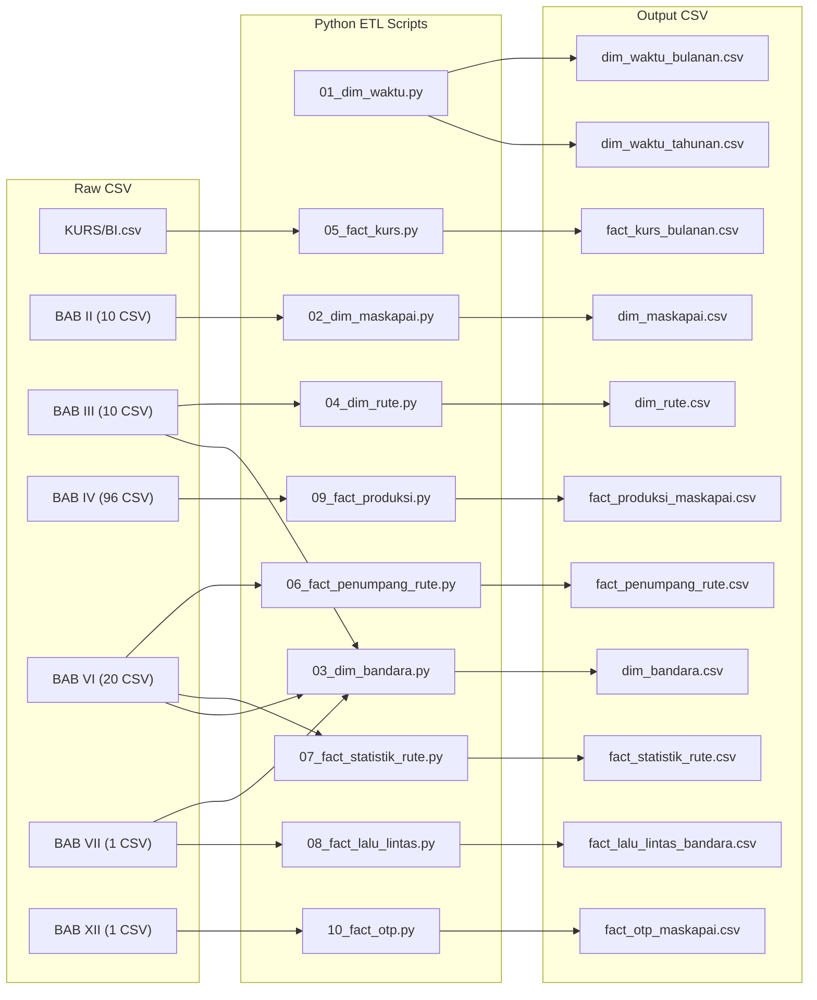
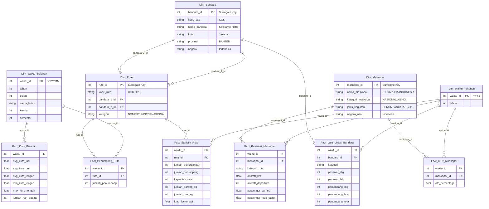

# Implementation Plan v3.0 — Rombak Total ke Master Blueprint
# Data Warehouse: Korelasi Nilai Rupiah terhadap Angkutan Udara Indonesia (2020–2024)

> [!IMPORTANT]
> **Rombak total** dari implementation plan v2.2. Mengikuti `Master_DWH_Blueprint_dan_Strategi_ETL.md` sebagai satu-satunya sumber kebenaran.
> Jalur tetap: `CSV Mentah → Python ETL → File CSV Bersih (dim & fact) → Tableau → Star Schema → Visualisasi`

---

## Apa yang Berubah dari v2.2?

| Aspek | v2.2 (Lama) | v3.0 (Baru — Blueprint) |
|:---|:---|:---|
| **Dim_Waktu** | 1 tabel (YYYYMM, 60 baris) | **2 tabel**: `Dim_Waktu_Bulanan` (60 baris) + `Dim_Waktu_Tahunan` (5 baris) |
| **Dim_Bandara** | ❌ Tidak ada | ✅ **BARU** — dari BAB VII + BAB III/VI (IATA matching) |
| **Dim_Rute** | Extracted dari BAB VI saja, kode PP alphabetical | Dari **BAB III** (sumber utama), FK ke `Dim_Bandara` |
| **Dim_Maskapai** | 3 kolom (id, nama, nama_pendek) | **5 kolom** (+`jenis_kegiatan`, +`negara_asal`) dari BAB II |
| **Fact_Statistik_Rute** | ❌ Tidak ada | ✅ **BARU** — dari BAB VI Statistik (10 file, tahunan) |
| **Fact_Penumpang_Agregat** | ✅ Ada (120 baris) | ❌ **DIHAPUS** — tidak ada di Blueprint |
| **Fact_Lalu_Lintas_Bandara** | Denormalisasi (propinsi, bandara in-fact) | FK ke `Dim_Bandara` + `Dim_Waktu_Tahunan` + kolom `kategori` |
| **Fact_OTP** | Range 2018–2024 | Range **2020–2024 saja** (buang 2018–2019) |
| **Output folder** | `fase1_core/` + `fase2_enrichment/` | **Flat**: `output/` (semua file 1 folder) |
| **Fact_Produksi** | Kolom sederhana | 14 kolom metrik penuh sesuai Blueprint |

---

## 1. ARSITEKTUR — Alur Data



---

## 2. STAR SCHEMA DESIGN



---

## 3. DETAIL OUTPUT FILES (11 File Total)

### 3.1 Dimension Files (5)

#### `dim_waktu_bulanan.csv` ✅ SUDAH ADA — Rename saja
| Kolom | Tipe | Keterangan |
|:---|:---|:---|
| `waktu_id` | INT (PK) | YYYYMM (misal: 202001) |
| `tahun` | INT | 2020–2024 |
| `bulan` | INT | 1–12 |
| `nama_bulan` | STRING | Januari–Desember |
| `kuartal` | INT | 1–4 |
| `semester` | INT | 1–2 |

**Total: 60 baris.** Script lama `01_dim_waktu.py` sudah menghasilkan ini — cukup rename output menjadi `dim_waktu_bulanan.csv` dan tambahkan generate `dim_waktu_tahunan.csv`.

---

#### `dim_waktu_tahunan.csv` — BARU, Generated
| Kolom | Tipe | Keterangan |
|:---|:---|:---|
| `waktu_id` | INT (PK) | YYYY (misal: 2020) |
| `tahun` | INT | 2020–2024 |

**Total: 5 baris.** Generate sederhana.

---

#### `dim_maskapai.csv` — REWORK (dari BAB II langsung)
| Kolom | Tipe | Keterangan |
|:---|:---|:---|
| `maskapai_id` | INT (PK) | Surrogate Key (auto-increment) |
| `nama_maskapai` | STRING | Uppercase standar (misal: PT GARUDA INDONESIA) |
| `kategori_maskapai` | STRING | NASIONAL / ASING |
| `jenis_kegiatan` | STRING | PENUMPANG / KARGO / PENUMPANG & KARGO |
| `negara_asal` | STRING | Indonesia (nasional) / nama negara (asing) |

**Total: ~40–60 baris** (semua maskapai unik dari BAB II, 2020–2024).

**Sumber:** BAB II CSV Berjadwal (nasional) + CSV Asing per tahun.

**Perubahan dari v2.2:** Sebelumnya hanya 3 kolom, sekarang 5 kolom. Sumber berubah dari BAB IV+XII filenames ke BAB II CSV langsung. Ditambah `jenis_kegiatan` dan `negara_asal`.

---

#### `dim_bandara.csv` — BARU ⚡ PALING KOMPLEKS
| Kolom | Tipe | Keterangan |
|:---|:---|:---|
| `bandara_id` | INT (PK) | Surrogate Key (auto-increment) |
| `kode_iata` | STRING | CGK, DPS, dll. (bisa NULL jika belum match) |
| `nama_bandara` | STRING | Nama bandara bersih (tanpa tag DOM/INT) |
| `kota` | STRING | Nama kota |
| `provinsi` | STRING | Nama provinsi (NULL untuk bandara asing) |
| `negara` | STRING | Indonesia / nama negara asing |

**Total: ~250–350 baris.**

**Strategi 2 tahap:**
1. **Tahap A**: Fondasi dari BAB VII — extract kombinasi unik `(airport_name bersih, propinsi_name)`. Strip tag `(DOM)/(INT)/(DOMESTIK)/(INTERNASIONAL)`. Parse `NAMA_BANDARA - KOTA` via dash split.
2. **Tahap B**: Enrich dengan kode IATA dari BAB III + BAB VI string rute → exact match → manual mapping dict → fuzzy match assist.

---

#### `dim_rute.csv` — REWORK (sumber berubah ke BAB III)
| Kolom | Tipe | Keterangan |
|:---|:---|:---|
| `rute_id` | INT (PK) | Surrogate Key (auto-increment) |
| `kode_rute` | STRING (Natural Key) | CGK-DPS (alphabetical) |
| `bandara_1_id` | INT (FK) | FK → dim_bandara |
| `bandara_2_id` | INT (FK) | FK → dim_bandara |
| `kategori` | STRING | DOMESTIK / INTERNASIONAL |

**Total: ~500–700 baris.**

**Sumber:** BAB III (file RUTE ANGKUTAN UDARA NIAGA BERJADWAL, Domestik + Luar Negeri, 2020–2024).

**Perubahan dari v2.2:** Sebelumnya extracted byproduct dari BAB VI. Sekarang sumber utama BAB III, dengan FK ke `Dim_Bandara`. Kolom `kota_a/kota_b` dihapus (pindah ke `Dim_Bandara`).

---

### 3.2 Fact Files (6)

#### `fact_kurs_bulanan.csv` — KEEP ✅ (minor: path output berubah)
| Kolom | Tipe | Keterangan |
|:---|:---|:---|
| `waktu_id` | INT (FK → dim_waktu_bulanan) | YYYYMM |
| `avg_kurs_jual` | FLOAT | Rata-rata harian per bulan |
| `avg_kurs_beli` | FLOAT | |
| `avg_kurs_tengah` | FLOAT | (jual+beli)/2 |
| `min_kurs_tengah` | FLOAT | |
| `max_kurs_tengah` | FLOAT | |
| `jumlah_hari_trading` | INT | |

**Total: 60 baris.** Logic tidak berubah.

---

#### `fact_penumpang_rute.csv` — REWORK (hapus `kategori`, FK `rute_id` berubah tipe)
| Kolom | Tipe | Keterangan |
|:---|:---|:---|
| `waktu_id` | INT (FK → dim_waktu_bulanan) | YYYYMM |
| `rute_id` | INT (FK → dim_rute) | **Surrogate key** (bukan string lagi) |
| `jumlah_penumpang` | INT | |

**Total: ~19.000–35.000 baris.**

**Perubahan dari v2.2:** Kolom `kategori` dihapus dari fact (sudah ada di `Dim_Rute`). `rute_id` berubah dari STRING `"CGK-DPS"` ke INT surrogate key.

---

#### `fact_statistik_rute.csv` — BARU
| Kolom | Tipe | Keterangan |
|:---|:---|:---|
| `waktu_id` | INT (FK → dim_waktu_tahunan) | YYYY |
| `rute_id` | INT (FK → dim_rute) | Surrogate key |
| `jumlah_penerbangan` | INT | |
| `jumlah_penumpang` | INT | |
| `kapasitas_seat` | INT | |
| `jumlah_barang_kg` | INT | |
| `jumlah_pos_kg` | INT | |
| `load_factor_pct` | FLOAT | Desimal (misal 0.87) |

**Total: ~3.000–5.000 baris.** Sumber: BAB VI — Statistik Per Rute (10 file).

---

#### `fact_lalu_lintas_bandara.csv` — REWORK (FK ke dim_bandara, full metrik)
| Kolom | Tipe | Keterangan |
|:---|:---|:---|
| `waktu_id` | INT (FK → dim_waktu_tahunan) | YYYY |
| `bandara_id` | INT (FK → dim_bandara) | Surrogate key |
| `kategori` | STRING | DOMESTIK / INTERNASIONAL |
| `pesawat_dtg` | INT | |
| `pesawat_brk` | INT | |
| `pesawat_total` | INT | |
| `penumpang_dtg` | INT | |
| `penumpang_brk` | INT | |
| `penumpang_tra` | INT | Transit |
| `penumpang_total` | INT | |
| `bagasi_dtg` | INT | |
| `bagasi_brk` | INT | |
| `bagasi_total` | INT | |
| `barang_dtg` | INT | |
| `barang_brk` | INT | |
| `barang_total` | INT | |
| `pos_dtg` | INT | |
| `pos_brk` | INT | |
| `pos_total` | INT | |

**Total: ~1.281 baris.**

**Perubahan dari v2.2:** Kolom `propinsi`, `nama_bandara`, `kota` dihapus dari fact → diganti FK `bandara_id`. Semua sub-metrik (dtg/brk/total) sekarang disimpan penuh sesuai Blueprint.

---

#### `fact_produksi_maskapai.csv` — REWORK (14 kolom metrik penuh)
| Kolom | Tipe | Keterangan |
|:---|:---|:---|
| `waktu_id` | INT (FK → dim_waktu_tahunan) | YYYY |
| `maskapai_id` | INT (FK → dim_maskapai) | Surrogate key |
| `kategori_rute` | STRING | DOMESTIK / INTERNASIONAL |
| `aircraft_km` | FLOAT | |
| `aircraft_departure` | INT | |
| `aircraft_hours` | FLOAT | Desimal jam |
| `passenger_carried` | INT | |
| `freight_carried` | FLOAT | Ton |
| `passenger_km` | FLOAT | |
| `available_seat_km` | FLOAT | |
| `passenger_load_factor` | FLOAT | % |
| `ton_km_passenger` | FLOAT | |
| `ton_km_freight` | FLOAT | |
| `ton_km_mail` | FLOAT | |
| `ton_km_total` | FLOAT | |
| `available_ton_km` | FLOAT | |
| `weight_load_factor` | FLOAT | % |

**Total: ~200–300 baris.**

**Perubahan dari v2.2:** 14 kolom metrik penuh. `maskapai_id` INT surrogate. Tambah `kategori_rute`.

---

#### `fact_otp_maskapai.csv` — REWORK (filter tahun, format desimal)
| Kolom | Tipe | Keterangan |
|:---|:---|:---|
| `waktu_id` | INT (FK → dim_waktu_tahunan) | YYYY |
| `maskapai_id` | INT (FK → dim_maskapai) | Surrogate key |
| `otp_percentage` | FLOAT | Desimal (0.8619 = 86.19%) |

**Total: ~50–70 baris.**

**Perubahan dari v2.2:** Tahun 2018–2019 dibuang. OTP ÷ 100. `maskapai_id` INT surrogate.

---

## 4. PYTHON ETL SCRIPTS

### 4.1 Struktur Folder

```
d:\Kuliah\projek_dw\
├── etl/
│   ├── config.py                     # UPDATE — paths
│   ├── utils.py                      # UPDATE — new parse functions
│   ├── 01_dim_waktu.py               # MODIFY → 2 output files
│   ├── 02_dim_maskapai.py            # REWRITE → BAB II, 5 kolom
│   ├── 03_dim_bandara.py             # NEW → BAB VII + IATA matching
│   ├── 04_dim_rute.py                # NEW → BAB III + FK dim_bandara
│   ├── 05_fact_kurs.py               # RENAME (was 03_) + path
│   ├── 06_fact_penumpang_rute.py     # REWRITE (was 04_) → FK int
│   ├── 07_fact_statistik_rute.py     # NEW → BAB VI Statistik
│   ├── 08_fact_lalu_lintas.py        # REWRITE → FK bandara_id
│   ├── 09_fact_produksi.py           # REWRITE → 14 kolom
│   ├── 10_fact_otp.py                # REWRITE → 2020+ decimal
│   └── run_all.py                    # UPDATE → new list
├── output/                           # FLAT (no subfolder)
│   ├── dim_waktu_bulanan.csv
│   ├── dim_waktu_tahunan.csv
│   ├── dim_maskapai.csv
│   ├── dim_bandara.csv
│   ├── dim_rute.csv
│   ├── fact_kurs_bulanan.csv
│   ├── fact_penumpang_rute.csv
│   ├── fact_statistik_rute.csv
│   ├── fact_lalu_lintas_bandara.csv
│   ├── fact_produksi_maskapai.csv
│   └── fact_otp_maskapai.csv
└── requirements.txt
```

### 4.2 Delta Analysis — Apa yang berubah per script

| Script | Status | Deskripsi Perubahan |
|:---|:---|:---|
| `config.py` | **UPDATE** | Output path flat `output/`. Tambah `BAB_III_DIR`. Hapus subfolder split. |
| `utils.py` | **UPDATE** | Tambah: `parse_airport_name()`, `extract_iata_from_route()`, `standardize_maskapai_bab2()`. Pertahankan fungsi lama yang relevan. |
| `01_dim_waktu.py` | **MODIFY** | Generate **2 file**: `dim_waktu_bulanan.csv` (logic lama) + `dim_waktu_tahunan.csv` (baru, 5 baris). |
| `02_dim_maskapai.py` | **REWRITE** | Sumber → BAB II CSV. 5 kolom. INT surrogate key. Union nasional+asing 2020–2024. Cleansing typo. |
| `03_dim_bandara.py` | **NEW** | 2-phase build. Phase A: BAB VII unique. Phase B: IATA enrichment. Manual mapping dict. |
| `04_dim_rute.py` | **NEW** | BAB III CSV. Schema drift handling. Parse IATA. FK ke dim_bandara. Deduplikasi. |
| `05_fact_kurs.py` | **RENAME** | Was `03_fact_kurs.py`. Logic identik, path berubah. |
| `06_fact_penumpang_rute.py` | **REWRITE** | Was `04_fact_penumpang.py`. Hapus `kategori`. `rute_id` → INT FK lookup. Hapus agregat. |
| `07_fact_statistik_rute.py` | **NEW** | 10 file BAB VI Statistik. Schema header mapping. Inject tahun. Parse rute. |
| `08_fact_lalu_lintas.py` | **REWRITE** | Was in `05_fact_enrichment.py`. Standalone. FK `bandara_id` INT. 19 kolom metrik. |
| `09_fact_produksi.py` | **REWRITE** | Was in `05_fact_enrichment.py`. Standalone. 14 kolom metrik penuh. FK INT. |
| `10_fact_otp.py` | **REWRITE** | Was in `05_fact_enrichment.py`. Standalone. Filter 2020+. OTP ÷ 100. FK INT. |
| `run_all.py` | **UPDATE** | New script list, gelombang 1→2→3. |

---

## 5. URUTAN EKSEKUSI (3 Gelombang)

### Gelombang 1 — Dimensi Independen

| Step | Script | Output | Dependensi |
|:---|:---|:---|:---|
| 1 | `01_dim_waktu.py` | `dim_waktu_bulanan.csv` + `dim_waktu_tahunan.csv` | Tidak ada |
| 2 | `02_dim_maskapai.py` | `dim_maskapai.csv` | Tidak ada |

### Gelombang 2 — Dimensi dengan Integrasi Silang

| Step | Script | Output | Dependensi |
|:---|:---|:---|:---|
| 3 | `03_dim_bandara.py` | `dim_bandara.csv` | Butuh BAB III/VI CSV untuk IATA |
| 4 | `04_dim_rute.py` | `dim_rute.csv` | Butuh `dim_bandara.csv` (step 3) |

### Gelombang 3 — Tabel Fakta

| Step | Script | Output | Dependensi |
|:---|:---|:---|:---|
| 5 | `05_fact_kurs.py` | `fact_kurs_bulanan.csv` | `dim_waktu_bulanan` (format saja) |
| 6 | `06_fact_penumpang_rute.py` | `fact_penumpang_rute.csv` | `dim_waktu_bulanan` + `dim_rute` |
| 7 | `07_fact_statistik_rute.py` | `fact_statistik_rute.csv` | `dim_waktu_tahunan` + `dim_rute` |
| 8 | `08_fact_lalu_lintas.py` | `fact_lalu_lintas_bandara.csv` | `dim_waktu_tahunan` + `dim_bandara` |
| 9 | `09_fact_produksi.py` | `fact_produksi_maskapai.csv` | `dim_waktu_tahunan` + `dim_maskapai` |
| 10 | `10_fact_otp.py` | `fact_otp_maskapai.csv` | `dim_waktu_tahunan` + `dim_maskapai` |

---

## 6. DETAIL LOGIC PER SCRIPT

### 6.1 `01_dim_waktu.py` — MODIFY

**Perubahan:** Tambah generate `dim_waktu_tahunan.csv`.

```python
# File 1: dim_waktu_bulanan.csv (logic lama, 60 baris)
# File 2: dim_waktu_tahunan.csv (BARU)
#   waktu_id: 2020, 2021, 2022, 2023, 2024
#   tahun: sama dengan waktu_id
```

---

### 6.2 `02_dim_maskapai.py` — REWRITE

**Sumber:** BAB II CSV per tahun (DAFTAR BADAN USAHA...BERJADWAL + DAFTAR PERWAKILAN...ASING)

**Logic:**
1. Loop tahun 2020–2024
2. Baca CSV berjadwal (nasional) → extract `nama_maskapai`, `jenis_kegiatan`
3. Baca CSV asing → extract `nama_maskapai`, `jenis_kegiatan`, `negara`
4. Handle schema drift: header berbeda per tahun → mapping kolom
5. Handle missing: asing 2020 tanpa kolom `negara` → NULL
6. Cleansing: uppercase, strip, koreksi typo (Penumparig→Penumpang, Cargo→Kargo)
7. Standardisasi `jenis_kegiatan`: PENUMPANG | KARGO | PENUMPANG & KARGO
8. Derive `kategori_maskapai`: nasional→NASIONAL, asing→ASING
9. Derive `negara_asal`: nasional→Indonesia, asing→dari kolom negara
10. Deduplikasi by `nama_maskapai`
11. Generate `maskapai_id` (auto-increment integer)

---

### 6.3 `03_dim_bandara.py` — NEW ⚡

**Phase A — Fondasi dari BAB VII:**
1. Baca CSV BAB VII (`DATA LALU LINTAS...2020-2024.csv`)
2. Regex extract tag dari `airport_name`: `(DOM)`, `(INT)`, `(DOMESTIK)`, `(INTERNASIONAL)` → strip
3. Parse `NAMA_BANDARA - KOTA` via dash split → pisahkan nama bandara & kota
4. Ambil kombinasi unik `(nama_bandara_bersih, kota, propinsi_name)`
5. Set `negara = 'Indonesia'`
6. Drop `airport_code` (fake index)

**Phase B — Perkaya dengan IATA:**
1. Baca semua RUTE CSV dari BAB III (domestik+internasional, 2020–2024) → extract `(nama_kota, kode_iata)`
2. Baca semua JUMLAH/STATISTIK CSV dari BAB VI → extract `(nama_kota, kode_iata)` dari string rute
3. Union semua pasangan unik kota↔IATA
4. Match ke fondasi Phase A:
   - **Pass 1**: Exact match kota (uppercase/strip)
   - **Pass 2**: Manual mapping dictionary
   - **Pass 3**: Fuzzy matching candidates → review
5. Bandara asing (di rute INT tapi tidak di BAB VII) → tambah baris baru `provinsi=NULL`
6. Generate `bandara_id` (auto-increment integer)

> [!WARNING]
> Script ini membutuhkan sebuah **manual mapping dictionary** di `utils.py`. Dict memetakan nama bandara BAB VII ke kode IATA. Contoh:
> ```python
> BANDARA_IATA_MAP = {
>     "SOEKARNO-HATTA": "CGK",
>     "NGURAH RAI": "DPS",
>     "JUANDA": "SUB", ...
> }
> ```

---

### 6.4 `04_dim_rute.py` — NEW

**Sumber:** BAB III CSV (RUTE ANGKUTAN UDARA, Domestik + Luar Negeri, 2020–2024)

**Logic:**
1. Loop tahun 2020–2024, baca file domestik + luar negeri
2. Handle schema drift: 2020–2021 = 2 kolom terpisah; 2022+ = 1 kolom gabungan
3. Standardisasi spasi: `"Jakarta(CGK)"` → `"Jakarta (CGK)"`
4. Extract IATA via regex
5. `kode_rute` = alphabetical sort asal+tujuan
6. Derive `kategori`: domestik → DOMESTIK, luar negeri → INTERNASIONAL
7. Deduplikasi by `kode_rute`
8. Lookup FK: IATA → `bandara_1_id`/`bandara_2_id` dari `dim_bandara.csv`
9. Generate `rute_id` (auto-increment integer)

---

### 6.5 `05_fact_kurs.py` — RENAME+PATH

Logic identik dengan `03_fact_kurs.py` lama. Hanya rename dan output path → `output/fact_kurs_bulanan.csv`.

---

### 6.6 `06_fact_penumpang_rute.py` — REWRITE

**Sumber:** BAB VI Jumlah Penumpang Per Bulan (20 file: 5 tahun × 2 kategori)

**Perubahan dari v2.2:**
- **Hapus kolom `kategori`** dari output (sudah di `Dim_Rute`)
- **`rute_id` → INT** (lookup dari `dim_rute.csv` via `kode_rute`)
- **Hapus agregat generation**

**Logic:** Parsing logic dari `04_fact_penumpang.py` lama (detect kolom, parse rute, unpivot 12 bulan, parse angka, filter baris non-data) sebagian besar **dipertahankan**. Yang berubah:
- Tambah load `dim_rute.csv`, lookup `kode_rute` → `rute_id` (INT)
- Hapus step build dim_rute as byproduct
- Hapus step aggregate

---

### 6.7 `07_fact_statistik_rute.py` — NEW

**Sumber:** BAB VI Statistik Per Rute (10 file: 5 tahun × 2 kategori)

**Logic:**
1. Loop tahun 2020–2024, baca file statistik domestik + luar negeri
2. Schema mapping header: `L/F` → `load_factor_pct`, `JUMLAH BARANG` → `jumlah_barang_kg`, dll.
3. Inject kolom `tahun` (dari nama folder/file)
4. Parse string rute → extract `kode_rute`
5. Cleansing numerik: hapus koma eropa di LF, cast ke float
6. Construct `waktu_id` = tahun
7. Lookup FK: `kode_rute` → `rute_id` dari `dim_rute.csv`
8. Drop baris total/footer. Isi NULL metrik → 0

---

### 6.8 `08_fact_lalu_lintas.py` — REWRITE

**Logic dari BAB VII di `05_fact_enrichment.py` lama.** Yang berubah:
- Output: FK `bandara_id` INT (lookup dari `dim_bandara.csv`)
- Output: **19 kolom metrik** (semua sub-metrik dtg/brk/total)
- Hapus kolom `propinsi`, `nama_bandara`, `kota`
- `waktu_id` = `year` (INT YYYY → match dim_waktu_tahunan)

---

### 6.9 `09_fact_produksi.py` — REWRITE

**Logic dari BAB IV di `05_fact_enrichment.py` lama.** Yang berubah:
- **14 kolom metrik penuh** (sebelumnya di-merge)
- `maskapai_id` → INT (lookup dari `dim_maskapai.csv`)
- `waktu_id` → INT YYYY
- Tambah `kategori_rute` (derive dari folder Dalam Negeri / Luar Negeri)

---

### 6.10 `10_fact_otp.py` — REWRITE

**Logic dari BAB XII di `05_fact_enrichment.py` lama.** Yang berubah:
- **Filter tahun**: buang 2018 & 2019
- OTP value → **bagi 100** (86.19% → 0.8619)
- `maskapai_id` → INT (lookup)
- `waktu_id` → INT YYYY

---

## 7. VERIFIKASI

### Dimension Checks

| Check | Expected |
|:---|:---|
| dim_waktu_bulanan rows | **60** |
| dim_waktu_tahunan rows | **5** |
| dim_maskapai: semua punya `kategori_maskapai` | Tidak ada NULL |
| dim_bandara: Indonesia punya `provinsi` | Tidak ada NULL untuk negara=Indonesia |
| dim_rute: unique `kode_rute` | Unique count = row count |
| dim_rute: semua FK valid | `bandara_1_id`/`bandara_2_id` match dim_bandara |

### Fact Checks

| Check | Expected |
|:---|:---|
| fact_kurs rows | **60** |
| fact_kurs Jan 2024 avg_kurs_tengah | ≈ 15.000–16.000 |
| fact_penumpang_rute: semua `rute_id` valid | FK match dim_rute |
| fact_penumpang_rute DOM 2020 total | ≈ 35.394.000 |
| fact_statistik_rute: semua `rute_id` valid | FK match dim_rute |
| fact_lalu_lintas rows | ≈ 1.281 |
| fact_lalu_lintas: semua `bandara_id` valid | FK match dim_bandara |
| fact_produksi: semua `maskapai_id` valid | FK match dim_maskapai |
| fact_otp: tahun min | **≥ 2020** |
| fact_otp: otp_percentage range | **0.0–1.0** |

---

## 8. PANDUAN TABLEAU

### Load Data
1. Connect → Text File → load semua 11 CSV dari `output/`
2. Buat **Relationships** (bukan Join) di Tableau Data Model

### Relationships

```
dim_waktu_bulanan ──── fact_kurs_bulanan (waktu_id = waktu_id)
dim_waktu_bulanan ──── fact_penumpang_rute (waktu_id = waktu_id)

dim_waktu_tahunan ──── fact_statistik_rute (waktu_id = waktu_id)
dim_waktu_tahunan ──── fact_lalu_lintas_bandara (waktu_id = waktu_id)
dim_waktu_tahunan ──── fact_produksi_maskapai (waktu_id = waktu_id)
dim_waktu_tahunan ──── fact_otp_maskapai (waktu_id = waktu_id)

dim_rute ──── fact_penumpang_rute (rute_id = rute_id)
dim_rute ──── fact_statistik_rute (rute_id = rute_id)

dim_bandara ──── dim_rute (bandara_id = bandara_1_id)
dim_bandara ──── dim_rute (bandara_id = bandara_2_id)
dim_bandara ──── fact_lalu_lintas_bandara (bandara_id = bandara_id)

dim_maskapai ──── fact_produksi_maskapai (maskapai_id = maskapai_id)
dim_maskapai ──── fact_otp_maskapai (maskapai_id = maskapai_id)
```

> [!TIP]
> Tableau Relationships lebih cocok karena ada **2 dimensi waktu berbeda** (bulanan & tahunan). Relationships menghindari fan-out problem.

---

## 9. OPEN QUESTIONS

> [!IMPORTANT]
> **Q1: Manual Mapping Bandara ↔ IATA**
> Script `03_dim_bandara.py` membutuhkan dictionary manual. Rekomendasi:
> Saya build dictionary lengkap dari data (jumlah bandara <300, feasible). OK?

> [!NOTE]
> **Q2: File output lama**
> File di `output/fase1_core/` dan `output/fase2_enrichment/` akan dihapus karena struktur berubah ke flat `output/`. OK?
